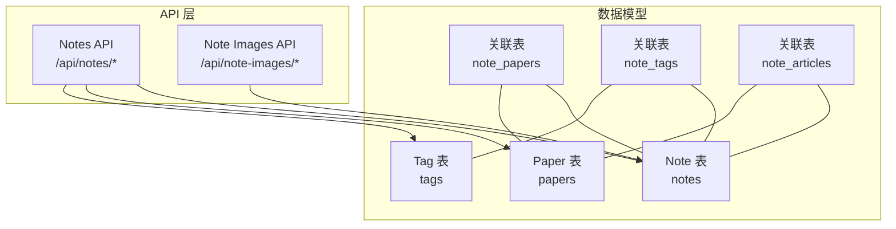
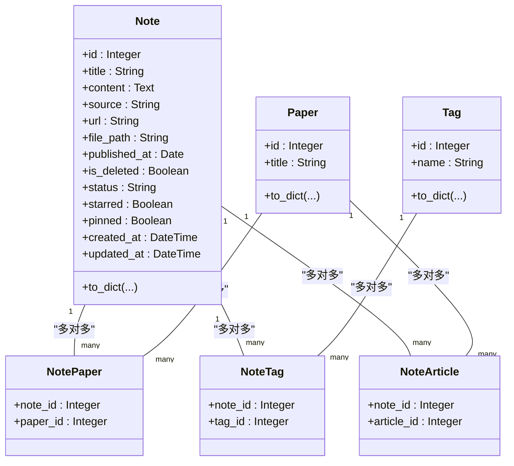
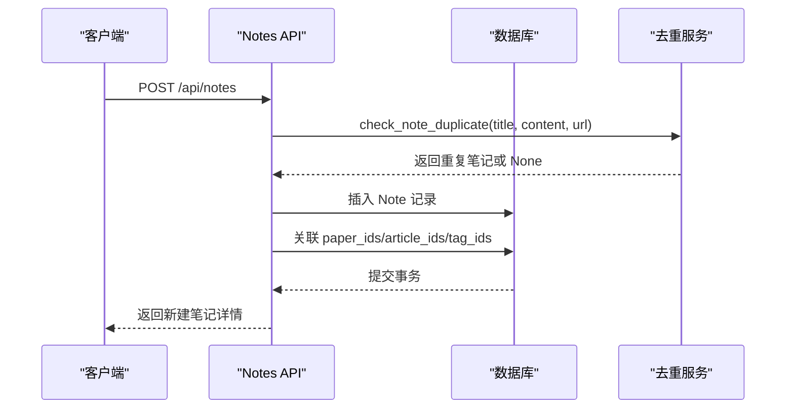
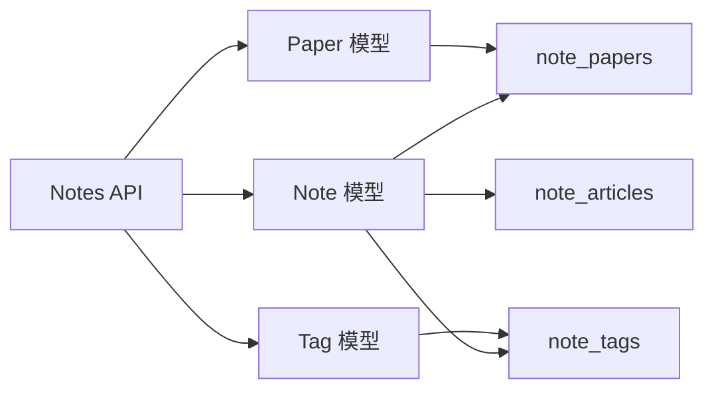

# Notes表

<cite>
**本文引用的文件**
- [paper.py](file://backend/models/paper.py)
- [notes.py](file://backend/api/notes.py)
- [note.yml](file://specs/backend/models/note.yml)
- [paper.yml](file://specs/backend/models/paper.yml)
- [SCHEMA.md](file://docs/SCHEMA.md)
- [笔记系统设计方案.md](file://docs/笔记系统设计方案.md)
- [note_deduplicator.py](file://backend/services/note_deduplicator.py)
- [note_images.py](file://backend/api/note_images.py)
- [pdf_processor.py](file://backend/services/pdf_processor.py)
</cite>

## 目录
1. [简介](#简介)
2. [项目结构](#项目结构)
3. [核心组件](#核心组件)
4. [架构总览](#架构总览)
5. [详细组件分析](#详细组件分析)
6. [依赖分析](#依赖分析)
7. [性能考量](#性能考量)
8. [故障排查指南](#故障排查指南)
9. [结论](#结论)
10. [附录](#附录)

## 简介
本文件围绕 Notes 表（笔记/批注表）进行系统性文档化，重点覆盖以下方面：
- 笔记内容、关联论文ID、页码、高亮区域坐标等字段的设计原理与用途
- JSON格式高亮区域坐标的存储方案与解析方法
- 外键约束关系与论文关联机制
- 索引策略（论文ID索引）与查询性能优化
- 笔记与PDF页面的映射关系与高亮显示的技术实现
- 笔记创建、编辑、删除的完整使用流程与最佳实践

## 项目结构
Notes 表位于后端数据模型与API之间，配合标签、论文、文章等模块共同构成 PaperHub 的三层内容库体系。其核心职责是承载个人笔记与批注，并通过多对多关联与论文、文章建立语义连接。

图表来源
- [paper.py:250-294](file://backend/models/paper.py#L250-L294)
- [notes.py:13-595](file://backend/api/notes.py#L13-L595)

章节来源
- [paper.py:250-294](file://backend/models/paper.py#L250-L294)
- [notes.py:13-595](file://backend/api/notes.py#L13-L595)

## 核心组件
- Notes 表（笔记/批注表）：存储笔记正文、来源、状态、标星、置顶、软删除等信息；通过 note_papers 与论文建立多对多关联；通过 note_tags 与标签建立多对多关联；通过 note_articles 与文章建立多对多关联。
- 关联表：note_papers、note_tags、note_articles 实现三类多对多关系。
- API：提供笔记 CRUD、关联管理、批量操作、图片上传等接口。
- 去重服务：note_deduplicator 提供基于 URL、标题相似度、内容哈希的去重策略。
- PDF 处理：pdf_processor 提供 PDF 元数据与文本提取能力，为后续批注功能提供基础。

章节来源
- [paper.py:250-294](file://backend/models/paper.py#L250-L294)
- [note.yml:1-115](file://specs/backend/models/note.yml#L1-L115)
- [paper.yml:1-164](file://specs/backend/models/paper.yml#L1-L164)
- [notes.py:13-595](file://backend/api/notes.py#L13-L595)
- [note_deduplicator.py:88-129](file://backend/services/note_deduplicator.py#L88-L129)
- [pdf_processor.py:10-170](file://backend/services/pdf_processor.py#L10-L170)

## 架构总览
Notes 表在整体架构中的定位如下：
- 数据模型层：Note 模型定义字段、关系与序列化行为；note_papers、note_tags、note_articles 作为中间表维护多对多关系。
- API 层：Notes API 提供笔记列表、创建、详情、更新、删除、关联管理、批量操作等接口；Note Images API 提供笔记内图片上传与引用。
- 业务服务层：note_deduplicator 提供去重逻辑；pdf_processor 提供 PDF 元数据提取能力，为后续批注功能提供支撑。

图表来源
- [paper.py:250-294](file://backend/models/paper.py#L250-L294)
- [paper.py:69-87](file://backend/models/paper.py#L69-L87)

## 详细组件分析

### Notes 表结构设计与字段说明
- 主键与标识：id（主键），is_deleted（软删除标记）。
- 内容与来源：title（可选标题）、content（Markdown 正文）、source（来源类型，默认 manual）、url（来源链接）、file_path（关联本地文件路径）、published_at（发布日期）。
- 状态与展示：status（状态，pending/reading/done/mastered）、starred（标星）、pinned（置顶）。
- 时间戳：created_at、updated_at（自动更新）。
- 关系：与 Tag 通过 note_tags 多对多；与 Paper 通过 note_papers 多对多；与 Article 通过 note_articles 多对多。
- 索引：title、is_deleted、pinned（见 note.yml）。

章节来源
- [note.yml:1-115](file://specs/backend/models/note.yml#L1-L115)
- [paper.py:250-294](file://backend/models/paper.py#L250-L294)

### 外键约束与论文关联机制
- Note 与 Paper 通过 note_papers 中间表建立多对多关系，Paper 与 Tag 通过 paper_tags 建立多对多关系，Note 与 Tag 通过 note_tags 建立多对多关系。
- Note 与 Article 通过 note_articles 建立多对多关系。
- Note.to_dict 支持递归序列化关联对象（papers/articles/tags），便于前端展示。

章节来源
- [paper.py:69-87](file://backend/models/paper.py#L69-L87)
- [paper.py:250-294](file://backend/models/paper.py#L250-L294)

### JSON格式高亮区域坐标存储与解析
- 当前仓库中，Notes 表的字段定义未包含 page_num 与 highlight_rect 字段；而 SCHEMA.md 中的 notes 表定义包含 page_num 与 highlight_rect 字段，且明确为 JSON 格式高亮区域坐标。
- 建议采用 JSON 文本字段存储高亮区域，结构示例：包含 x、y、width、height 等几何参数，便于前端 PDF 阅读器渲染高亮。
- 解析方法：后端以 JSON 文本形式存取；前端渲染时解析 JSON 并在 PDF 页面上叠加 Canvas 或 SVG 高亮层。

章节来源
- [SCHEMA.md:107-122](file://docs/SCHEMA.md#L107-L122)

### 索引策略与查询性能优化
- Notes 表索引建议：
  - 论文ID索引：idx_notes_paper（用于按论文快速检索笔记）
  - 标题索引：idx_notes_title（用于关键词搜索）
  - 软删除索引：idx_notes_is_deleted（用于默认过滤已删除）
  - 置顶索引：idx_notes_pinned（用于优先展示置顶笔记）
- 查询优化建议：
  - 列表查询时按 is_deleted=false 过滤，结合分页与排序（如 created_at desc）
  - 搜索关键词使用 title/content 的模糊匹配
  - 批量操作时使用 IN 查询减少往返

章节来源
- [note.yml:108-115](file://specs/backend/models/note.yml#L108-L115)
- [notes.py:25-57](file://backend/api/notes.py#L25-L57)

### 笔记与PDF页面的映射关系与高亮显示
- 映射关系：Notes 表通过 paper_id 关联到论文；高亮区域通过 highlight_rect 字段存储 JSON 坐标，page_num 指定页码。
- 技术实现思路：
  - 前端 PDF 阅读器（如 PDF.js）渲染指定页码
  - 解析 highlight_rect JSON，计算相对坐标并绘制高亮层
  - 支持多页高亮与交互（点击跳转到对应笔记）

章节来源
- [SCHEMA.md:107-122](file://docs/SCHEMA.md#L107-L122)

### 笔记创建、编辑、删除流程与最佳实践
- 创建流程
  - 调用 POST /api/notes 创建笔记，传入 title、content、source、url 等
  - 可选传入 paper_ids/article_ids/tag_ids 完成关联
  - 去重检查：check_note_duplicate 会根据 URL、标题相似度、内容哈希进行去重
- 编辑流程
  - PUT /api/notes/:id 更新 title、content、status、starred、pinned 等
  - 支持批量更新：PUT /api/notes/batch
- 删除流程
  - DELETE /api/notes/:id 删除笔记，同时清理笔记内容中引用的 note_images 图片
  - 批量删除：通过批量接口执行删除动作
- 最佳实践
  - 使用 source 字段标识笔记来源（manual/ChatGPT/Claude 等），便于统计与筛选
  - 使用 status/starred/pinned 组合实现高效排序与展示
  - 使用标签系统对笔记进行分类管理，避免冗余重复

图表来源
- [notes.py:61-134](file://backend/api/notes.py#L61-L134)
- [note_deduplicator.py:88-129](file://backend/services/note_deduplicator.py#L88-L129)

章节来源
- [notes.py:61-134](file://backend/api/notes.py#L61-L134)
- [note_deduplicator.py:88-129](file://backend/services/note_deduplicator.py#L88-L129)

### 笔记图片上传与引用
- 图片上传：POST /api/note-images/upload，返回静态资源 URL（/static/note_images/xxx.png）
- 内容引用：在笔记 content 中使用 Markdown 图片语法引用上传的图片
- 删除清理：DELETE /api/notes/:id 时，会扫描 content 中的图片引用并删除本地文件

章节来源
- [note_images.py:22-58](file://backend/api/note_images.py#L22-L58)
- [notes.py:190-228](file://backend/api/notes.py#L190-L228)

### PDF元数据与文本提取（为批注功能提供基础）
- 提取文本：extract_pdf_text 限制最大页数，避免大文件导致性能问题
- 元数据提取：从文本中提取标题、作者、摘要，必要时回退到文件名
- 处理流程：process_pdf_file 统一封装标题、作者、摘要、全文与来源

章节来源
- [pdf_processor.py:10-170](file://backend/services/pdf_processor.py#L10-L170)

## 依赖分析
- Notes 与 Paper 通过 note_papers 关联，实现“笔记-论文”双向导航
- Notes 与 Tag 通过 note_tags 关联，实现标签化管理
- Notes 与 Article 通过 note_articles 关联，实现“笔记-文章”双向导航
- API 层依赖 SQLAlchemy 会话与模型定义，提供统一的 CRUD 与批量操作接口

图表来源
- [paper.py:250-294](file://backend/models/paper.py#L250-L294)
- [notes.py:13-595](file://backend/api/notes.py#L13-L595)

章节来源
- [paper.py:250-294](file://backend/models/paper.py#L250-L294)
- [notes.py:13-595](file://backend/api/notes.py#L13-L595)

## 性能考量
- 查询性能
  - 使用软删除过滤（is_deleted=false）与分页（page/per_page）控制结果规模
  - 对高频查询字段（如 paper_id、title、pinned）建立索引
- 写入性能
  - 批量操作（/api/notes/batch）减少网络往返
  - 去重检查在创建前执行，避免重复写入
- 渲染性能
  - PDF 高亮渲染建议前端按需加载与缓存，避免一次性渲染过多高亮层

## 故障排查指南
- 笔记重复
  - 现象：创建笔记时报错“笔记已存在”
  - 原因：URL 完全匹配、标题相似度阈值、内容哈希一致
  - 处理：调整标题/内容或使用现有笔记
- 关联失败
  - 现象：关联论文/文章报错“不存在”
  - 原因：paper_id/article_id 无效或已被删除
  - 处理：确认目标对象存在且未被软删除
- 删除异常
  - 现象：删除笔记后图片未清理
  - 原因：content 中图片路径不规范或不在允许目录
  - 处理：检查图片路径与目录权限

章节来源
- [note_deduplicator.py:88-129](file://backend/services/note_deduplicator.py#L88-L129)
- [notes.py:251-305](file://backend/api/notes.py#L251-L305)
- [notes.py:190-228](file://backend/api/notes.py#L190-L228)

## 结论
Notes 表在 PaperHub 中承担笔记与批注的核心存储职责，通过与论文、文章、标签的多对多关联，构建了完整的知识组织体系。结合去重服务、图片上传与批量操作，能够满足日常学习与研究场景下的高效管理需求。对于 PDF 批注功能，建议在现有 Notes 表基础上增加 page_num 与 highlight_rect 字段，并在前端引入 PDF.js 与高亮渲染层，实现“所见即所得”的批注体验。

## 附录
- 数据模型与索引参考：见 note.yml、paper.yml、SCHEMA.md
- 笔记系统设计概览：见 笔记系统设计方案.md