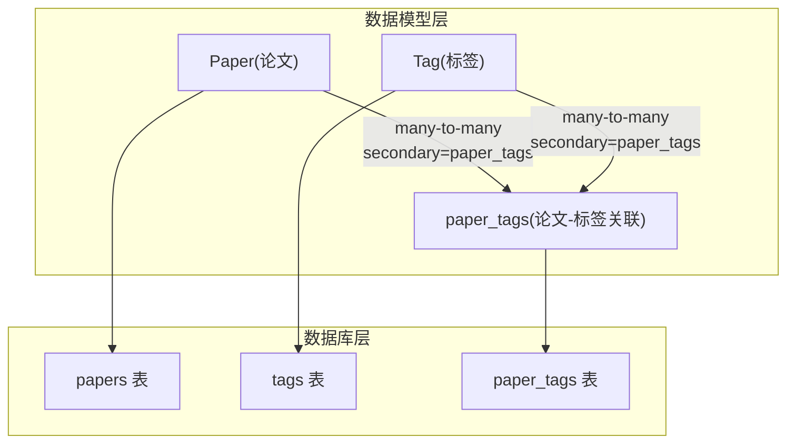
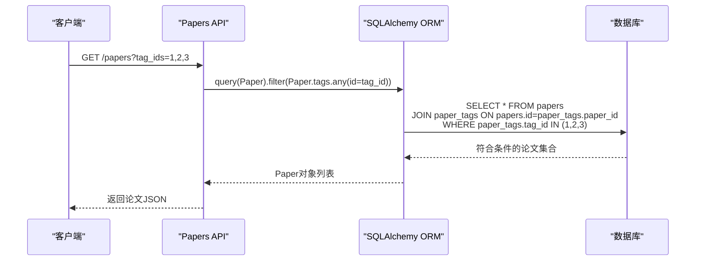
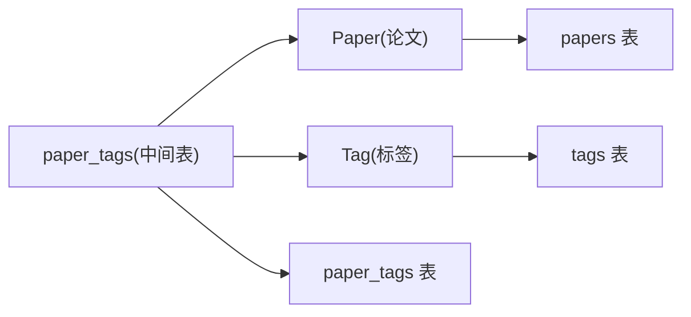

# Paper_Tags关联表

<cite>
**本文档引用的文件**
- [backend/models/paper.py](file://backend/models/paper.py)
- [specs/backend/models/relations_and_aux.yml](file://specs/backend/models/relations_and_aux.yml)
- [specs/backend/models/tag.yml](file://specs/backend/models/tag.yml)
- [specs/backend/models/paper.yml](file://specs/backend/models/paper.yml)
- [docs/SCHEMA.md](file://docs/SCHEMA.md)
- [backend/api/papers.py](file://backend/api/papers.py)
- [backend/models/__init__.py](file://backend/models/__init__.py)
- [scripts/maintenance/check_schema.py](file://scripts/maintenance/check_schema.py)
</cite>

## 目录
1. [简介](#简介)
2. [项目结构](#项目结构)
3. [核心组件](#核心组件)
4. [架构总览](#架构总览)
5. [详细组件分析](#详细组件分析)
6. [依赖关系分析](#依赖关系分析)
7. [性能考量](#性能考量)
8. [故障排查指南](#故障排查指南)
9. [结论](#结论)
10. [附录](#附录)

## 简介
本文件聚焦于Paper_Tags关联表（论文-标签多对多关联表）的设计与实现，系统阐述其在PaperHub论文标签系统中的作用、数据一致性保障、外键约束与引用完整性维护、索引设计与查询优化策略，并结合实际应用场景说明其在标签统计、论文筛选与数据聚合中的关键价值。

## 项目结构
Paper_Tags属于多对多关联中间表，位于数据模型层并通过ORM映射到数据库表。其与论文表、标签表共同构成论文标签系统的基石。



图表来源
- [backend/models/paper.py:18-27](file://backend/models/paper.py#L18-L27)
- [specs/backend/models/relations_and_aux.yml:4-28](file://specs/backend/models/relations_and_aux.yml#L4-L28)
- [specs/backend/models/tag.yml:44-49](file://specs/backend/models/tag.yml#L44-L49)
- [specs/backend/models/paper.yml:130-135](file://specs/backend/models/paper.yml#L130-L135)

章节来源
- [backend/models/paper.py:18-27](file://backend/models/paper.py#L18-L27)
- [specs/backend/models/relations_and_aux.yml:4-28](file://specs/backend/models/relations_and_aux.yml#L4-L28)
- [specs/backend/models/tag.yml:44-49](file://specs/backend/models/tag.yml#L44-L49)
- [specs/backend/models/paper.yml:130-135](file://specs/backend/models/paper.yml#L130-L135)

## 核心组件
- 关联表定义：Paper_Tags通过SQLAlchemy Table定义，包含复合主键（paper_id, tag_id），并带有创建时间字段。
- 模型关系：Paper与Tag通过secondary参数指向paper_tags，形成双向多对多关系。
- 外键约束：paper_id引用papers.id，tag_id引用tags.id；复合主键确保每对论文-标签组合唯一。
- 查询接口：API层支持按标签ID筛选论文，利用Paper.tags.any(id=tag_id)进行关联查询。

章节来源
- [backend/models/paper.py:18-27](file://backend/models/paper.py#L18-L27)
- [specs/backend/models/relations_and_aux.yml:4-28](file://specs/backend/models/relations_and_aux.yml#L4-L28)
- [specs/backend/models/tag.yml:44-49](file://specs/backend/models/tag.yml#L44-L49)
- [specs/backend/models/paper.yml:130-135](file://specs/backend/models/paper.yml#L130-L135)
- [backend/api/papers.py:87-91](file://backend/api/papers.py#L87-L91)

## 架构总览
Paper_Tags在PaperHub中的角色是“解耦实体与属性”的桥梁，使论文与标签之间具备灵活的多对多关系，同时保持数据一致性与可扩展性。



图表来源
- [backend/api/papers.py:87-91](file://backend/api/papers.py#L87-L91)
- [specs/backend/models/paper.yml:130-135](file://specs/backend/models/paper.yml#L130-L135)
- [specs/backend/models/tag.yml:44-49](file://specs/backend/models/tag.yml#L44-L49)

## 详细组件分析

### 设计原理与复合主键
- 复合主键设计：paper_id与tag_id共同组成主键，天然避免重复关联，无需额外唯一索引即可保证唯一性。
- 业务语义：每个论文只能与同一标签建立一次关联，防止重复打标签导致的统计偏差。
- 可扩展性：新增字段（如created_at）可在不破坏现有主键的前提下扩展元数据。

章节来源
- [specs/backend/models/relations_and_aux.yml:25-28](file://specs/backend/models/relations_and_aux.yml#L25-L28)
- [docs/SCHEMA.md:103](file://docs/SCHEMA.md#L103)

### 外键约束与引用完整性
- 外键关系：paper_id引用papers.id，tag_id引用tags.id，确保删除标签或论文时不会产生悬挂引用。
- 引用完整性：由于paper_id与tag_id均为NOT NULL且受外键约束，任何非法值都会在插入阶段被拒绝。
- 级联策略：当前paper_tags仅包含复合主键与created_at，未定义级联删除；删除论文或标签时需显式清理关联，避免孤儿记录。

章节来源
- [specs/backend/models/relations_and_aux.yml:8-24](file://specs/backend/models/relations_and_aux.yml#L8-L24)
- [docs/SCHEMA.md:99-101](file://docs/SCHEMA.md#L99-L101)

### 数据一致性保证
- 唯一性：复合主键保证同一论文-标签组合只存在一条记录。
- 事务性：通过ORM会话提交（commit）确保关联变更原子性。
- 一致性校验：API层在添加/移除标签时先查询目标实体是否存在，再执行关系变更，减少不一致风险。

章节来源
- [backend/models/paper.py:18-27](file://backend/models/paper.py#L18-L27)
- [backend/api/papers.py:753-770](file://backend/api/papers.py#L753-L770)

### 索引设计与查询优化
- 主键索引：复合主键(paper_id, tag_id)即为唯一索引，覆盖关联查询与去重需求。
- 查询路径：API按标签筛选论文时，底层通过JOIN paper_tags实现，主键索引可高效定位匹配记录。
- 建议补充索引（视业务需要）：
  - idx_paper_tags_tag_id：加速按标签反查论文
  - idx_paper_tags_created_at：按创建时间排序或统计
- 注意：SQLite默认不支持部分索引，如需更细粒度优化，可考虑在应用层缓存常用查询结果。

章节来源
- [specs/backend/models/relations_and_aux.yml:25-28](file://specs/backend/models/relations_and_aux.yml#L25-L28)
- [backend/api/papers.py:87-91](file://backend/api/papers.py#L87-L91)

### 实际应用场景与使用示例
- 论文筛选：按多个标签ID筛选论文，API内部逐个tag_id使用Paper.tags.any(id=tag_id)进行过滤。
- 标签统计：前端可基于paper_tags统计各标签的论文数量，或按标签聚合展示。
- 批量操作：API支持批量为论文添加/移除标签，内部通过ORM关系集合进行增删。
- 数据聚合：结合papers表的分类、状态等字段，可实现“某标签下不同状态/分类的论文分布”。

章节来源
- [backend/api/papers.py:87-91](file://backend/api/papers.py#L87-L91)
- [backend/api/papers.py:753-770](file://backend/api/papers.py#L753-L770)
- [docs/项目完整复盘与优化清单.md:116-127](file://docs/项目完整复盘与优化清单.md#L116-L127)

### 关系映射与ORM交互
- 模型侧：Paper与Tag均通过secondary=paper_tags建立多对多关系，back_populates确保双向同步。
- 初始化：backend/models/__init__.py导出paper_tags，供API与服务层直接引用。
- 查询：API层使用Paper.tags.any(id=tag_id)触发关联查询，ORM生成JOIN语句并利用主键索引。

```mermaid
classDiagram
class Paper {
+int id
+String title
+Tag[] tags
}
class Tag {
+int id
+String name
+Paper[] papers
}
class paper_tags {
+int paper_id
+int tag_id
+DateTime created_at
}
Paper "1" <---> "N" paper_tags : "many-to-many"
Tag "1" <---> "N" paper_tags : "many-to-many"
```

图表来源
- [backend/models/paper.py:18-27](file://backend/models/paper.py#L18-L27)
- [specs/backend/models/tag.yml:44-49](file://specs/backend/models/tag.yml#L44-L49)
- [specs/backend/models/paper.yml:130-135](file://specs/backend/models/paper.yml#L130-L135)

章节来源
- [backend/models/paper.py:18-27](file://backend/models/paper.py#L18-L27)
- [specs/backend/models/tag.yml:44-49](file://specs/backend/models/tag.yml#L44-L49)
- [specs/backend/models/paper.yml:130-135](file://specs/backend/models/paper.yml#L130-L135)
- [backend/models/__init__.py:9-19](file://backend/models/__init__.py#L9-L19)

## 依赖关系分析
Paper_Tags与Paper、Tag之间的依赖关系如下：



图表来源
- [specs/backend/models/relations_and_aux.yml:4-28](file://specs/backend/models/relations_and_aux.yml#L4-L28)
- [specs/backend/models/tag.yml:44-49](file://specs/backend/models/tag.yml#L44-L49)
- [specs/backend/models/paper.yml:130-135](file://specs/backend/models/paper.yml#L130-L135)

章节来源
- [specs/backend/models/relations_and_aux.yml:4-28](file://specs/backend/models/relations_and_aux.yml#L4-L28)
- [specs/backend/models/tag.yml:44-49](file://specs/backend/models/tag.yml#L44-L49)
- [specs/backend/models/paper.yml:130-135](file://specs/backend/models/paper.yml#L130-L135)

## 性能考量
- 查询路径：按标签筛选论文时，底层JOIN paper_tags，主键索引可快速定位匹配记录。
- 批量操作：API批量添加/移除标签时，建议控制单次操作的标签数量，避免过长事务。
- 缓存策略：高频统计（如标签论文数量）可在应用层缓存，降低数据库压力。
- 索引优化：若存在大量按tag_id反查论文的场景，可考虑补充索引以提升反向查询性能。

## 故障排查指南
- 插入失败：检查paper_id与tag_id是否为空，以及papers与tags中对应记录是否存在。
- 删除异常：确认是否需要清理paper_tags中的关联记录，避免外键约束报错。
- 查询无结果：确认API传入的tag_ids格式正确，且Paper.tags关系已加载。
- 结构核验：可使用维护脚本检查数据库表结构，确认paper_tags存在且字段完整。

章节来源
- [scripts/maintenance/check_schema.py:1-26](file://scripts/maintenance/check_schema.py#L1-L26)
- [backend/api/papers.py:87-91](file://backend/api/papers.py#L87-L91)

## 结论
Paper_Tags作为论文与标签之间的纽带，采用复合主键与外键约束确保了数据一致性与可扩展性。通过ORM的多对多关系映射与API层的筛选逻辑，系统实现了高效的论文筛选、标签统计与数据聚合能力。建议在实际部署中根据查询热点补充索引，并在批量操作时注意事务边界与性能影响。

## 附录
- 数据库Schema参考：见docs/SCHEMA.md中的paper_tags表定义与索引说明。
- 模型与规格：详见specs/backend/models/relations_and_aux.yml、specs/backend/models/tag.yml、specs/backend/models/paper.yml。