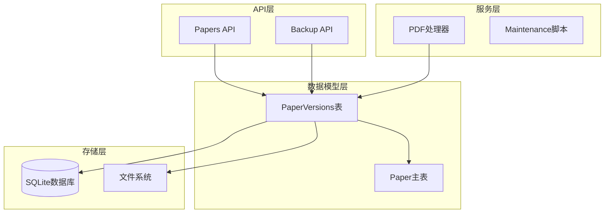
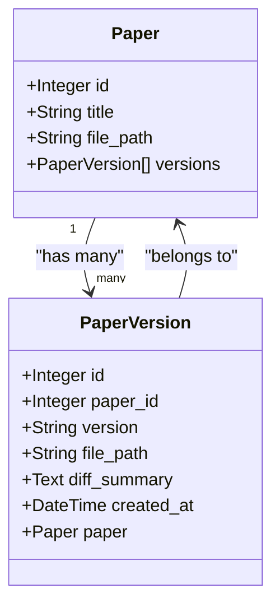
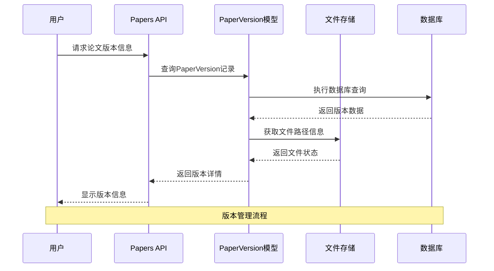
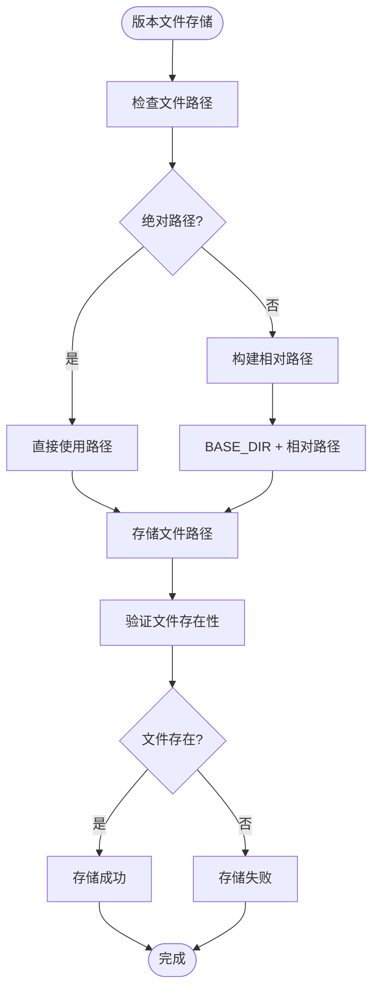
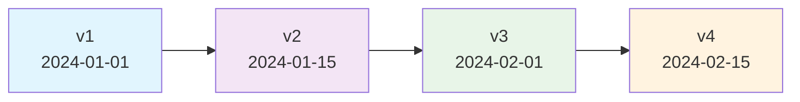
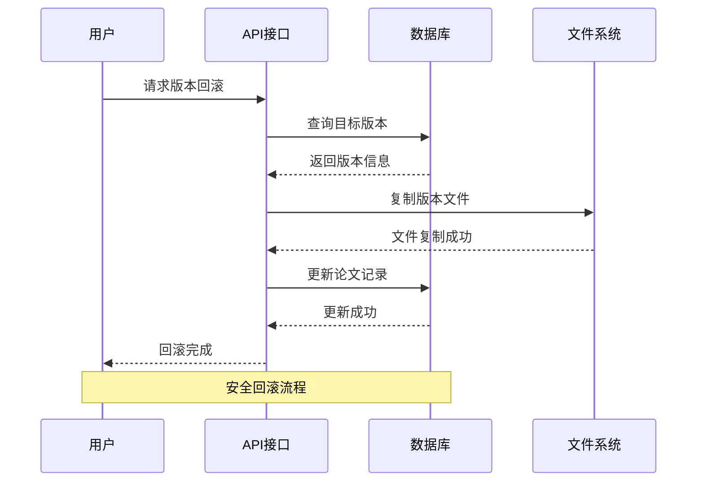
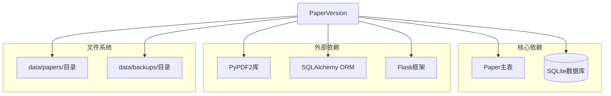

# Paper_Versions表

<cite>
**本文档引用的文件**
- [backend/models/paper.py](file://backend/models/paper.py)
- [specs/backend/models/paper.yml](file://specs/backend/models/paper.yml)
- [specs/backend/models/relations_and_aux.yml](file://specs/backend/models/relations_and_aux.yml)
- [backend/api/papers.py](file://backend/api/papers.py)
- [backend/config.py](file://backend/config.py)
- [scripts/maintenance/backup.py](file://scripts/maintenance/backup.py)
- [scripts/maintenance/restore.py](file://scripts/maintenance/restore.py)
- [backend/services/pdf_processor.py](file://backend/services/pdf_processor.py)
</cite>

## 目录
1. [简介](#简介)
2. [项目结构](#项目结构)
3. [核心组件](#核心组件)
4. [架构概览](#架构概览)
5. [详细组件分析](#详细组件分析)
6. [依赖关系分析](#依赖关系分析)
7. [性能考虑](#性能考虑)
8. [故障排除指南](#故障排除指南)
9. [结论](#结论)
10. [附录](#附录)

## 简介

Paper_Versions表是PaperHub论文管理系统中的核心版本控制组件，专门用于跟踪和管理论文文件的历史版本。该表设计遵循严格的版本管理原则，确保用户能够有效追踪论文内容的演进过程，实现版本回滚、差异对比和历史版本访问等功能。

该表采用简洁而高效的数据库设计，通过版本号标识、文件路径存储和差异摘要记录，为论文版本管理提供了完整的解决方案。系统支持多种版本命名规范，并提供了灵活的版本比较策略，满足不同使用场景的需求。

## 项目结构

Paper_Versions表位于系统的数据模型层，与论文主表形成一对多的关系。整个版本管理架构包括以下关键组件：

**图表来源**
- [backend/models/paper.py:299-320](file://backend/models/paper.py#L299-L320)
- [specs/backend/models/relations_and_aux.yml:160-196](file://specs/backend/models/relations_and_aux.yml#L160-L196)

**章节来源**
- [backend/models/paper.py:299-320](file://backend/models/paper.py#L299-L320)
- [specs/backend/models/relations_and_aux.yml:160-196](file://specs/backend/models/relations_and_aux.yml#L160-L196)

## 核心组件

### PaperVersion模型定义

Paper_Versions表的核心数据结构由以下字段组成：

| 字段名 | 类型 | 约束 | 描述 |
|--------|------|------|------|
| id | Integer | 主键, 唯一, 非空 | 版本记录的唯一标识符 |
| paper_id | Integer | 外键, 非空 | 关联的论文记录ID |
| version | String | 非空 | 版本号标识符（如v1, v2等） |
| file_path | String | 非空 | 对应版本文件的存储路径 |
| diff_summary | Text | 可空 | 版本间的差异摘要说明 |
| created_at | DateTime | 非空 | 版本创建的时间戳 |

### 关系映射

PaperVersion模型与Paper主表建立了一对多的关联关系，通过paper_id外键字段实现：

**图表来源**
- [backend/models/paper.py:120-146](file://backend/models/paper.py#L120-L146)
- [backend/models/paper.py:299-320](file://backend/models/paper.py#L299-L320)

**章节来源**
- [backend/models/paper.py:120-146](file://backend/models/paper.py#L120-L146)
- [backend/models/paper.py:299-320](file://backend/models/paper.py#L299-L320)

## 架构概览

Paper_Versions表在整个系统架构中扮演着关键角色，连接着数据存储、业务逻辑和用户界面三个层面：

**图表来源**
- [backend/api/papers.py:111-147](file://backend/api/papers.py#L111-L147)
- [backend/models/paper.py:299-320](file://backend/models/paper.py#L299-L320)

## 详细组件分析

### 版本号命名规范

系统支持灵活的版本号命名策略，主要遵循以下规范：

#### 标准版本号格式
- **v1, v2, v3, ...**：基础递增版本号
- **v1.0, v1.1, v2.0**：主版本.次版本格式
- **v1.0.0, v1.0.1**：语义化版本控制格式

#### 版本号生成策略
系统通过以下规则确保版本号的唯一性和有序性：
1. **自动递增**：基于现有版本数量自动计算新版本号
2. **冲突检测**：检查目标版本号是否已被使用
3. **回退保护**：防止版本号重复覆盖重要版本

### 版本文件存储管理

#### 存储路径策略
Paper_Versions表通过file_path字段存储每个版本对应的文件路径，采用以下组织方式：

**图表来源**
- [backend/config.py:18-32](file://backend/config.py#L18-L32)
- [backend/api/papers.py:133-146](file://backend/api/papers.py#L133-L146)

#### 文件清理机制
系统提供自动文件清理功能，当论文记录被删除或版本切换时，自动清理不再使用的版本文件：

**章节来源**
- [backend/config.py:18-32](file://backend/config.py#L18-L32)
- [backend/api/papers.py:133-146](file://backend/api/papers.py#L133-L146)

### 版本差异摘要生成

#### 摘要内容结构
diff_summary字段用于存储版本间的差异信息，包含以下关键要素：

| 摘要要素 | 描述 | 示例 |
|----------|------|------|
| 内容变更 | 主要内容的修改说明 | "更新了实验结果部分" |
| 格式调整 | 文档格式的调整信息 | "修正了参考文献格式" |
| 新增内容 | 新增的重要章节或数据 | "添加了新的案例研究" |
| 删除内容 | 移除的内容说明 | "删除了过时的实验数据" |

#### 自动生成策略
系统通过以下步骤生成差异摘要：
1. **内容对比**：比较新旧版本的文本内容
2. **变更识别**：识别新增、修改、删除的段落
3. **摘要生成**：将变更类型转换为自然语言描述
4. **格式化输出**：组织摘要内容的结构和格式

### 版本比较策略

#### 时间排序策略
系统按照created_at字段进行版本排序，确保版本的时序正确性：

#### 版本选择策略
用户可以选择特定版本进行查看或下载，系统支持以下操作：
- **最新版本**：默认显示最新版本
- **指定版本**：根据版本号访问特定版本
- **版本对比**：同时显示两个版本的差异

### 版本回滚机制

#### 回滚流程
系统提供安全的版本回滚功能，确保用户能够恢复到之前的版本：

**图表来源**
- [backend/api/papers.py:256-295](file://backend/api/papers.py#L256-L295)

#### 回滚保护机制
系统实施多重保护措施防止意外回滚：
1. **确认提示**：回滚操作前要求用户确认
2. **备份创建**：回滚前自动创建当前状态备份
3. **版本锁定**：防止对正在使用的版本进行回滚
4. **完整性检查**：验证目标版本文件的完整性

**章节来源**
- [backend/api/papers.py:256-295](file://backend/api/papers.py#L256-L295)

## 依赖关系分析

### 数据模型依赖

Paper_Versions表与系统其他组件存在以下依赖关系：

**图表来源**
- [specs/backend/models/relations_and_aux.yml:160-196](file://specs/backend/models/relations_and_aux.yml#L160-L196)
- [backend/config.py:18-32](file://backend/config.py#L18-L32)

### API接口依赖

Papers API模块为Paper_Versions表提供完整的CRUD操作接口，包括：

- **版本查询**：获取论文的所有版本信息
- **版本创建**：为新论文创建初始版本
- **版本更新**：更新版本文件和摘要信息
- **版本删除**：清理不再需要的版本记录

**章节来源**
- [specs/backend/models/relations_and_aux.yml:160-196](file://specs/backend/models/relations_and_aux.yml#L160-L196)
- [backend/api/papers.py:111-147](file://backend/api/papers.py#L111-L147)

## 性能考虑

### 存储优化策略

#### 文件压缩
系统采用以下策略优化版本文件的存储空间：
- **增量存储**：只存储版本间的差异文件
- **压缩格式**：使用ZIP格式压缩多个版本文件
- **缓存机制**：对常用版本文件进行内存缓存

#### 数据库性能
- **索引优化**：为paper_id字段建立索引提高查询性能
- **连接池**：使用连接池减少数据库连接开销
- **事务管理**：合理使用事务确保数据一致性

### 查询性能优化

系统通过以下方式优化版本查询性能：
- **分页查询**：支持大量版本记录的分页显示
- **条件过滤**：支持按时间范围、版本号等条件过滤
- **预加载策略**：避免N+1查询问题

## 故障排除指南

### 常见问题及解决方案

#### 版本文件丢失
**问题描述**：版本文件在存储过程中丢失
**解决步骤**：
1. 检查文件路径配置是否正确
2. 验证文件权限设置
3. 确认磁盘空间充足
4. 检查文件系统完整性

#### 版本号冲突
**问题描述**：新版本号与现有版本冲突
**解决步骤**：
1. 检查版本号生成逻辑
2. 验证版本号唯一性约束
3. 重新生成版本号序列
4. 更新相关索引

#### 版本回滚失败
**问题描述**：版本回滚操作无法完成
**解决步骤**：
1. 检查目标版本文件完整性
2. 验证回滚权限设置
3. 确认数据库事务状态
4. 查看系统日志获取详细错误信息

### 调试工具

系统提供以下调试工具帮助诊断版本管理问题：
- **版本状态检查**：验证版本记录的完整性
- **文件路径验证**：检查文件路径的有效性
- **数据库连接测试**：验证数据库连接状态
- **存储空间监控**：监控版本文件的存储使用情况

**章节来源**
- [scripts/maintenance/backup.py:1-41](file://scripts/maintenance/backup.py#L1-41)
- [scripts/maintenance/restore.py:1-74](file://scripts/maintenance/restore.py#L1-74)

## 结论

Paper_Versions表作为PaperHub论文管理系统的核心组件，通过精心设计的数据结构和完善的版本管理机制，为用户提供了可靠的论文版本控制能力。该表不仅支持基本的版本存储和检索功能，还具备版本回滚、差异对比、文件清理等高级特性。

系统的设计充分考虑了实用性、可维护性和扩展性，能够适应不同规模的论文管理需求。通过合理的版本命名规范、存储管理和回滚机制，确保用户能够有效地管理论文的演进过程，为学术研究和知识管理提供强有力的技术支撑。

## 附录

### 使用场景示例

#### 场景1：论文修订管理
研究人员可以使用版本管理功能跟踪论文的多次修订过程，每次修订都会生成新的版本记录，便于追溯修改历史。

#### 场景2：团队协作
在团队协作环境中，多个成员可以对同一论文进行编辑，版本管理确保每个人的修改都能被正确记录和追踪。

#### 场景3：学术出版
在论文投稿过程中，研究人员可以保存不同阶段的版本，包括初稿、修改稿、最终稿等，为出版流程提供完整的版本记录。

### 最佳实践建议

1. **定期清理**：定期清理不再需要的旧版本文件，释放存储空间
2. **版本命名**：采用清晰的版本命名规范，便于理解和查找
3. **备份策略**：建立定期备份机制，防止版本数据丢失
4. **权限控制**：合理设置版本管理的访问权限，保护敏感信息
5. **监控告警**：建立存储空间和性能监控，及时发现潜在问题