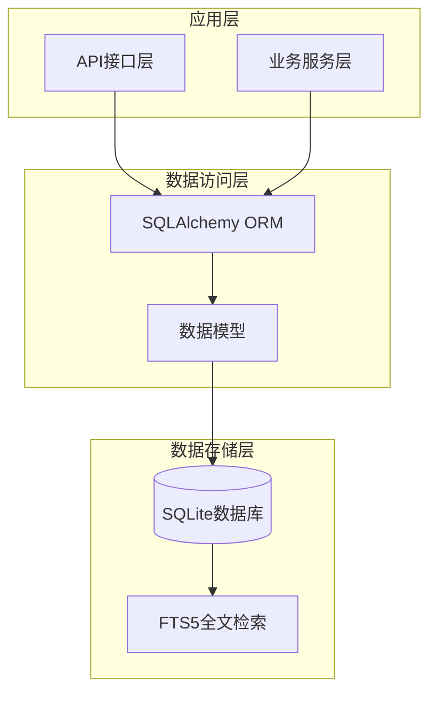
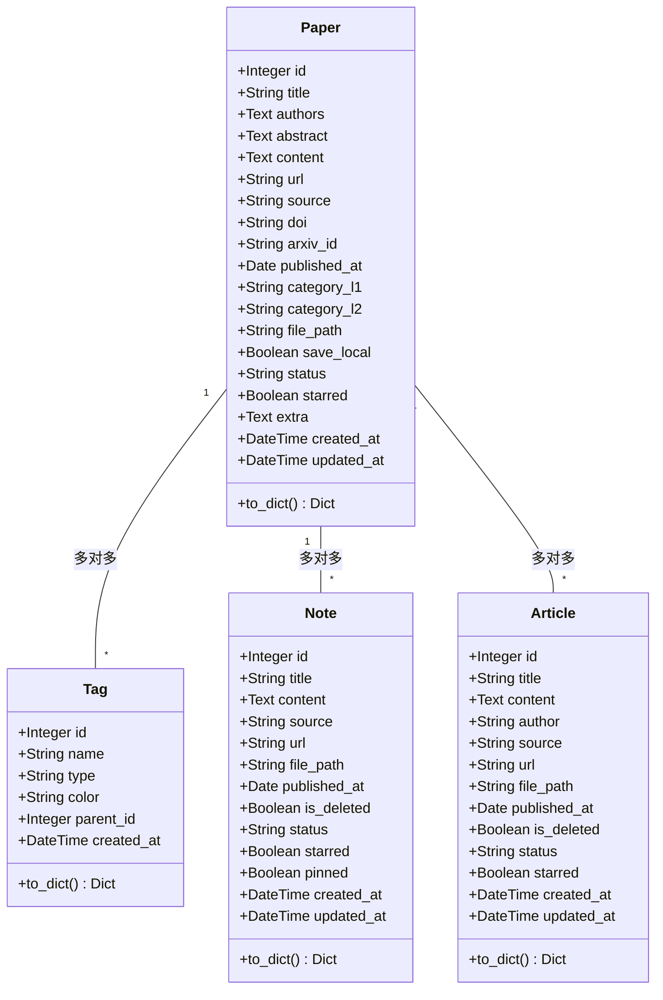
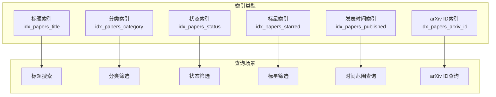
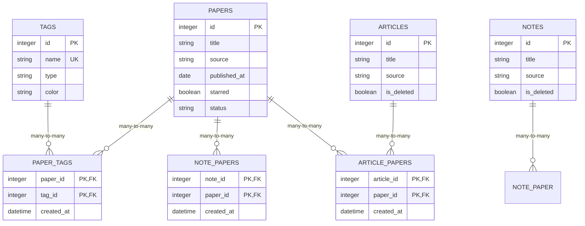
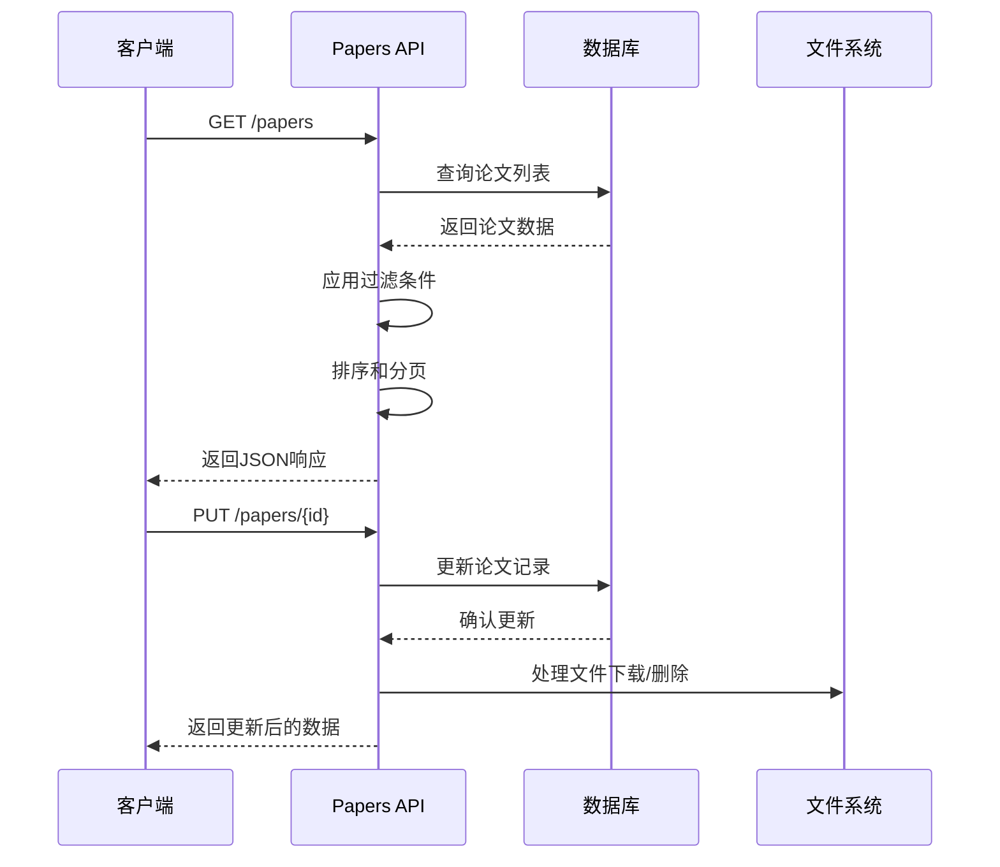
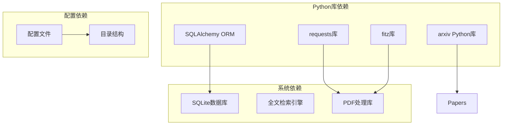
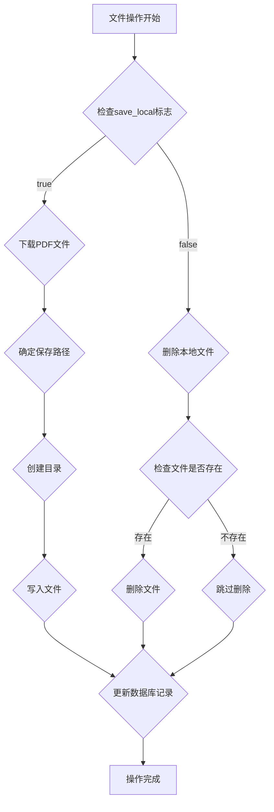

# Papers表

<cite>
**本文档引用的文件**
- [paper.py](file://backend/models/paper.py)
- [paper.yml](file://specs/backend/models/paper.yml)
- [papers.py](file://backend/api/papers.py)
- [SCHEMA.md](file://docs/SCHEMA.md)
- [arxiv_fetcher.py](file://backend/services/arxiv_fetcher.py)
- [config.py](file://backend/config.py)
</cite>

## 目录
1. [简介](#简介)
2. [项目结构](#项目结构)
3. [核心组件](#核心组件)
4. [架构概览](#架构概览)
5. [详细组件分析](#详细组件分析)
6. [依赖关系分析](#依赖关系分析)
7. [性能考虑](#性能考虑)
8. [故障排除指南](#故障排除指南)
9. [结论](#结论)
10. [附录](#附录)

## 简介

Papers表是PaperHub系统的核心数据表，用于存储学术论文和文章的元数据信息。该表设计遵循关系型数据库范式，支持完整的论文生命周期管理，包括导入、检索、分类、标签管理和版本控制等功能。

本文档将深入分析Papers表的字段定义、数据类型、业务含义、约束条件、索引策略以及与其他表的关系设计，为开发者和用户提供全面的技术参考。

## 项目结构

PaperHub采用分层架构设计，Papers表位于数据模型层，通过SQLAlchemy ORM框架进行数据持久化操作。



**图表来源**
- [paper.py:119-146](file://backend/models/paper.py#L119-L146)
- [config.py:35-57](file://backend/config.py#L35-L57)

**章节来源**
- [paper.py:1-360](file://backend/models/paper.py#L1-L360)
- [config.py:1-134](file://backend/config.py#L1-L134)

## 核心组件

### 数据模型定义

Papers表采用SQLAlchemy声明式映射，定义了完整的字段结构和关系映射。



**图表来源**
- [paper.py:119-146](file://backend/models/paper.py#L119-L146)
- [paper.py:93-106](file://backend/models/paper.py#L93-L106)
- [paper.py:247-293](file://backend/models/paper.py#L247-L293)

### 字段详细定义

#### 标识符字段
- **id**: 主键，整数类型，自增标识符
- **created_at**: 创建时间戳，默认当前时间
- **updated_at**: 更新时间戳，默认当前时间，自动更新

#### 基本信息字段
- **title**: 论文标题，字符串类型，最大长度512字符，必填
- **authors**: 作者信息，文本类型，支持JSON数组或逗号分隔格式
- **abstract**: 摘要内容，文本类型
- **content**: 全文内容，文本类型
- **url**: 原文链接，字符串类型，最大长度255字符

#### 来源和标识字段
- **source**: 数据来源，字符串类型，最大长度50字符，必填
  - 支持值：arxiv、wechat、blog、conference等
- **doi**: DOI编号，字符串类型，最大长度255字符，唯一约束
- **arxiv_id**: arXiv ID，字符串类型，最大长度64字符，唯一约束
  - 格式示例：2310.06825

#### 时间和分类字段
- **published_at**: 发表日期，日期类型
- **category_l1**: 一级分类，字符串类型，最大长度64字符
- **category_l2**: 二级分类，字符串类型，最大长度64字符

#### 文件和状态字段
- **file_path**: 本地文件路径，字符串类型，最大长度512字符
- **save_local**: 本地保存标志，布尔类型，默认true
- **status**: 阅读状态，字符串类型，最大长度32字符，默认pending
  - 可选值：pending、reading、done、mastered
- **starred**: 标星标记，布尔类型，默认false
- **extra**: 扩展JSON字段，文本类型

**章节来源**
- [paper.yml:3-129](file://specs/backend/models/paper.yml#L3-L129)
- [paper.py:120-146](file://backend/models/paper.py#L120-L146)

## 架构概览

Papers表在整个系统中的作用和与其他组件的交互关系如下：

```mermaid
graph LR
subgraph "外部系统"
Arxiv[arXiv API]
WeChat[微信公众号]
Blog[博客平台]
end
subgraph "数据处理层"
Importer[导入器]
Parser[解析器]
Deduplicator[去重器]
end
subgraph "核心数据层"
Papers[Papers表]
Tags[Tags表]
PaperTags[Paper_Tags关联表]
Notes[Notes表]
Articles[Articles表]
end
subgraph "应用层"
API[REST API]
Frontend[前端界面]
end
Arxiv --> Importer
WeChat --> Importer
Blog --> Importer
Importer --> Parser
Parser --> Deduplicator
Deduplicator --> Papers
Papers <- --> PaperTags
PaperTags --> Tags
Papers <- --> Notes
Papers <- --> Articles
API --> Papers
Frontend --> API
```

**图表来源**
- [papers.py:29-108](file://backend/api/papers.py#L29-L108)
- [paper.py:18-87](file://backend/models/paper.py#L18-L87)

## 详细组件分析

### 字段约束和验证规则

#### 约束条件
- **主键约束**: id字段为主键，确保每条记录的唯一性
- **非空约束**: title、source、created_at、updated_at字段不允许为空
- **唯一约束**: 
  - doi字段具有唯一约束，用于防止重复导入
  - arxiv_id字段具有唯一约束，用于arXiv论文去重
- **默认值设置**:
  - save_local: 默认true
  - status: 默认'pending'
  - starred: 默认false
  - created_at: 默认当前时间
  - updated_at: 默认当前时间

#### 数据验证规则
- **长度限制**: 各字符串字段均设置了合理的长度限制
- **格式要求**: 
  - URL字段应符合标准URL格式
  - arXiv ID应符合2310.06825格式
  - 日期字段应符合YYYY-MM-DD格式

### 索引策略和性能影响

#### 现有索引设计



**图表来源**
- [paper.yml:151-163](file://specs/backend/models/paper.yml#L151-L163)

#### 索引性能分析

| 索引类型 | 查询场景 | 性能影响 | 使用建议 |
|---------|---------|---------|---------|
| 标题索引 | 标题模糊搜索、精确匹配 | 高效，支持前缀匹配 | 适用于论文检索和搜索功能 |
| 分类索引 | 一级/二级分类筛选 | 高效，复合索引优化 | 支持多维分类查询 |
| 状态索引 | 阅读状态筛选 | 高效，枚举值优化 | 支持学习进度跟踪 |
| 标星索引 | 收藏论文筛选 | 高效，布尔值优化 | 支持个性化推荐 |
| 发表时间索引 | 日期范围查询 | 高效，时间序列优化 | 支持时间轴展示 |
| arXiv ID索引 | 唯一ID查询 | 极高效，主键优化 | 防止重复导入 |

**章节来源**
- [paper.yml:151-163](file://specs/backend/models/paper.yml#L151-L163)
- [SCHEMA.md:66-72](file://docs/SCHEMA.md#L66-L72)

### 字段间关系设计

#### 多对多关系



**图表来源**
- [paper.py:18-87](file://backend/models/paper.py#L18-L87)
- [paper.py:119-146](file://backend/models/paper.py#L119-L146)

#### 数据完整性保证机制

1. **外键约束**: 所有关联表均定义了适当的外键约束
2. **唯一约束**: DOI和arXiv ID字段的唯一性确保数据一致性
3. **级联操作**: 定义了适当的级联删除和更新行为
4. **事务管理**: API层实现了完整的事务处理机制

**章节来源**
- [paper.py:18-87](file://backend/models/paper.py#L18-L87)
- [paper.py:119-146](file://backend/models/paper.py#L119-L146)

### API接口设计

#### 核心API功能



**图表来源**
- [papers.py:29-108](file://backend/api/papers.py#L29-L108)
- [papers.py:181-253](file://backend/api/papers.py#L181-L253)

#### 支持的查询参数

| 参数名 | 类型 | 描述 | 示例 |
|-------|------|------|------|
| page | int | 页码，默认1 | ?page=2 |
| per_page | int | 每页数量，默认20 | ?per_page=50 |
| category_l1 | string | 一级分类 | ?category_l1=cs |
| status | string | 阅读状态 | ?status=done |
| starred | boolean | 标星状态 | ?starred=true |
| source | string | 数据来源 | ?source=arxiv |
| published_date | string | 具体日期 | ?published_date=2023-10-01 |
| start_date | string | 开始日期 | ?start_date=2023-01-01 |
| end_date | string | 结束日期 | ?end_date=2023-12-31 |
| year | int | 年份 | ?year=2023 |
| month | string | 月份 | ?month=2023-10 |

**章节来源**
- [papers.py:29-108](file://backend/api/papers.py#L29-L108)

## 依赖关系分析

### 外部依赖



**图表来源**
- [arxiv_fetcher.py:5-14](file://backend/services/arxiv_fetcher.py#L5-L14)
- [config.py:35-57](file://backend/config.py#L35-L57)

### 内部依赖关系

| 组件 | 依赖组件 | 用途 |
|------|---------|------|
| papers.py | paper.py | 数据模型访问 |
| papers.py | arxiv_fetcher.py | arXiv数据获取 |
| arxiv_fetcher.py | config.py | 配置参数访问 |
| paper.py | config.py | 数据库连接配置 |
| SCHEMA.md | 所有组件 | 架构规范参考 |

**章节来源**
- [papers.py:12-26](file://backend/api/papers.py#L12-L26)
- [arxiv_fetcher.py:11-14](file://backend/services/arxiv_fetcher.py#L11-L14)
- [paper.py:8-15](file://backend/models/paper.py#L8-L15)

## 性能考虑

### 查询优化策略

#### 索引使用建议

1. **复合索引优化**
   - 对于经常组合使用的查询条件，考虑创建复合索引
   - 例如：`(category_l1, status)`、`(published_at, starred)`

2. **全文检索集成**
   - 利用SQLite FTS5进行全文搜索
   - 需要额外的虚拟表papers_fts支持

3. **缓存策略**
   - 对热门查询结果实施缓存
   - 使用Redis或其他内存数据库缓存热点数据

#### 性能监控指标

| 指标类型 | 目标值 | 监控方法 |
|---------|--------|---------|
| 查询响应时间 | <100ms | 数据库查询日志 |
| 并发连接数 | <50 | 连接池监控 |
| 索引命中率 | >95% | 数据库统计信息 |
| 磁盘I/O | <100MB/s | 系统监控 |

### 存储优化

#### 文件管理策略



**图表来源**
- [papers.py:197-229](file://backend/api/papers.py#L197-L229)

## 故障排除指南

### 常见问题及解决方案

#### 数据导入问题

**问题**: 导入重复的arXiv论文
**原因**: arXiv ID已存在
**解决方案**: 
1. 检查arxiv_id字段的唯一性
2. 使用批量导入API的去重功能
3. 手动清理重复记录

#### 文件访问问题

**问题**: PDF文件无法下载或访问
**原因**: 文件路径错误或权限问题
**解决方案**:
1. 验证file_path字段的正确性
2. 检查PAPERS_DIR目录权限
3. 确认文件系统空间充足

#### 查询性能问题

**问题**: 大数据量查询响应缓慢
**原因**: 缺少合适的索引或查询条件不当
**解决方案**:
1. 添加必要的索引
2. 优化WHERE子句条件
3. 实施分页查询

**章节来源**
- [papers.py:256-295](file://backend/api/papers.py#L256-L295)
- [papers.py:324-366](file://backend/api/papers.py#L324-L366)

### 错误处理机制

#### 异常类型和处理

| 异常类型 | 触发条件 | 处理方式 |
|---------|---------|---------|
| NotFound | 论文不存在 | 返回404状态码 |
| ValidationError | 数据验证失败 | 返回400状态码 |
| DatabaseError | 数据库操作异常 | 返回500状态码 |
| FileError | 文件操作异常 | 返回500状态码 |

#### 日志记录策略

1. **错误日志**: 记录所有异常和错误信息
2. **访问日志**: 记录API调用和查询信息
3. **性能日志**: 记录查询耗时和性能指标

## 结论

Papers表作为PaperHub系统的核心数据表，设计合理、结构清晰，能够有效支持学术论文和文章的全生命周期管理。其完善的字段定义、严格的约束条件、高效的索引策略以及灵活的API接口，为系统的稳定运行和良好用户体验提供了坚实基础。

通过持续的性能优化和功能扩展，Papers表将继续为PaperHub系统的发展提供强有力的数据支撑。

## 附录

### 实际使用示例

#### 基本查询示例

```sql
-- 查询所有待读论文
SELECT * FROM papers WHERE status = 'pending';

-- 按分类筛选论文
SELECT * FROM papers 
WHERE category_l1 = 'cs' AND category_l2 = 'AI';

-- 按时间范围查询
SELECT * FROM papers 
WHERE published_at BETWEEN '2023-01-01' AND '2023-12-31';
```

#### API调用示例

```bash
# 获取论文列表
curl "http://localhost:5000/api/papers?page=1&per_page=20"

# 按状态筛选
curl "http://localhost:5000/api/papers?status=done"

# 按分类筛选
curl "http://localhost:5000/api/papers?category_l1=cs"
```

### 最佳实践建议

1. **数据质量控制**
   - 建立严格的数据验证机制
   - 定期清理重复和无效数据
   - 实施数据备份和恢复策略

2. **性能优化**
   - 合理使用索引，避免过度索引
   - 实施查询缓存机制
   - 优化大数据量的分页查询

3. **安全性考虑**
   - 实施适当的访问控制
   - 防止SQL注入攻击
   - 定期更新和维护系统

4. **可扩展性设计**
   - 保持数据模型的向后兼容性
   - 设计灵活的扩展点
   - 实施版本化的API接口