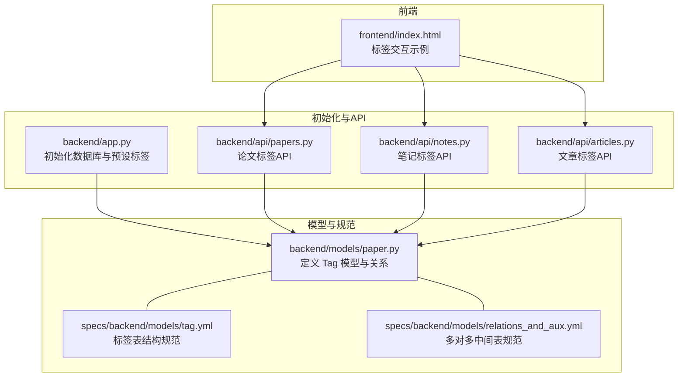
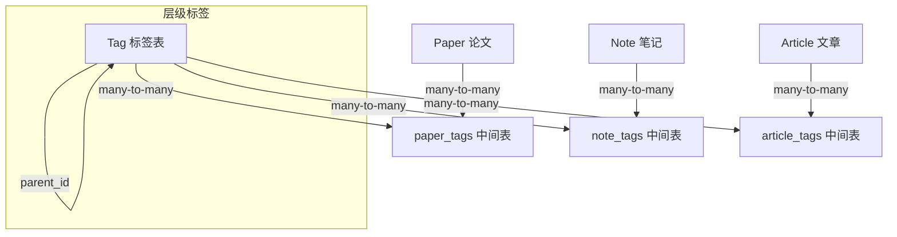
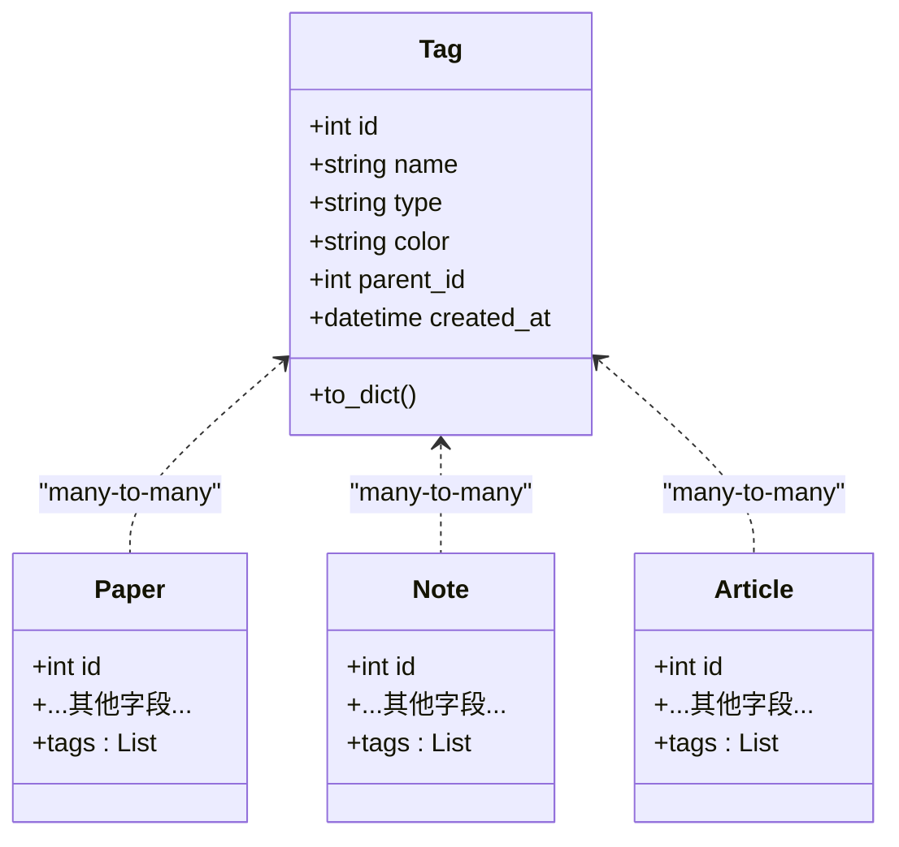
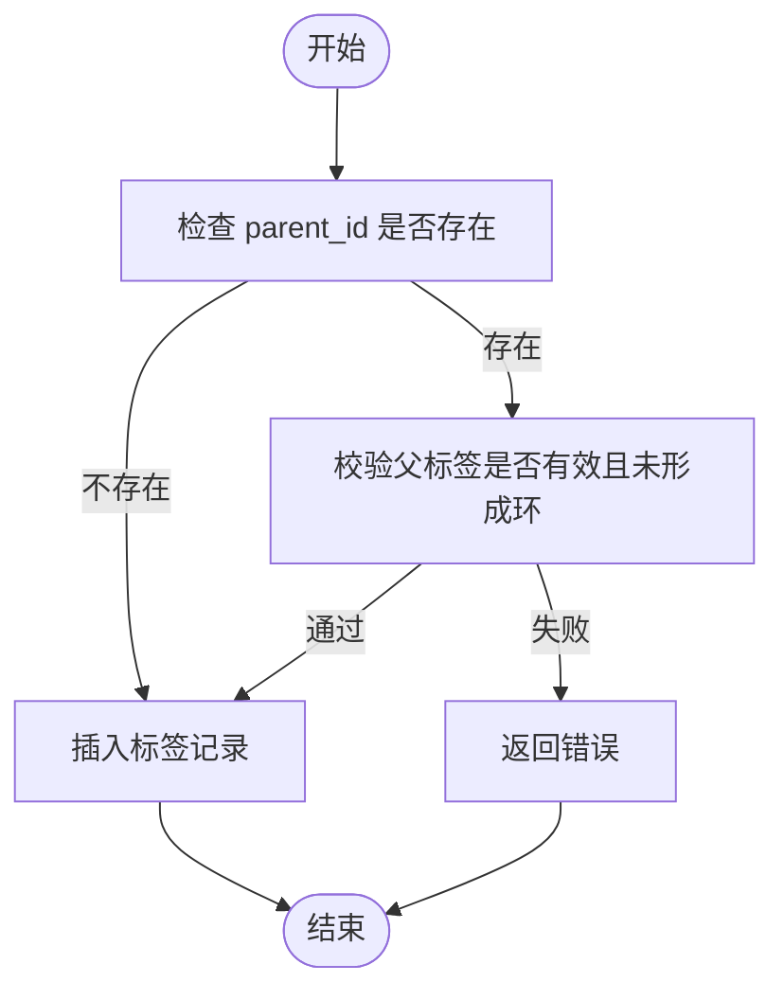
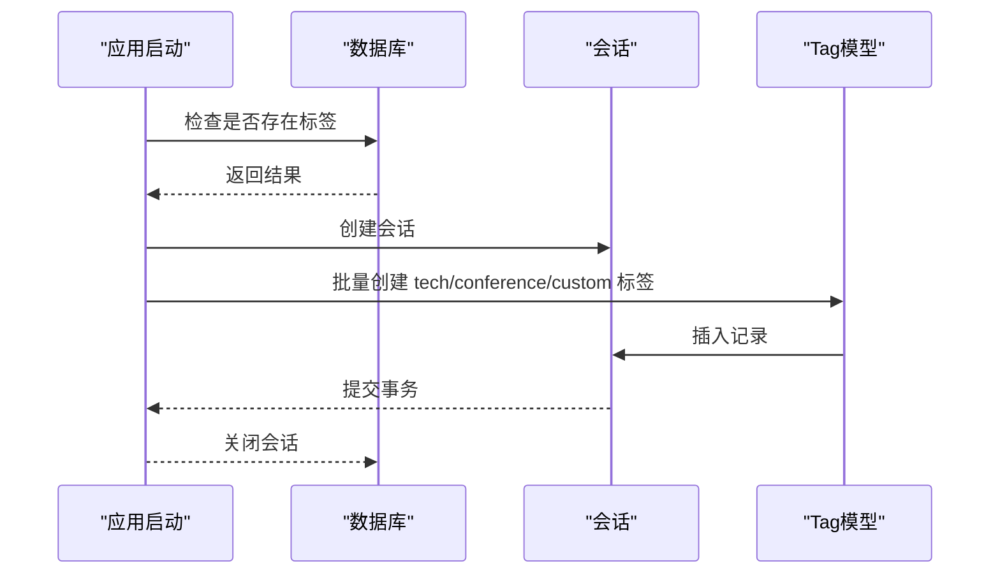
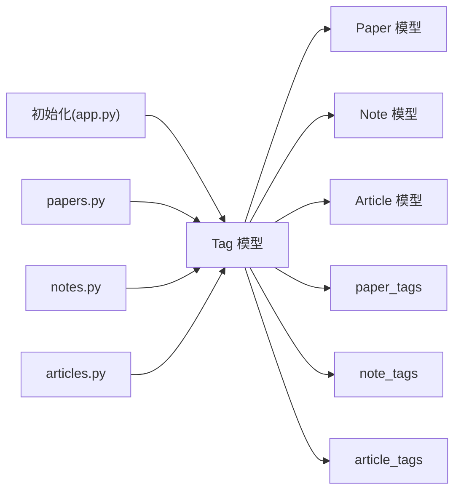

# Tags表

<cite>
**本文档引用的文件**
- [backend/models/paper.py](file://backend/models/paper.py)
- [specs/backend/models/tag.yml](file://specs/backend/models/tag.yml)
- [specs/backend/models/relations_and_aux.yml](file://specs/backend/models/relations_and_aux.yml)
- [backend/app.py](file://backend/app.py)
- [backend/api/papers.py](file://backend/api/papers.py)
- [backend/api/notes.py](file://backend/api/notes.py)
- [backend/api/articles.py](file://backend/api/articles.py)
- [frontend/index.html](file://frontend/index.html)
</cite>

## 目录
1. [简介](#简介)
2. [项目结构](#项目结构)
3. [核心组件](#核心组件)
4. [架构总览](#架构总览)
5. [详细组件分析](#详细组件分析)
6. [依赖分析](#依赖分析)
7. [性能考虑](#性能考虑)
8. [故障排查指南](#故障排查指南)
9. [结论](#结论)
10. [附录](#附录)

## 简介
本文件系统性梳理 PaperHub 中的 Tags 表设计与实现，涵盖表结构、字段语义、索引与约束、层级标签支持、颜色管理策略、预设数据与初始化流程，并结合 API 使用场景给出最佳实践与排障建议。目标是帮助开发者与产品人员快速理解并正确使用标签体系。

## 项目结构
与 Tags 表相关的核心位置如下：
- 数据模型与 ORM 映射：backend/models/paper.py
- 规范化模型定义：specs/backend/models/tag.yml
- 多对多中间表规范：specs/backend/models/relations_and_aux.yml
- 初始化与预设标签：backend/app.py
- 标签相关 API：backend/api/papers.py、backend/api/notes.py、backend/api/articles.py
- 前端交互示例：frontend/index.html

**图表来源**
- [backend/models/paper.py:93-114](file://backend/models/paper.py#L93-L114)
- [specs/backend/models/tag.yml:1-67](file://specs/backend/models/tag.yml#L1-L67)
- [specs/backend/models/relations_and_aux.yml:4-81](file://specs/backend/models/relations_and_aux.yml#L4-L81)
- [backend/app.py:160-217](file://backend/app.py#L160-L217)
- [backend/api/papers.py:369-472](file://backend/api/papers.py#L369-L472)
- [backend/api/notes.py:311-385](file://backend/api/notes.py#L311-L385)
- [backend/api/articles.py:280-353](file://backend/api/articles.py#L280-L353)
- [frontend/index.html:5658-5724](file://frontend/index.html#L5658-L5724)

**章节来源**
- [backend/models/paper.py:93-114](file://backend/models/paper.py#L93-L114)
- [specs/backend/models/tag.yml:1-67](file://specs/backend/models/tag.yml#L1-L67)
- [specs/backend/models/relations_and_aux.yml:4-81](file://specs/backend/models/relations_and_aux.yml#L4-L81)
- [backend/app.py:160-217](file://backend/app.py#L160-L217)
- [backend/api/papers.py:369-472](file://backend/api/papers.py#L369-L472)
- [backend/api/notes.py:311-385](file://backend/api/notes.py#L311-L385)
- [backend/api/articles.py:280-353](file://backend/api/articles.py#L280-L353)
- [frontend/index.html:5658-5724](file://frontend/index.html#L5658-L5724)

## 核心组件
- 标签模型（Tag）：定义标签的主键、名称、类型、颜色、父标签ID及创建时间；并建立与论文、笔记、文章的多对多关系。
- 多对多中间表：paper_tags、note_tags、article_tags，分别承载标签与三类实体的关联。
- 预设标签初始化：启动时按技术标签、会议标签、自定义标签三类批量插入基础标签。

关键要点
- 唯一性约束：name 字段唯一，确保标签名去重。
- 类型字段：默认 custom，支持 tech、conference、custom 三类。
- 颜色字段：十六进制颜色值，用于前端展示。
- 层级标签：通过 parent_id 自引用实现父子关系，支持树形结构。
- 索引策略：name、type、parent_id 上建立索引，提升查询效率。

**章节来源**
- [specs/backend/models/tag.yml:10-37](file://specs/backend/models/tag.yml#L10-L37)
- [specs/backend/models/tag.yml:60-67](file://specs/backend/models/tag.yml#L60-L67)
- [specs/backend/models/relations_and_aux.yml:4-81](file://specs/backend/models/relations_and_aux.yml#L4-L81)
- [backend/models/paper.py:93-114](file://backend/models/paper.py#L93-L114)
- [backend/app.py:186-217](file://backend/app.py#L186-L217)

## 架构总览
标签系统围绕“标签-实体”多对多关系展开，通过中间表解耦标签与论文、笔记、文章的关联。初始化阶段注入一组预设标签，API 提供增删查改能力，前端通过统一的交互逻辑完成标签绑定与刷新。

**图表来源**
- [specs/backend/models/tag.yml:44-59](file://specs/backend/models/tag.yml#L44-L59)
- [specs/backend/models/relations_and_aux.yml:4-81](file://specs/backend/models/relations_and_aux.yml#L4-L81)
- [backend/models/paper.py:93-114](file://backend/models/paper.py#L93-L114)

## 详细组件分析

### 数据模型与字段语义
- id：主键，自增整数。
- name：字符串，最大长度 128，唯一约束，作为标签名的唯一标识。
- type：字符串，最大长度 32，默认 custom，枚举值包括 tech、conference、custom。
- color：字符串，最大长度 16，可为空，用于前端配色。
- parent_id：整数，外键自引用 tags.id，支持层级标签。
- created_at：时间戳，记录标签创建时间。
- 关系：与 Paper、Note、Article 通过中间表建立多对多关系。

**图表来源**
- [specs/backend/models/tag.yml:3-43](file://specs/backend/models/tag.yml#L3-L43)
- [backend/models/paper.py:93-114](file://backend/models/paper.py#L93-L114)

**章节来源**
- [specs/backend/models/tag.yml:3-43](file://specs/backend/models/tag.yml#L3-L43)
- [backend/models/paper.py:93-114](file://backend/models/paper.py#L93-L114)

### 标签类型与颜色管理
- 类型分类
  - tech：技术类标签，如 Transformer、LLM、CNN 等。
  - conference：会议/平台类标签，如 CVPR2024、NeurIPS2024、arXiv 等。
  - custom：用户自定义标签，如 必读、待复现、落地可用 等。
- 颜色策略
  - color 字段采用十六进制颜色值，便于前端渲染统一风格。
  - 初始化时为三类标签分配不同颜色，便于区分与识别。

**章节来源**
- [specs/backend/models/tag.yml:17-31](file://specs/backend/models/tag.yml#L17-L31)
- [backend/app.py:186-210](file://backend/app.py#L186-L210)

### 层级标签实现原理
- 自引用关系：parent_id 指向 tags.id，形成树形层级。
- 设计要点
  - 支持任意深度的父子关系。
  - 查询时可通过递归或一次性拉取整棵树进行处理。
  - 删除子标签不影响父标签；删除父标签需谨慎处理级联。
- 注意事项
  - 避免循环引用（逻辑层面约束）。
  - 层级变更时保持一致性，必要时进行事务控制。

**图表来源**
- [specs/backend/models/tag.yml:32-37](file://specs/backend/models/tag.yml#L32-L37)
- [backend/models/paper.py:99-100](file://backend/models/paper.py#L99-L100)

**章节来源**
- [specs/backend/models/tag.yml:32-37](file://specs/backend/models/tag.yml#L32-L37)
- [backend/models/paper.py:99-100](file://backend/models/paper.py#L99-L100)

### 唯一性约束与索引策略
- 唯一性
  - name 唯一：防止重复标签名。
- 索引
  - idx_tags_name：name 唯一索引。
  - idx_tags_type：type 普通索引，支持按类型筛选。
  - idx_tags_parent：parent_id 普通索引，支持层级查询与树遍历。
- 性能影响
  - 唯一索引保证数据一致性，查询与去重成本低。
  - 类型与层级索引有助于高频过滤与树形查询。

**章节来源**
- [specs/backend/models/tag.yml:60-67](file://specs/backend/models/tag.yml#L60-L67)

### 预设数据与初始化策略
- 初始化流程
  - 若数据库中已有标签则跳过初始化。
  - 否则批量插入三类预设标签：tech、conference、custom。
  - 插入完成后关闭会话。
- 预设内容
  - 技术标签：如 Transformer、Diffusion、LLM 等。
  - 会议标签：如 CVPR2024、ICCV2023、NeurIPS2024、ICML2024、arXiv 等。
  - 自定义标签：如 必读、待复现、落地可用、冷门但有启发 等。

**图表来源**
- [backend/app.py:160-217](file://backend/app.py#L160-L217)

**章节来源**
- [backend/app.py:160-217](file://backend/app.py#L160-L217)

### API 使用与最佳实践
- 获取所有标签（含使用计数）
  - 接口：GET /papers/tags
  - 逻辑：按标签聚合统计论文数量，降序排列。
- 获取某实体的标签
  - 论文：GET /papers/{paper_id}/tags
  - 笔记：GET /notes/{note_id}/tags
  - 文章：GET /articles/{article_id}/tags
- 给实体添加标签
  - 论文：POST /papers/{paper_id}/tags（name 必填）
  - 笔记：POST /notes/{note_id}/tags（支持 tag_id 或 name）
  - 文章：POST /articles/{article_id}/tags（name 必填）
- 移除实体标签
  - 论文：DELETE /papers/{paper_id}/tags/{tag_id}
  - 笔记：DELETE /notes/{note_id}/tags/{tag_id}
  - 文章：DELETE /articles/{article_id}/tags/{tag_id}
- 删除标签
  - DELETE /tags/{tag_id}

最佳实践
- 添加标签前先按 name 查询，避免重复创建。
- 批量操作时使用事务，确保一致性。
- 前端交互建议：添加/移除标签后刷新列表与详情视图，避免脏数据。

**章节来源**
- [backend/api/papers.py:369-472](file://backend/api/papers.py#L369-L472)
- [backend/api/notes.py:311-385](file://backend/api/notes.py#L311-L385)
- [backend/api/articles.py:280-353](file://backend/api/articles.py#L280-L353)
- [frontend/index.html:5658-5724](file://frontend/index.html#L5658-L5724)

## 依赖分析
- 模型依赖
  - Tag 依赖 Paper、Note、Article 的多对多关系。
  - 中间表 paper_tags、note_tags、article_tags 定义了三类实体与标签的关联。
- 初始化依赖
  - app.py 在首次启动时创建表并插入预设标签。
- API 依赖
  - papers.py、notes.py、articles.py 的标签接口均依赖 Tag 模型与中间表。

**图表来源**
- [specs/backend/models/relations_and_aux.yml:4-81](file://specs/backend/models/relations_and_aux.yml#L4-L81)
- [backend/models/paper.py:93-114](file://backend/models/paper.py#L93-L114)
- [backend/app.py:160-217](file://backend/app.py#L160-L217)
- [backend/api/papers.py:369-472](file://backend/api/papers.py#L369-L472)
- [backend/api/notes.py:311-385](file://backend/api/notes.py#L311-L385)
- [backend/api/articles.py:280-353](file://backend/api/articles.py#L280-L353)

**章节来源**
- [specs/backend/models/relations_and_aux.yml:4-81](file://specs/backend/models/relations_and_aux.yml#L4-L81)
- [backend/models/paper.py:93-114](file://backend/models/paper.py#L93-L114)
- [backend/app.py:160-217](file://backend/app.py#L160-L217)
- [backend/api/papers.py:369-472](file://backend/api/papers.py#L369-L472)
- [backend/api/notes.py:311-385](file://backend/api/notes.py#L311-L385)
- [backend/api/articles.py:280-353](file://backend/api/articles.py#L280-L353)

## 性能考虑
- 索引命中
  - name 唯一索引：标签名查询与去重高效。
  - type 普通索引：按类型筛选时可利用索引。
  - parent_id 普通索引：层级查询与树遍历更高效。
- 查询优化
  - 聚合统计：在获取标签列表时，使用 group_by 与 count 聚合，减少往返。
  - 批量操作：前端批量添加/移除标签时，尽量合并请求，减少网络开销。
- 存储与序列化
  - to_dict 序列化仅包含必要字段，避免冗余数据传输。

[本节为通用性能建议，无需特定文件引用]

## 故障排查指南
- 标签名重复
  - 现象：添加标签时报唯一约束冲突。
  - 处理：先按 name 查询，若不存在再创建。
- 标签不存在
  - 现象：移除或删除标签时报错。
  - 处理：确认 tag_id 是否正确，或先查询再操作。
- 层级异常
  - 现象：设置父标签后出现显示异常或循环引用。
  - 处理：检查 parent_id 是否指向有效节点，避免自引用成环。
- 前端未刷新
  - 现象：添加/移除标签后界面未更新。
  - 处理：参考前端示例，先刷新列表，再根据当前详情页 ID 更新详情视图。

**章节来源**
- [backend/api/papers.py:410-472](file://backend/api/papers.py#L410-L472)
- [backend/api/notes.py:326-385](file://backend/api/notes.py#L326-L385)
- [backend/api/articles.py:280-353](file://backend/api/articles.py#L280-L353)
- [frontend/index.html:5658-5724](file://frontend/index.html#L5658-L5724)

## 结论
Tags 表通过清晰的字段语义、完善的索引与唯一性约束、灵活的层级自引用关系，以及标准化的多对多中间表，构建了稳定高效的标签体系。配合预设标签初始化与丰富的 API，能够满足论文、笔记、文章的标签管理需求。遵循本文的最佳实践与排障建议，可显著提升开发效率与系统稳定性。

## 附录
- 初始化预设标签（示例）
  - 技术标签：Transformer、Diffusion、YOLO、RAG、LoRA、LLM、CNN、ViT
  - 会议标签：CVPR2024、ICCV2023、NeurIPS2024、ICML2024、arXiv
  - 自定义标签：必读、待复现、落地可用、冷门但有启发

**章节来源**
- [backend/app.py:186-210](file://backend/app.py#L186-L210)