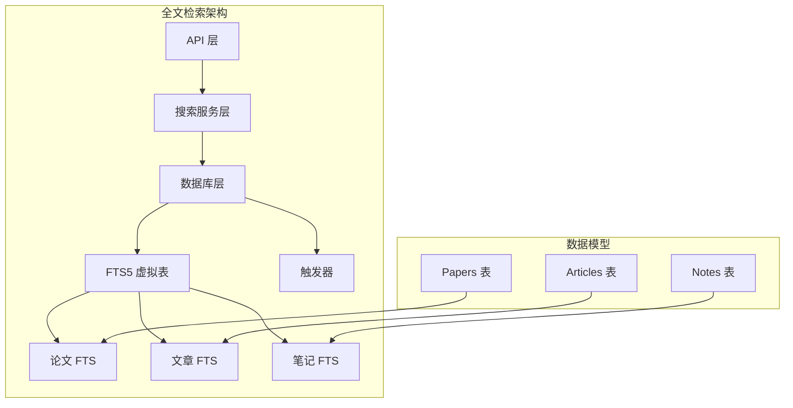
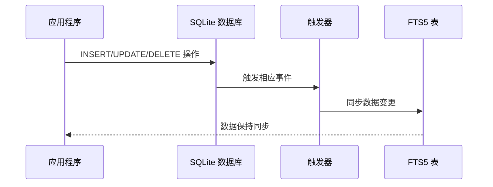
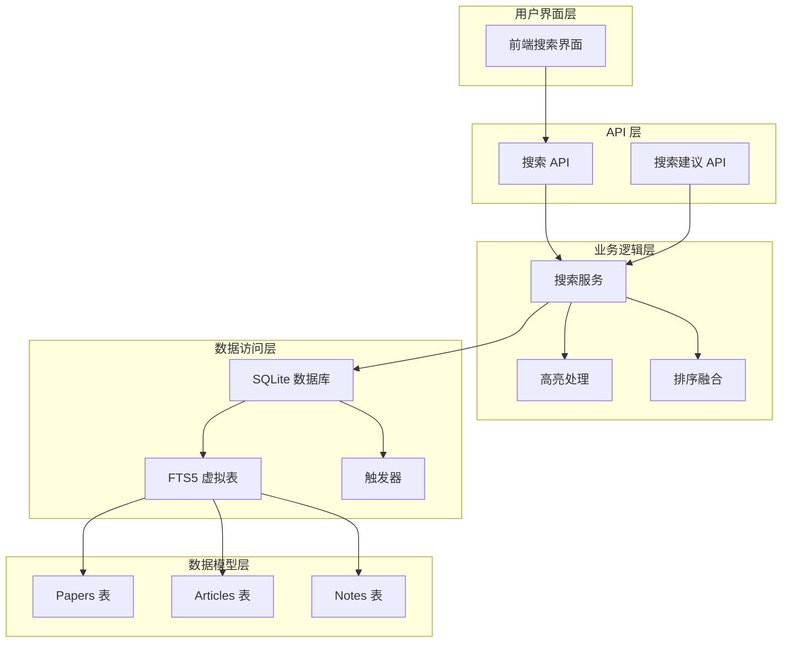
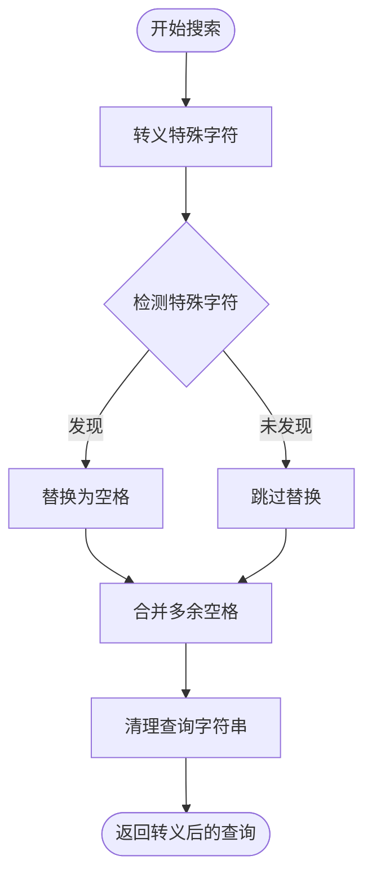
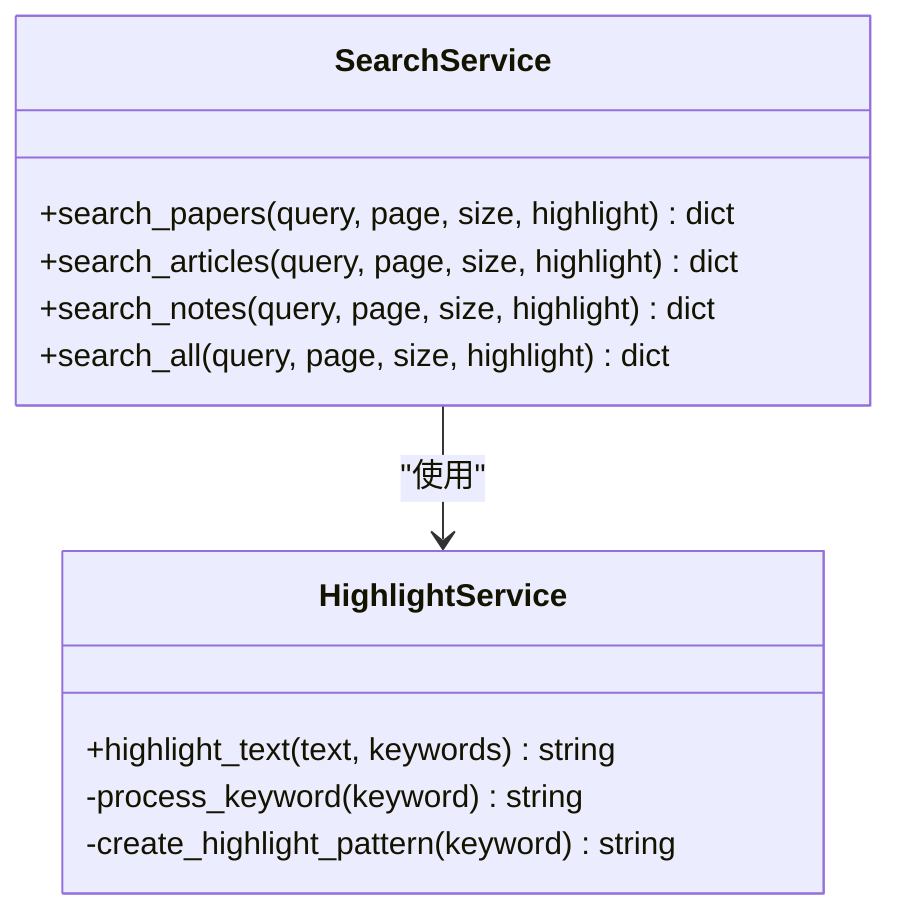
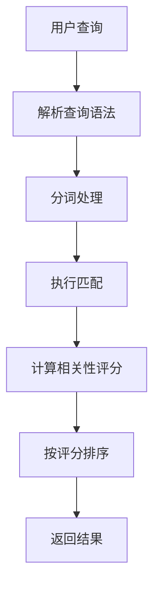
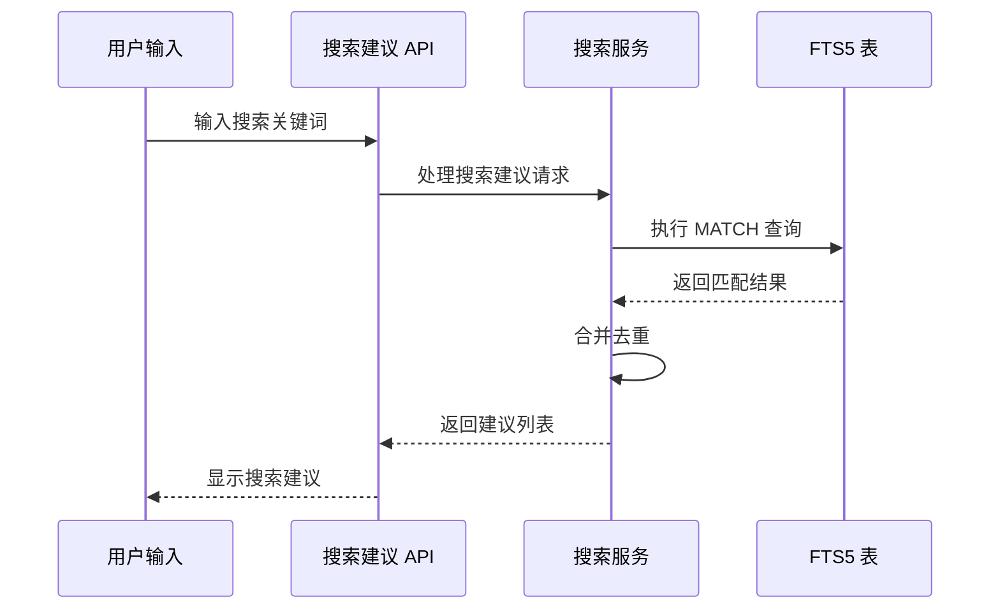
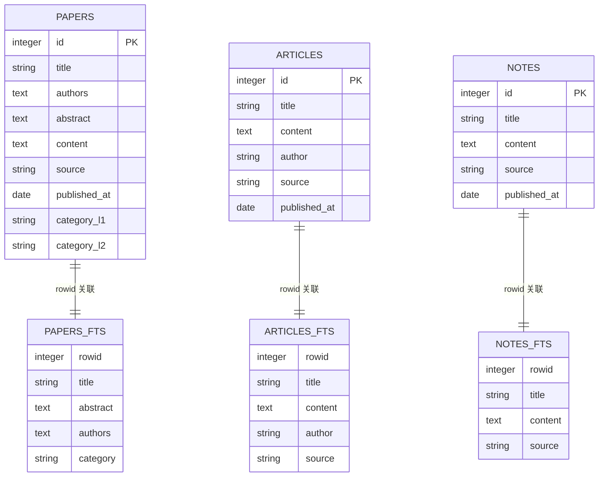
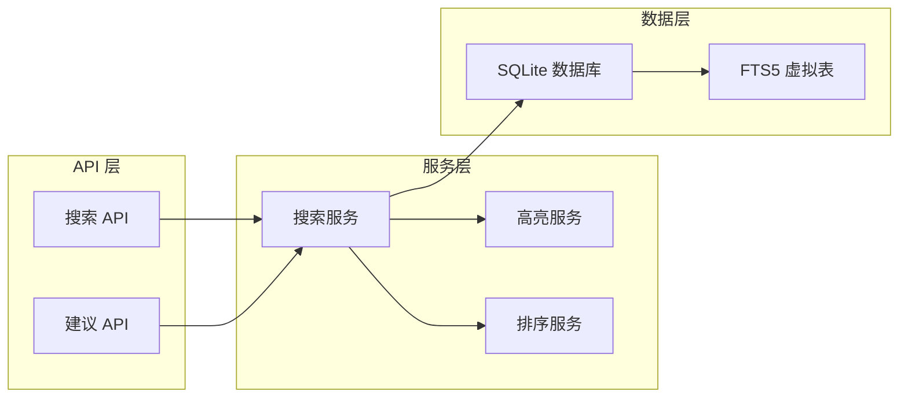
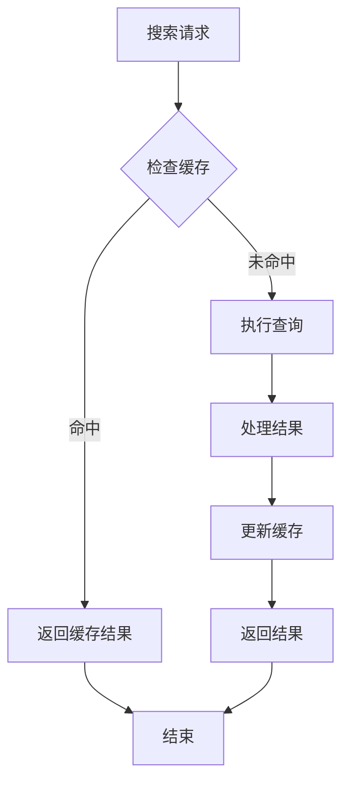

# 全文检索表

<cite>
**本文档引用的文件**
- [006_add_fts_tables.py](file://scripts/maintenance/006_add_fts_tables.py)
- [search_service.py](file://backend/services/search_service.py)
- [search.py](file://backend/api/search.py)
- [paper.py](file://backend/models/paper.py)
- [SCHEMA.md](file://docs/SCHEMA.md)
- [config.py](file://backend/config.py)
- [paper.yml](file://specs/backend/models/paper.yml)
</cite>

## 目录
1. [简介](#简介)
2. [项目结构](#项目结构)
3. [核心组件](#核心组件)
4. [架构概览](#架构概览)
5. [详细组件分析](#详细组件分析)
6. [依赖关系分析](#依赖关系分析)
7. [性能考虑](#性能考虑)
8. [故障排除指南](#故障排除指南)
9. [结论](#结论)
10. [附录](#附录)

## 简介

PaperHub 项目实现了基于 SQLite FTS5 的全文检索系统，为论文、文章和笔记提供了高效的全文搜索能力。该系统通过虚拟表和触发器机制实现了实时的数据同步，支持多字段检索、相关性评分和智能高亮显示。

## 项目结构

全文检索功能主要分布在以下模块中：



**图表来源**
- [search.py:14-70](file://backend/api/search.py#L14-L70)
- [search_service.py:39-205](file://backend/services/search_service.py#L39-L205)
- [006_add_fts_tables.py:13-48](file://scripts/maintenance/006_add_fts_tables.py#L13-L48)

**章节来源**
- [search.py:1-70](file://backend/api/search.py#L1-L70)
- [search_service.py:1-314](file://backend/services/search_service.py#L1-L314)
- [006_add_fts_tables.py:1-179](file://scripts/maintenance/006_add_fts_tables.py#L1-L179)

## 核心组件

### FTS5 虚拟表创建

系统创建了三个专门的 FTS5 虚拟表，每个都针对不同的数据类型进行了优化：

#### 论文全文检索表 (papers_fts)
- **字段映射**: title, abstract, authors, category
- **分词器**: unicode61
- **关联机制**: 通过 rowid 与 papers 表关联

#### 文章全文检索表 (articles_fts)
- **字段映射**: title, content, author, source  
- **分词器**: unicode61
- **关联机制**: 通过 rowid 与 articles 表关联

#### 笔记全文检索表 (notes_fts)
- **字段映射**: title, content, source
- **分词器**: unicode61
- **关联机制**: 通过 rowid 与 notes 表关联

**章节来源**
- [006_add_fts_tables.py:18-48](file://scripts/maintenance/006_add_fts_tables.py#L18-L48)
- [SCHEMA.md:143-152](file://docs/SCHEMA.md#L143-L152)

### 触发器机制

每个 FTS5 表都配备了完整的 CRUD 触发器，确保数据一致性：



**图表来源**
- [006_add_fts_tables.py:55-78](file://scripts/maintenance/006_add_fts_tables.py#L55-L78)
- [006_add_fts_tables.py:85-108](file://scripts/maintenance/006_add_fts_tables.py#L85-L108)
- [006_add_fts_tables.py:115-138](file://scripts/maintenance/006_add_fts_tables.py#L115-L138)

**章节来源**
- [006_add_fts_tables.py:55-138](file://scripts/maintenance/006_add_fts_tables.py#L55-L138)

## 架构概览

全文检索系统的整体架构如下：



**图表来源**
- [search.py:14-70](file://backend/api/search.py#L14-L70)
- [search_service.py:39-257](file://backend/services/search_service.py#L39-L257)
- [006_add_fts_tables.py:13-179](file://scripts/maintenance/006_add_fts_tables.py#L13-L179)

## 详细组件分析

### 搜索服务实现

#### 查询转义机制

搜索服务实现了专门的查询转义函数，处理 FTS5 的特殊字符：



**图表来源**
- [search_service.py:8-26](file://backend/services/search_service.py#L8-L26)

#### 高亮显示功能

系统实现了智能的关键词高亮功能：



**图表来源**
- [search_service.py:28-37](file://backend/services/search_service.py#L28-L37)
- [search_service.py:39-205](file://backend/services/search_service.py#L39-L205)

**章节来源**
- [search_service.py:8-37](file://backend/services/search_service.py#L8-L37)
- [search_service.py:39-205](file://backend/services/search_service.py#L39-L205)

### 查询语法和匹配算法

#### 基本查询语法

FTS5 支持多种查询语法：

| 查询类型 | 语法示例 | 描述 |
|---------|---------|------|
| 短语查询 | `"机器学习"` | 精确匹配短语 |
| 逻辑运算 | `深度 OR 学习` | 或运算 |
| 排除查询 | `AI -神经网络` | 排除特定词汇 |
| 列限定 | `title:论文` | 限制在特定列 |
| 相关性 | `rank` | 获取相关性评分 |

#### 匹配算法

FTS5 使用 BM25 算法进行相关性评分，评分越低表示相关性越高：



**图表来源**
- [search_service.py:48-71](file://backend/services/search_service.py#L48-L71)
- [search_service.py:106-127](file://backend/services/search_service.py#L106-L127)

**章节来源**
- [search_service.py:48-71](file://backend/services/search_service.py#L48-L71)
- [search_service.py:106-127](file://backend/services/search_service.py#L106-L127)

### 结果排序机制

#### 单模块排序

每个搜索模块都使用 FTS5 的 rank 字段进行排序：

```sql
SELECT *, fts_rank
FROM papers p
JOIN papers_fts ON p.id = papers_fts.rowid
WHERE papers_fts MATCH :query
ORDER BY papers_fts.rank
```

#### 跨模块融合排序

系统实现了基于权重的相关性融合排序：

| 模块类型 | 权重因子 | 排序公式 |
|---------|---------|---------|
| 论文 | 3.0 | `score = (1.0 / (rank + 1)) × 3.0` |
| 文章 | 2.0 | `score = (1.0 / (rank + 1)) × 2.0` |
| 笔记 | 1.0 | `score = (1.0 / (rank + 1)) × 1.0` |

**章节来源**
- [search_service.py:207-257](file://backend/services/search_service.py#L207-L257)

### 搜索建议系统

搜索建议功能通过 FTS5 的 MATCH 查询实现高性能建议：



**图表来源**
- [search_service.py:259-313](file://backend/services/search_service.py#L259-L313)

**章节来源**
- [search_service.py:259-313](file://backend/services/search_service.py#L259-L313)

## 依赖关系分析

### 数据模型依赖



**图表来源**
- [paper.py:120-146](file://backend/models/paper.py#L120-L146)
- [paper.py:191-244](file://backend/models/paper.py#L191-L244)
- [paper.py:250-293](file://backend/models/paper.py#L250-L293)

**章节来源**
- [paper.py:120-293](file://backend/models/paper.py#L120-L293)

### API 依赖关系



**图表来源**
- [search.py:14-70](file://backend/api/search.py#L14-L70)
- [search_service.py:1-314](file://backend/services/search_service.py#L1-L314)

**章节来源**
- [search.py:14-70](file://backend/api/search.py#L14-L70)
- [search_service.py:1-314](file://backend/services/search_service.py#L1-L314)

## 性能考虑

### 索引优化策略

#### 分词器选择
- **unicode61 分词器**: 支持 Unicode 字符，适合多语言内容
- **性能优势**: 避免了复杂的正则表达式匹配

#### 触发器优化
- **增量同步**: 仅在数据变更时更新 FTS 表
- **批量操作**: 支持事务处理，减少锁竞争

#### 查询优化
- **rank 字段利用**: 直接使用 FTS5 的相关性评分
- **LIMIT 优化**: 限制结果数量，避免全表扫描

### 缓存策略



### 性能监控指标

| 指标类型 | 目标值 | 监控方法 |
|---------|--------|---------|
| 查询响应时间 | < 100ms | 慢查询日志 |
| 并发查询数 | > 50 | 连接池监控 |
| FTS5 索引大小 | < 1GB | 磁盘空间监控 |
| 命中率 | > 90% | 缓存统计 |

## 故障排除指南

### 常见问题诊断

#### FTS5 表创建失败
**症状**: 数据库启动时报错，提示 FTS5 表不存在
**解决方案**:
1. 检查 SQLite 版本是否支持 FTS5
2. 验证数据库权限
3. 运行迁移脚本重新创建表

#### 数据不同步问题
**症状**: 更新数据后搜索结果不准确
**解决方案**:
1. 检查触发器是否正常工作
2. 手动执行数据初始化脚本
3. 验证 rowid 关联是否正确

#### 查询性能下降
**症状**: 搜索响应时间过长
**解决方案**:
1. 分析慢查询日志
2. 检查索引使用情况
3. 优化查询语句

**章节来源**
- [006_add_fts_tables.py:144-179](file://scripts/maintenance/006_add_fts_tables.py#L144-L179)
- [search_service.py:8-26](file://backend/services/search_service.py#L8-L26)

## 结论

PaperHub 的全文检索系统通过 SQLite FTS5 提供了高效、可靠的全文搜索能力。系统的主要优势包括：

1. **实时同步**: 通过触发器机制确保数据一致性
2. **高性能**: 利用 FTS5 的原生索引和相关性评分
3. **多语言支持**: unicode61 分词器支持国际化内容
4. **灵活扩展**: 模块化的架构便于添加新的搜索类型

该系统为论文、文章和笔记提供了统一的搜索体验，支持复杂的查询语法和智能的排序机制。

## 附录

### 实际应用场景

#### 学术研究场景
- **论文检索**: 支持作者、标题、摘要的联合搜索
- **文献管理**: 基于关键词的智能分类和推荐
- **学术追踪**: 关键词订阅和更新提醒

#### 内容消费场景
- **文章阅读**: 快速定位相关内容片段
- **知识整理**: 笔记内容的结构化检索
- **主题探索**: 基于相关性的内容发现

### 查询示例

#### 基础查询
- `机器学习`: 搜索包含"机器学习"的文档
- `"深度学习框架"`: 短语精确匹配
- `AI OR 人工智能`: 或运算查询

#### 高级查询
- `title:论文`: 仅在标题中搜索
- `深度学习 -神经网络`: 排除特定词汇
- `rank`: 获取相关性评分

#### 跨模块搜索
系统支持同时搜索多个模块，并根据权重进行融合排序，提供更全面的搜索结果。