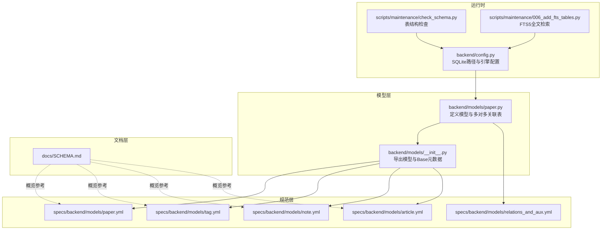
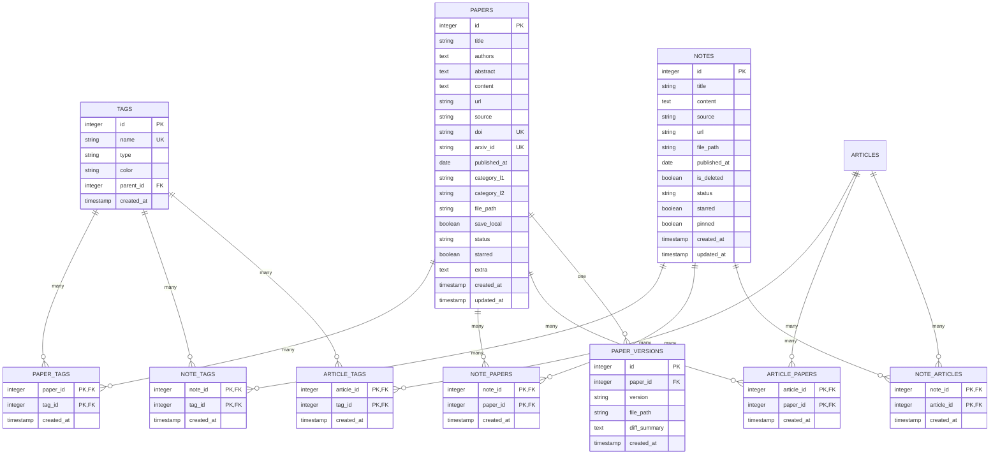
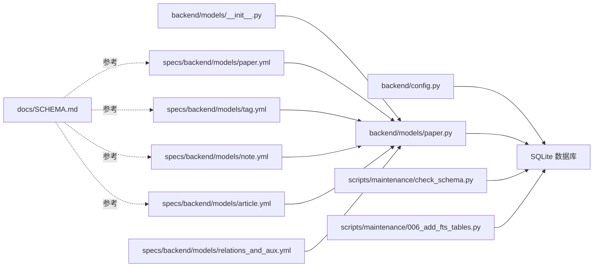

# 核心数据表

<cite>
**本文档引用的文件**
- [backend/models/paper.py](file://backend/models/paper.py)
- [specs/backend/models/paper.yml](file://specs/backend/models/paper.yml)
- [specs/backend/models/tag.yml](file://specs/backend/models/tag.yml)
- [specs/backend/models/note.yml](file://specs/backend/models/note.yml)
- [specs/backend/models/article.yml](file://specs/backend/models/article.yml)
- [specs/backend/models/relations_and_aux.yml](file://specs/backend/models/relations_and_aux.yml)
- [docs/SCHEMA.md](file://docs/SCHEMA.md)
- [scripts/maintenance/check_schema.py](file://scripts/maintenance/check_schema.py)
- [backend/config.py](file://backend/config.py)
- [backend/models/__init__.py](file://backend/models/__init__.py)
- [scripts/maintenance/006_add_fts_tables.py](file://scripts/maintenance/006_add_fts_tables.py)
</cite>

## 目录
1. [简介](#简介)
2. [项目结构](#项目结构)
3. [核心组件](#核心组件)
4. [架构总览](#架构总览)
5. [详细组件分析](#详细组件分析)
6. [依赖分析](#依赖分析)
7. [性能考虑](#性能考虑)
8. [故障排查指南](#故障排查指南)
9. [结论](#结论)
10. [附录](#附录)

## 简介
本文件聚焦于 PaperHub 的核心数据表设计与实现，围绕 papers、tags、paper_tags、notes、paper_versions 等关键表进行系统性梳理。内容涵盖字段定义、数据类型、约束条件、业务含义、主键与外键关系、索引策略、表间关联关系与数据完整性保障机制，并补充表结构变更历史与版本管理策略。

## 项目结构
PaperHub 使用 SQLAlchemy ORM 映射数据库表，核心模型集中在 backend/models/paper.py 中，同时通过 specs 目录下的 YAML 规范明确各表字段、关系与索引；docs/SCHEMA.md 提供了数据库 Schema 的概览与说明；scripts/maintenance/* 提供维护脚本，包括 FTS 全文检索表的创建与初始化。

**图表来源**
- [backend/models/paper.py:1-360](file://backend/models/paper.py#L1-L360)
- [specs/backend/models/paper.yml:1-164](file://specs/backend/models/paper.yml#L1-L164)
- [specs/backend/models/tag.yml:1-68](file://specs/backend/models/tag.yml#L1-L68)
- [specs/backend/models/note.yml:1-115](file://specs/backend/models/note.yml#L1-L115)
- [specs/backend/models/article.yml:1-114](file://specs/backend/models/article.yml#L1-L114)
- [specs/backend/models/relations_and_aux.yml:1-263](file://specs/backend/models/relations_and_aux.yml#L1-L263)
- [docs/SCHEMA.md:1-182](file://docs/SCHEMA.md#L1-L182)
- [backend/config.py:1-133](file://backend/config.py#L1-L133)
- [scripts/maintenance/check_schema.py:1-26](file://scripts/maintenance/check_schema.py#L1-L26)
- [scripts/maintenance/006_add_fts_tables.py:144-179](file://scripts/maintenance/006_add_fts_tables.py#L144-L179)

**章节来源**
- [backend/models/paper.py:1-360](file://backend/models/paper.py#L1-L360)
- [specs/backend/models/paper.yml:1-164](file://specs/backend/models/paper.yml#L1-L164)
- [specs/backend/models/tag.yml:1-68](file://specs/backend/models/tag.yml#L1-L68)
- [specs/backend/models/note.yml:1-115](file://specs/backend/models/note.yml#L1-L115)
- [specs/backend/models/article.yml:1-114](file://specs/backend/models/article.yml#L1-L114)
- [specs/backend/models/relations_and_aux.yml:1-263](file://specs/backend/models/relations_and_aux.yml#L1-L263)
- [docs/SCHEMA.md:1-182](file://docs/SCHEMA.md#L1-L182)
- [backend/config.py:1-133](file://backend/config.py#L1-L133)
- [scripts/maintenance/check_schema.py:1-26](file://scripts/maintenance/check_schema.py#L1-L26)
- [scripts/maintenance/006_add_fts_tables.py:144-179](file://scripts/maintenance/006_add_fts_tables.py#L144-L179)

## 核心组件
本节从数据模型、规范与文档三个维度，系统阐述核心表的结构与关系。

- papers 表：论文/文章主表，承载论文元信息、状态与时间戳，支持与标签、笔记、文章的多对多关联，并维护版本历史。
- tags 表：标签表，支持层级父子关系与类型区分，提供论文/笔记/文章三类对象的多对多关联。
- paper_tags 表：论文-标签多对多关联表，复合主键确保唯一性。
- notes 表：笔记/批注表，支持与论文、文章、标签的多对多关联，具备软删除与置顶能力。
- paper_versions 表：论文版本管理表，记录不同版本的文件路径与差异摘要，建立论文与版本的一对多关系。

上述组件在 backend/models/paper.py 中以 SQLAlchemy 模型形式定义，在 specs 目录中以 YAML 规范明确字段、关系与索引；docs/SCHEMA.md 提供概览与说明；运行时通过 backend/config.py 的 SQLite 路径与引擎配置生效。

**章节来源**
- [backend/models/paper.py:93-319](file://backend/models/paper.py#L93-L319)
- [specs/backend/models/paper.yml:1-164](file://specs/backend/models/paper.yml#L1-L164)
- [specs/backend/models/tag.yml:1-68](file://specs/backend/models/tag.yml#L1-L68)
- [specs/backend/models/note.yml:1-115](file://specs/backend/models/note.yml#L1-L115)
- [specs/backend/models/relations_and_aux.yml:160-197](file://specs/backend/models/relations_and_aux.yml#L160-L197)
- [docs/SCHEMA.md:41-137](file://docs/SCHEMA.md#L41-L137)

## 架构总览
下图展示核心表之间的实体关系与关联策略，映射到实际的 SQLAlchemy 模型与 YAML 规范。

**图表来源**
- [backend/models/paper.py:21-87](file://backend/models/paper.py#L21-L87)
- [specs/backend/models/paper.yml:130-164](file://specs/backend/models/paper.yml#L130-L164)
- [specs/backend/models/tag.yml:44-68](file://specs/backend/models/tag.yml#L44-L68)
- [specs/backend/models/note.yml:92-115](file://specs/backend/models/note.yml#L92-L115)
- [specs/backend/models/relations_and_aux.yml:4-158](file://specs/backend/models/relations_and_aux.yml#L4-L158)
- [specs/backend/models/relations_and_aux.yml:160-197](file://specs/backend/models/relations_and_aux.yml#L160-L197)

## 详细组件分析

### papers 表
- 字段与约束
  - 主键：id（整型，自增）
  - 标题：非空字符串
  - 作者/摘要/全文：文本字段，可为空
  - 链接/来源：字符串，来源为必填
  - 唯一标识：doi、arxiv_id（唯一约束，用于去重）
  - 时间与状态：发布日期、分类（两级）、本地文件路径、是否保存本地、阅读状态、是否标星、扩展字段、创建与更新时间戳
- 业务含义
  - 记录论文元信息与状态，支撑检索、筛选与版本管理
- 关系
  - 与 tags：多对多（通过 paper_tags）
  - 与 notes：多对多（通过 note_papers）
  - 与 articles：多对多（通过 article_papers）
  - 与 versions：一对多（PaperVersion）
- 索引策略
  - 标题、分类、状态、标星、发布日期、arXiv ID 等常用查询字段建立索引
- 完整性保障
  - 唯一约束保证去重；外键约束保证关联数据一致性；级联删除或孤儿删除策略由具体关系定义决定

**章节来源**
- [specs/backend/models/paper.yml:1-164](file://specs/backend/models/paper.yml#L1-L164)
- [backend/models/paper.py:120-186](file://backend/models/paper.py#L120-L186)
- [specs/backend/models/relations_and_aux.yml:134-158](file://specs/backend/models/relations_and_aux.yml#L134-L158)

### tags 表
- 字段与约束
  - 主键：id
  - 名称：非空且唯一
  - 类型：默认 custom，支持 tech/conference/custom
  - 颜色：十六进制颜色值
  - 层级：父标签自引用
  - 时间：创建时间
- 业务含义
  - 统一标签体系，支持层级与类型区分
- 关系
  - 与 papers、notes、articles：多对多（通过 paper_tags、note_tags、article_tags）
- 索引策略
  - 名称唯一索引；类型、父标签索引提升查询效率

**章节来源**
- [specs/backend/models/tag.yml:1-68](file://specs/backend/models/tag.yml#L1-L68)
- [backend/models/paper.py:93-115](file://backend/models/paper.py#L93-L115)
- [specs/backend/models/relations_and_aux.yml:4-81](file://specs/backend/models/relations_and_aux.yml#L4-L81)

### paper_tags 关联表
- 字段与约束
  - 复合主键：(paper_id, tag_id)
  - 外键：分别引用 papers.id 与 tags.id
  - 关联创建时间
- 业务含义
  - 记录论文与标签的绑定关系及绑定时间
- 完整性保障
  - 复合主键防止重复绑定；外键约束保证引用有效

**章节来源**
- [specs/backend/models/relations_and_aux.yml:4-29](file://specs/backend/models/relations_and_aux.yml#L4-L29)
- [backend/models/paper.py:21-27](file://backend/models/paper.py#L21-L27)

### notes 表
- 字段与约束
  - 主键：id
  - 标题、内容：标题可空，内容必填
  - 来源、链接、本地文件路径、发布日期
  - 软删除：is_deleted 默认 false
  - 状态、标星、置顶
  - 时间：创建与更新时间戳
- 业务含义
  - 存储个人笔记与批注，支持与论文、文章、标签的多对多关联
- 关系
  - 与 tags：多对多（通过 note_tags）
  - 与 papers：多对多（通过 note_papers）
  - 与 articles：多对多（通过 note_articles）

**章节来源**
- [specs/backend/models/note.yml:1-115](file://specs/backend/models/note.yml#L1-L115)
- [backend/models/paper.py:250-294](file://backend/models/paper.py#L250-L294)
- [specs/backend/models/relations_and_aux.yml:82-133](file://specs/backend/models/relations_and_aux.yml#L82-L133)

### paper_versions 表
- 字段与约束
  - 主键：id
  - 外键：paper_id 引用 papers.id（非空）
  - 版本号、文件路径（均非空）、差异摘要、创建时间
- 业务含义
  - 记录论文的历史版本，便于对比与回溯
- 关系
  - 与 papers：一对多（PaperVersion.back_populates）

**章节来源**
- [specs/backend/models/relations_and_aux.yml:160-197](file://specs/backend/models/relations_and_aux.yml#L160-L197)
- [backend/models/paper.py:299-319](file://backend/models/paper.py#L299-L319)

### notes 表（补充：notes 表的字段与约束）
- 字段与约束
  - 主键：id
  - 标题、内容：标题可空，内容必填
  - 来源、链接、本地文件路径、发布日期
  - 软删除：is_deleted 默认 false
  - 状态、标星、置顶
  - 时间：创建与更新时间戳
- 业务含义
  - 存储个人笔记与批注，支持与论文、文章、标签的多对多关联
- 关系
  - 与 tags：多对多（通过 note_tags）
  - 与 papers：多对多（通过 note_papers）
  - 与 articles：多对多（通过 note_articles）

**章节来源**
- [specs/backend/models/note.yml:1-115](file://specs/backend/models/note.yml#L1-L115)
- [backend/models/paper.py:250-294](file://backend/models/paper.py#L250-L294)
- [specs/backend/models/relations_and_aux.yml:82-133](file://specs/backend/models/relations_and_aux.yml#L82-L133)

## 依赖分析
- 模型依赖
  - backend/models/paper.py 定义所有核心模型与多对多关联表
  - backend/models/__init__.py 导出模型与 Base 元数据，供应用启动时创建表结构
- 规范依赖
  - specs 下的 YAML 文件为各表字段、关系与索引的权威描述
- 文档依赖
  - docs/SCHEMA.md 提供概览与说明，作为设计文档的补充
- 运行时依赖
  - backend/config.py 提供 SQLite 路径与引擎配置，scripts/maintenance/check_schema.py 用于检查表结构，006_add_fts_tables.py 用于创建 FTS5 全文检索表

**图表来源**
- [backend/config.py:1-133](file://backend/config.py#L1-L133)
- [backend/models/__init__.py:1-25](file://backend/models/__init__.py#L1-L25)
- [backend/models/paper.py:1-360](file://backend/models/paper.py#L1-L360)
- [specs/backend/models/paper.yml:1-164](file://specs/backend/models/paper.yml#L1-L164)
- [specs/backend/models/tag.yml:1-68](file://specs/backend/models/tag.yml#L1-L68)
- [specs/backend/models/note.yml:1-115](file://specs/backend/models/note.yml#L1-L115)
- [specs/backend/models/article.yml:1-114](file://specs/backend/models/article.yml#L1-L114)
- [specs/backend/models/relations_and_aux.yml:1-263](file://specs/backend/models/relations_and_aux.yml#L1-L263)
- [docs/SCHEMA.md:1-182](file://docs/SCHEMA.md#L1-L182)
- [scripts/maintenance/check_schema.py:1-26](file://scripts/maintenance/check_schema.py#L1-L26)
- [scripts/maintenance/006_add_fts_tables.py:144-179](file://scripts/maintenance/006_add_fts_tables.py#L144-L179)

**章节来源**
- [backend/models/__init__.py:1-25](file://backend/models/__init__.py#L1-L25)
- [backend/models/paper.py:1-360](file://backend/models/paper.py#L1-L360)
- [specs/backend/models/paper.yml:1-164](file://specs/backend/models/paper.yml#L1-L164)
- [specs/backend/models/tag.yml:1-68](file://specs/backend/models/tag.yml#L1-L68)
- [specs/backend/models/note.yml:1-115](file://specs/backend/models/note.yml#L1-L115)
- [specs/backend/models/article.yml:1-114](file://specs/backend/models/article.yml#L1-L114)
- [specs/backend/models/relations_and_aux.yml:1-263](file://specs/backend/models/relations_and_aux.yml#L1-L263)
- [docs/SCHEMA.md:1-182](file://docs/SCHEMA.md#L1-L182)
- [scripts/maintenance/check_schema.py:1-26](file://scripts/maintenance/check_schema.py#L1-L26)
- [scripts/maintenance/006_add_fts_tables.py:144-179](file://scripts/maintenance/006_add_fts_tables.py#L144-L179)

## 性能考虑
- 索引策略
  - papers：针对标题、分类、状态、标星、发布日期、arXiv ID 建立索引，提升常见查询性能
  - tags：针对名称（唯一）、类型、父标签建立索引
  - notes：针对标题、软删除、置顶建立索引
  - 关系表：paper_tags、note_tags、article_tags、note_papers、article_papers、note_articles 采用复合主键，避免重复绑定并提高查找效率
- 查询模式
  - 常见过滤：按状态、标星、分类、来源、发布日期
  - 搜索：结合 SQLite FTS5 全文检索表（papers_fts、articles_fts、notes_fts）加速模糊匹配
- 存储与路径
  - SQLite 本地文件路径由 backend/config.py 统一管理，确保数据目录与日志目录一致

**章节来源**
- [specs/backend/models/paper.yml:151-164](file://specs/backend/models/paper.yml#L151-L164)
- [specs/backend/models/tag.yml:61-68](file://specs/backend/models/tag.yml#L61-L68)
- [specs/backend/models/note.yml:108-115](file://specs/backend/models/note.yml#L108-L115)
- [specs/backend/models/relations_and_aux.yml:4-158](file://specs/backend/models/relations_and_aux.yml#L4-L158)
- [docs/SCHEMA.md:139-152](file://docs/SCHEMA.md#L139-L152)
- [backend/config.py:20-33](file://backend/config.py#L20-L33)

## 故障排查指南
- 表结构不一致
  - 使用 scripts/maintenance/check_schema.py 列出数据库中所有表及其列，核对与规范是否一致
- FTS 表缺失或数据不同步
  - 运行 scripts/maintenance/006_add_fts_tables.py 创建 FTS5 虚拟表并初始化数据
- SQLite 路径与权限
  - 确认 backend/config.py 中 SQLite 数据库路径与目录权限正确，确保 paperhub.db 可读写
- 版本管理与迁移
  - 若新增字段或索引，需在 YAML 规范中同步更新，并在应用启动时通过 Base.metadata.create_all 生效

**章节来源**
- [scripts/maintenance/check_schema.py:1-26](file://scripts/maintenance/check_schema.py#L1-L26)
- [scripts/maintenance/006_add_fts_tables.py:144-179](file://scripts/maintenance/006_add_fts_tables.py#L144-L179)
- [backend/config.py:35-133](file://backend/config.py#L35-L133)

## 结论
本文档基于 SQLAlchemy 模型、YAML 规范与运行时脚本，系统梳理了 papers、tags、paper_tags、notes、paper_versions 等核心表的结构设计与实现细节。通过复合主键、外键约束与索引策略，确保数据完整性与查询性能；通过 FTS5 全文检索与规范化的字段定义，提升搜索体验与可维护性。建议在后续迭代中持续完善 YAML 规范与维护脚本，确保表结构变更的可追溯与可审计。

## 附录
- 表结构变更历史与版本管理策略
  - 采用 YAML 规范作为权威设计文档，每次结构变更同步更新 specs 下对应文件
  - 运行时通过 backend/models/__init__.py 导出模型，应用启动时调用 Base.metadata.create_all 生效
  - 使用 scripts/maintenance/* 提供的脚本进行结构检查与 FTS 初始化，形成标准化的运维流程
- SQLite 路径与引擎配置
  - 数据库文件位于 data/db/paperhub.db，连接池参数与回收策略在 backend/config.py 中集中配置

**章节来源**
- [specs/backend/models/paper.yml:1-164](file://specs/backend/models/paper.yml#L1-L164)
- [specs/backend/models/tag.yml:1-68](file://specs/backend/models/tag.yml#L1-L68)
- [specs/backend/models/note.yml:1-115](file://specs/backend/models/note.yml#L1-L115)
- [specs/backend/models/relations_and_aux.yml:1-263](file://specs/backend/models/relations_and_aux.yml#L1-L263)
- [backend/models/__init__.py:1-25](file://backend/models/__init__.py#L1-L25)
- [backend/config.py:35-133](file://backend/config.py#L35-L133)
- [scripts/maintenance/check_schema.py:1-26](file://scripts/maintenance/check_schema.py#L1-L26)
- [scripts/maintenance/006_add_fts_tables.py:144-179](file://scripts/maintenance/006_add_fts_tables.py#L144-L179)