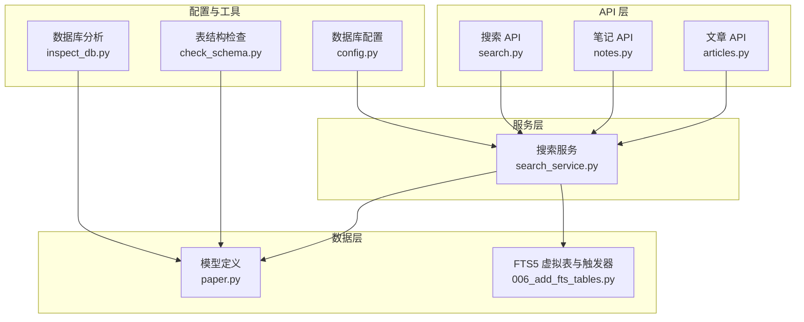
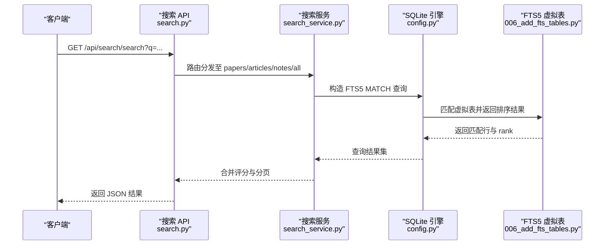
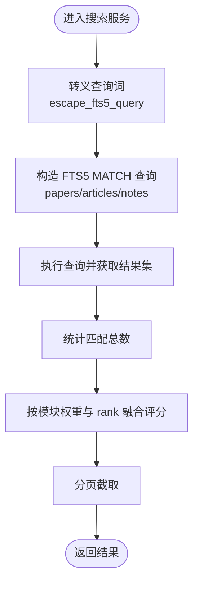
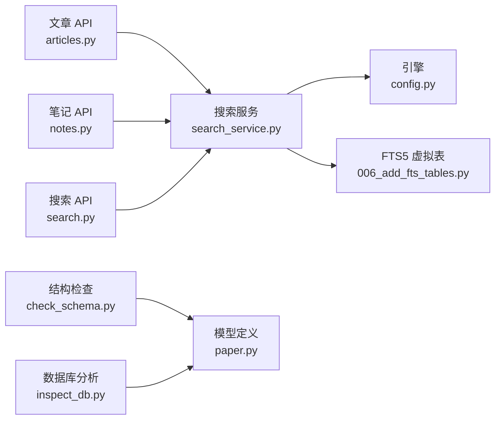

# 索引与性能优化

<cite>
**本文档引用的文件**
- [paper.py](file://backend/models/paper.py)
- [articles.py](file://backend/api/articles.py)
- [notes.py](file://backend/api/notes.py)
- [search.py](file://backend/api/search.py)
- [search_service.py](file://backend/services/search_service.py)
- [config.py](file://backend/config.py)
- [check_schema.py](file://scripts/maintenance/check_schema.py)
- [inspect_db.py](file://scripts/maintenance/inspect_db.py)
- [006_add_fts_tables.py](file://scripts/maintenance/006_add_fts_tables.py)
- [paper.yml](file://specs/backend/models/paper.yml)
- [article.yml](file://specs/backend/models/article.yml)
- [note.yml](file://specs/backend/models/note.yml)
- [tag.yml](file://specs/backend/models/tag.yml)
</cite>

## 目录
1. [简介](#简介)
2. [项目结构](#项目结构)
3. [核心组件](#核心组件)
4. [架构总览](#架构总览)
5. [详细组件分析](#详细组件分析)
6. [依赖分析](#依赖分析)
7. [性能考量](#性能考量)
8. [故障排查指南](#故障排查指南)
9. [结论](#结论)
10. [附录](#附录)

## 简介
本文件聚焦于 PaperHub 项目的数据库索引策略与性能优化实践，结合现有模型定义、API 查询模式与全文检索实现，系统梳理各表索引设计、查询路径、性能瓶颈与优化建议，并提供可落地的索引维护与调优经验。

## 项目结构
- 后端采用 Flask + SQLAlchemy + SQLite 架构，数据层通过模型定义表结构与关系，服务层封装全文检索逻辑，API 层暴露查询与批量操作端点。
- 全文检索基于 SQLite FTS5 虚拟表与触发器，配合专用查询服务实现高性能跨模块检索。
- 维护脚本用于检查表结构、统计软删与重复数据，辅助索引与查询优化决策。

**图表来源**
- [articles.py:1-482](file://backend/api/articles.py#L1-L482)
- [notes.py:1-595](file://backend/api/notes.py#L1-L595)
- [search.py:1-70](file://backend/api/search.py#L1-L70)
- [search_service.py:1-314](file://backend/services/search_service.py#L1-L314)
- [paper.py:1-360](file://backend/models/paper.py#L1-L360)
- [006_add_fts_tables.py:1-179](file://scripts/maintenance/006_add_fts_tables.py#L1-L179)
- [config.py:1-134](file://backend/config.py#L1-L134)
- [check_schema.py:1-26](file://scripts/maintenance/check_schema.py#L1-L26)
- [inspect_db.py:1-91](file://scripts/maintenance/inspect_db.py#L1-L91)

**章节来源**
- [paper.py:1-360](file://backend/models/paper.py#L1-L360)
- [search_service.py:1-314](file://backend/services/search_service.py#L1-L314)
- [config.py:1-134](file://backend/config.py#L1-L134)

## 核心组件
- 数据模型与索引：论文、文章、笔记、标签四张核心表及其多对多关联表；模型规格文件明确索引字段集合。
- 全文检索：FTS5 虚拟表与触发器，配合服务层 SQL 查询与评分融合。
- API 查询：文章列表、笔记列表、批量更新等常见查询模式，均涉及过滤、排序与分页。
- 维护工具：表结构检查、软删与重复数据统计，支撑索引有效性评估与查询优化。

**章节来源**
- [paper.yml:151-164](file://specs/backend/models/paper.yml#L151-L164)
- [article.yml:107-114](file://specs/backend/models/article.yml#L107-L114)
- [note.yml:108-115](file://specs/backend/models/note.yml#L108-L115)
- [tag.yml:60-68](file://specs/backend/models/tag.yml#L60-L68)
- [search_service.py:39-257](file://backend/services/search_service.py#L39-L257)
- [articles.py:28-56](file://backend/api/articles.py#L28-L56)
- [notes.py:25-59](file://backend/api/notes.py#L25-L59)

## 架构总览
下图展示搜索 API 到服务层再到数据层的调用链路，以及 FTS5 虚拟表参与的全文检索流程。

**图表来源**
- [search.py:14-51](file://backend/api/search.py#L14-L51)
- [search_service.py:39-257](file://backend/services/search_service.py#L39-L257)
- [config.py:85-134](file://backend/config.py#L85-L134)
- [006_add_fts_tables.py:13-179](file://scripts/maintenance/006_add_fts_tables.py#L13-L179)

## 详细组件分析

### 表结构与索引设计概览
- 论文表（papers）
  - 索引字段：title、category_l1+category_l2、status、starred、published_at、arxiv_id
  - 复合索引：category_l1+category_l2，适合按分类筛选
  - 唯一索引：arxiv_id（唯一约束）
- 文章表（articles）
  - 索引字段：title、source、is_deleted
  - 软删除 is_deleted 常用于过滤已删除记录
- 笔记表（notes）
  - 索引字段：title、is_deleted、pinned
  - 适合按置顶与标题检索
- 标签表（tags）
  - 索引字段：name（唯一）、type、parent_id
  - name 唯一索引用于快速去重与关联

**章节来源**
- [paper.yml:151-164](file://specs/backend/models/paper.yml#L151-L164)
- [article.yml:107-114](file://specs/backend/models/article.yml#L107-L114)
- [note.yml:108-115](file://specs/backend/models/note.yml#L108-L115)
- [tag.yml:60-68](file://specs/backend/models/tag.yml#L60-L68)

### 查询路径与性能特征
- 文章列表查询
  - 过滤条件：source（可选）、全文搜索（title/author/content）
  - 排序：按 created_at 降序
  - 分页：offset/limit
  - 性能要点：全文搜索走 FTS5；非 FTS 的过滤与排序需结合索引
- 笔记列表查询
  - 过滤条件：keyword（title/content）、source（可选）
  - 排序：按指定字段降序，默认 created_at
  - 分页：offset/limit
  - 性能要点：title 与 is_deleted 上的索引有助于快速过滤与排序
- 搜索服务
  - FTS5 MATCH 查询，显式获取 rank 并进行模块加权融合排序
  - 建议：保持查询词转义与规范化，避免特殊字符影响解析

**图表来源**
- [search_service.py:8-26](file://backend/services/search_service.py#L8-L26)
- [search_service.py:39-257](file://backend/services/search_service.py#L39-L257)

**章节来源**
- [articles.py:28-56](file://backend/api/articles.py#L28-L56)
- [notes.py:25-59](file://backend/api/notes.py#L25-L59)
- [search_service.py:39-257](file://backend/services/search_service.py#L39-L257)

### 复合索引、覆盖索引与选择性
- 复合索引
  - 论文：category_l1+category_l2，适合按分类范围查询
  - 文章：source+is_deleted，适合按来源与状态组合过滤
  - 笔记：pinned+is_deleted，适合置顶优先展示
- 覆盖索引
  - 当查询仅访问索引列或 FTS5 虚拟表列时，可减少回表成本
  - 搜索服务已显式选择必要列并利用 rank，具备一定覆盖特性
- 选择性
  - arxiv_id、name（标签名）具有较高选择性，适合作为过滤首选
  - category_l1、source 等低基数字段需谨慎使用，避免全表扫描

**章节来源**
- [paper.yml:151-164](file://specs/backend/models/paper.yml#L151-L164)
- [article.yml:107-114](file://specs/backend/models/article.yml#L107-L114)
- [note.yml:108-115](file://specs/backend/models/note.yml#L108-L115)
- [tag.yml:60-68](file://specs/backend/models/tag.yml#L60-L68)
- [search_service.py:39-257](file://backend/services/search_service.py#L39-L257)

### 查询性能分析与优化建议
- 全文搜索
  - 已采用 FTS5，建议：保持触发器同步最新数据；对高频查询词做缓存
- 过滤与排序
  - 对常用过滤字段（如 status、starred、is_deleted）建立索引以避免排序开销
  - 对排序字段（如 created_at、updated_at）建立索引，减少 ORDER BY 开销
- 分页
  - 大偏移分页成本高，建议：使用基于游标的分页或索引覆盖的键集分页
- 连接查询
  - 多对多关联表（paper_tags、article_tags、note_tags）建议在关联键上建立索引，避免 N+1 与全表连接

**章节来源**
- [search_service.py:39-257](file://backend/services/search_service.py#L39-L257)
- [paper.py:18-87](file://backend/models/paper.py#L18-L87)
- [articles.py:28-56](file://backend/api/articles.py#L28-L56)
- [notes.py:25-59](file://backend/api/notes.py#L25-L59)

### 慢查询分析与优化案例
- 案例：文章列表搜索 author/title/content
  - 现状：全文搜索走 FTS5，但未对 author 建立 FTS5 字段
  - 建议：在 FTS5 中加入 author 字段，或为 author 单独建立索引以提升命中率
- 案例：笔记列表 keyword 搜索
  - 现状：title/content 模糊匹配
  - 建议：对 title 建立索引；若 content 体量大，考虑 FTS5 或向量化索引
- 案例：批量更新
  - 现状：批量操作逐条处理
  - 建议：使用批量 SQL（如批量 UPDATE/INSERT）减少往返；事务包裹降低锁竞争

**章节来源**
- [articles.py:42-46](file://backend/api/articles.py#L42-L46)
- [notes.py:33-37](file://backend/api/notes.py#L33-L37)
- [search_service.py:39-257](file://backend/services/search_service.py#L39-L257)

### 索引维护策略
- 新增字段后的索引补建
  - 使用维护脚本检查表结构，识别缺失索引字段
- 触发器一致性
  - FTS5 虚拟表与真实表数据同步依赖触发器，需定期校验
- 统计信息与失效检测
  - 定期运行数据库分析脚本，识别软删与重复数据，指导索引有效性评估

**章节来源**
- [check_schema.py:1-26](file://scripts/maintenance/check_schema.py#L1-L26)
- [inspect_db.py:1-91](file://scripts/maintenance/inspect_db.py#L1-L91)
- [006_add_fts_tables.py:13-179](file://scripts/maintenance/006_add_fts_tables.py#L13-L179)

## 依赖分析
- API 层依赖服务层提供的搜索能力
- 服务层依赖 SQLAlchemy 引擎与 FTS5 虚拟表
- 维护脚本依赖 SQLite PRAGMA 与 SQL 查询，用于结构与数据质量检查

**图表来源**
- [articles.py:1-482](file://backend/api/articles.py#L1-L482)
- [notes.py:1-595](file://backend/api/notes.py#L1-L595)
- [search.py:1-70](file://backend/api/search.py#L1-L70)
- [search_service.py:1-314](file://backend/services/search_service.py#L1-L314)
- [config.py:1-134](file://backend/config.py#L1-L134)
- [006_add_fts_tables.py:1-179](file://scripts/maintenance/006_add_fts_tables.py#L1-L179)
- [check_schema.py:1-26](file://scripts/maintenance/check_schema.py#L1-L26)
- [inspect_db.py:1-91](file://scripts/maintenance/inspect_db.py#L1-L91)
- [paper.py:1-360](file://backend/models/paper.py#L1-L360)

**章节来源**
- [paper.py:1-360](file://backend/models/paper.py#L1-L360)
- [search_service.py:1-314](file://backend/services/search_service.py#L1-L314)
- [config.py:1-134](file://backend/config.py#L1-L134)

## 性能考量
- 连接池与会话管理
  - 使用全局引擎与 scoped_session，合理设置连接池参数，避免并发阻塞
- I/O 与锁
  - SQLite 在高并发写入场景下易出现锁等待，建议控制批量写入粒度与频率
- 缓存与预热
  - 对高频搜索词与热门模块结果进行缓存，降低数据库压力
- 监控指标建议
  - 查询耗时分布、慢查询数量、FTS5 命中率、连接池利用率、磁盘 I/O

[本节为通用性能建议，不直接分析具体文件]

## 故障排查指南
- FTS5 不生效
  - 检查虚拟表与触发器是否创建成功；确认数据是否已初始化同步
- 查询变慢
  - 使用维护脚本检查表结构与重复数据；评估索引选择性与覆盖情况
- 软删除数据异常
  - 检查 is_deleted 字段是否正确过滤；核对触发器是否同步删除

**章节来源**
- [006_add_fts_tables.py:13-179](file://scripts/maintenance/006_add_fts_tables.py#L13-L179)
- [inspect_db.py:1-91](file://scripts/maintenance/inspect_db.py#L1-L91)
- [check_schema.py:1-26](file://scripts/maintenance/check_schema.py#L1-L26)

## 结论
- 项目已采用 FTS5 实现全文检索，配合模型层索引与服务层评分融合，整体查询性能良好
- 建议进一步完善 FTS5 字段覆盖、补充缺失索引、优化分页与批量操作，并建立索引维护与监控机制，持续保障性能稳定

[本节为总结性内容，不直接分析具体文件]

## 附录
- 索引清单（基于模型规格）
  - 论文：title、category_l1+category_l2、status、starred、published_at、arxiv_id（唯一）
  - 文章：title、source、is_deleted
  - 笔记：title、is_deleted、pinned
  - 标签：name（唯一）、type、parent_id
- 优化清单（建议）
  - 为 author 建立 FTS5 字段或索引
  - 为 status/starred/published_at 等常用过滤/排序字段建立索引
  - 使用基于游标的分页替代大偏移
  - 批量操作使用批量 SQL 与事务包裹
  - 定期运行维护脚本，检查结构与数据质量

**章节来源**
- [paper.yml:151-164](file://specs/backend/models/paper.yml#L151-L164)
- [article.yml:107-114](file://specs/backend/models/article.yml#L107-L114)
- [note.yml:108-115](file://specs/backend/models/note.yml#L108-L115)
- [tag.yml:60-68](file://specs/backend/models/tag.yml#L60-L68)