# 前端架构设计

<cite>
**本文档引用的文件**
- [frontend/src/modules/fileUploadModule.js](file://frontend/src/modules/fileUploadModule.js)
- [frontend/src/modules/filterUtils.js](file://frontend/src/modules/filterUtils.js)
- [frontend/src/modules/ingestModule.js](file://frontend/src/modules/ingestModule.js)
- [frontend/src/modules/sortUtils.js](file://frontend/src/modules/sortUtils.js)
- [frontend/index.html](file://frontend/index.html)
- [frontend/src/css/style.css](file://frontend/src/css/style.css)
- [frontend/ARCHITECTURE_AUDIT_V3.md](file://frontend/ARCHITECTURE_AUDIT_V3.md)
- [frontend/README.md](file://frontend/README.md)
- [specs/frontend/modules/fileUploadModule.yml](file://specs/frontend/modules/fileUploadModule.yml)
- [specs/frontend/modules/filterUtils.yml](file://specs/frontend/modules/filterUtils.yml)
- [specs/frontend/modules/ingestModule.yml](file://specs/frontend/modules/ingestModule.yml)
- [specs/frontend/modules/sortUtils.yml](file://specs/frontend/modules/sortUtils.yml)
- [specs/architecture.spec.md](file://specs/architecture.spec.md)
- [specs/api_response.spec.md](file://specs/api_response.spec.md)
</cite>

## 目录
1. [简介](#简介)
2. [项目结构](#项目结构)
3. [核心组件](#核心组件)
4. [架构概览](#架构概览)
5. [详细组件分析](#详细组件分析)
6. [依赖分析](#依赖分析)
7. [性能考虑](#性能考虑)
8. [故障排除指南](#故障排除指南)
9. [结论](#结论)
10. [附录](#附录)

## 简介

PaperHub是一个基于Vue 3的单页应用程序，采用混合式架构设计，专注于论文知识库管理。该项目实现了高度模块化的前端架构，通过工具库模式实现了三个核心库（论文库、文章库、笔记库）的功能复用和状态统一。

项目采用Element Plus作为UI框架，结合自定义CSS样式，实现了响应式设计和良好的用户体验。前端架构的核心特点是"同构设计"——三个库使用完全相同的筛选逻辑、排序逻辑和UI结构，确保用户在不同库之间切换时获得一致的操作体验。

## 项目结构

PaperHub前端项目采用清晰的模块化组织结构：

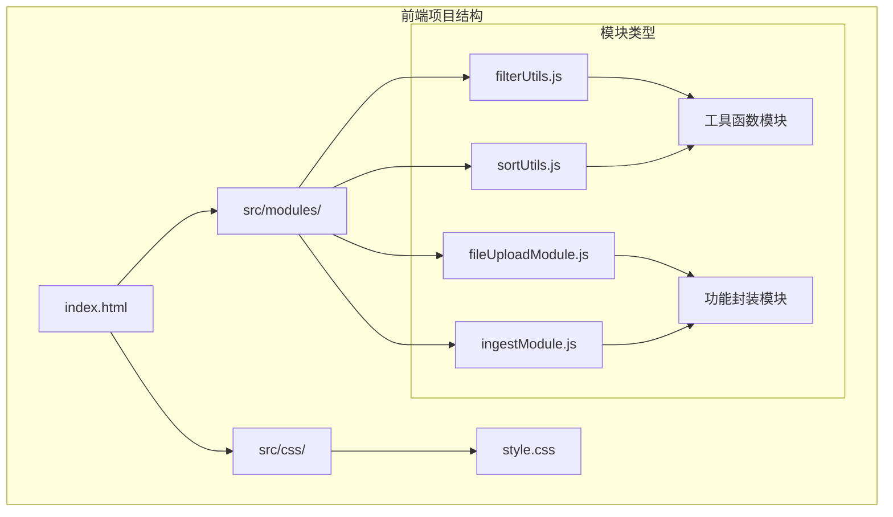

**图表来源**
- [specs/architecture.spec.md:50-72](file://specs/architecture.spec.md#L50-L72)

### 目录结构规约

前端项目严格遵循模块化规约：

- **frontend/pages/**: 页面级代码，按功能页划分
- **frontend/modules/**: 可复用模块与工具，包含业务模块和工具函数
- **frontend/src/css/**: 样式文件
- **frontend/src/js/**: 页面脚本文件（如存在）

**章节来源**
- [specs/architecture.spec.md:50-72](file://specs/architecture.spec.md#L50-L72)

## 核心组件

### 模块化架构模式

PaperHub采用了"混合式架构"，结合了单体应用的便利性和模块化的优势：

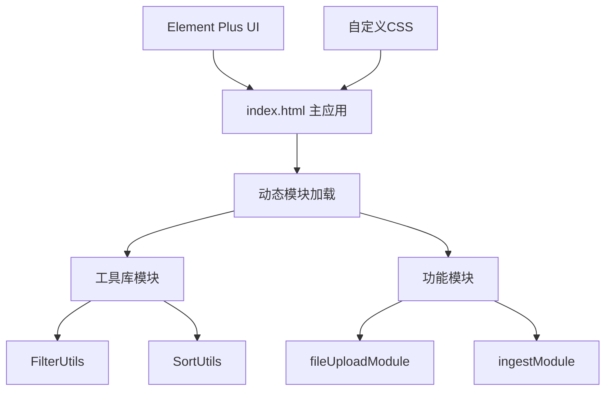

**图表来源**
- [frontend/ARCHITECTURE_AUDIT_V3.md:15-34](file://frontend/ARCHITECTURE_AUDIT_V3.md#L15-L34)

### 工具库模块

三个核心工具库实现了高度复用：

1. **FilterUtils**: 统一的筛选逻辑
2. **SortUtils**: 统一的排序逻辑  
3. **fileUploadModule**: 文件上传功能封装
4. **ingestModule**: 入库功能封装

**章节来源**
- [frontend/ARCHITECTURE_AUDIT_V3.md:25-32](file://frontend/ARCHITECTURE_AUDIT_V3.md#L25-L32)

## 架构概览

### 混合式架构设计

PaperHub采用混合式架构，既保持了主文件的完整性便于调试，又通过工具库实现了逻辑复用：

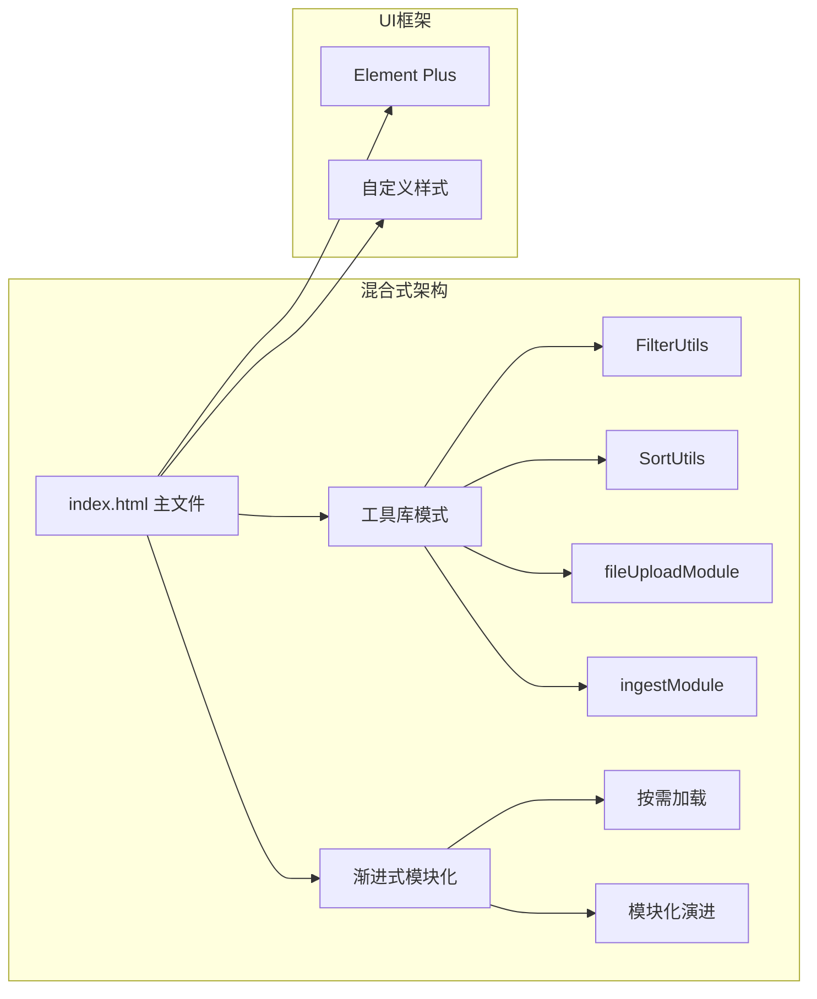

**图表来源**
- [frontend/ARCHITECTURE_AUDIT_V3.md:13-34](file://frontend/ARCHITECTURE_AUDIT_V3.md#L13-L34)

### 响应式状态管理

三个核心库实现了完全统一的响应式状态管理：

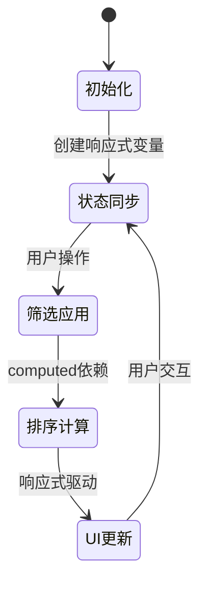

**图表来源**
- [frontend/ARCHITECTURE_AUDIT_V3.md:103-122](file://frontend/ARCHITECTURE_AUDIT_V3.md#L103-L122)

**章节来源**
- [frontend/ARCHITECTURE_AUDIT_V3.md:103-122](file://frontend/ARCHITECTURE_AUDIT_V3.md#L103-L122)

## 详细组件分析

### FilterUtils 筛选工具模块

FilterUtils实现了统一的筛选逻辑，支持三种核心筛选类型：

#### 核心筛选功能

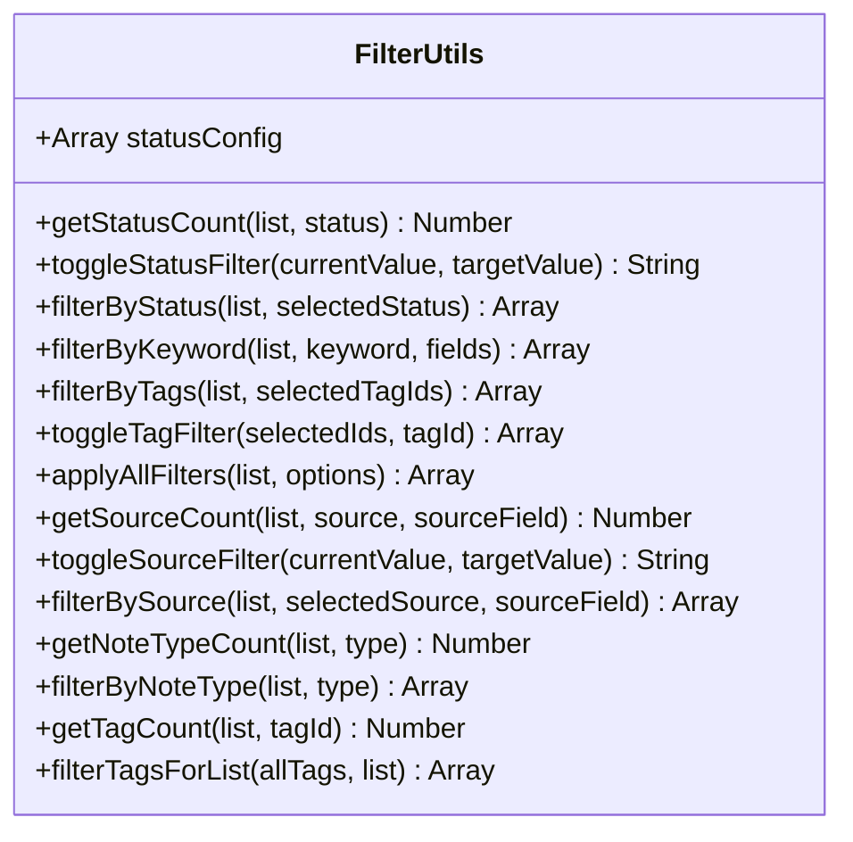

**图表来源**
- [specs/frontend/modules/filterUtils.yml:1-215](file://specs/frontend/modules/filterUtils.yml#L1-L215)

#### 筛选流程

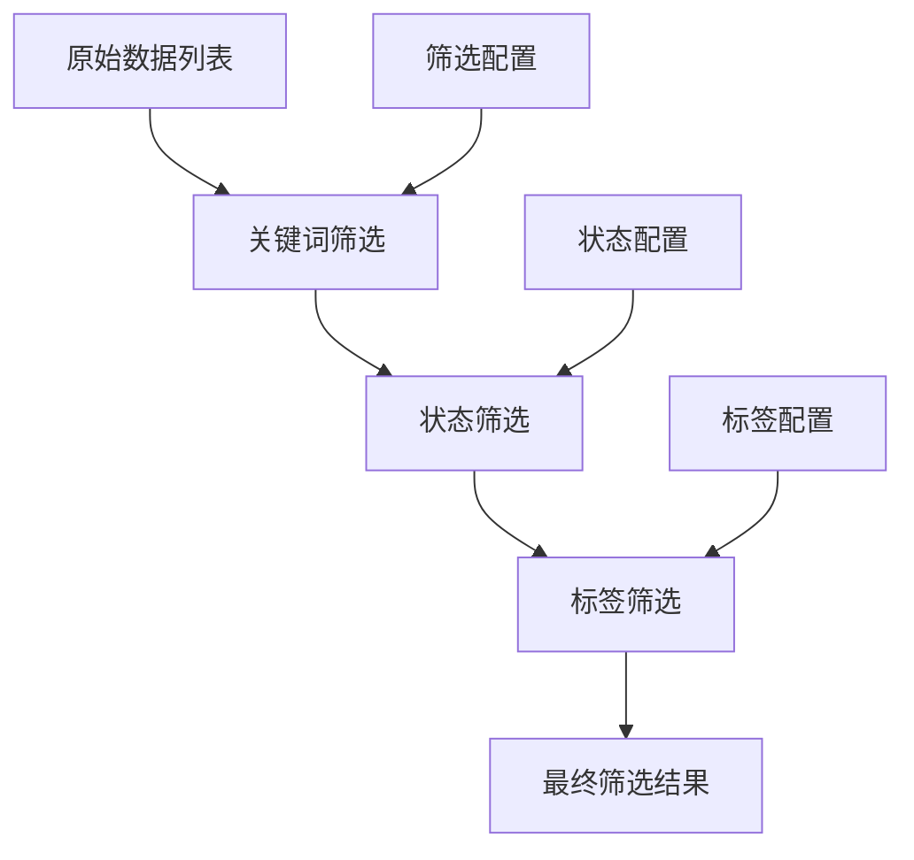

**图表来源**
- [specs/frontend/modules/filterUtils.yml:95-108](file://specs/frontend/modules/filterUtils.yml#L95-L108)

**章节来源**
- [specs/frontend/modules/filterUtils.yml:1-215](file://specs/frontend/modules/filterUtils.yml#L1-L215)

### SortUtils 排序工具模块

SortUtils提供了统一的排序逻辑，支持多种排序方式：

#### 排序算法实现

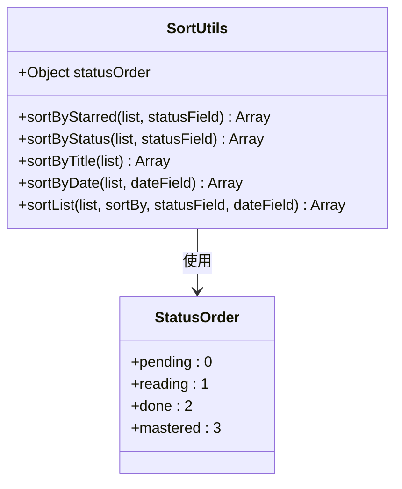

**图表来源**
- [specs/frontend/modules/sortUtils.yml:1-91](file://specs/frontend/modules/sortUtils.yml#L1-L91)

#### 排序优先级

排序算法遵循以下优先级规则：
1. 标星状态优先级最高
2. 阅读状态次之（pending < reading < done < mastered）
3. 创建时间最后排序（最新在前）

**章节来源**
- [specs/frontend/modules/sortUtils.yml:1-91](file://specs/frontend/modules/sortUtils.yml#L1-L91)

### fileUploadModule 文件上传模块

fileUploadModule封装了文件上传功能，支持多种上传模式：

#### 上传流程设计

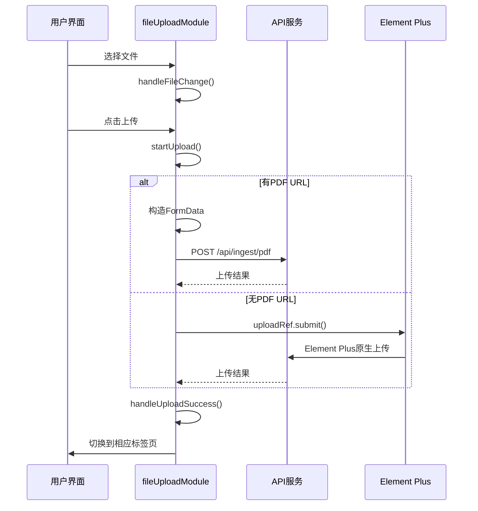

**图表来源**
- [specs/frontend/modules/fileUploadModule.yml:57-69](file://specs/frontend/modules/fileUploadModule.yml#L57-L69)

#### 智能跳转机制

上传成功后根据返回内容自动跳转到相应的库标签页：

- 仅文章：跳转到文章库
- 仅笔记：跳转到笔记库  
- 仅论文：跳转到论文库
- 混合内容：默认跳转到论文库并刷新所有数据

**章节来源**
- [specs/frontend/modules/fileUploadModule.yml:30-46](file://specs/frontend/modules/fileUploadModule.yml#L30-L46)

### ingestModule 入库模块

ingestModule封装了论文和文章的入库功能：

#### 入库操作流程

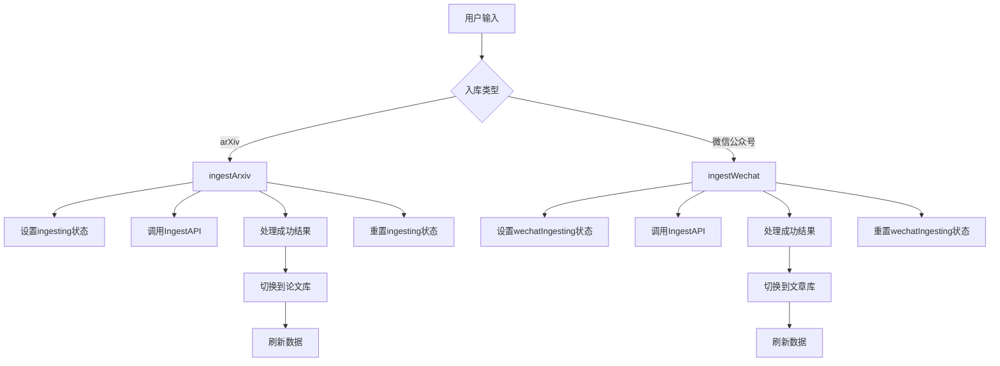

**图表来源**
- [specs/frontend/modules/ingestModule.yml:4-29](file://specs/frontend/modules/ingestModule.yml#L4-L29)

**章节来源**
- [specs/frontend/modules/ingestModule.yml:1-34](file://specs/frontend/modules/ingestModule.yml#L1-L34)

## 依赖分析

### 模块间依赖关系

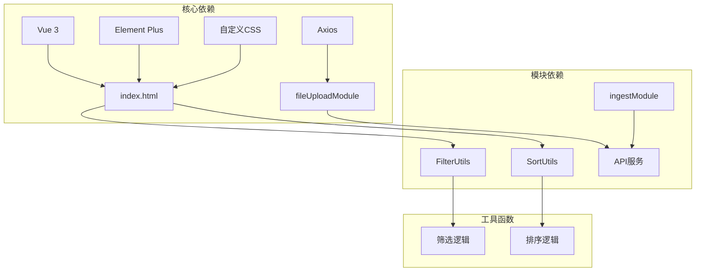

**图表来源**
- [frontend/index.html:7-12](file://frontend/index.html#L7-L12)

### 依赖注入模式

所有模块都采用依赖注入模式，通过工厂函数接收外部依赖：

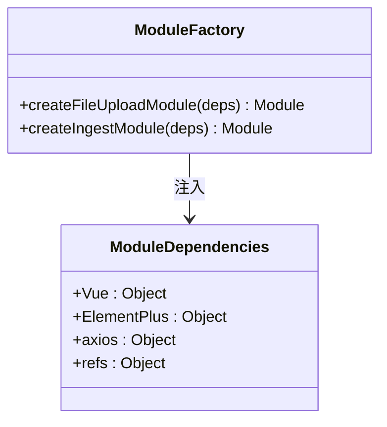

**图表来源**
- [frontend/src/modules/fileUploadModule.js:4](file://frontend/src/modules/fileUploadModule.js#L4)
- [frontend/src/modules/ingestModule.js:4](file://frontend/src/modules/ingestModule.js#L4)

**章节来源**
- [frontend/src/modules/fileUploadModule.js:4](file://frontend/src/modules/fileUploadModule.js#L4)
- [frontend/src/modules/ingestModule.js:4](file://frontend/src/modules/ingestModule.js#L4)

## 性能考虑

### 响应式优化

项目采用了完整的computed响应式机制，确保只有在依赖变化时才重新计算：

- **全computed响应式**：三个核心库都使用computed属性
- **状态持久化**：排序偏好通过localStorage持久化
- **按需更新**：只更新受影响的DOM节点

### 模块化优势

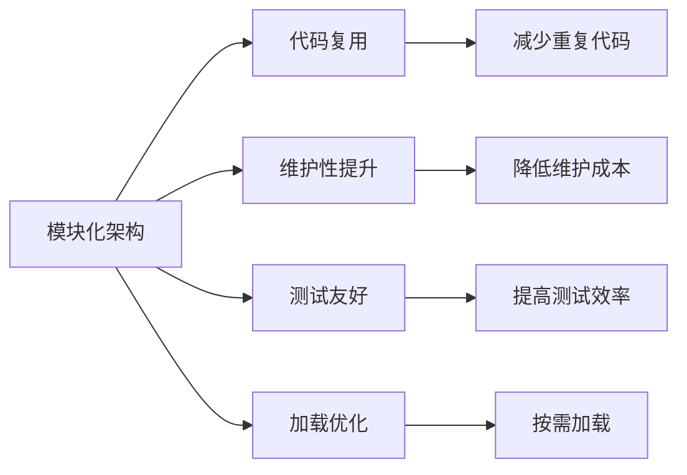

**章节来源**
- [frontend/ARCHITECTURE_AUDIT_V3.md:42-46](file://frontend/ARCHITECTURE_AUDIT_V3.md#L42-L46)

## 故障排除指南

### 常见问题诊断

#### 筛选功能异常

**症状**：筛选结果不符合预期
**排查步骤**：
1. 检查FilterUtils函数调用参数
2. 验证数据结构是否包含必需字段
3. 确认computed依赖是否正确

#### 排序功能异常

**症状**：排序结果不正确
**排查步骤**：
1. 检查statusOrder配置
2. 验证日期字段格式
3. 确认排序优先级逻辑

#### 上传功能异常

**症状**：文件上传失败
**排查步骤**：
1. 检查网络连接和API可达性
2. 验证文件格式和大小限制
3. 确认权限配置

**章节来源**
- [specs/frontend/modules/filterUtils.yml:213-215](file://specs/frontend/modules/filterUtils.yml#L213-L215)
- [specs/frontend/modules/sortUtils.yml:89-91](file://specs/frontend/modules/sortUtils.yml#L89-L91)

## 结论

PaperHub前端架构展现了优秀的模块化设计实践。通过采用混合式架构，项目在保持开发便利性的同时实现了高度的功能复用和状态统一。

### 架构优势

1. **同构设计**：三个核心库实现完全一致的逻辑和UI
2. **模块化程度高**：工具库模式实现了95%以上的逻辑复用
3. **响应式机制完善**：全computed响应式确保性能最优
4. **用户体验一致**：统一的交互模式降低学习成本

### 改进建议

1. **命名规范化**：为论文库状态添加前缀统一命名
2. **模块化演进**：继续推进渐进式模块化改造
3. **文档完善**：补充架构设计文档和模块说明

## 附录

### API响应格式

项目采用统一的API响应格式，确保前后端交互的一致性：

```json
{
    "code": 0,
    "data": {},
    "msg": "success"
}
```

**章节来源**
- [specs/api_response.spec.md:8-15](file://specs/api_response.spec.md#L8-L15)

### UI框架集成

项目集成了Element Plus作为主要UI框架，并配合自定义CSS实现品牌化设计：

- **Element Plus CSS**：通过CDN引入
- **自定义样式**：覆盖Element Plus默认样式
- **响应式设计**：支持多设备访问

**章节来源**
- [frontend/index.html:7-12](file://frontend/index.html#L7-L12)