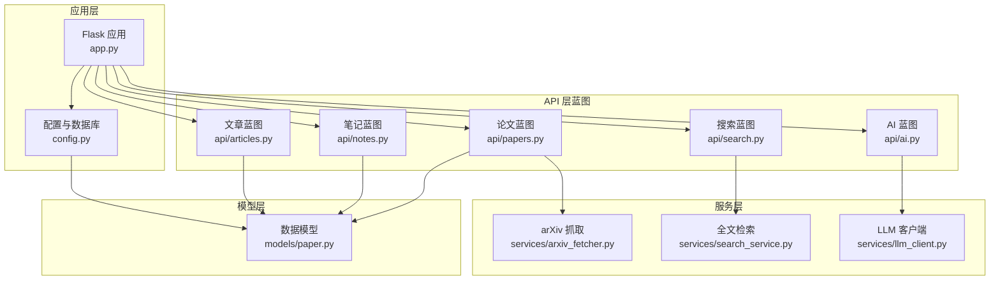
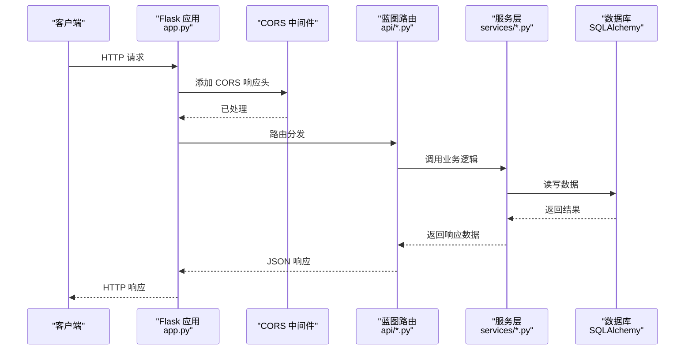
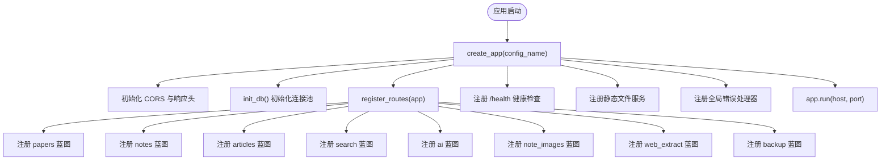
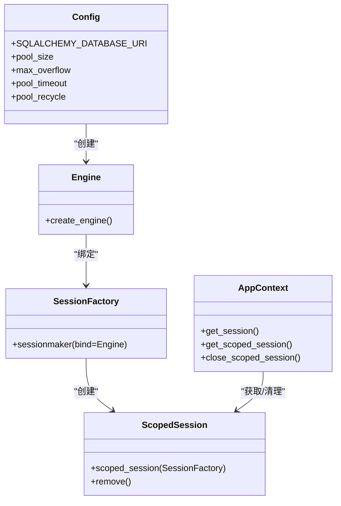
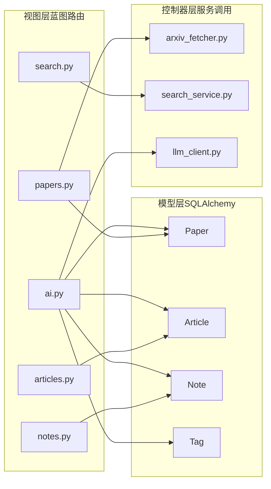
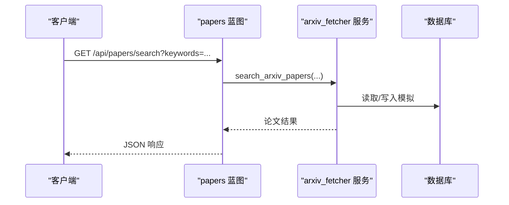
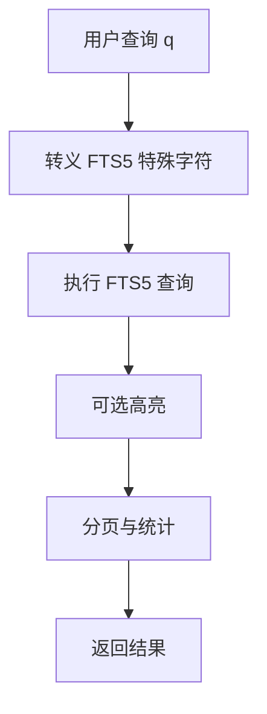
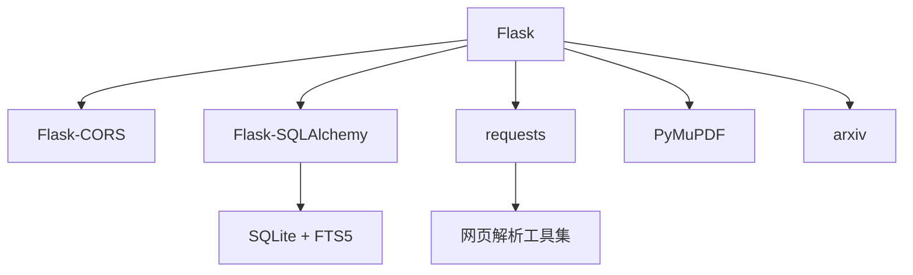

# 后端架构设计

<cite>
**本文档引用的文件**
- [backend/app.py](file://backend/app.py)
- [backend/config.py](file://backend/config.py)
- [backend/api/__init__.py](file://backend/api/__init__.py)
- [backend/api/papers.py](file://backend/api/papers.py)
- [backend/api/notes.py](file://backend/api/notes.py)
- [backend/api/articles.py](file://backend/api/articles.py)
- [backend/api/search.py](file://backend/api/search.py)
- [backend/api/ai.py](file://backend/api/ai.py)
- [backend/models/paper.py](file://backend/models/paper.py)
- [backend/services/arxiv_fetcher.py](file://backend/services/arxiv_fetcher.py)
- [backend/services/search_service.py](file://backend/services/search_service.py)
- [backend/services/llm_client.py](file://backend/services/llm_client.py)
- [backend/requirements.txt](file://backend/requirements.txt)
</cite>

## 目录
1. [简介](#简介)
2. [项目结构](#项目结构)
3. [核心组件](#核心组件)
4. [架构总览](#架构总览)
5. [详细组件分析](#详细组件分析)
6. [依赖分析](#依赖分析)
7. [性能考虑](#性能考虑)
8. [故障排除指南](#故障排除指南)
9. [结论](#结论)

## 简介
本文件为 PaperHub 后端架构设计文档，聚焦于 Flask 应用初始化、蓝图注册与路由组织、MVC 架构模式在后端的实现（模型层数据持久化、视图层 API 路由设计、控制器层服务调用逻辑）、数据库连接池与会话生命周期管理、CORS 配置、静态文件服务与健康检查接口、启动流程、中间件与安全过滤器，以及通过蓝图实现的模块化设计。

## 项目结构
后端采用典型的分层与模块化组织：
- 应用入口与配置：backend/app.py、backend/config.py
- API 层（蓝图）：backend/api/*.py
- 模型层（SQLAlchemy）：backend/models/*.py
- 服务层（业务逻辑与外部集成）：backend/services/*.py
- 依赖声明：backend/requirements.txt

**图表来源**
- [backend/app.py:41-137](file://backend/app.py#L41-L137)
- [backend/config.py:85-134](file://backend/config.py#L85-L134)
- [backend/api/papers.py:9](file://backend/api/papers.py#L9)
- [backend/api/notes.py:10](file://backend/api/notes.py#L10)
- [backend/api/articles.py:10](file://backend/api/articles.py#L10)
- [backend/api/search.py:12](file://backend/api/search.py#L12)
- [backend/api/ai.py:7](file://backend/api/ai.py#L7)
- [backend/models/paper.py:93](file://backend/models/paper.py#L93)
- [backend/services/arxiv_fetcher.py:123](file://backend/services/arxiv_fetcher.py#L123)
- [backend/services/search_service.py:39](file://backend/services/search_service.py#L39)
- [backend/services/llm_client.py:198](file://backend/services/llm_client.py#L198)

**章节来源**
- [backend/app.py:41-137](file://backend/app.py#L41-L137)
- [backend/config.py:85-134](file://backend/config.py#L85-L134)

## 核心组件
- Flask 应用工厂与初始化：create_app、register_routes、init_database
- 配置与数据库连接池：config.py 中的 init_db、get_engine、get_session、close_scoped_session
- 蓝图与路由组织：papers、notes、articles、search、ai 等蓝图注册与路由定义
- MVC 实现：
  - 模型层：SQLAlchemy 模型（Paper、Article、Note、Tag 等）
  - 视图层：蓝图路由（HTTP 接口）
  - 控制器层：服务调用（arXiv 抓取、全文检索、LLM 客户端）
- 中间件与安全：CORS、扫描器日志过滤、静态文件服务、健康检查
- 启动流程：命令行参数端口设置、应用启动

**章节来源**
- [backend/app.py:41-137](file://backend/app.py#L41-L137)
- [backend/config.py:85-134](file://backend/config.py#L85-L134)
- [backend/models/paper.py:93](file://backend/models/paper.py#L93)

## 架构总览
PaperHub 后端采用 Flask 微服务风格，以蓝图为中心进行模块化组织。应用启动时初始化数据库引擎与会话工厂，注册各功能蓝图，提供 RESTful API，并通过服务层封装外部能力（arXiv、全文检索、LLM）。

**图表来源**
- [backend/app.py:54-64](file://backend/app.py#L54-L64)
- [backend/app.py:140-157](file://backend/app.py#L140-L157)
- [backend/api/papers.py:29](file://backend/api/papers.py#L29)
- [backend/services/arxiv_fetcher.py:123](file://backend/services/arxiv_fetcher.py#L123)
- [backend/services/search_service.py:39](file://backend/services/search_service.py#L39)
- [backend/config.py:105-117](file://backend/config.py#L105-L117)

## 详细组件分析

### Flask 应用初始化与蓝图注册
- 应用工厂 create_app：
  - 设置静态目录、配置对象、JSON 编码、日志过滤（扫描器日志）
  - 初始化数据库（init_db）、注册蓝图（register_routes）
  - 注册全局错误处理器（handle_exception）
  - 注册健康检查、静态文件服务、favicon、首页路由
  - 请求结束时关闭会话（shutdown_session）
- 蓝图注册 register_routes：
  - 注册 papers、ingest、wechat_subscription、search、ai、note_images、web_extract、backup、export 等蓝图
  - 通过 get_note_routes、get_article_routes、get_subscription_routes 动态注册部分蓝图

**图表来源**
- [backend/app.py:41-137](file://backend/app.py#L41-L137)
- [backend/app.py:140-157](file://backend/app.py#L140-L157)

**章节来源**
- [backend/app.py:41-137](file://backend/app.py#L41-L137)
- [backend/app.py:140-157](file://backend/app.py#L140-L157)

### 数据库连接池与会话生命周期
- 全局单例连接池：
  - init_db 创建 Engine（连接池大小、溢出、超时、回收时间）
  - sessionmaker 绑定 Engine，scoped_session 提供线程安全会话
- 会话获取与关闭：
  - get_session 返回每次调用者负责关闭的 Session
  - get_scoped_session 返回线程安全的 ScopedSession，需在请求结束时 remove()
  - teardown_appcontext 调用 close_scoped_session 清理当前线程会话

**图表来源**
- [backend/config.py:85-134](file://backend/config.py#L85-L134)

**章节来源**
- [backend/config.py:85-134](file://backend/config.py#L85-L134)

### MVC 架构模式实现
- 模型层（Model）：Paper、Article、Note、Tag 等 SQLAlchemy 模型，定义表结构与关系
- 视图层（View）：蓝图路由（如 /api/papers、/api/notes、/api/articles、/api/search、/api/ai）
- 控制器层（Controller）：API 路由函数中调用服务层（arXiv 抓取、全文检索、LLM 客户端）

**图表来源**
- [backend/api/papers.py:29](file://backend/api/papers.py#L29)
- [backend/api/notes.py:25](file://backend/api/notes.py#L25)
- [backend/api/articles.py:28](file://backend/api/articles.py#L28)
- [backend/api/search.py:14](file://backend/api/search.py#L14)
- [backend/api/ai.py:79](file://backend/api/ai.py#L79)
- [backend/services/arxiv_fetcher.py:123](file://backend/services/arxiv_fetcher.py#L123)
- [backend/services/search_service.py:39](file://backend/services/search_service.py#L39)
- [backend/services/llm_client.py:198](file://backend/services/llm_client.py#L198)
- [backend/models/paper.py:120](file://backend/models/paper.py#L120)

**章节来源**
- [backend/api/papers.py:29](file://backend/api/papers.py#L29)
- [backend/api/notes.py:25](file://backend/api/notes.py#L25)
- [backend/api/articles.py:28](file://backend/api/articles.py#L28)
- [backend/api/search.py:14](file://backend/api/search.py#L14)
- [backend/api/ai.py:79](file://backend/api/ai.py#L79)
- [backend/models/paper.py:120](file://backend/models/paper.py#L120)

### 论文 API（papers）组件分析
- 路由组织：/api/papers 列表、详情、标签管理、arXiv 搜索与导入、批量更新、文件下载与图片服务
- 服务调用：arxiv_fetcher 搜索与导入、文件系统读写、PDF 处理
- 数据模型：Paper、Tag、PaperVersion、paper_tags 关联表

**图表来源**
- [backend/api/papers.py:475](file://backend/api/papers.py#L475)
- [backend/services/arxiv_fetcher.py:123](file://backend/services/arxiv_fetcher.py#L123)

**章节来源**
- [backend/api/papers.py:29](file://backend/api/papers.py#L29)
- [backend/api/papers.py:475](file://backend/api/papers.py#L475)
- [backend/models/paper.py:120](file://backend/models/paper.py#L120)

### 笔记 API（notes）组件分析
- 路由组织：/api/notes CRUD、批量操作、笔记-论文/文章/标签关联管理
- 服务调用：去重检测、文件清理（note_images）
- 数据模型：Note、paper_papers、note_tags、note_articles 关联表

**章节来源**
- [backend/api/notes.py:25](file://backend/api/notes.py#L25)
- [backend/api/notes.py:471](file://backend/api/notes.py#L471)
- [backend/models/paper.py:250](file://backend/models/paper.py#L250)

### 文章 API（articles）组件分析
- 路由组织：/api/articles CRUD、批量操作、文章-论文/标签关联管理
- 服务调用：去重检测、本地文件清理（wechat）
- 数据模型：Article、Paper、Tag、article_papers、article_tags 关联表

**章节来源**
- [backend/api/articles.py:28](file://backend/api/articles.py#L28)
- [backend/api/articles.py:355](file://backend/api/articles.py#L355)
- [backend/models/paper.py:191](file://backend/models/paper.py#L191)

### 搜索 API（search）组件分析
- 路由组织：/api/search、/api/search/suggest
- 服务调用：全文检索（papers_fts、articles_fts、notes_fts）、建议生成
- 性能优化：FTS5 查询、高亮、分页、权重融合排序

**图表来源**
- [backend/api/search.py:14](file://backend/api/search.py#L14)
- [backend/services/search_service.py:8](file://backend/services/search_service.py#L8)
- [backend/services/search_service.py:39](file://backend/services/search_service.py#L39)

**章节来源**
- [backend/api/search.py:14](file://backend/api/search.py#L14)
- [backend/services/search_service.py:39](file://backend/services/search_service.py#L39)

### AI API（ai）组件分析
- 路由组织：/api/ai/config、/api/ai/stats、/api/ai/summary、/api/ai/recommend-tags、/api/ai/related、/api/ai/clear-cache
- 服务调用：LLM 客户端（多提供商）、提示工程、缓存与用量统计
- 数据模型：Paper、Article、Note、Tag

**章节来源**
- [backend/api/ai.py:42](file://backend/api/ai.py#L42)
- [backend/services/llm_client.py:198](file://backend/services/llm_client.py#L198)

### CORS 配置、静态文件服务与健康检查
- CORS：全局响应头添加 Access-Control-Allow-*，开发环境允许所有来源
- 静态文件服务：/static/wechat、/static/zhihu、/static/note_images、/static/web、/static/wechat_subscriptions/images、/src
- 健康检查：/health 返回 {status: ok}
- 扫描器日志过滤：自定义 Filter 过滤扫描请求日志

**章节来源**
- [backend/app.py:54-64](file://backend/app.py#L54-L64)
- [backend/app.py:101-131](file://backend/app.py#L101-L131)
- [backend/app.py:32-38](file://backend/app.py#L32-L38)

### 错误处理机制
- 全局异常处理：handle_exception 捕获未处理异常，区分 NotFound 与 HTTPException，返回 JSON 错误
- 扫描请求保护：_is_scan_request 与 ScanFilter 防止扫描日志泄露

**章节来源**
- [backend/app.py:70-89](file://backend/app.py#L70-L89)
- [backend/app.py:25-29](file://backend/app.py#L25-L29)
- [backend/app.py:32-38](file://backend/app.py#L32-L38)

## 依赖分析
- Flask 生态：Flask、Flask-CORS、Flask-SQLAlchemy
- 数据与检索：arxiv、PyMuPDF、FTS5（SQLite 内置全文检索）
- 网页解析：beautifulsoup4、trafilatura、readability-lxml、newspaper3k、lxml
- 网络请求：requests、urllib3、charset-normalizer
- HTML 转换：html2text

**图表来源**
- [backend/requirements.txt:1-15](file://backend/requirements.txt#L1-L15)

**章节来源**
- [backend/requirements.txt:1-15](file://backend/requirements.txt#L1-L15)

## 性能考虑
- 数据库连接池：合理设置 pool_size、max_overflow、pool_recycle，避免 SQLite 锁问题
- 全文检索：FTS5 查询与索引，高亮与分页减少传输量
- LLM 调用：缓存与用量统计，避免重复请求
- 文件服务：静态文件直接发送，避免不必要的处理
- 日志过滤：扫描器日志过滤降低噪音与潜在风险

## 故障排除指南
- CORS 问题：确认响应头已添加，开发环境允许所有来源
- 数据库连接失败：检查 init_db 是否正确初始化，连接池参数是否合理
- 蓝图未注册：确认 register_routes 中是否包含对应蓝图
- LLM 配置：检查 .env 或环境变量是否正确设置
- 健康检查：访问 /health 确认服务正常

**章节来源**
- [backend/app.py:54-64](file://backend/app.py#L54-L64)
- [backend/app.py:91-103](file://backend/app.py#L91-L103)
- [backend/services/llm_client.py:18](file://backend/services/llm_client.py#L18)

## 结论
PaperHub 后端以 Flask 蓝图为骨架，结合 SQLAlchemy 模型层与服务层，实现了清晰的 MVC 分层与模块化设计。通过连接池管理、CORS、静态文件服务、健康检查与错误处理机制，提供了稳定可靠的后端基础设施。蓝图注册与路由组织使得功能边界明确、易于扩展与维护。