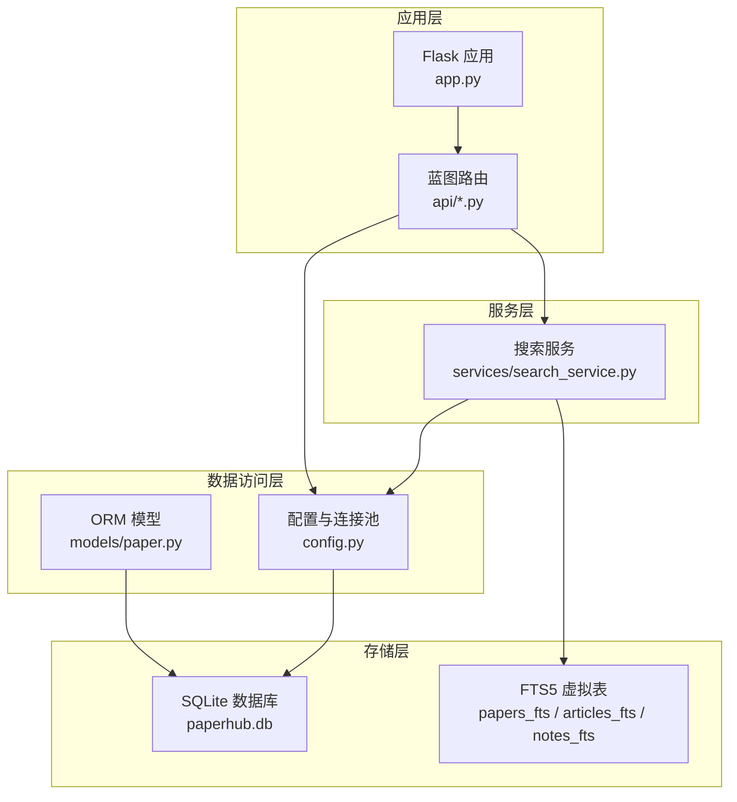
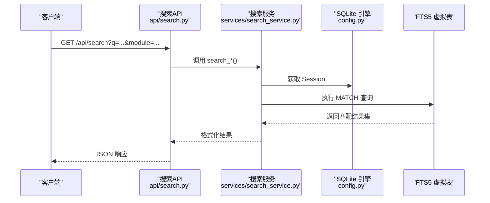
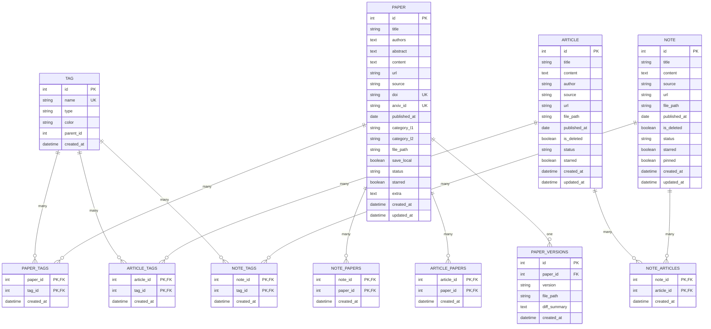
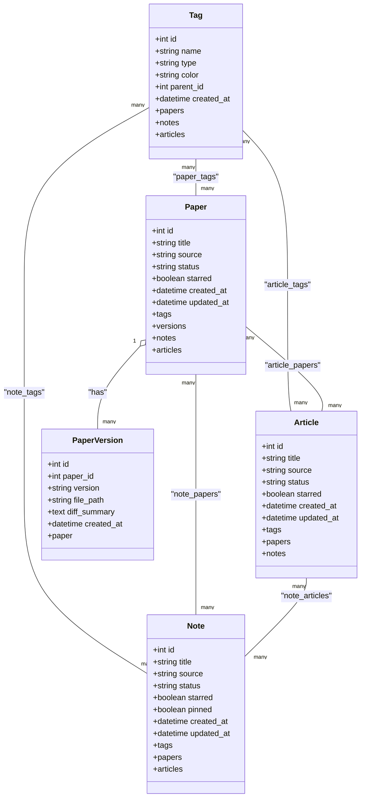
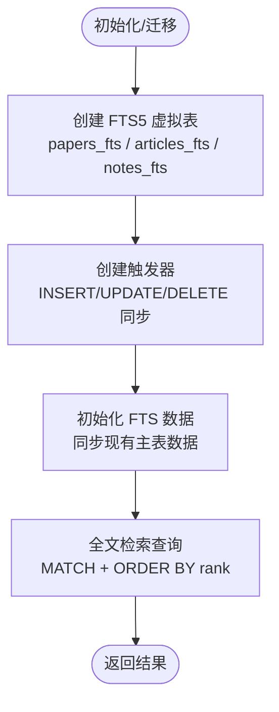
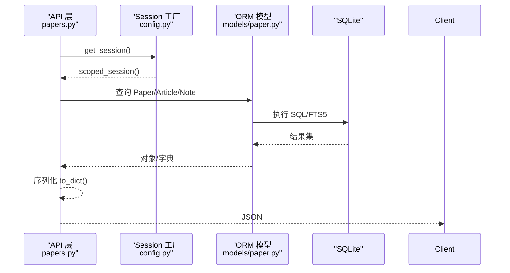
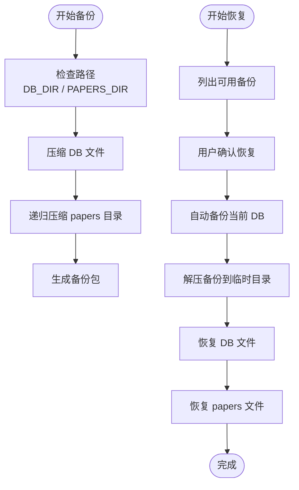
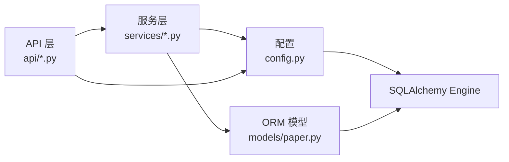

# 数据架构设计

<cite>
**本文档引用的文件**
- [backend/models/paper.py](file://backend/models/paper.py)
- [backend/config.py](file://backend/config.py)
- [backend/app.py](file://backend/app.py)
- [specs/backend/models/paper.yml](file://specs/backend/models/paper.yml)
- [specs/backend/models/article.yml](file://specs/backend/models/article.yml)
- [specs/backend/models/note.yml](file://specs/backend/models/note.yml)
- [specs/backend/models/tag.yml](file://specs/backend/models/tag.yml)
- [specs/backend/models/relations_and_aux.yml](file://specs/backend/models/relations_and_aux.yml)
- [scripts/maintenance/006_add_fts_tables.py](file://scripts/maintenance/006_add_fts_tables.py)
- [scripts/maintenance/backup.py](file://scripts/maintenance/backup.py)
- [scripts/maintenance/restore.py](file://scripts/maintenance/restore.py)
- [backend/api/papers.py](file://backend/api/papers.py)
- [backend/api/search.py](file://backend/api/search.py)
- [backend/services/search_service.py](file://backend/services/search_service.py)
- [scripts/maintenance/check_schema.py](file://scripts/maintenance/check_schema.py)
</cite>

## 目录
1. [简介](#简介)
2. [项目结构](#项目结构)
3. [核心组件](#核心组件)
4. [架构总览](#架构总览)
5. [详细组件分析](#详细组件分析)
6. [依赖关系分析](#依赖关系分析)
7. [性能考量](#性能考量)
8. [故障排查指南](#故障排查指南)
9. [结论](#结论)
10. [附录](#附录)

## 简介
本文件面向PaperHub的数据架构，围绕统一数据模型设计原则，系统化阐述Paper、Article、Note三类核心实体的建模思路与关系设计；详解多对多标签关联表的实现机制、版本管理与数据一致性保障；说明SQLite数据库选型理由、FTS5全文检索集成与索引优化策略；梳理数据访问层设计模式、ORM映射配置与查询优化技巧；并给出数据迁移机制、备份恢复策略与数据完整性约束。最后以架构图、ER关系图与数据流/事务处理示意帮助读者快速把握系统全貌。

## 项目结构
后端采用Flask应用，数据层基于SQLAlchemy ORM，SQLite作为持久化存储。核心数据模型位于models目录，API路由集中在api目录，服务层位于services目录，维护脚本位于scripts/maintenance目录。配置集中于config.py，应用入口在app.py。

**图表来源**
- [backend/app.py:140-158](file://backend/app.py#L140-L158)
- [backend/config.py:85-133](file://backend/config.py#L85-L133)
- [backend/models/paper.py:18-87](file://backend/models/paper.py#L18-L87)
- [scripts/maintenance/006_add_fts_tables.py:13-48](file://scripts/maintenance/006_add_fts_tables.py#L13-L48)

**章节来源**
- [backend/app.py:41-137](file://backend/app.py#L41-L137)
- [backend/config.py:35-133](file://backend/config.py#L35-L133)

## 核心组件
- 统一数据模型：Paper、Article、Note三类实体共享一致的元数据字段（标题、来源、时间戳、状态、星标等），并通过多对多标签体系实现灵活组织。
- 多对多标签关联：通过paper_tags、article_tags、note_tags等中间表实现标签与实体的解耦，支持层级标签与跨实体复用。
- 版本管理：PaperVersion提供论文历史版本追踪，确保内容演进可追溯。
- 数据访问层：SQLAlchemy ORM + scoped_session连接池，统一Session生命周期管理。
- 全文检索：FTS5虚拟表配合触发器，实现论文、文章、笔记的高效全文检索。
- 备份恢复：独立脚本实现数据库与文件目录的打包备份与恢复。

**章节来源**
- [backend/models/paper.py:93-360](file://backend/models/paper.py#L93-L360)
- [specs/backend/models/paper.yml:1-164](file://specs/backend/models/paper.yml#L1-L164)
- [specs/backend/models/article.yml:1-114](file://specs/backend/models/article.yml#L1-L114)
- [specs/backend/models/note.yml:1-115](file://specs/backend/models/note.yml#L1-L115)
- [specs/backend/models/tag.yml:1-68](file://specs/backend/models/tag.yml#L1-L68)
- [specs/backend/models/relations_and_aux.yml:1-263](file://specs/backend/models/relations_and_aux.yml#L1-L263)

## 架构总览
PaperHub采用“API层-服务层-数据访问层-存储层”的分层架构。API层负责请求接入与路由注册；服务层封装业务逻辑（如全文检索）；数据访问层通过SQLAlchemy ORM与SQLite交互；FTS5提供高性能全文检索能力；维护脚本负责数据库结构迁移与备份恢复。

**图表来源**
- [backend/api/search.py:14-51](file://backend/api/search.py#L14-L51)
- [backend/services/search_service.py:39-96](file://backend/services/search_service.py#L39-L96)
- [backend/config.py:111-117](file://backend/config.py#L111-L117)
- [scripts/maintenance/006_add_fts_tables.py:13-48](file://scripts/maintenance/006_add_fts_tables.py#L13-L48)

## 详细组件分析

### 统一数据模型与实体关系
Paper、Article、Note三类实体共享一致的元数据字段，便于前端与API统一处理。它们通过多对多标签体系实现灵活组织，并可相互关联（如Article-Paper、Note-Paper、Note-Article）。标签Tag支持层级结构（自引用），并具备类型与颜色属性，便于分类与视觉呈现。

**图表来源**
- [backend/models/paper.py:18-87](file://backend/models/paper.py#L18-L87)
- [specs/backend/models/paper.yml:1-164](file://specs/backend/models/paper.yml#L1-L164)
- [specs/backend/models/article.yml:1-114](file://specs/backend/models/article.yml#L1-L114)
- [specs/backend/models/note.yml:1-115](file://specs/backend/models/note.yml#L1-L115)
- [specs/backend/models/tag.yml:1-68](file://specs/backend/models/tag.yml#L1-L68)
- [specs/backend/models/relations_and_aux.yml:1-263](file://specs/backend/models/relations_and_aux.yml#L1-L263)

**章节来源**
- [backend/models/paper.py:93-360](file://backend/models/paper.py#L93-L360)
- [specs/backend/models/paper.yml:1-164](file://specs/backend/models/paper.yml#L1-L164)
- [specs/backend/models/article.yml:1-114](file://specs/backend/models/article.yml#L1-L114)
- [specs/backend/models/note.yml:1-115](file://specs/backend/models/note.yml#L1-L115)
- [specs/backend/models/tag.yml:1-68](file://specs/backend/models/tag.yml#L1-L68)
- [specs/backend/models/relations_and_aux.yml:1-263](file://specs/backend/models/relations_and_aux.yml#L1-L263)

### 多对多标签关联与版本管理
- 标签关联表：paper_tags、article_tags、note_tags均采用复合主键（实体ID+标签ID），并记录创建时间，确保关系可审计。
- 标签层级：Tag的parent_id自引用，支持父子标签形成层级树。
- 版本管理：PaperVersion记录每次版本变更的文件路径与差异摘要，Paper与PaperVersion为一对多关系，级联删除孤儿版本，保证数据整洁。

**图表来源**
- [backend/models/paper.py:93-360](file://backend/models/paper.py#L93-L360)
- [specs/backend/models/relations_and_aux.yml:160-197](file://specs/backend/models/relations_and_aux.yml#L160-L197)

**章节来源**
- [backend/models/paper.py:18-87](file://backend/models/paper.py#L18-L87)
- [specs/backend/models/relations_and_aux.yml:160-197](file://specs/backend/models/relations_and_aux.yml#L160-L197)

### SQLite 选型与 FTS5 全文检索
- 选型理由：SQLite轻量、零配置、跨平台、事务强一致，适合个人/小团队知识库场景；结合FTS5可满足全文检索需求。
- FTS5集成：为Paper、Article、Note分别创建papers_fts、articles_fts、notes_fts虚拟表，使用unicode61分词器；通过INSERT/UPDATE/DELETE触发器保持与主表同步。
- 索引优化：FTS5内部索引由引擎管理；同时为实体表建立常用查询字段索引（如papers的title/category/status/starred/published_at等），提升过滤与排序效率。

**图表来源**
- [scripts/maintenance/006_add_fts_tables.py:13-48](file://scripts/maintenance/006_add_fts_tables.py#L13-L48)
- [scripts/maintenance/006_add_fts_tables.py:56-138](file://scripts/maintenance/006_add_fts_tables.py#L56-L138)
- [specs/backend/models/paper.yml:151-164](file://specs/backend/models/paper.yml#L151-L164)
- [specs/backend/models/article.yml:107-114](file://specs/backend/models/article.yml#L107-L114)
- [specs/backend/models/note.yml:108-115](file://specs/backend/models/note.yml#L108-L115)

**章节来源**
- [scripts/maintenance/006_add_fts_tables.py:13-179](file://scripts/maintenance/006_add_fts_tables.py#L13-L179)
- [specs/backend/models/paper.yml:151-164](file://specs/backend/models/paper.yml#L151-L164)
- [specs/backend/models/article.yml:107-114](file://specs/backend/models/article.yml#L107-L114)
- [specs/backend/models/note.yml:108-115](file://specs/backend/models/note.yml#L108-L115)

### 数据访问层设计模式与ORM映射
- 设计模式：采用Repository/Service模式分离数据访问与业务逻辑；API层仅负责参数解析与响应封装，业务逻辑集中在服务层。
- ORM映射：SQLAlchemy声明式映射Paper、Article、Note、Tag及中间表；使用relationship定义多对多/一对多关系；通过scoped_session实现线程安全的会话管理。
- 查询优化：API层按需过滤（分类、状态、星标、日期范围、标签ID等），服务层使用JOIN FTS5进行全文检索并返回rank排序；合理使用LIMIT/OFFSET实现分页。

**图表来源**
- [backend/api/papers.py:29-108](file://backend/api/papers.py#L29-L108)
- [backend/services/search_service.py:39-96](file://backend/services/search_service.py#L39-L96)
- [backend/config.py:111-117](file://backend/config.py#L111-L117)
- [backend/models/paper.py:120-294](file://backend/models/paper.py#L120-L294)

**章节来源**
- [backend/api/papers.py:29-108](file://backend/api/papers.py#L29-L108)
- [backend/services/search_service.py:39-200](file://backend/services/search_service.py#L39-L200)
- [backend/config.py:85-133](file://backend/config.py#L85-L133)
- [backend/models/paper.py:120-294](file://backend/models/paper.py#L120-L294)

### 数据迁移机制与数据一致性
- 迁移脚本：通过维护脚本创建FTS5虚拟表与触发器，确保主表变更自动同步至FTS表，保障全文检索一致性。
- 初始化流程：应用启动时若未检测到标签数据，则创建基础技术/会议/自定义标签，保证标签体系可用。
- 一致性保障：FTS触发器在INSERT/UPDATE/DELETE阶段同步虚拟表；PaperVersion级联删除避免悬挂版本；软删除字段（Article/Note）支持逻辑删除与过滤。

**章节来源**
- [scripts/maintenance/006_add_fts_tables.py:13-179](file://scripts/maintenance/006_add_fts_tables.py#L13-L179)
- [backend/app.py:160-218](file://backend/app.py#L160-L218)
- [specs/backend/models/relations_and_aux.yml:160-197](file://specs/backend/models/relations_and_aux.yml#L160-L197)

### 备份恢复策略与数据完整性
- 备份：打包数据库文件与papers目录，支持自定义命名与列出备份；备份内容包含数据库与所有论文/文章/笔记文件。
- 恢复：交互式选择备份文件，恢复前自动备份当前数据库，覆盖性恢复数据库与文件目录。
- 完整性：FTS5触发器与主表同步减少检索不一致；软删除字段避免误删；索引与唯一约束（如Tag.name、Paper.doi、Paper.arxiv_id）保障数据去重与一致性。

**图表来源**
- [scripts/maintenance/backup.py:47-76](file://scripts/maintenance/backup.py#L47-L76)
- [scripts/maintenance/restore.py:57-123](file://scripts/maintenance/restore.py#L57-L123)

**章节来源**
- [scripts/maintenance/backup.py:1-121](file://scripts/maintenance/backup.py#L1-L121)
- [scripts/maintenance/restore.py:1-166](file://scripts/maintenance/restore.py#L1-L166)
- [specs/backend/models/tag.yml:14](file://specs/backend/models/tag.yml#L14)
- [specs/backend/models/paper.yml:53-62](file://specs/backend/models/paper.yml#L53-L62)

## 依赖关系分析
- API层依赖服务层与配置；服务层依赖ORM模型与配置；ORM模型依赖Base元数据与关系定义；配置提供Engine与Session工厂。
- 外部依赖：SQLite（本地文件）、FTS5（SQLite扩展）、SQLAlchemy（Python ORM）。

**图表来源**
- [backend/api/papers.py:12-26](file://backend/api/papers.py#L12-L26)
- [backend/services/search_service.py:5-6](file://backend/services/search_service.py#L5-L6)
- [backend/config.py:85-133](file://backend/config.py#L85-L133)
- [backend/models/paper.py:18-87](file://backend/models/paper.py#L18-L87)

**章节来源**
- [backend/api/papers.py:12-26](file://backend/api/papers.py#L12-L26)
- [backend/services/search_service.py:5-6](file://backend/services/search_service.py#L5-L6)
- [backend/config.py:85-133](file://backend/config.py#L85-L133)
- [backend/models/paper.py:18-87](file://backend/models/paper.py#L18-L87)

## 性能考量
- 连接池与会话：启用连接池（pool_size、max_overflow、pool_recycle）降低SQLite锁竞争；使用scoped_session避免并发会话冲突。
- 查询优化：按需过滤条件（category/status/starred/date/tag_ids）；FTS5 MATCH + ORDER BY rank；LIMIT/OFFSET分页。
- 索引策略：实体表常见过滤字段建立索引；FTS5虚拟表自动维护倒排索引。
- I/O优化：定期备份与文件目录分离，避免大文件影响数据库性能。

**章节来源**
- [backend/config.py:92-99](file://backend/config.py#L92-L99)
- [backend/api/papers.py:47-97](file://backend/api/papers.py#L47-L97)
- [specs/backend/models/paper.yml:151-164](file://specs/backend/models/paper.yml#L151-L164)
- [specs/backend/models/article.yml:107-114](file://specs/backend/models/article.yml#L107-L114)
- [specs/backend/models/note.yml:108-115](file://specs/backend/models/note.yml#L108-L115)

## 故障排查指南
- 数据库结构检查：使用维护脚本打印所有表与列信息，核对是否包含FTS表与触发器。
- FTS同步问题：确认触发器是否存在且未被重复创建；必要时重建触发器并重新初始化FTS数据。
- 备份/恢复失败：检查备份文件是否存在、权限是否正确；恢复前确认自动备份已生成。
- 查询异常：检查查询参数（日期范围、标签ID列表）格式；确认FTS表是否已初始化。

**章节来源**
- [scripts/maintenance/check_schema.py:1-26](file://scripts/maintenance/check_schema.py#L1-L26)
- [scripts/maintenance/006_add_fts_tables.py:50-138](file://scripts/maintenance/006_add_fts_tables.py#L50-L138)
- [scripts/maintenance/restore.py:57-123](file://scripts/maintenance/restore.py#L57-L123)

## 结论
PaperHub通过统一的Paper/Article/Note数据模型与多对多标签体系，实现了知识库三大核心模块的协同工作；SQLite+FTS5提供了轻量高效的全文检索能力；完善的备份恢复与迁移脚本保障了数据的可靠性与可维护性。该架构在易用性、性能与可扩展性之间取得良好平衡，适合个人与小团队的知识管理场景。

## 附录
- 数据流向与事务处理：API层接收请求，服务层执行业务逻辑，ORM通过scoped_session管理事务，SQLite保证原子性与一致性；FTS触发器在事务提交后同步更新虚拟表。
- 统一模型支撑三大模块：Paper作为核心实体，Article与Note通过多对多关系与其关联，标签体系贯穿三者，实现跨模块的统一组织与检索。