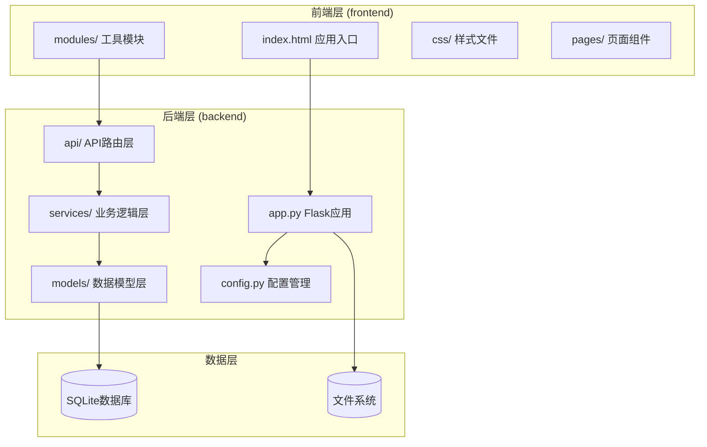
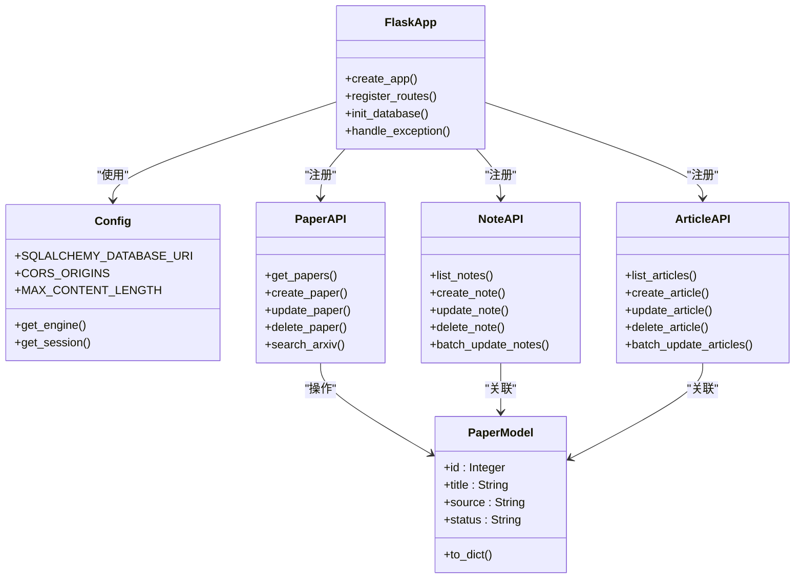
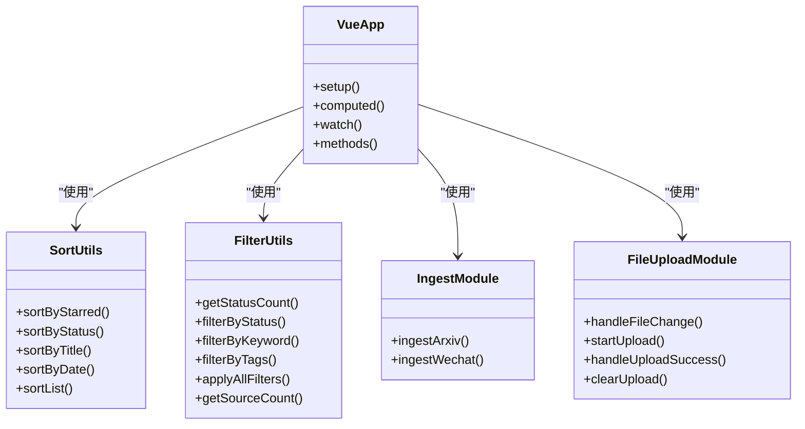
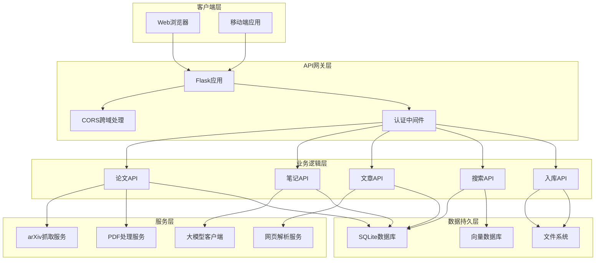
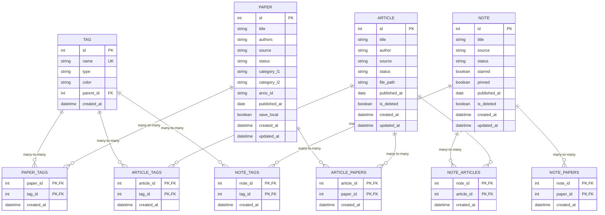
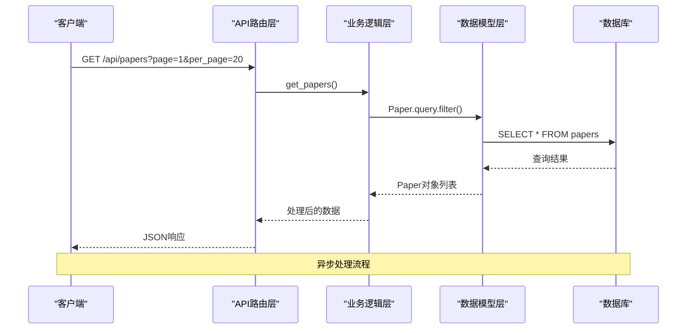
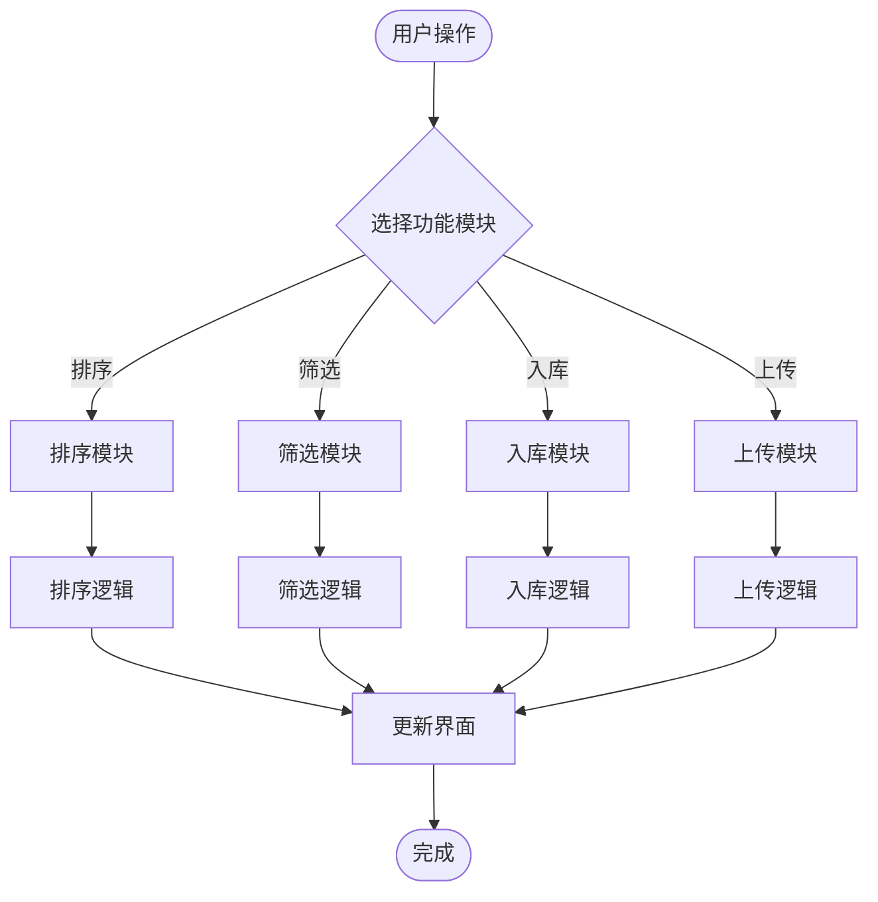
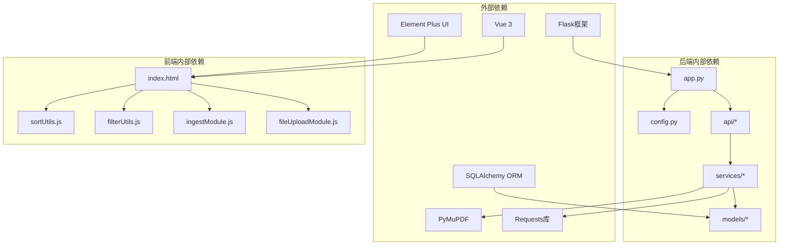

# 架构设计

<cite>
**本文档引用的文件**
- [README.md](file://README.md)
- [架构规约](file://specs/architecture.spec.md)
- [全局配置标准规约](file://specs/system/global_config.yml)
- [接口响应格式规约](file://specs/api_response.spec.md)
- [后端应用入口](file://backend/app.py)
- [后端配置](file://backend/config.py)
- [论文API](file://backend/api/papers.py)
- [笔记API](file://backend/api/notes.py)
- [文章API](file://backend/api/articles.py)
- [数据模型](file://backend/models/paper.py)
- [前端入口](file://frontend/index.html)
- [排序工具模块](file://frontend/src/modules/sortUtils.js)
- [筛选工具模块](file://frontend/src/modules/filterUtils.js)
- [入库模块](file://frontend/src/modules/ingestModule.js)
- [文件上传模块](file://frontend/src/modules/fileUploadModule.js)
</cite>

## 目录
1. [引言](#引言)
2. [项目结构](#项目结构)
3. [核心组件](#核心组件)
4. [架构概览](#架构概览)
5. [详细组件分析](#详细组件分析)
6. [依赖分析](#依赖分析)
7. [性能考虑](#性能考虑)
8. [故障排查指南](#故障排查指南)
9. [结论](#结论)
10. [附录](#附录)

## 引言

PaperHub是一个前后端分离的个人知识管理系统，采用Flask后端服务与Vue 3前端应用的全栈架构设计。系统专注于算法工程师的论文、公众号文章、对话笔记一体化管理，实现了三大模块（论文库、文章库、笔记库）的统一架构设计。

该项目的核心设计理念是"一致性原则"，通过统一的API设计、标准化的数据模型和一致的前端交互模式，确保用户在三个模块间的学习成本最小化。系统支持本地优先的数据存储策略，所有数据均存储在本地，确保隐私安全和永久可用性。

## 项目结构

PaperHub采用清晰的前后端分离架构，每个层级都有明确的职责划分：

**图表来源**
- [架构规约:6-19](file://specs/architecture.spec.md#L6-L19)
- [后端应用入口:41-127](file://backend/app.py#L41-L127)
- [后端配置:35-72](file://backend/config.py#L35-L72)

### 目录结构特点

系统采用模块化组织方式，严格遵循分层架构原则：

- **后端三层架构**：API层（路由处理）、Services层（业务逻辑）、Models层（数据模型）
- **前端单页应用**：基于Vue 3的现代化前端架构，采用模块化设计
- **统一配置管理**：集中式的配置文件，支持多环境部署
- **标准化文档**：完整的架构规约、API规范和配置标准

**章节来源**
- [架构规约:6-19](file://specs/architecture.spec.md#L6-L19)
- [README.md:324-412](file://README.md#L324-L412)

## 核心组件

### 后端核心组件

后端采用Flask框架构建RESTful API服务，实现了完整的MVC架构模式：

**图表来源**
- [后端应用入口:41-147](file://backend/app.py#L41-L147)
- [后端配置:35-132](file://backend/config.py#L35-L132)
- [论文API:29-108](file://backend/api/papers.py#L29-L108)
- [笔记API:25-59](file://backend/api/notes.py#L25-L59)
- [文章API:28-54](file://backend/api/articles.py#L28-L54)
- [数据模型:120-185](file://backend/models/paper.py#L120-L185)

### 前端核心组件

前端采用Vue 3 Composition API构建，实现了高度模块化的架构：

**图表来源**
- [前端入口:16-800](file://frontend/index.html#L16-L800)
- [排序工具模块:2-52](file://frontend/src/modules/sortUtils.js#L2-L52)
- [筛选工具模块:2-106](file://frontend/src/modules/filterUtils.js#L2-L106)
- [入库模块:4-47](file://frontend/src/modules/ingestModule.js#L4-L47)
- [文件上传模块:4-109](file://frontend/src/modules/fileUploadModule.js#L4-L109)

**章节来源**
- [后端应用入口:41-147](file://backend/app.py#L41-L147)
- [前端入口:16-800](file://frontend/index.html#L16-L800)

## 架构概览

PaperHub采用典型的前后端分离架构，通过RESTful API进行通信，实现了高度解耦的设计模式：

**图表来源**
- [后端应用入口:130-147](file://backend/app.py#L130-L147)
- [论文API:475-588](file://backend/api/papers.py#L475-L588)
- [笔记API:61-134](file://backend/api/notes.py#L61-L134)
- [文章API:81-134](file://backend/api/articles.py#L81-L134)

### MVC架构模式应用

系统严格遵循MVC（Model-View-Controller）架构模式：

- **Model层**：数据模型定义，负责数据结构和业务规则
- **View层**：前端模板和组件，负责用户界面展示
- **Controller层**：API路由和业务逻辑控制器，负责请求处理

**章节来源**
- [架构规约:21-77](file://specs/architecture.spec.md#L21-L77)
- [数据模型:93-360](file://backend/models/paper.py#L93-L360)

## 详细组件分析

### 数据模型层分析

PaperHub的数据模型采用了高度规范化的设计，实现了复杂的多对多关联关系：

**图表来源**
- [数据模型:21-87](file://backend/models/paper.py#L21-L87)

#### 关键设计特点

1. **统一标签系统**：所有实体共享标签体系，支持灵活的标签管理
2. **多对多关联**：论文、文章、笔记之间可以建立复杂的关联关系
3. **版本控制**：论文版本管理支持内容变更追踪
4. **软删除机制**：文章和笔记支持软删除，便于数据恢复

**章节来源**
- [数据模型:93-360](file://backend/models/paper.py#L93-L360)

### API服务层分析

后端API层实现了完整的RESTful服务，每个模块都有清晰的职责划分：

**图表来源**
- [论文API:29-108](file://backend/api/papers.py#L29-L108)

#### API设计原则

1. **统一响应格式**：所有API响应都遵循统一的JSON格式
2. **分页支持**：所有列表查询都支持分页参数
3. **过滤条件**：支持多维度的查询过滤
4. **批量操作**：提供批量更新和删除功能

**章节来源**
- [接口响应格式规约:8-15](file://specs/api_response.spec.md#L8-L15)
- [论文API:29-108](file://backend/api/papers.py#L29-L108)

### 前端模块化分析

前端采用模块化设计，每个功能模块都有独立的职责：

**图表来源**
- [排序工具模块:37-51](file://frontend/src/modules/sortUtils.js#L37-L51)
- [筛选工具模块:52-58](file://frontend/src/modules/filterUtils.js#L52-L58)
- [入库模块:9-24](file://frontend/src/modules/ingestModule.js#L9-L24)
- [文件上传模块:56-86](file://frontend/src/modules/fileUploadModule.js#L56-L86)

#### 模块化设计优势

1. **代码复用**：相同逻辑在不同模块间复用
2. **易于维护**：每个模块职责单一，便于维护
3. **测试友好**：模块独立，便于单元测试
4. **扩展性强**：新增功能只需添加新模块

**章节来源**
- [排序工具模块:2-52](file://frontend/src/modules/sortUtils.js#L2-L52)
- [筛选工具模块:2-106](file://frontend/src/modules/filterUtils.js#L2-L106)
- [入库模块:4-47](file://frontend/src/modules/ingestModule.js#L4-L47)
- [文件上传模块:4-109](file://frontend/src/modules/fileUploadModule.js#L4-L109)

## 依赖分析

系统采用清晰的依赖层次结构，避免了循环依赖：

**图表来源**
- [后端应用入口:1-20](file://backend/app.py#L1-L20)
- [后端配置:1-10](file://backend/config.py#L1-L10)
- [前端入口:1-15](file://frontend/index.html#L1-L15)

### 依赖关系特点

1. **单向依赖**：依赖关系都是单向的，避免循环依赖
2. **分层清晰**：从底层基础设施到上层应用的清晰分层
3. **接口隔离**：各层通过明确定义的接口进行交互
4. **可替换性**：底层实现可以独立替换而不影响上层

**章节来源**
- [架构规约:74-77](file://specs/architecture.spec.md#L74-L77)

## 性能考虑

系统在设计时充分考虑了性能优化，采用了多种策略来提升用户体验：

### 数据库性能优化

1. **连接池管理**：使用SQLAlchemy连接池，支持并发访问
2. **查询优化**：合理的索引设计和查询优化
3. **分页机制**：大数据量时使用分页避免内存溢出
4. **缓存策略**：前端本地缓存常用数据

### 前端性能优化

1. **懒加载**：组件按需加载，减少初始加载时间
2. **虚拟滚动**：大量数据时使用虚拟滚动技术
3. **防抖机制**：搜索和筛选操作使用防抖优化
4. **增量更新**：只更新变化的部分DOM

### 后端性能优化

1. **异步处理**：耗时操作异步执行
2. **资源复用**：数据库连接和文件句柄的复用
3. **压缩传输**：API响应使用Gzip压缩
4. **CDN加速**：静态资源使用CDN分发

## 故障排查指南

### 常见问题及解决方案

#### 数据库连接问题

**症状**：API调用时报数据库连接错误
**原因**：数据库连接池耗尽或连接超时
**解决方案**：
1. 检查数据库连接配置
2. 增加连接池大小
3. 优化查询语句减少锁等待

#### 前端资源加载失败

**症状**：页面资源404或加载缓慢
**原因**：静态资源路径配置错误或CDN不可用
**解决方案**：
1. 检查静态资源路径配置
2. 验证CDN服务状态
3. 清理浏览器缓存

#### API响应格式错误

**症状**：前端无法解析API响应
**原因**：API响应格式不符合规范
**解决方案**：
1. 检查API响应包装逻辑
2. 验证统一响应格式
3. 查看后端日志

**章节来源**
- [接口响应格式规约:70-80](file://specs/api_response.spec.md#L70-L80)

## 结论

PaperHub项目展现了优秀的全栈架构设计，通过前后端分离、模块化设计和标准化规范，实现了高度可维护和可扩展的知识管理系统。系统的核心优势包括：

1. **统一架构**：三大模块采用一致的设计模式和交互方式
2. **清晰分层**：严格的分层架构确保了代码的可维护性
3. **标准化规范**：完善的架构规约和API规范
4. **性能优化**：多层面的性能优化策略
5. **安全考虑**：合理的安全配置和防护措施

项目的架构设计充分体现了"一致性原则"，通过统一的API设计、标准化的数据模型和一致的前端交互模式，为用户提供了优质的使用体验。同时，系统的模块化设计也为未来的功能扩展奠定了良好的基础。

## 附录

### 技术栈说明

- **后端**：Flask + SQLite + SQLAlchemy
- **前端**：Vue 3 + Element Plus (CDN)
- **PDF处理**：PyMuPDF (fitz)
- **网页解析**：BeautifulSoup4 + requests
- **Markdown渲染**：marked.js (CDN)

### 部署配置

系统支持多环境部署，通过配置文件管理不同的部署环境。生产环境需要特别注意以下配置：

- **安全密钥**：生产环境必须设置强随机的SECRET_KEY
- **CORS配置**：根据实际域名配置CORS白名单
- **数据库连接**：优化数据库连接池参数
- **日志级别**：生产环境使用INFO级别日志

**章节来源**
- [全局配置标准规约:1-80](file://specs/system/global_config.yml#L1-L80)
- [后端配置:35-72](file://backend/config.py#L35-L72)