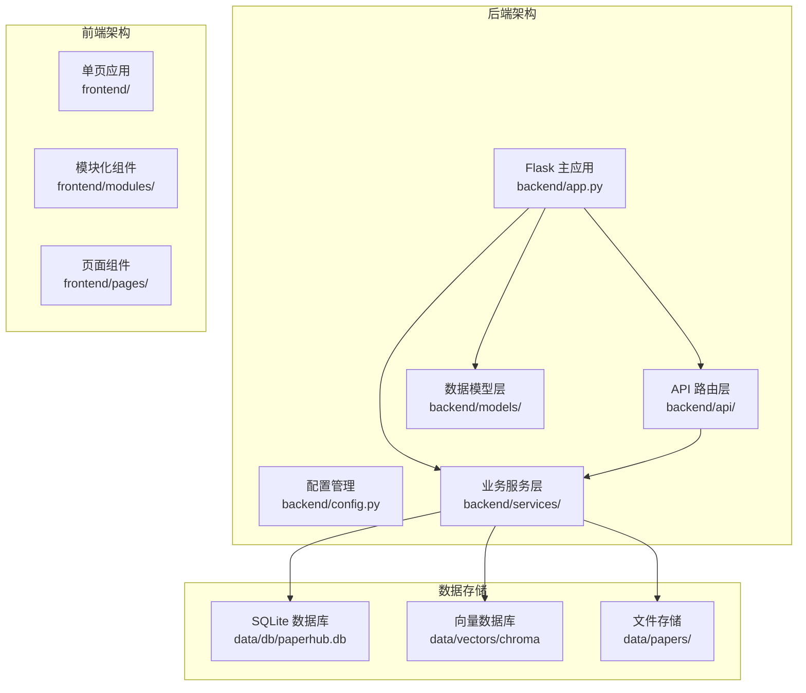
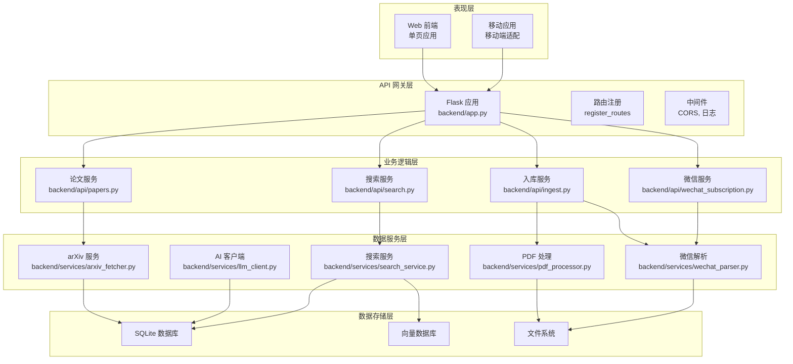
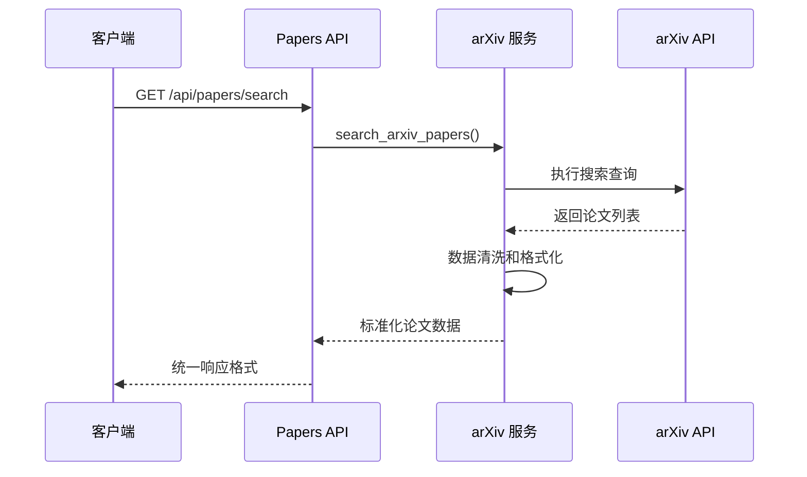
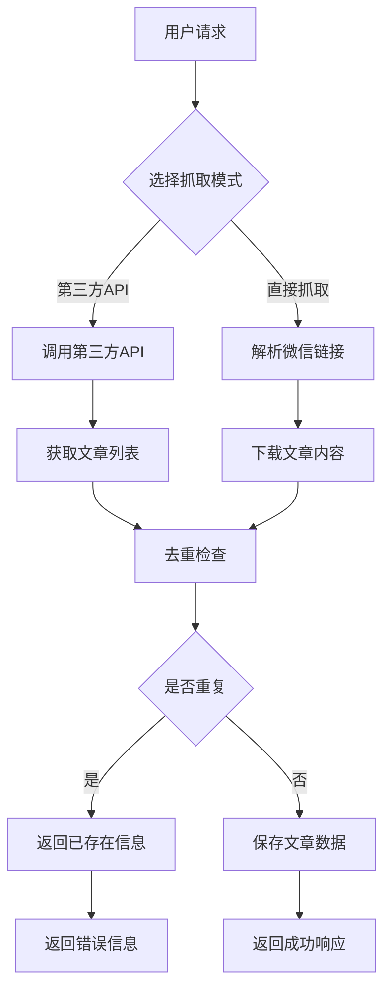
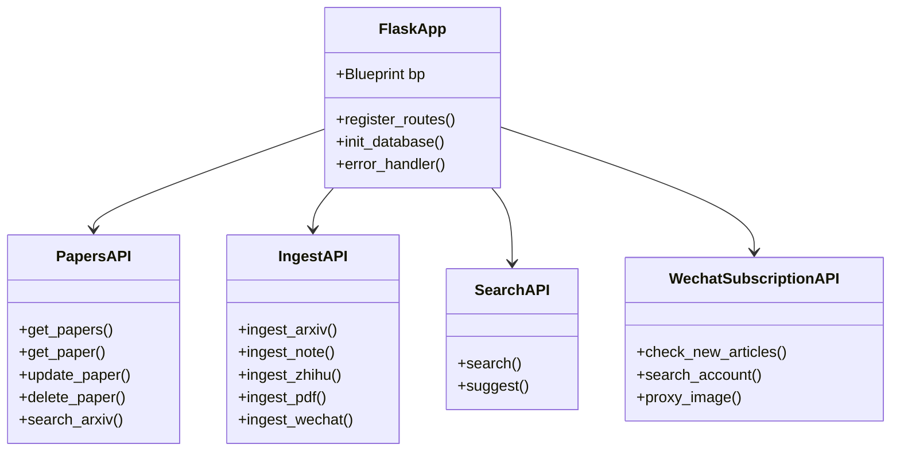
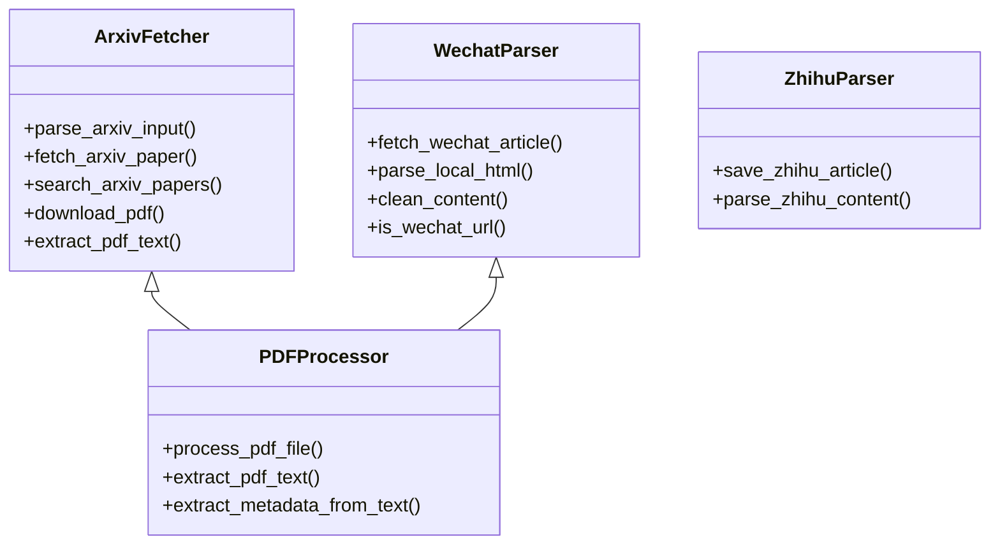
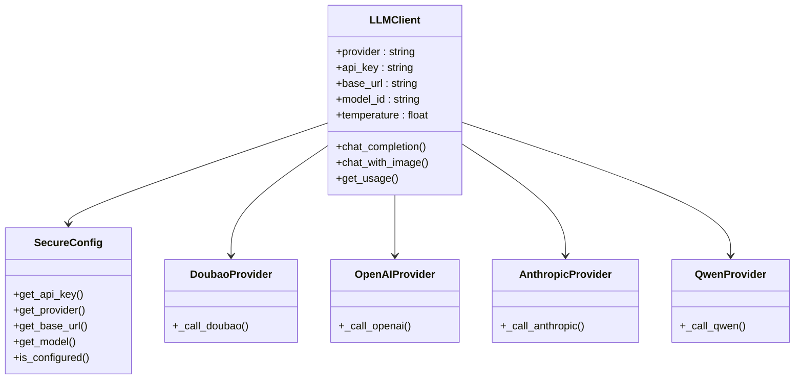
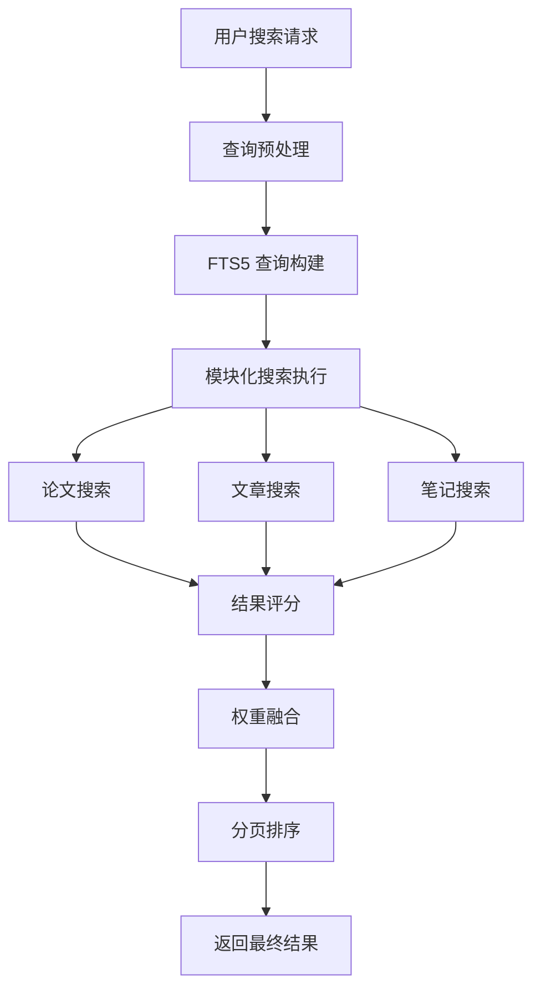
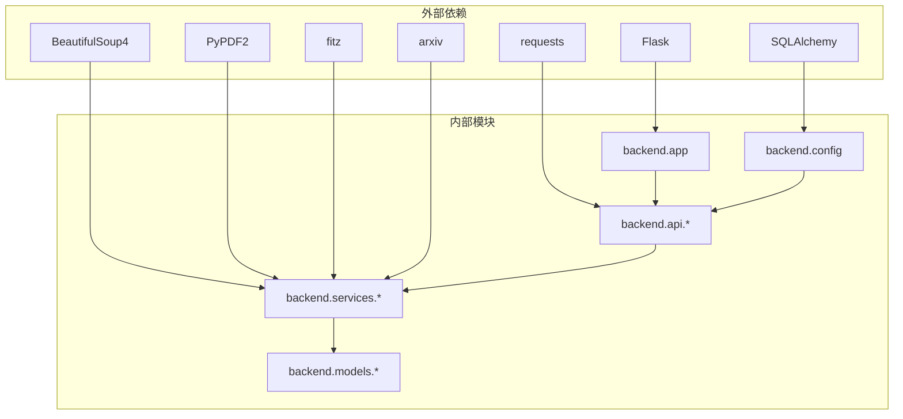
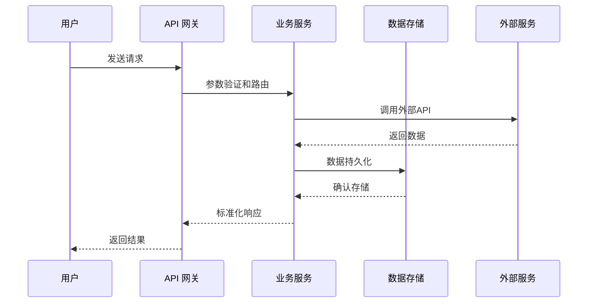

# 集成架构设计

<cite>
**本文档引用的文件**
- [backend/app.py](file://backend/app.py)
- [backend/config.py](file://backend/config.py)
- [specs/architecture.spec.md](file://specs/architecture.spec.md)
- [specs/api_response.spec.md](file://specs/api_response.spec.md)
- [backend/README.md](file://backend/README.md)
- [backend/api/papers.py](file://backend/api/papers.py)
- [backend/api/ingest.py](file://backend/api/ingest.py)
- [backend/api/wechat_subscription.py](file://backend/api/wechat_subscription.py)
- [backend/api/search.py](file://backend/api/search.py)
- [backend/services/arxiv_fetcher.py](file://backend/services/arxiv_fetcher.py)
- [backend/services/pdf_processor.py](file://backend/services/pdf_processor.py)
- [backend/services/llm_client.py](file://backend/services/llm_client.py)
- [backend/services/search_service.py](file://backend/services/search_service.py)
- [backend/services/wechat_parser.py](file://backend/services/wechat_parser.py)
</cite>

## 目录
1. [简介](#简介)
2. [项目结构](#项目结构)
3. [核心组件](#核心组件)
4. [架构概览](#架构概览)
5. [详细组件分析](#详细组件分析)
6. [依赖分析](#依赖分析)
7. [性能考虑](#性能考虑)
8. [故障排除指南](#故障排除指南)
9. [结论](#结论)

## 简介

PaperHub是一个多源数据集成平台，旨在统一管理和处理来自不同来源的学术论文、技术文章和笔记内容。该系统集成了arXiv API、微信公众号、知乎等多个外部服务，通过标准化的API接口实现数据源的透明接入。

本架构设计文档详细阐述了PaperHub的集成架构，包括多源数据集成的设计模式、统一API网关的设计原理、服务层的微服务化设计、异步任务处理机制以及第三方API的认证授权策略。

## 项目结构

PaperHub采用清晰的分层架构设计，严格按照模块化原则组织代码结构：

**图表来源**
- [backend/app.py:1-234](file://backend/app.py#L1-L234)
- [backend/config.py:1-134](file://backend/config.py#L1-L134)

**章节来源**
- [specs/architecture.spec.md:1-83](file://specs/architecture.spec.md#L1-L83)
- [backend/README.md:50-72](file://backend/README.md#L50-L72)

## 核心组件

### API 网关层

PaperHub采用Flask框架构建统一的API网关，所有外部请求都通过API网关进行路由分发。API网关的主要职责包括：

- **路由管理**：统一管理所有API端点，支持RESTful风格的URL设计
- **请求验证**：对所有请求参数进行验证和过滤
- **响应标准化**：统一API响应格式，确保前后端交互的一致性
- **错误处理**：集中处理各种异常情况，提供友好的错误信息

### 服务层架构

服务层是PaperHub的核心业务逻辑层，采用微服务化设计，每个服务负责特定的业务功能：

- **arXiv 数据服务**：处理arXiv论文的搜索、下载和解析
- **文件处理服务**：负责PDF文件的解析和元数据提取
- **微信解析服务**：处理微信公众号文章的抓取和内容清理
- **AI 服务集成**：统一管理各种大模型API的调用
- **搜索服务**：提供全文检索和智能搜索功能

### 数据存储层

PaperHub采用混合存储架构，结合关系型数据库和向量数据库：

- **关系型数据库**：使用SQLite存储结构化数据
- **向量数据库**：使用ChromaDB存储向量嵌入，支持高效的相似性搜索
- **文件存储**：本地文件系统存储PDF、HTML等文件内容

**章节来源**
- [specs/architecture.spec.md:21-49](file://specs/architecture.spec.md#L21-L49)
- [specs/api_response.spec.md:1-80](file://specs/api_response.spec.md#L1-L80)

## 架构概览

PaperHub的整体架构采用分层设计，确保各层之间的职责清晰分离：

**图表来源**
- [backend/app.py:140-158](file://backend/app.py#L140-L158)
- [backend/api/papers.py:1-822](file://backend/api/papers.py#L1-L822)
- [backend/api/ingest.py:1-1166](file://backend/api/ingest.py#L1-L1166)

## 详细组件分析

### 多源数据集成设计

PaperHub实现了统一的数据集成框架，支持多种数据源的透明接入：

#### arXiv API 集成

arXiv集成提供了完整的论文搜索和管理功能：

**图表来源**
- [backend/api/papers.py:475-552](file://backend/api/papers.py#L475-L552)
- [backend/services/arxiv_fetcher.py:123-227](file://backend/services/arxiv_fetcher.py#L123-L227)

#### 微信公众号集成

微信公众号集成了两种抓取模式：

1. **第三方API模式**：使用第三方服务获取公众号文章列表
2. **直接抓取模式**：直接解析微信公众号文章内容

**图表来源**
- [backend/api/wechat_subscription.py:329-429](file://backend/api/wechat_subscription.py#L329-L429)
- [backend/services/wechat_parser.py:326-601](file://backend/services/wechat_parser.py#L326-L601)

#### 知乎集成

知乎集成了两种导入模式：

1. **URL自动导入**：通过浏览器Cookie自动获取文章内容
2. **手动粘贴导入**：用户手动粘贴文章内容

**章节来源**
- [backend/api/ingest.py:350-465](file://backend/api/ingest.py#L350-L465)

### 统一API网关设计

PaperHub的API网关采用蓝图(BP)模式，每个业务模块都有独立的蓝图：

**图表来源**
- [backend/app.py:140-158](file://backend/app.py#L140-L158)
- [backend/api/papers.py:9-822](file://backend/api/papers.py#L9-L822)
- [backend/api/ingest.py:10-1166](file://backend/api/ingest.py#L10-L1166)

### 服务层微服务化设计

服务层采用模块化设计，每个服务都有明确的职责边界：

#### 数据解析服务

数据解析服务负责处理不同类型的数据源：

**图表来源**
- [backend/services/arxiv_fetcher.py:17-324](file://backend/services/arxiv_fetcher.py#L17-L324)
- [backend/services/wechat_parser.py:1-1197](file://backend/services/wechat_parser.py#L1-L1197)
- [backend/services/pdf_processor.py:1-170](file://backend/services/pdf_processor.py#L1-L170)

#### AI 服务集成

AI服务通过统一的客户端接口管理多个大模型提供商：

**图表来源**
- [backend/services/llm_client.py:198-590](file://backend/services/llm_client.py#L198-L590)

### 搜索服务架构

搜索服务采用FTS5全文搜索引擎，支持多模块联合搜索：

**图表来源**
- [backend/services/search_service.py:207-257](file://backend/services/search_service.py#L207-L257)

**章节来源**
- [backend/api/search.py:1-70](file://backend/api/search.py#L1-L70)
- [backend/services/search_service.py:1-314](file://backend/services/search_service.py#L1-L314)

## 依赖分析

PaperHub的依赖关系遵循清晰的层次结构，确保模块间的松耦合：

**图表来源**
- [backend/app.py:4-12](file://backend/app.py#L4-L12)
- [backend/config.py:6-8](file://backend/config.py#L6-L8)

### 数据流分析

PaperHub的数据流遵循标准化的处理流程：

**图表来源**
- [specs/api_response.spec.md:8-15](file://specs/api_response.spec.md#L8-L15)

**章节来源**
- [backend/config.py:85-134](file://backend/config.py#L85-L134)

## 性能考虑

### 数据库性能优化

PaperHub采用了多项数据库性能优化策略：

- **连接池管理**：使用SQLAlchemy连接池，配置合理的连接数和超时时间
- **索引优化**：为常用查询字段建立索引，特别是全文搜索相关的字段
- **查询优化**：使用原生SQL查询替代ORM的复杂查询，提高查询效率
- **缓存策略**：实现API响应缓存和LLM调用结果缓存

### 文件处理优化

对于大文件处理，PaperHub采用了流式处理和分块读取：

- **PDF流式读取**：使用PyPDF2的流式读取方式，避免内存溢出
- **分块处理**：对长文本进行分块处理，减少内存占用
- **增量存储**：支持增量文件处理，避免重复处理相同文件

### API性能监控

系统内置了详细的性能监控机制：

- **请求追踪**：记录每个请求的处理时间和错误信息
- **资源使用**：监控内存、CPU和磁盘使用情况
- **响应时间**：统计API响应时间分布
- **错误率监控**：实时监控API错误率和外部服务可用性

## 故障排除指南

### 常见问题诊断

#### 数据库连接问题

当遇到数据库连接问题时，可以检查以下方面：

1. **连接池配置**：确认连接池大小和超时设置是否合理
2. **并发访问**：检查是否存在过多的并发数据库连接
3. **锁竞争**：监控数据库锁等待情况，避免死锁

#### 外部服务调用失败

针对外部服务调用失败，建议：

1. **网络连接**：检查网络连接稳定性和防火墙设置
2. **API限制**：监控API调用频率，避免触发限流
3. **重试机制**：实现指数退避的重试策略

#### 文件处理异常

文件处理异常的排查步骤：

1. **文件权限**：确认文件读写权限设置正确
2. **磁盘空间**：检查磁盘空间是否充足
3. **文件格式**：验证文件格式是否符合预期

**章节来源**
- [backend/app.py:70-89](file://backend/app.py#L70-L89)

## 结论

PaperHub的集成架构设计体现了现代微服务架构的最佳实践，通过清晰的分层设计、标准化的API接口和灵活的服务组合，实现了多源数据的统一管理和高效处理。

该架构的主要优势包括：

1. **模块化设计**：每个服务都有明确的职责边界，便于维护和扩展
2. **标准化接口**：统一的API响应格式和错误处理机制
3. **可扩展性**：支持新的数据源和服务的快速集成
4. **性能优化**：针对大数据量和高并发场景进行了专门优化
5. **可靠性保障**：完善的错误处理和监控机制

未来的发展方向包括：

- **容器化部署**：支持Docker容器化部署，提高部署灵活性
- **消息队列集成**：引入消息队列处理异步任务，提高系统吞吐量
- **分布式缓存**：实现分布式缓存，进一步提升性能
- **监控告警**：完善监控告警体系，提高运维效率

通过持续的架构优化和技术升级，PaperHub将成为一个功能完善、性能优异的多源数据集成平台。