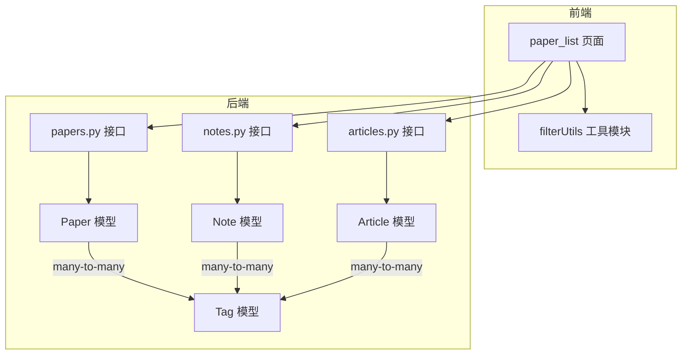
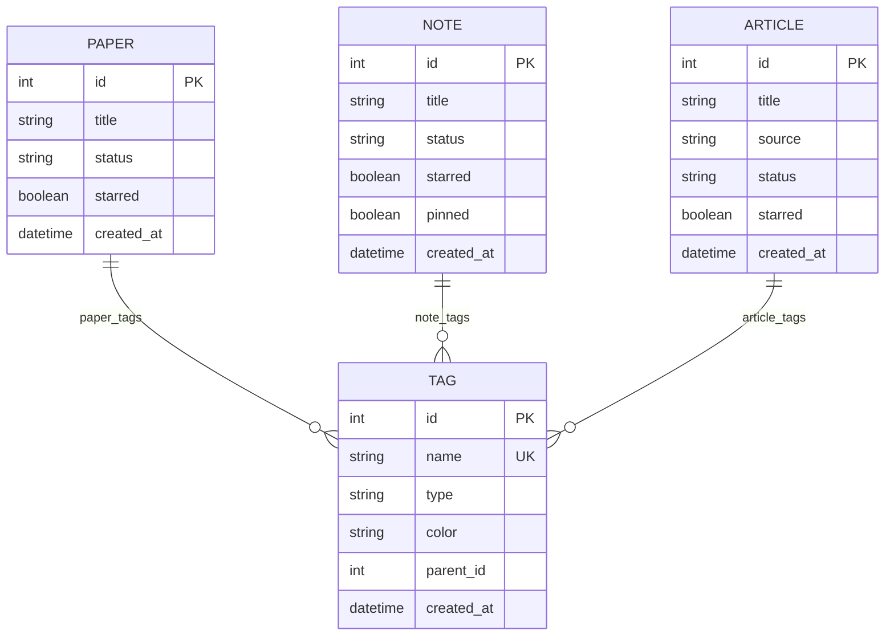
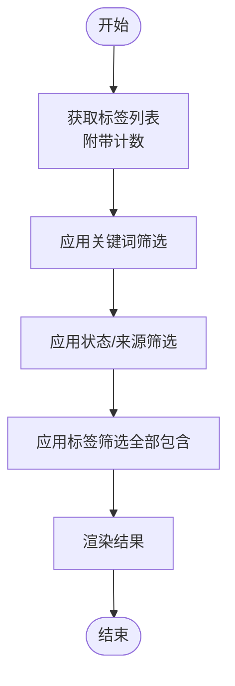
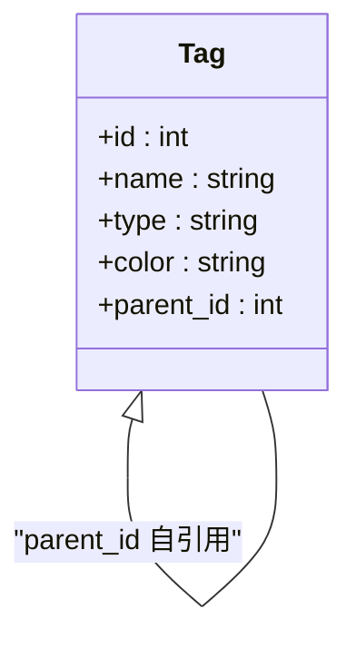
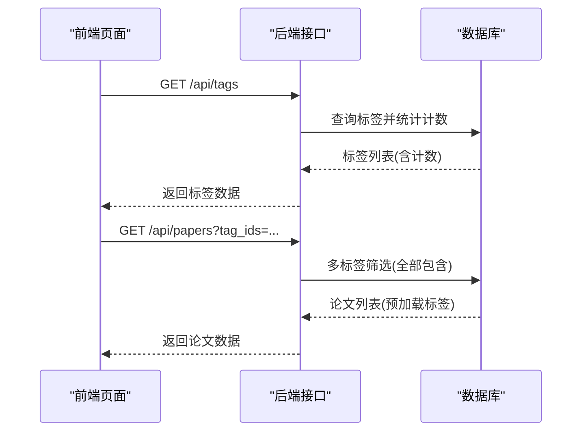
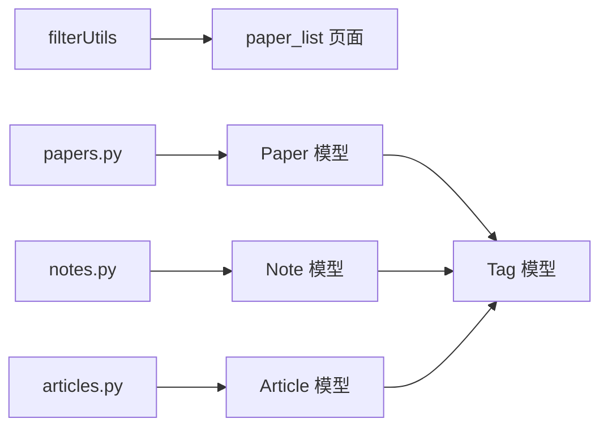

# 标签系统设计

<cite>
**本文档引用的文件**
- [specs/backend/models/tag.yml](file://specs/backend/models/tag.yml)
- [specs/backend/models/paper.yml](file://specs/backend/models/paper.yml)
- [specs/backend/models/note.yml](file://specs/backend/models/note.yml)
- [specs/backend/models/article.yml](file://specs/backend/models/article.yml)
- [specs/backend/api/papers.yml](file://specs/backend/api/papers.yml)
- [specs/backend/api/notes.yml](file://specs/backend/api/notes.yml)
- [specs/backend/api/articles.yml](file://specs/backend/api/articles.yml)
- [specs/backend/services/search_service.yml](file://specs/backend/services/search_service.yml)
- [specs/frontend/pages/paper_list.yml](file://specs/frontend/pages/paper_list.yml)
- [specs/frontend/modules/filterUtils.yml](file://specs/frontend/modules/filterUtils.yml)
- [backend/api/papers.py](file://backend/api/papers.py)
- [backend/api/notes.py](file://backend/api/notes.py)
- [backend/api/articles.py](file://backend/api/articles.py)
- [backend/models/paper.py](file://backend/models/paper.py)
</cite>

## 目录
1. [引言](#引言)
2. [项目结构](#项目结构)
3. [核心组件](#核心组件)
4. [架构总览](#架构总览)
5. [详细组件分析](#详细组件分析)
6. [依赖分析](#依赖分析)
7. [性能考虑](#性能考虑)
8. [故障排查指南](#故障排查指南)
9. [结论](#结论)
10. [附录](#附录)

## 引言
本设计文档围绕 PaperHub 的标签系统展开，系统性阐述标签架构的设计原理、多级标签支持与标签关联机制，并统一说明论文库、文章库、笔记库三类实体的标签体系如何协同工作。文档覆盖标签筛选功能的实现细节、实时统计机制与交互设计，同时给出扩展性、性能优化与用户体验方面的建议，最后文档化标签数据模型、查询优化与前端展示策略。

## 项目结构
标签系统横跨后端 API、数据模型与前端页面/工具模块：
- 后端模型层定义标签与三类实体的多对多关系及索引
- 后端 API 层提供标签的增删改查、批量导入、统计与筛选接口
- 前端页面通过筛选工具模块实现标签筛选、计数与交互
- 搜索服务支持跨模块的统一检索，便于标签驱动的发现



**图表来源**
- [specs/backend/models/tag.yml:44-59](file://specs/backend/models/tag.yml#L44-L59)
- [specs/backend/models/paper.yml:130-145](file://specs/backend/models/paper.yml#L130-L145)
- [specs/backend/models/note.yml:92-107](file://specs/backend/models/note.yml#L92-L107)
- [specs/backend/models/article.yml:91-106](file://specs/backend/models/article.yml#L91-L106)
- [specs/backend/api/papers.yml:254-327](file://specs/backend/api/papers.yml#L254-L327)
- [specs/backend/api/notes.yml:249-317](file://specs/backend/api/notes.yml#L249-L317)
- [specs/backend/api/articles.yml:219-266](file://specs/backend/api/articles.yml#L219-L266)

**章节来源**
- [specs/backend/models/tag.yml:1-68](file://specs/backend/models/tag.yml#L1-L68)
- [specs/backend/models/paper.yml:1-164](file://specs/backend/models/paper.yml#L1-L164)
- [specs/backend/models/note.yml:1-115](file://specs/backend/models/note.yml#L1-L115)
- [specs/backend/models/article.yml:1-114](file://specs/backend/models/article.yml#L1-L114)
- [specs/backend/api/papers.yml:1-404](file://specs/backend/api/papers.yml#L1-L404)
- [specs/backend/api/notes.yml:1-378](file://specs/backend/api/notes.yml#L1-L378)
- [specs/backend/api/articles.yml:1-266](file://specs/backend/api/articles.yml#L1-L266)
- [specs/frontend/pages/paper_list.yml:1-58](file://specs/frontend/pages/paper_list.yml#L1-L58)
- [specs/frontend/modules/filterUtils.yml:1-215](file://specs/frontend/modules/filterUtils.yml#L1-L215)

## 核心组件
- 标签模型（Tag）：支持多级父子关系、类型与颜色标注，提供与论文、笔记、文章的多对多关联
- 实体模型（Paper/Note/Article）：均通过中间表与标签建立多对多关系，支持标签计数与筛选
- 后端 API：提供标签的创建、删除、批量导入、统计与筛选接口；论文库接口还提供标签计数排序
- 前端工具：提供关键词、状态、来源与标签的筛选与计数工具函数，支持“全部包含”的标签筛选逻辑
- 搜索服务：支持跨模块统一检索，便于标签驱动的发现与高亮

**章节来源**
- [specs/backend/models/tag.yml:17-37](file://specs/backend/models/tag.yml#L17-L37)
- [specs/backend/models/paper.yml:130-145](file://specs/backend/models/paper.yml#L130-L145)
- [specs/backend/models/note.yml:92-107](file://specs/backend/models/note.yml#L92-L107)
- [specs/backend/models/article.yml:91-106](file://specs/backend/models/article.yml#L91-L106)
- [specs/backend/api/papers.yml:254-327](file://specs/backend/api/papers.yml#L254-L327)
- [specs/frontend/modules/filterUtils.yml:66-81](file://specs/frontend/modules/filterUtils.yml#L66-L81)

## 架构总览
标签系统采用“统一标签模型 + 多实体关联”的架构，三类实体共享同一套标签能力，实现跨库统一筛选与统计。后端通过中间表维护多对多关系，前端通过筛选工具模块实现标签筛选与计数，搜索服务提供跨模块检索能力。



**图表来源**
- [specs/backend/models/tag.yml:44-59](file://specs/backend/models/tag.yml#L44-L59)
- [specs/backend/models/paper.yml:130-145](file://specs/backend/models/paper.yml#L130-L145)
- [specs/backend/models/note.yml:92-107](file://specs/backend/models/note.yml#L92-L107)
- [specs/backend/models/article.yml:91-106](file://specs/backend/models/article.yml#L91-L106)

## 详细组件分析

### 数据模型与关系设计
- 标签模型（Tag）
  - 字段：主键、名称（唯一）、类型（tech/conference/custom）、颜色、父标签ID（自引用）、创建时间
  - 关系：与 Paper/Note/Article 通过中间表建立多对多关系
  - 索引：名称唯一索引、类型索引、父标签索引
- 实体模型（Paper/Note/Article）
  - 均包含与 Tag 的多对多关系，支持标签计数与筛选
  - Paper/Note/Article 的索引覆盖常见筛选字段（如状态、标星、来源等）

```mermaid
classDiagram
class Tag {
+id : int
+name : string
+type : string
+color : string
+parent_id : int
+created_at : datetime
}
class Paper {
+id : int
+title : string
+status : string
+starred : boolean
+created_at : datetime
}
class Note {
+id : int
+title : string
+status : string
+starred : boolean
+pinned : boolean
+created_at : datetime
}
class Article {
+id : int
+title : string
+source : string
+status : string
+starred : boolean
+created_at : datetime
}
Paper "many-to-many" --|| Tag : "paper_tags"
Note "many-to-many" --|| Tag : "note_tags"
Article "many-to-many" --|| Tag : "article_tags"
```

**图表来源**
- [specs/backend/models/tag.yml:17-37](file://specs/backend/models/tag.yml#L17-L37)
- [specs/backend/models/paper.yml:130-145](file://specs/backend/models/paper.yml#L130-L145)
- [specs/backend/models/note.yml:92-107](file://specs/backend/models/note.yml#L92-L107)
- [specs/backend/models/article.yml:91-106](file://specs/backend/models/article.yml#L91-L106)

**章节来源**
- [specs/backend/models/tag.yml:1-68](file://specs/backend/models/tag.yml#L1-L68)
- [specs/backend/models/paper.yml:130-145](file://specs/backend/models/paper.yml#L130-L145)
- [specs/backend/models/note.yml:92-107](file://specs/backend/models/note.yml#L92-L107)
- [specs/backend/models/article.yml:91-106](file://specs/backend/models/article.yml#L91-L106)

### 标签筛选与统计实现
- 前端筛选工具
  - 标签筛选：支持“全部包含”逻辑，即仅返回同时包含所有选中标签的条目
  - 标签计数：计算某标签被多少条目引用，用于筛选器的计数展示
  - 应用顺序：关键词筛选 → 状态/来源筛选 → 标签筛选
- 后端统计接口
  - 获取所有标签并附带计数，按计数降序、名称升序排序
  - 论文库接口支持按 tag_ids 参数进行筛选，且关联预加载标签以提升前端渲染效率



**图表来源**
- [specs/frontend/modules/filterUtils.yml:66-81](file://specs/frontend/modules/filterUtils.yml#L66-L81)
- [specs/frontend/modules/filterUtils.yml:95-108](file://specs/frontend/modules/filterUtils.yml#L95-L108)
- [specs/backend/api/papers.yml:254-264](file://specs/backend/api/papers.yml#L254-L264)

**章节来源**
- [specs/frontend/modules/filterUtils.yml:1-215](file://specs/frontend/modules/filterUtils.yml#L1-L215)
- [specs/backend/api/papers.yml:254-264](file://specs/backend/api/papers.yml#L254-L264)

### 多级标签支持与层级关系
- Tag 模型通过 parent_id 字段支持自引用，形成多级标签树
- 前端页面与工具模块未显式暴露层级选择器，但后端模型已具备多级能力，可用于后续扩展（如层级下钻、折叠/展开）



**图表来源**
- [specs/backend/models/tag.yml:32-37](file://specs/backend/models/tag.yml#L32-L37)

**章节来源**
- [specs/backend/models/tag.yml:32-37](file://specs/backend/models/tag.yml#L32-L37)

### 三大模块的统一设计与实现策略
- 统一模型：Paper/Note/Article 均通过中间表与 Tag 建立多对多关系，保证标签能力在三类实体中一致
- 统一接口：三类实体均提供“添加标签/移除标签”的接口，支持按名称或 ID 操作
- 统一筛选：前端工具模块提供通用的标签筛选与计数函数，可直接复用到不同页面
- 统一统计：后端提供标签计数接口，便于在论文库页面展示标签分布



**图表来源**
- [specs/backend/api/papers.yml:254-264](file://specs/backend/api/papers.yml#L254-L264)
- [specs/backend/api/papers.yml:39-48](file://specs/backend/api/papers.yml#L39-L48)
- [specs/frontend/pages/paper_list.yml:44-52](file://specs/frontend/pages/paper_list.yml#L44-L52)

**章节来源**
- [specs/backend/api/papers.yml:39-48](file://specs/backend/api/papers.yml#L39-L48)
- [specs/backend/api/notes.yml:249-317](file://specs/backend/api/notes.yml#L249-L317)
- [specs/backend/api/articles.yml:219-266](file://specs/backend/api/articles.yml#L219-L266)
- [specs/frontend/pages/paper_list.yml:44-52](file://specs/frontend/pages/paper_list.yml#L44-L52)

### 标签交互设计与用户体验
- 标签展示：论文卡片内支持标签展示与移除，新增标签通过回车快速添加
- 筛选交互：侧边栏筛选器支持点击切换状态/来源/标签，标签计数实时更新
- 空状态与错误处理：无数据时显示空状态提示；网络错误保留筛选条件，支持重试
- 标星与排序：卡片内支持标星与排序切换，增强个人化体验

**章节来源**
- [specs/frontend/pages/paper_list.yml:14-58](file://specs/frontend/pages/paper_list.yml#L14-L58)

### 标签数据模型与查询优化
- 数据模型
  - Tag：唯一名称、类型、颜色、父标签ID、创建时间
  - Paper/Note/Article：与 Tag 的多对多关系通过中间表维护
- 查询优化
  - 标签计数：后端聚合统计并按计数排序，减少前端计算开销
  - 关联预加载：论文列表接口预加载标签，避免 N+1 查询
  - 索引策略：Tag 表的 name/type/parent_id 索引，Paper/Note/Article 表的常用筛选字段索引

**章节来源**
- [specs/backend/models/tag.yml:60-68](file://specs/backend/models/tag.yml#L60-L68)
- [specs/backend/models/paper.yml:151-164](file://specs/backend/models/paper.yml#L151-L164)
- [specs/backend/models/note.yml:108-115](file://specs/backend/models/note.yml#L108-L115)
- [specs/backend/models/article.yml:107-114](file://specs/backend/models/article.yml#L107-L114)
- [specs/backend/api/papers.yml:102-103](file://specs/backend/api/papers.yml#L102-L103)

### 前端展示策略
- 标签计数：根据后端返回的计数动态更新筛选器
- 标签筛选：支持多标签“全部包含”，避免误筛选
- 样式与交互：状态/来源/标签的选中态样式统一，标签移除按钮清晰可见

**章节来源**
- [specs/frontend/modules/filterUtils.yml:188-211](file://specs/frontend/modules/filterUtils.yml#L188-L211)
- [specs/frontend/pages/paper_list.yml:40-43](file://specs/frontend/pages/paper_list.yml#L40-L43)

## 依赖分析
- 模块耦合
  - 前端页面依赖筛选工具模块；筛选工具模块不依赖具体页面，保持高内聚低耦合
  - 后端 API 依赖模型层；模型层不反向依赖 API，避免循环依赖
- 外部依赖
  - 搜索服务提供跨模块检索能力，与标签系统配合实现“标签驱动发现”
- 关键依赖链
  - 前端筛选器 → 后端标签统计/筛选接口 → 数据库中间表查询



**图表来源**
- [specs/frontend/modules/filterUtils.yml:1-215](file://specs/frontend/modules/filterUtils.yml#L1-L215)
- [specs/frontend/pages/paper_list.yml:1-58](file://specs/frontend/pages/paper_list.yml#L1-L58)
- [specs/backend/api/papers.yml:1-404](file://specs/backend/api/papers.yml#L1-L404)
- [specs/backend/api/notes.yml:1-378](file://specs/backend/api/notes.yml#L1-L378)
- [specs/backend/api/articles.yml:1-266](file://specs/backend/api/articles.yml#L1-L266)
- [specs/backend/models/paper.yml:130-145](file://specs/backend/models/paper.yml#L130-L145)
- [specs/backend/models/note.yml:92-107](file://specs/backend/models/note.yml#L92-L107)
- [specs/backend/models/article.yml:91-106](file://specs/backend/models/article.yml#L91-L106)

**章节来源**
- [specs/frontend/modules/filterUtils.yml:1-215](file://specs/frontend/modules/filterUtils.yml#L1-L215)
- [specs/backend/api/papers.yml:1-404](file://specs/backend/api/papers.yml#L1-L404)
- [specs/backend/api/notes.yml:1-378](file://specs/backend/api/notes.yml#L1-L378)
- [specs/backend/api/articles.yml:1-266](file://specs/backend/api/articles.yml#L1-L266)
- [specs/backend/models/paper.yml:130-145](file://specs/backend/models/paper.yml#L130-L145)
- [specs/backend/models/note.yml:92-107](file://specs/backend/models/note.yml#L92-L107)
- [specs/backend/models/article.yml:91-106](file://specs/backend/models/article.yml#L91-L106)

## 性能考虑
- 查询层面
  - 使用中间表进行多对多关联，避免冗余字段
  - 论文列表接口预加载标签，减少额外查询
  - 标签统计通过聚合查询一次性完成，避免多次扫描
- 索引层面
  - Tag 表的 name/type/parent_id 建立索引，加速标签查询与层级遍历
  - Paper/Note/Article 表的常用筛选字段建立索引，提升筛选性能
- 前端层面
  - 标签筛选采用“全部包含”逻辑，减少不必要的数据传输
  - 计数与筛选分离，避免重复计算

**章节来源**
- [specs/backend/models/tag.yml:60-68](file://specs/backend/models/tag.yml#L60-L68)
- [specs/backend/models/paper.yml:151-164](file://specs/backend/models/paper.yml#L151-L164)
- [specs/backend/models/note.yml:108-115](file://specs/backend/models/note.yml#L108-L115)
- [specs/backend/models/article.yml:107-114](file://specs/backend/models/article.yml#L107-L114)
- [specs/backend/api/papers.yml:102-103](file://specs/backend/api/papers.yml#L102-L103)

## 故障排查指南
- 标签计数异常
  - 检查中间表是否正确维护，确保标签与实体的关联无遗漏
  - 核对聚合查询逻辑，确认计数字段与排序规则
- 标签筛选无效
  - 确认前端筛选工具模块的“全部包含”逻辑是否生效
  - 检查后端接口是否正确解析 tag_ids 参数并执行多标签筛选
- 新增标签失败
  - 检查标签名称唯一性约束，避免重复创建
  - 确认后端接口在标签不存在时的自动创建逻辑
- 删除标签影响范围
  - 确认删除标签不会影响实体内容，仅解除关联
  - 若需彻底清理，需在业务层补充额外清理逻辑

**章节来源**
- [specs/backend/api/papers.yml:254-327](file://specs/backend/api/papers.yml#L254-L327)
- [specs/backend/api/notes.yml:249-317](file://specs/backend/api/notes.yml#L249-L317)
- [specs/backend/api/articles.yml:219-266](file://specs/backend/api/articles.yml#L219-L266)

## 结论
PaperHub 的标签系统通过统一的标签模型与多实体关联，实现了论文库、文章库、笔记库的标签能力一体化。前端筛选工具模块与后端统计/筛选接口协同，提供了高效、直观的标签筛选与统计体验。未来可在多级标签可视化、标签推荐与标签合并等方面进一步扩展，持续提升系统的可用性与可维护性。

## 附录
- 相关接口与模型定义可参考以下规格文件：
  - [标签模型定义:1-68](file://specs/backend/models/tag.yml#L1-L68)
  - [论文模型定义:1-164](file://specs/backend/models/paper.yml#L1-L164)
  - [笔记模型定义:1-115](file://specs/backend/models/note.yml#L1-L115)
  - [文章模型定义:1-114](file://specs/backend/models/article.yml#L1-L114)
  - [论文库 API 规格:1-404](file://specs/backend/api/papers.yml#L1-L404)
  - [笔记库 API 规格:1-378](file://specs/backend/api/notes.yml#L1-L378)
  - [文章库 API 规格:1-266](file://specs/backend/api/articles.yml#L1-L266)
  - [搜索服务规格:1-28](file://specs/backend/services/search_service.yml#L1-L28)
  - [论文库页面规格:1-58](file://specs/frontend/pages/paper_list.yml#L1-L58)
  - [筛选工具模块规格:1-215](file://specs/frontend/modules/filterUtils.yml#L1-L215)