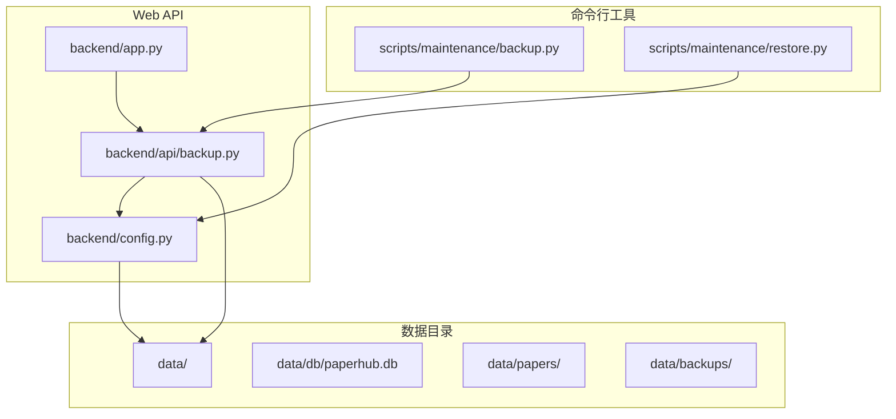
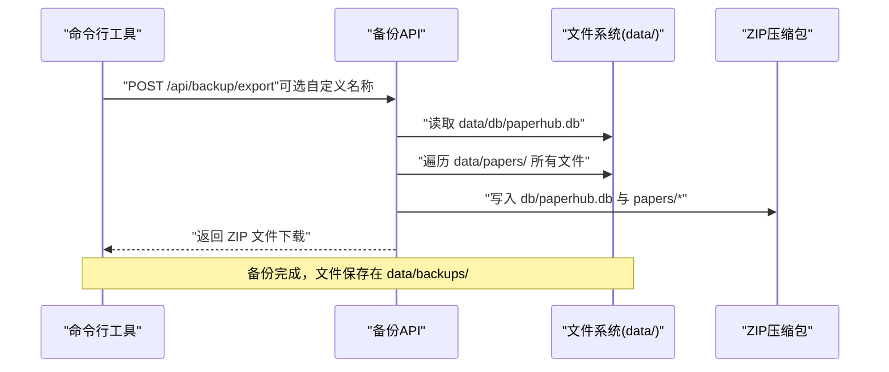
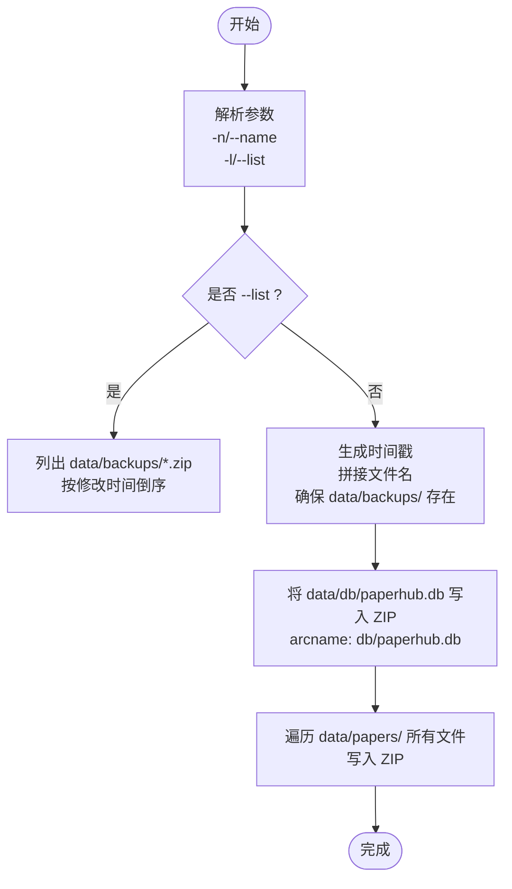
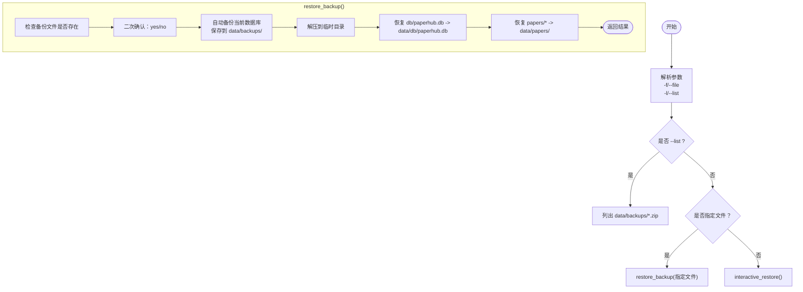
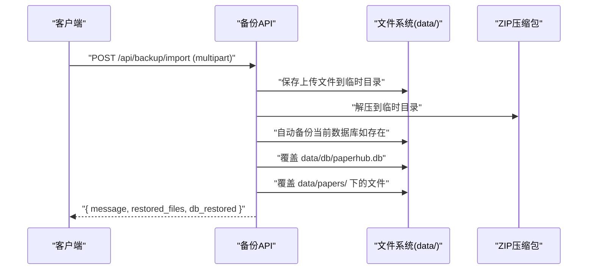
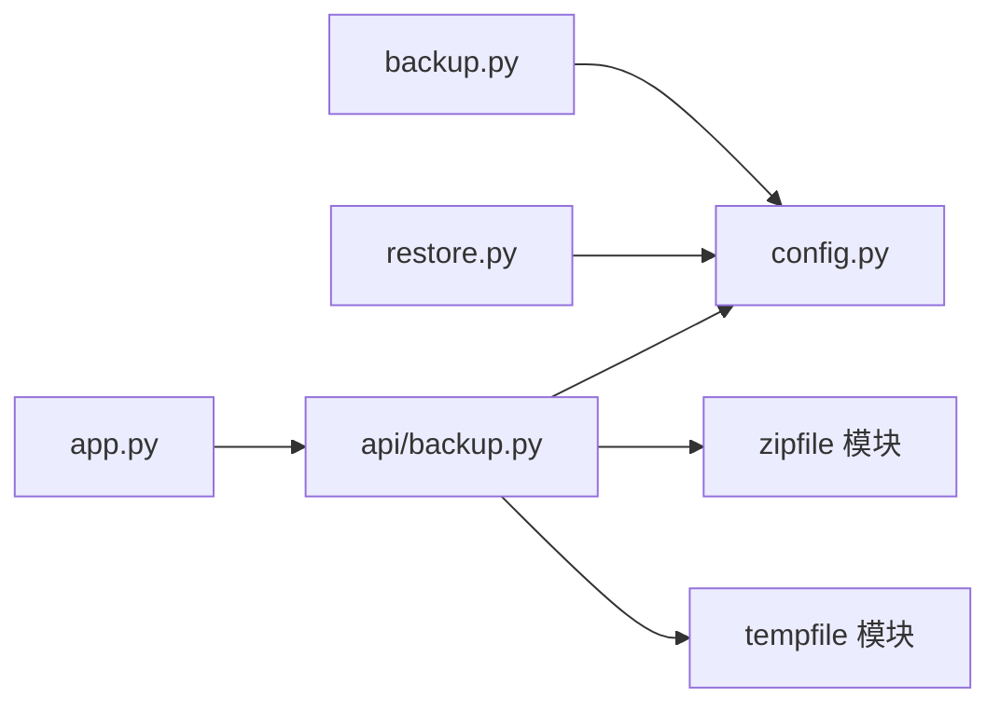

# 数据备份和恢复

<cite>
**本文引用的文件**   
- [scripts/maintenance/backup.py](file://scripts/maintenance/backup.py)
- [scripts/maintenance/restore.py](file://scripts/maintenance/restore.py)
- [backend/api/backup.py](file://backend/api/backup.py)
- [specs/backend/api/backup.yml](file://specs/backend/api/backup.yml)
- [backend/config.py](file://backend/config.py)
- [backend/app.py](file://backend/app.py)
- [README.md](file://README.md)
</cite>

## 目录
1. [简介](#简介)
2. [项目结构](#项目结构)
3. [核心组件](#核心组件)
4. [架构概览](#架构概览)
5. [详细组件分析](#详细组件分析)
6. [依赖分析](#依赖分析)
7. [性能考虑](#性能考虑)
8. [故障排查指南](#故障排查指南)
9. [结论](#结论)
10. [附录](#附录)

## 简介
本指南面向 PaperHub 用户与运维人员，提供完整的数据备份与恢复操作手册。内容涵盖：
- 备份策略与恢复流程
- 备份内容与位置管理
- 备份文件命名规则
- 命令行工具使用方法（创建备份、列出备份、自定义备份名称等）
- 恢复流程步骤与注意事项（数据完整性验证、恢复前准备）
- 备份脚本参数、错误处理机制与最佳实践
- 备份频率建议、存储空间管理与生命周期管理

## 项目结构
PaperHub 的数据备份与恢复能力由以下模块协同实现：
- 命令行工具：scripts/maintenance/backup.py、scripts/maintenance/restore.py
- Web API：backend/api/backup.py（Flask Blueprint）
- 配置与路径：backend/config.py
- API 规约：specs/backend/api/backup.yml
- 应用注册：backend/app.py

图表来源
- [scripts/maintenance/backup.py:1-121](file://scripts/maintenance/backup.py#L1-L121)
- [scripts/maintenance/restore.py:1-166](file://scripts/maintenance/restore.py#L1-L166)
- [backend/api/backup.py:1-249](file://backend/api/backup.py#L1-L249)
- [backend/config.py:1-134](file://backend/config.py#L1-L134)
- [backend/app.py:140-158](file://backend/app.py#L140-L158)

章节来源
- [README.md:383-481](file://README.md#L383-L481)
- [backend/config.py:18-32](file://backend/config.py#L18-L32)

## 核心组件
- 备份命令行工具：支持自动命名、自定义名称、列出备份
- 恢复命令行工具：支持交互式选择、指定文件恢复、列出可用备份
- 备份 API：提供导出、导入、列表、删除备份的 HTTP 接口
- 配置模块：统一管理数据目录、备份目录、数据库路径
- 应用注册：将备份蓝图注册到 Flask 应用

章节来源
- [scripts/maintenance/backup.py:47-76](file://scripts/maintenance/backup.py#L47-L76)
- [scripts/maintenance/restore.py:57-123](file://scripts/maintenance/restore.py#L57-L123)
- [backend/api/backup.py:46-91](file://backend/api/backup.py#L46-L91)
- [backend/api/backup.py:93-171](file://backend/api/backup.py#L93-L171)
- [backend/api/backup.py:173-214](file://backend/api/backup.py#L173-L214)
- [backend/api/backup.py:217-249](file://backend/api/backup.py#L217-L249)
- [backend/config.py:18-32](file://backend/config.py#L18-L32)
- [backend/app.py:140-158](file://backend/app.py#L140-L158)

## 架构概览
备份与恢复的总体流程如下：
- 备份：从 data/db/paperhub.db 与 data/papers/ 目录打包为 ZIP，保存至 data/backups/
- 恢复：从 ZIP 中解压并覆盖 data/db/paperhub.db 与 data/papers/ 目录
- Web API：提供 /api/backup/export、/api/backup/import、/api/backup/list、/api/backup/delete

图表来源
- [backend/api/backup.py:46-91](file://backend/api/backup.py#L46-L91)
- [backend/config.py:18-32](file://backend/config.py#L18-L32)

章节来源
- [specs/backend/api/backup.yml:5-24](file://specs/backend/api/backup.yml#L5-L24)
- [backend/api/backup.py:46-91](file://backend/api/backup.py#L46-L91)

## 详细组件分析

### 备份命令行工具
- 功能
  - 创建备份：自动命名（paperhub_backup_YYYYMMDD_HHMMSS.zip）或自定义名称
  - 列出备份：按时间倒序显示 data/backups/ 下的 .zip 文件
- 备份内容
  - data/db/paperhub.db
  - data/papers/ 下的所有文件
- 备份位置
  - data/backups/
- 命名规则
  - 自动：paperhub_backup_YYYYMMDD_HHMMSS.zip
  - 自定义：{自定义名称}_YYYYMMDD_HHMMSS.zip

图表来源
- [scripts/maintenance/backup.py:47-76](file://scripts/maintenance/backup.py#L47-L76)
- [scripts/maintenance/backup.py:79-104](file://scripts/maintenance/backup.py#L79-L104)

章节来源
- [scripts/maintenance/backup.py:1-16](file://scripts/maintenance/backup.py#L1-L16)
- [scripts/maintenance/backup.py:47-76](file://scripts/maintenance/backup.py#L47-L76)
- [scripts/maintenance/backup.py:79-104](file://scripts/maintenance/backup.py#L79-L104)

### 恢复命令行工具
- 功能
  - 交互式选择：列出可用备份并选择编号恢复
  - 指定文件恢复：通过 -f 指定备份文件路径
  - 列出可用备份：按时间倒序显示 data/backups/ 下的 .zip
- 恢复前准备
  - 自动备份当前数据库：在 data/backups/ 下生成 auto_backup_before_restore_YYYYMMDD_HHMMSS.db
- 恢复过程
  - 解压备份到临时目录
  - 恢复数据库：覆盖 data/db/paperhub.db
  - 恢复 papers 文件：覆盖 data/papers/ 下的文件
- 注意事项
  - 恢复会覆盖现有数据，务必确认
  - 恢复前会进行二次确认

图表来源
- [scripts/maintenance/restore.py:57-123](file://scripts/maintenance/restore.py#L57-L123)
- [scripts/maintenance/restore.py:126-161](file://scripts/maintenance/restore.py#L126-L161)

章节来源
- [scripts/maintenance/restore.py:1-12](file://scripts/maintenance/restore.py#L1-L12)
- [scripts/maintenance/restore.py:57-123](file://scripts/maintenance/restore.py#L57-L123)
- [scripts/maintenance/restore.py:126-161](file://scripts/maintenance/restore.py#L126-L161)

### 备份 API（Web）
- 导出备份
  - 方法：POST /api/backup/export
  - 输入：可选 JSON { filename: "自定义名称" }
  - 输出：ZIP 文件（下载）
  - 命名规则：若传入 filename，则为 {filename}_YYYYMMDD_HHMMSS.zip；否则为 paperhub_backup_YYYYMMDD_HHMMSS.zip
- 导入备份
  - 方法：POST /api/backup/import（multipart/form-data，字段 backup_file）
  - 行为：覆盖式恢复，恢复前自动备份当前数据库
  - 返回：{ message, restored_files, db_restored }
- 列出备份
  - 方法：GET /api/backup/list
  - 返回：[{ filename, size, created_at }, ...]（按创建时间倒序）
- 删除备份
  - 方法：POST /api/backup/delete
  - 输入：{ filename: "文件名" }
  - 规则：禁止路径遍历（不允许包含 .. / \）

图表来源
- [backend/api/backup.py:93-171](file://backend/api/backup.py#L93-L171)
- [specs/backend/api/backup.yml:25-51](file://specs/backend/api/backup.yml#L25-L51)

章节来源
- [backend/api/backup.py:46-91](file://backend/api/backup.py#L46-L91)
- [backend/api/backup.py:93-171](file://backend/api/backup.py#L93-L171)
- [backend/api/backup.py:173-214](file://backend/api/backup.py#L173-L214)
- [backend/api/backup.py:217-249](file://backend/api/backup.py#L217-L249)
- [specs/backend/api/backup.yml:5-24](file://specs/backend/api/backup.yml#L5-L24)
- [specs/backend/api/backup.yml:25-51](file://specs/backend/api/backup.yml#L25-L51)
- [specs/backend/api/backup.yml:52-92](file://specs/backend/api/backup.yml#L52-L92)

### 配置与路径
- 数据目录
  - BASE_DIR：PaperHub 项目根目录
  - DATA_DIR：data/
  - DB_DIR：data/db/
  - PAPERS_DIR：data/papers/
  - BACKUPS_DIR：data/backups/
- 目录初始化
  - 确保 data/papers/、data/db/、data/backups/、data/vectors/ 及其子目录存在

章节来源
- [backend/config.py:18-32](file://backend/config.py#L18-L32)

### 应用注册
- 备份蓝图注册到 Flask 应用，前缀为 /api
- 初始化数据库与会话管理

章节来源
- [backend/app.py:140-158](file://backend/app.py#L140-L158)

## 依赖分析
- 备份命令行工具依赖配置模块提供的路径，或直接使用 ZIP 写入逻辑
- 恢复命令行工具依赖配置模块提供的路径
- 备份 API 依赖 Flask Blueprint、路径配置、临时目录与 ZIP 解压
- API 注册依赖 Flask 应用与蓝图

图表来源
- [scripts/maintenance/backup.py:26-44](file://scripts/maintenance/backup.py#L26-L44)
- [scripts/maintenance/restore.py:24-27](file://scripts/maintenance/restore.py#L24-L27)
- [backend/api/backup.py:16-22](file://backend/api/backup.py#L16-L22)
- [backend/app.py:140-158](file://backend/app.py#L140-L158)

章节来源
- [scripts/maintenance/backup.py:26-44](file://scripts/maintenance/backup.py#L26-L44)
- [scripts/maintenance/restore.py:24-27](file://scripts/maintenance/restore.py#L24-L27)
- [backend/api/backup.py:16-22](file://backend/api/backup.py#L16-L22)
- [backend/app.py:140-158](file://backend/app.py#L140-L158)

## 性能考虑
- 备份与恢复涉及大量文件 I/O，建议：
  - 在空闲时段执行备份
  - 使用 SSD 存储以提升读写性能
  - 控制备份频率，避免频繁 I/O
- ZIP 压缩采用默认压缩算法，若对压缩率有更高要求，可在备份前预压缩或选择更高压缩级别（需自行扩展脚本）
- 恢复前自动备份数据库，避免覆盖后无法回退

[本节为通用指导，无需特定文件来源]

## 故障排查指南
- 备份文件不存在
  - 命令行工具：检查 data/backups/ 是否存在且包含 .zip 文件
  - API：确认文件名正确且未包含路径遍历字符
- 数据库文件损坏
  - 恢复前自动备份当前数据库，可从 data/backups/ 中恢复
  - 若数据库无法打开，尝试使用 SQLite 工具检查与修复
- 权限问题
  - 确保运行用户对 data/ 目录具有读写权限
- 网络或上传限制
  - API 导入时注意文件大小限制与超时设置
- 命名与路径
  - 自定义名称仅支持字母数字与下划线，避免特殊字符
  - API 删除接口禁止路径遍历，确保文件名合法

章节来源
- [scripts/maintenance/restore.py:59-61](file://scripts/maintenance/restore.py#L59-L61)
- [specs/backend/api/backup.yml:70-92](file://specs/backend/api/backup.yml#L70-L92)

## 结论
PaperHub 提供了完善的本地数据备份与恢复能力，既可通过命令行工具快速执行，也可通过 Web API 实现自动化与远程管理。遵循本文的备份策略、命名规则与恢复流程，可有效保障数据安全与业务连续性。

[本节为总结，无需特定文件来源]

## 附录

### 备份策略与频率建议
- 建议策略
  - 增量与全量结合：日常全量备份 + 增量日志（如适用）
  - 多地备份：本地 + 远程云存储
  - 版本化管理：保留最近 N 次备份
- 频率建议
  - 开发/测试环境：每日全量
  - 生产环境：每周全量 + 每日增量
  - 高频变更：每日全量

[本节为通用指导，无需特定文件来源]

### 备份内容与位置管理
- 备份内容
  - SQLite 数据库：data/db/paperhub.db
  - 论文/文章/笔记文件：data/papers/ 下的所有文件
- 备份位置
  - data/backups/（命令行与 API 默认）
- 命名规则
  - 自动：paperhub_backup_YYYYMMDD_HHMMSS.zip
  - 自定义：{自定义名称}_YYYYMMDD_HHMMSS.zip

章节来源
- [scripts/maintenance/backup.py:10-16](file://scripts/maintenance/backup.py#L10-L16)
- [scripts/maintenance/backup.py:51-55](file://scripts/maintenance/backup.py#L51-L55)
- [specs/backend/api/backup.yml:22-24](file://specs/backend/api/backup.yml#L22-L24)

### 命令行工具使用方法
- 创建备份
  - 自动命名：python scripts/maintenance/backup.py
  - 自定义名称：python scripts/maintenance/backup.py -n 名称
- 列出备份：python scripts/maintenance/backup.py -l
- 恢复备份
  - 交互式：python scripts/maintenance/restore.py
  - 指定文件：python scripts/maintenance/restore.py -f backup.zip
  - 列出可用备份：python scripts/maintenance/restore.py -l

章节来源
- [scripts/maintenance/backup.py:5-8](file://scripts/maintenance/backup.py#L5-L8)
- [scripts/maintenance/restore.py:5-8](file://scripts/maintenance/restore.py#L5-L8)

### Web API 使用方法
- 导出备份：POST /api/backup/export（可选 JSON { filename }）
- 导入备份：POST /api/backup/import（multipart/form-data，字段 backup_file）
- 列出备份：GET /api/backup/list
- 删除备份：POST /api/backup/delete（JSON { filename }）

章节来源
- [specs/backend/api/backup.yml:5-24](file://specs/backend/api/backup.yml#L5-L24)
- [specs/backend/api/backup.yml:25-51](file://specs/backend/api/backup.yml#L25-L51)
- [specs/backend/api/backup.yml:52-92](file://specs/backend/api/backup.yml#L52-L92)

### 恢复流程与注意事项
- 恢复前准备
  - 备份当前数据库（自动备份）
  - 确认备份文件完整
- 恢复步骤
  - 解压备份到临时目录
  - 覆盖 data/db/paperhub.db
  - 覆盖 data/papers/ 下的文件
- 注意事项
  - 恢复会覆盖现有数据，务必确认
  - 恢复前进行二次确认
  - 恢复后验证数据完整性（如数据库连接、文件访问）

章节来源
- [scripts/maintenance/restore.py:63-69](file://scripts/maintenance/restore.py#L63-L69)
- [scripts/maintenance/restore.py:71-81](file://scripts/maintenance/restore.py#L71-L81)
- [scripts/maintenance/restore.py:89-123](file://scripts/maintenance/restore.py#L89-L123)
- [backend/api/backup.py:140-148](file://backend/api/backup.py#L140-L148)

### 备份脚本参数与错误处理
- 参数
  - 备份：-n/--name（自定义名称），-l/--list（列出备份）
  - 恢复：-f/--file（指定备份文件），-l/--list（列出备份）
- 错误处理
  - 备份文件不存在：命令行工具输出提示
  - API 删除：禁止路径遍历，返回错误
  - 导入：缺少文件或格式错误时返回错误
- 最佳实践
  - 定期清理旧备份，控制存储空间
  - 使用稳定网络与足够磁盘空间
  - 备份完成后验证 ZIP 文件完整性

章节来源
- [scripts/maintenance/backup.py:106-117](file://scripts/maintenance/backup.py#L106-L117)
- [scripts/maintenance/restore.py:146-161](file://scripts/maintenance/restore.py#L146-L161)
- [specs/backend/api/backup.yml:70-92](file://specs/backend/api/backup.yml#L70-L92)