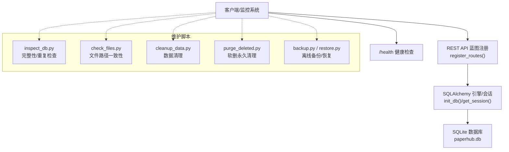
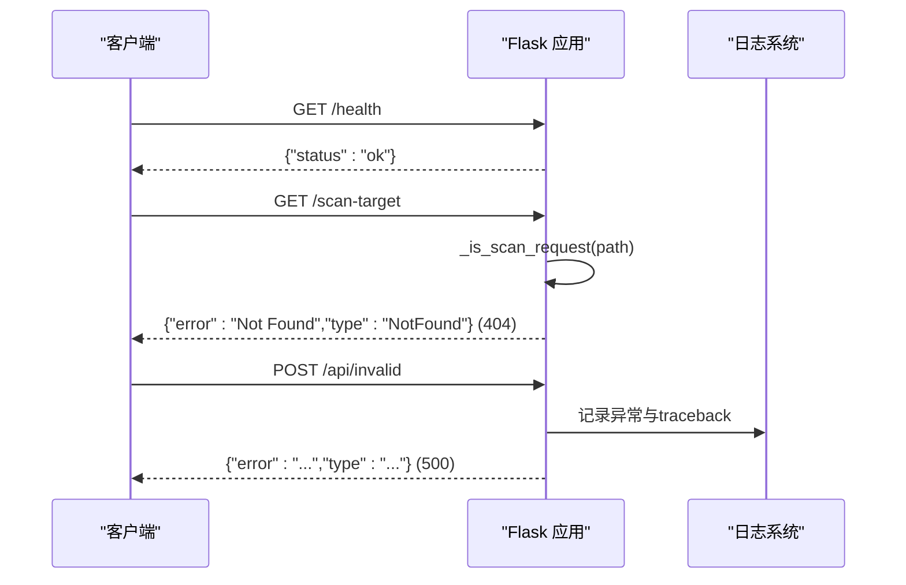
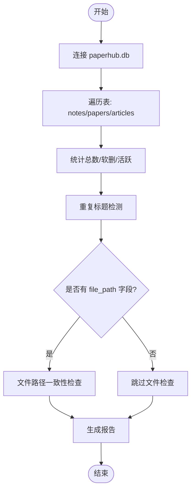
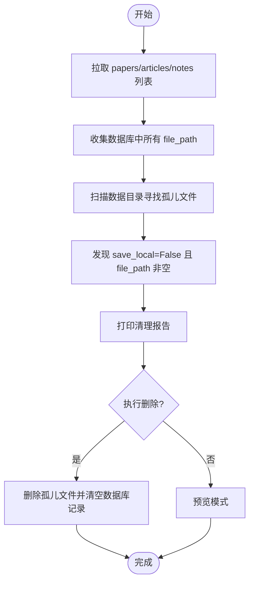
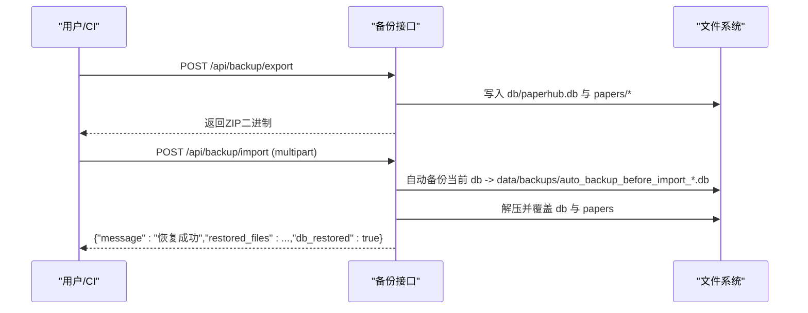
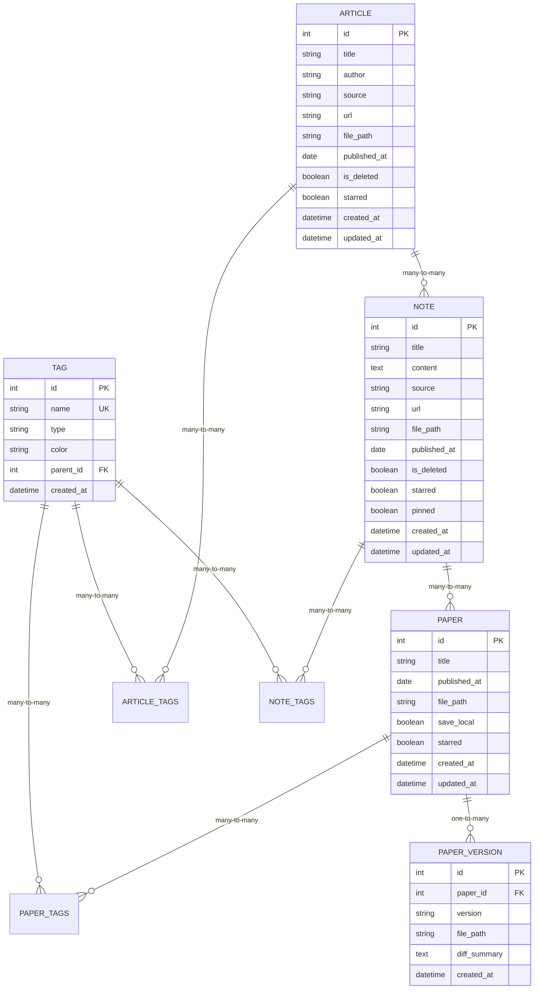
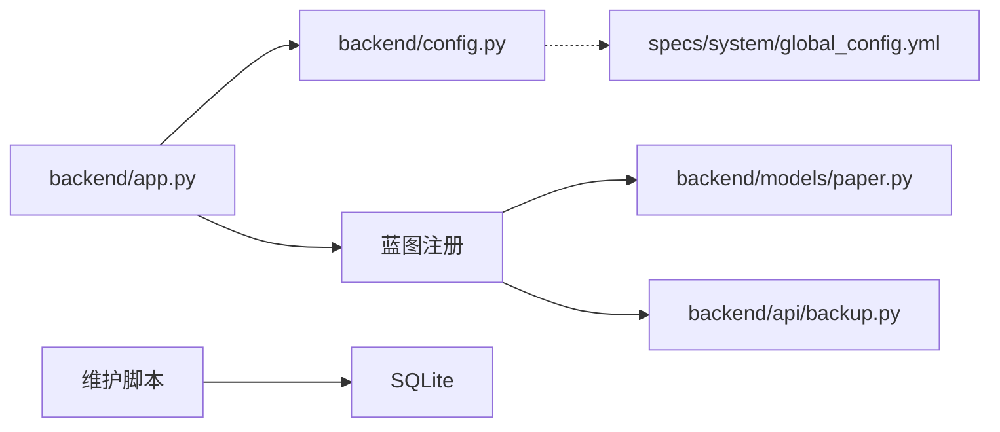

# 系统监控和诊断

<cite>
**本文引用的文件**   
- [backend/app.py](file://backend/app.py)
- [backend/config.py](file://backend/config.py)
- [backend/models/paper.py](file://backend/models/paper.py)
- [backend/api/backup.py](file://backend/api/backup.py)
- [scripts/maintenance/inspect_db.py](file://scripts/maintenance/inspect_db.py)
- [scripts/maintenance/check_schema.py](file://scripts/maintenance/check_schema.py)
- [scripts/maintenance/check_files.py](file://scripts/maintenance/check_files.py)
- [scripts/maintenance/check_articles.py](file://scripts/maintenance/check_articles.py)
- [scripts/maintenance/cleanup_data.py](file://scripts/maintenance/cleanup_data.py)
- [scripts/maintenance/purge_deleted.py](file://scripts/maintenance/purge_deleted.py)
- [scripts/maintenance/backup.py](file://scripts/maintenance/backup.py)
- [scripts/maintenance/restore.py](file://scripts/maintenance/restore.py)
- [specs/system/global_config.yml](file://specs/system/global_config.yml)
- [specs/backend/api/backup.yml](file://specs/backend/api/backup.yml)
- [docs/SCHEMA.md](file://docs/SCHEMA.md)
</cite>

## 目录
1. [简介](#简介)
2. [项目结构](#项目结构)
3. [核心组件](#核心组件)
4. [架构总览](#架构总览)
5. [详细组件分析](#详细组件分析)
6. [依赖分析](#依赖分析)
7. [性能考量](#性能考量)
8. [故障排查指南](#故障排查指南)
9. [结论](#结论)
10. [附录](#附录)

## 简介
本指南面向PaperHub系统的运维与开发人员，提供一套完整的监控与诊断实践，涵盖：
- 系统健康检查与错误处理策略
- 数据库状态检查工具（完整性、重复性、文件路径一致性）
- 日志记录与错误追踪最佳实践
- 系统资源监控与性能瓶颈识别
- 常见问题诊断流程与预防性维护
- 备份与恢复流程及监控仪表板配置思路

## 项目结构
PaperHub采用前后端分离的Flask后端与前端静态资源目录结构。后端通过蓝图注册API路由，数据库使用SQLite并通过SQLAlchemy连接池管理；维护脚本位于scripts/maintenance目录，提供数据库检查、文件一致性校验、数据清理、备份与恢复等能力。

**图表来源**
- [backend/app.py:1-137](file://backend/app.py#L1-L137)
- [backend/config.py:85-133](file://backend/config.py#L85-L133)
- [backend/models/paper.py:120-293](file://backend/models/paper.py#L120-L293)
- [backend/api/backup.py:98-176](file://backend/api/backup.py#L98-L176)
- [scripts/maintenance/inspect_db.py:1-91](file://scripts/maintenance/inspect_db.py#L1-L91)
- [scripts/maintenance/check_schema.py:1-26](file://scripts/maintenance/check_schema.py#L1-L26)
- [scripts/maintenance/check_files.py:1-77](file://scripts/maintenance/check_files.py#L1-L77)
- [scripts/maintenance/check_articles.py:1-36](file://scripts/maintenance/check_articles.py#L1-L36)
- [scripts/maintenance/cleanup_data.py:1-325](file://scripts/maintenance/cleanup_data.py#L1-L325)
- [scripts/maintenance/purge_deleted.py:1-79](file://scripts/maintenance/purge_deleted.py#L1-L79)
- [scripts/maintenance/backup.py:1-121](file://scripts/maintenance/backup.py#L1-L121)
- [scripts/maintenance/restore.py:1-108](file://scripts/maintenance/restore.py#L1-L108)
- [specs/system/global_config.yml:1-80](file://specs/system/global_config.yml#L1-L80)
- [specs/backend/api/backup.yml:1-50](file://specs/backend/api/backup.yml#L1-L50)
- [docs/SCHEMA.md:125-182](file://docs/SCHEMA.md#L125-L182)

**章节来源**
- [backend/app.py:1-137](file://backend/app.py#L1-L137)
- [backend/config.py:1-134](file://backend/config.py#L1-L134)
- [specs/system/global_config.yml:1-80](file://specs/system/global_config.yml#L1-L80)

## 核心组件
- 健康检查与错误处理
  - 提供/health健康端点，返回服务可用状态
  - 全局异常处理器统一捕获未处理异常，区分HTTP异常与非HTTP异常，记录堆栈并返回结构化错误
  - 对扫描类请求进行日志过滤，降低噪音
- 数据库连接池与会话管理
  - 初始化全局Engine与scoped_session，配置连接池大小、溢出、超时与回收周期，避免SQLite锁问题
- 日志与告警
  - 基于Python logging，Werkzeug日志使用自定义过滤器屏蔽扫描请求
  - 规约中定义LOG_LEVEL全局配置项，便于集中控制日志级别

**章节来源**
- [backend/app.py:101-103](file://backend/app.py#L101-L103)
- [backend/app.py:70-89](file://backend/app.py#L70-L89)
- [backend/app.py:32-38](file://backend/app.py#L32-L38)
- [backend/config.py:85-133](file://backend/config.py#L85-L133)
- [specs/system/global_config.yml:72-75](file://specs/system/global_config.yml#L72-L75)

## 架构总览
后端通过蓝图注册API，数据库模型定义实体与关系，维护脚本独立于应用运行，提供离线诊断与修复能力。备份/恢复接口支持在线导出与导入，CLI工具提供离线备份与恢复。

**图表来源**
- [backend/app.py:140-157](file://backend/app.py#L140-L157)
- [backend/config.py:85-133](file://backend/config.py#L85-L133)
- [scripts/maintenance/inspect_db.py:1-91](file://scripts/maintenance/inspect_db.py#L1-L91)
- [scripts/maintenance/check_files.py:1-77](file://scripts/maintenance/check_files.py#L1-L77)
- [scripts/maintenance/cleanup_data.py:1-325](file://scripts/maintenance/cleanup_data.py#L1-L325)
- [scripts/maintenance/purge_deleted.py:1-79](file://scripts/maintenance/purge_deleted.py#L1-L79)
- [scripts/maintenance/backup.py:1-121](file://scripts/maintenance/backup.py#L1-L121)
- [scripts/maintenance/restore.py:1-108](file://scripts/maintenance/restore.py#L1-L108)

## 详细组件分析

### 健康检查与错误处理
- 健康端点：/health返回简单状态，便于K8s/负载均衡探针使用
- 异常处理：全局errorhandler捕获异常，区分NotFound与扫描请求，避免误报；记录traceback并返回结构化错误
- 日志过滤：ScanFilter屏蔽扫描类请求日志，降低噪声

**图表来源**
- [backend/app.py:101-103](file://backend/app.py#L101-L103)
- [backend/app.py:75-79](file://backend/app.py#L75-L79)
- [backend/app.py:80-89](file://backend/app.py#L80-L89)
- [backend/app.py:25-29](file://backend/app.py#L25-L29)
- [backend/app.py:32-38](file://backend/app.py#L32-L38)

**章节来源**
- [backend/app.py:101-103](file://backend/app.py#L101-L103)
- [backend/app.py:70-89](file://backend/app.py#L70-L89)
- [backend/app.py:25-38](file://backend/app.py#L25-L38)

### 数据库状态检查工具
- 完整性与重复性检查：遍历notes/papers/articles，统计总数、软删数与活跃数，检测重复标题
- 表结构检查：输出所有表的字段定义，辅助schema演进核对
- 文件路径一致性检查：对比数据库file_path与磁盘文件存在性，支持相对/绝对路径转换
- 文章导入检查：列出已导入微信文章的关键字段，便于人工核对
- 软删记录清理：交互式确认后批量删除软删记录，减少数据库膨胀

**图表来源**
- [scripts/maintenance/inspect_db.py:18-87](file://scripts/maintenance/inspect_db.py#L18-L87)
- [scripts/maintenance/check_schema.py:13-25](file://scripts/maintenance/check_schema.py#L13-L25)
- [scripts/maintenance/check_files.py:38-66](file://scripts/maintenance/check_files.py#L38-L66)
- [scripts/maintenance/check_articles.py:22-32](file://scripts/maintenance/check_articles.py#L22-L32)
- [scripts/maintenance/purge_deleted.py:26-66](file://scripts/maintenance/purge_deleted.py#L26-L66)

**章节来源**
- [scripts/maintenance/inspect_db.py:1-91](file://scripts/maintenance/inspect_db.py#L1-L91)
- [scripts/maintenance/check_schema.py:1-26](file://scripts/maintenance/check_schema.py#L1-L26)
- [scripts/maintenance/check_files.py:1-77](file://scripts/maintenance/check_files.py#L1-L77)
- [scripts/maintenance/check_articles.py:1-36](file://scripts/maintenance/check_articles.py#L1-L36)
- [scripts/maintenance/purge_deleted.py:1-79](file://scripts/maintenance/purge_deleted.py#L1-L79)

### 数据清理与文件一致性
- 数据清理：基于API拉取全量数据，识别save_local=False但file_path非空的不一致项，以及磁盘上存在但数据库无记录的孤儿文件；支持dry-run与删除执行
- 文件一致性：对papers/articles/notes三类数据进行file_path校验，支持相对路径转换与配对文件（如知乎/微信的md/html配对）

**图表来源**
- [scripts/maintenance/cleanup_data.py:37-186](file://scripts/maintenance/cleanup_data.py#L37-L186)
- [scripts/maintenance/cleanup_data.py:201-279](file://scripts/maintenance/cleanup_data.py#L201-L279)

**章节来源**
- [scripts/maintenance/cleanup_data.py:1-325](file://scripts/maintenance/cleanup_data.py#L1-L325)

### 备份与恢复
- 在线备份/恢复接口：支持导出ZIP与从ZIP恢复，恢复前自动备份当前数据库
- CLI备份/恢复：提供命令行工具，支持列出备份、创建带时间戳的备份、交互式恢复

**图表来源**
- [backend/api/backup.py:98-176](file://backend/api/backup.py#L98-L176)
- [specs/backend/api/backup.yml:1-50](file://specs/backend/api/backup.yml#L1-L50)
- [scripts/maintenance/backup.py:47-76](file://scripts/maintenance/backup.py#L47-L76)
- [scripts/maintenance/restore.py:57-108](file://scripts/maintenance/restore.py#L57-L108)

**章节来源**
- [backend/api/backup.py:98-176](file://backend/api/backup.py#L98-L176)
- [specs/backend/api/backup.yml:1-50](file://specs/backend/api/backup.yml#L1-L50)
- [scripts/maintenance/backup.py:1-121](file://scripts/maintenance/backup.py#L1-L121)
- [scripts/maintenance/restore.py:1-108](file://scripts/maintenance/restore.py#L1-L108)

### 数据模型与全文检索
- 数据模型：定义Paper/Article/Note/Tag及其多对多关联表，支持软删、标签、时间戳等通用字段
- 全文检索：通过FTS5虚拟表papers_fts实现全文检索，配合content/paper主表映射

**图表来源**
- [backend/models/paper.py:18-87](file://backend/models/paper.py#L18-L87)
- [backend/models/paper.py:120-293](file://backend/models/paper.py#L120-L293)
- [docs/SCHEMA.md:125-152](file://docs/SCHEMA.md#L125-L152)

**章节来源**
- [backend/models/paper.py:120-293](file://backend/models/paper.py#L120-L293)
- [docs/SCHEMA.md:125-182](file://docs/SCHEMA.md#L125-L182)

## 依赖分析
- 组件耦合
  - app.py依赖config.py进行数据库初始化与会话管理，依赖蓝图注册API
  - 维护脚本通过直接连接SQLite或调用API实现离线/在线诊断
- 外部依赖
  - Flask、SQLAlchemy、Werkzeug、flask-cors
- 配置契约
  - global_config.yml定义LOG_LEVEL、连接池参数、分页参数等，确保部署一致性

**图表来源**
- [backend/app.py:140-157](file://backend/app.py#L140-L157)
- [backend/config.py:85-133](file://backend/config.py#L85-L133)
- [specs/system/global_config.yml:1-80](file://specs/system/global_config.yml#L1-L80)

**章节来源**
- [backend/app.py:140-157](file://backend/app.py#L140-L157)
- [backend/config.py:85-133](file://backend/config.py#L85-L133)
- [specs/system/global_config.yml:1-80](file://specs/system/global_config.yml#L1-L80)

## 性能考量
- 数据库连接池
  - 连接池大小、溢出、超时与回收周期已在配置中设定，避免SQLite锁问题与并发瓶颈
- 查询与全文检索
  - Schema文档定义了FTS5全文检索表，结合content映射，适合大规模文本检索场景
- 日志与扫描请求
  - 通过ScanFilter过滤扫描类请求日志，降低Werkzeug日志噪音，提高可观测性

**章节来源**
- [backend/config.py:92-99](file://backend/config.py#L92-L99)
- [docs/SCHEMA.md:139-152](file://docs/SCHEMA.md#L139-L152)
- [backend/app.py:32-38](file://backend/app.py#L32-L38)

## 故障排查指南
- 健康检查
  - 访问/health确认服务可用；若不可用，查看应用日志与异常处理器输出
- 数据库问题
  - 使用inspect_db.py检查重复标题与软删状态；check_schema.py核对表结构；check_files.py验证文件路径一致性
  - 若存在大量孤儿文件或不一致项，使用cleanup_data.py进行清理
- 备份与恢复
  - 使用backup.py导出备份；如需恢复，使用restore.py交互式恢复，或通过API导入ZIP
- 错误分类与告警
  - 将HTTP异常与非HTTP异常分别处理，记录traceback；结合LOG_LEVEL统一控制日志级别，必要时接入外部日志/告警平台

**章节来源**
- [backend/app.py:101-103](file://backend/app.py#L101-L103)
- [scripts/maintenance/inspect_db.py:1-91](file://scripts/maintenance/inspect_db.py#L1-L91)
- [scripts/maintenance/check_schema.py:1-26](file://scripts/maintenance/check_schema.py#L1-L26)
- [scripts/maintenance/check_files.py:1-77](file://scripts/maintenance/check_files.py#L1-L77)
- [scripts/maintenance/cleanup_data.py:1-325](file://scripts/maintenance/cleanup_data.py#L1-L325)
- [scripts/maintenance/backup.py:1-121](file://scripts/maintenance/backup.py#L1-L121)
- [scripts/maintenance/restore.py:1-108](file://scripts/maintenance/restore.py#L1-L108)
- [specs/system/global_config.yml:72-75](file://specs/system/global_config.yml#L72-L75)

## 结论
PaperHub提供了从应用层到维护脚本的完整监控与诊断能力：健康检查、异常处理、数据库状态检查、文件一致性校验、数据清理、备份与恢复。结合全局配置规约与Schema文档，可形成稳定可靠的运维体系。建议在生产环境启用更严格的日志级别与告警策略，并定期执行维护脚本以保持数据健康。

## 附录
- 监控仪表板配置与自定义
  - 可基于/health端点与日志级别（LOG_LEVEL）构建基础健康面板
  - 结合维护脚本输出生成数据完整性与文件一致性仪表板
  - 备份/恢复流程可纳入CI/CD流水线，实现自动化巡检与回滚

**章节来源**
- [specs/system/global_config.yml:72-75](file://specs/system/global_config.yml#L72-L75)
- [scripts/maintenance/backup.py:1-121](file://scripts/maintenance/backup.py#L1-L121)
- [scripts/maintenance/restore.py:1-108](file://scripts/maintenance/restore.py#L1-L108)