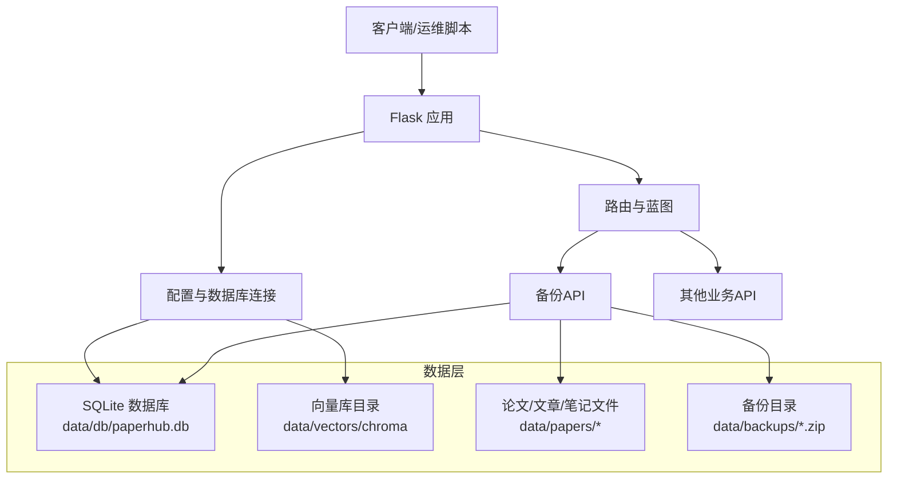
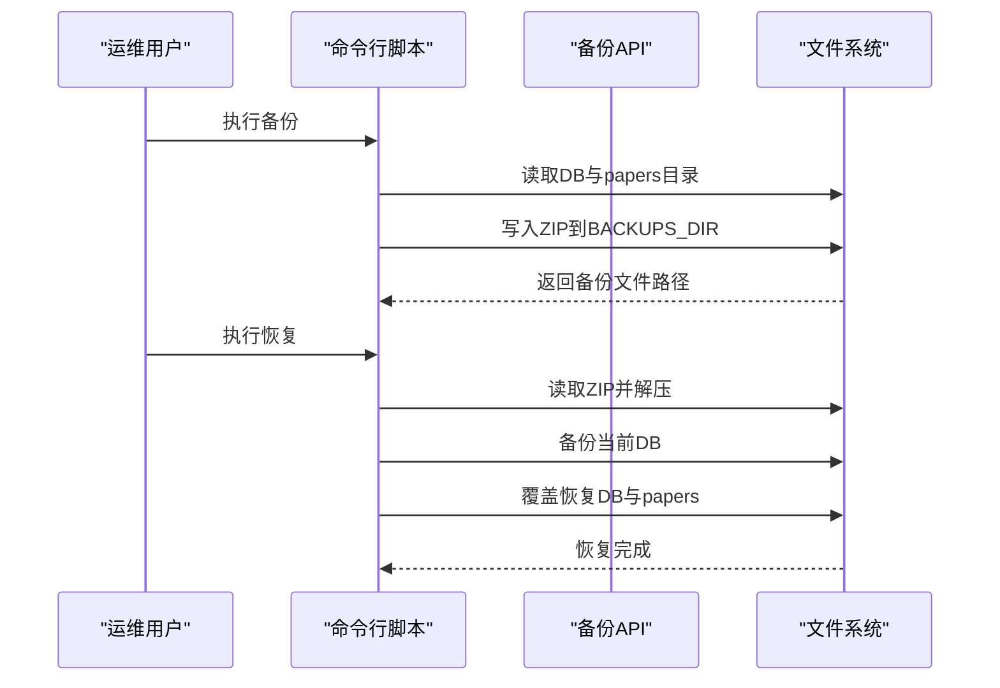
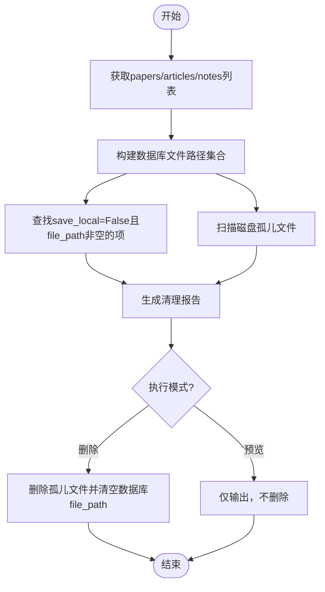
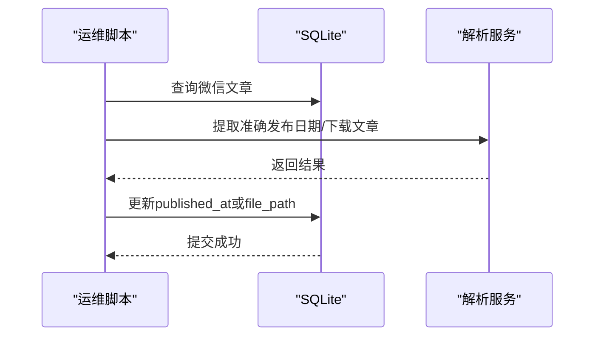
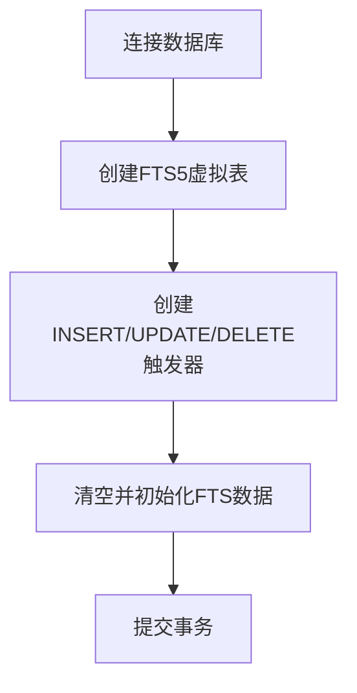
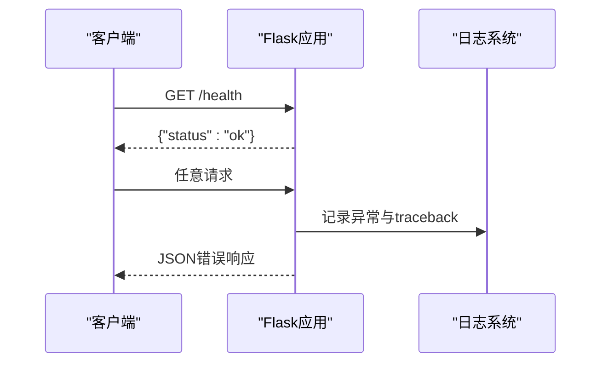
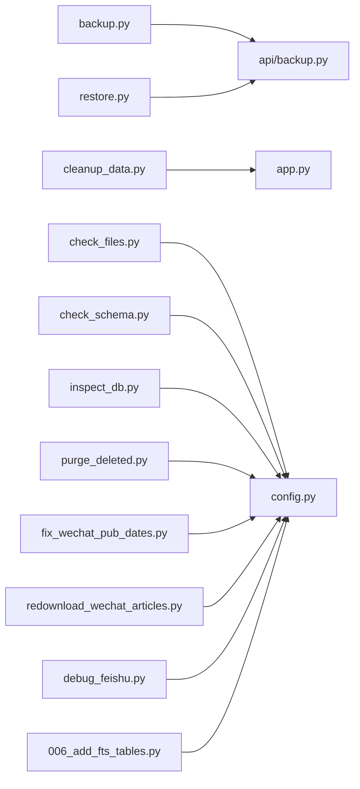

# 系统维护和运维

<cite>
**本文引用的文件**
- [backend/app.py](file://backend/app.py)
- [backend/config.py](file://backend/config.py)
- [backend/api/backup.py](file://backend/api/backup.py)
- [scripts/maintenance/backup.py](file://scripts/maintenance/backup.py)
- [scripts/maintenance/restore.py](file://scripts/maintenance/restore.py)
- [scripts/maintenance/cleanup_data.py](file://scripts/maintenance/cleanup_data.py)
- [scripts/maintenance/check_files.py](file://scripts/maintenance/check_files.py)
- [scripts/maintenance/check_schema.py](file://scripts/maintenance/check_schema.py)
- [scripts/maintenance/inspect_db.py](file://scripts/maintenance/inspect_db.py)
- [scripts/maintenance/purge_deleted.py](file://scripts/maintenance/purge_deleted.py)
- [scripts/maintenance/redownload_wechat_articles.py](file://scripts/maintenance/redownload_wechat_articles.py)
- [scripts/maintenance/fix_wechat_pub_dates.py](file://scripts/maintenance/fix_wechat_pub_dates.py)
- [scripts/maintenance/debug_feishu.py](file://scripts/maintenance/debug_feishu.py)
- [scripts/maintenance/006_add_fts_tables.py](file://scripts/maintenance/006_add_fts_tables.py)
</cite>

## 目录
1. [简介](#简介)
2. [项目结构](#项目结构)
3. [核心组件](#核心组件)
4. [架构总览](#架构总览)
5. [详细组件分析](#详细组件分析)
6. [依赖分析](#依赖分析)
7. [性能考虑](#性能考虑)
8. [故障排除指南](#故障排除指南)
9. [结论](#结论)
10. [附录](#附录)

## 简介
本指南面向PaperHub系统的维护与运维人员，围绕数据备份与恢复、系统监控与诊断、维护工具集（数据清理、批量修复、性能优化）、健康检查与错误处理、运维脚本使用、故障排除以及升级与版本管理、数据迁移流程进行系统化说明。目标是帮助读者建立标准化的日常运维流程，降低风险并提升稳定性。

## 项目结构
PaperHub采用前后端分离的Flask后端与静态前端资源组织方式，数据以SQLite为主存储，并辅以向量数据库目录用于检索增强；维护脚本集中于scripts/maintenance目录，提供命令行工具与API接口，便于自动化与批处理。

```mermaid
graph TB
subgraph "后端"
APP["Flask 应用<br/>backend/app.py"]
CFG["配置与数据库连接<br/>backend/config.py"]
API_BACKUP["备份API<br/>backend/api/backup.py"]
end
subgraph "维护脚本"
M_BACKUP["备份脚本<br/>scripts/maintenance/backup.py"]
M_RESTORE["恢复脚本<br/>scripts/maintenance/restore.py"]
M_CLEAN["数据清理<br/>scripts/maintenance/cleanup_data.py"]
M_CHECK_FILES["文件一致性检查<br/>scripts/maintenance/check_files.py"]
M_CHECK_SCHEMA["表结构检查<br/>scripts/maintenance/check_schema.py"]
M_INSPECT_DB["数据库分析<br/>scripts/maintenance/inspect_db.py"]
M_PURGE["软删清理<br/>scripts/maintenance/purge_deleted.py"]
M_WECHAT_FIX["微信日期修复<br/>scripts/maintenance/fix_wechat_pub_dates.py"]
M_WECHAT_REDOWNLOAD["微信重下载<br/>scripts/maintenance/redownload_wechat_articles.py"]
M_DEBUG_FS["飞书解析调试<br/>scripts/maintenance/debug_feishu.py"]
M_FTS["FTS5迁移<br/>scripts/maintenance/006_add_fts_tables.py"]
end
APP --> CFG
APP --> API_BACKUP
M_BACKUP --> API_BACKUP
M_RESTORE --> API_BACKUP
M_CLEAN --> APP
M_CHECK_FILES --> CFG
M_CHECK_SCHEMA --> CFG
M_INSPECT_DB --> CFG
M_PURGE --> CFG
M_WECHAT_FIX --> CFG
M_WECHAT_REDOWNLOAD --> CFG
M_DEBUG_FS --> CFG
M_FTS --> CFG
```

图表来源
- [backend/app.py:1-234](file://backend/app.py#L1-L234)
- [backend/config.py:1-134](file://backend/config.py#L1-L134)
- [backend/api/backup.py:1-249](file://backend/api/backup.py#L1-L249)
- [scripts/maintenance/backup.py:1-121](file://scripts/maintenance/backup.py#L1-L121)
- [scripts/maintenance/restore.py:1-166](file://scripts/maintenance/restore.py#L1-L166)
- [scripts/maintenance/cleanup_data.py:1-325](file://scripts/maintenance/cleanup_data.py#L1-L325)
- [scripts/maintenance/check_files.py:1-77](file://scripts/maintenance/check_files.py#L1-L77)
- [scripts/maintenance/check_schema.py:1-26](file://scripts/maintenance/check_schema.py#L1-L26)
- [scripts/maintenance/inspect_db.py:1-91](file://scripts/maintenance/inspect_db.py#L1-L91)
- [scripts/maintenance/purge_deleted.py:1-79](file://scripts/maintenance/purge_deleted.py#L1-L79)
- [scripts/maintenance/fix_wechat_pub_dates.py:1-67](file://scripts/maintenance/fix_wechat_pub_dates.py#L1-L67)
- [scripts/maintenance/redownload_wechat_articles.py:1-71](file://scripts/maintenance/redownload_wechat_articles.py#L1-L71)
- [scripts/maintenance/debug_feishu.py:1-71](file://scripts/maintenance/debug_feishu.py#L1-L71)
- [scripts/maintenance/006_add_fts_tables.py:1-179](file://scripts/maintenance/006_add_fts_tables.py#L1-L179)

章节来源
- [backend/app.py:1-234](file://backend/app.py#L1-L234)
- [backend/config.py:1-134](file://backend/config.py#L1-L134)

## 核心组件
- 应用入口与中间件
  - 初始化数据库引擎与会话工厂，注册路由蓝图，设置CORS与健康检查端点，统一异常处理与访问日志过滤。
- 配置与数据目录
  - 统一管理BASE_DIR、DATA_DIR、DB_DIR、VECTORS_DIR、BACKUPS_DIR等路径，确保目录存在；提供全局Engine与ScopedSession，支持连接池与回收。
- 备份与恢复API
  - 提供导出ZIP压缩包、导入覆盖恢复、列出与删除备份文件的REST接口，支持自动备份当前数据库以防导入覆盖风险。
- 维护脚本生态
  - 命令行备份/恢复工具与API互为补充；数据清理、文件一致性检查、表结构检查、数据库分析、软删清理、微信文章修复与重下载、全文检索FTS5迁移、调试工具等形成闭环。

章节来源
- [backend/app.py:41-137](file://backend/app.py#L41-L137)
- [backend/config.py:85-134](file://backend/config.py#L85-L134)
- [backend/api/backup.py:46-249](file://backend/api/backup.py#L46-L249)

## 架构总览
PaperHub后端通过Flask提供REST服务，数据库为SQLite，向量库目录用于检索；维护脚本既可通过API调用，也可直接命令行执行，实现离线与在线双通道运维。

图表来源
- [backend/app.py:140-158](file://backend/app.py#L140-L158)
- [backend/config.py:20-56](file://backend/config.py#L20-L56)
- [backend/api/backup.py:16-44](file://backend/api/backup.py#L16-L44)

## 详细组件分析

### 备份与恢复策略
- 备份范围
  - 数据库文件与papers目录全部文件打包为ZIP，便于离线归档与跨环境迁移。
- 备份流程（API）
  - 生成带时间戳的文件名，写入db/paperhub.db与papers目录文件，返回下载或保存至BACKUPS_DIR。
- 恢复流程（API）
  - 上传ZIP后解压，自动备份当前数据库，再覆盖恢复数据库与papers文件。
- 命令行工具
  - 备份脚本支持自定义名称与列出备份；恢复脚本支持交互式选择与指定文件，自动备份当前数据库以防误操作。

图表来源
- [scripts/maintenance/backup.py:47-76](file://scripts/maintenance/backup.py#L47-L76)
- [scripts/maintenance/restore.py:57-123](file://scripts/maintenance/restore.py#L57-L123)
- [backend/api/backup.py:46-91](file://backend/api/backup.py#L46-L91)
- [backend/api/backup.py:93-171](file://backend/api/backup.py#L93-L171)

章节来源
- [backend/api/backup.py:46-249](file://backend/api/backup.py#L46-L249)
- [scripts/maintenance/backup.py:1-121](file://scripts/maintenance/backup.py#L1-L121)
- [scripts/maintenance/restore.py:1-166](file://scripts/maintenance/restore.py#L1-L166)

### 数据清理与一致性检查
- 数据清理
  - 通过API获取papers/articles/notes列表，识别save_local=False但file_path非空的记录与磁盘上存在但数据库无记录的孤儿文件，支持预览与删除两种模式。
- 文件一致性检查
  - 遍历papers/articles/notes表，校验file_path字段对应的文件是否存在，输出缺失统计。
- 表结构检查
  - 列出所有表及其列定义，辅助迁移与审计。
- 数据库分析
  - 统计总记录、软删数量与活跃数量，检测活跃记录重复标题，辅助数据质量评估。

图表来源
- [scripts/maintenance/cleanup_data.py:37-321](file://scripts/maintenance/cleanup_data.py#L37-L321)
- [scripts/maintenance/check_files.py:10-77](file://scripts/maintenance/check_files.py#L10-L77)
- [scripts/maintenance/check_schema.py:5-26](file://scripts/maintenance/check_schema.py#L5-L26)
- [scripts/maintenance/inspect_db.py:18-91](file://scripts/maintenance/inspect_db.py#L18-L91)

章节来源
- [scripts/maintenance/cleanup_data.py:1-325](file://scripts/maintenance/cleanup_data.py#L1-L325)
- [scripts/maintenance/check_files.py:1-77](file://scripts/maintenance/check_files.py#L1-L77)
- [scripts/maintenance/check_schema.py:1-26](file://scripts/maintenance/check_schema.py#L1-L26)
- [scripts/maintenance/inspect_db.py:1-91](file://scripts/maintenance/inspect_db.py#L1-L91)

### 批量修复与专项工具
- 软删记录永久清理
  - 扫描notes/articles表中is_deleted=1的记录，确认后批量删除，释放空间并简化查询。
- 微信文章修复
  - 批量修正发布日期，基于URL提取准确时间；支持重新下载补全图片目录，保证内容完整性。
- 飞书解析调试
  - 针对特定URL调试多种正文提取方法，定位解析问题，辅助上游解析器优化。

图表来源
- [scripts/maintenance/purge_deleted.py:26-79](file://scripts/maintenance/purge_deleted.py#L26-L79)
- [scripts/maintenance/fix_wechat_pub_dates.py:24-67](file://scripts/maintenance/fix_wechat_pub_dates.py#L24-L67)
- [scripts/maintenance/redownload_wechat_articles.py:24-71](file://scripts/maintenance/redownload_wechat_articles.py#L24-L71)
- [scripts/maintenance/debug_feishu.py:15-71](file://scripts/maintenance/debug_feishu.py#L15-L71)

章节来源
- [scripts/maintenance/purge_deleted.py:1-79](file://scripts/maintenance/purge_deleted.py#L1-L79)
- [scripts/maintenance/fix_wechat_pub_dates.py:1-67](file://scripts/maintenance/fix_wechat_pub_dates.py#L1-L67)
- [scripts/maintenance/redownload_wechat_articles.py:1-71](file://scripts/maintenance/redownload_wechat_articles.py#L1-L71)
- [scripts/maintenance/debug_feishu.py:1-71](file://scripts/maintenance/debug_feishu.py#L1-L71)

### 全文检索FTS5迁移
- 功能概述
  - 为papers、articles、notes三张表创建FTS5虚拟表与INSERT/UPDATE/DELETE触发器，保持与主表同步；初始化时将现有数据写入FTS表，支持全文检索。
- 使用建议
  - 在新增全文检索需求或升级后执行，确保迁移脚本在低峰期运行，避免影响线上查询。

图表来源
- [scripts/maintenance/006_add_fts_tables.py:13-179](file://scripts/maintenance/006_add_fts_tables.py#L13-L179)

章节来源
- [scripts/maintenance/006_add_fts_tables.py:1-179](file://scripts/maintenance/006_add_fts_tables.py#L1-L179)

### 系统健康检查与错误处理
- 健康检查
  - 提供/health端点返回状态ok，便于K8s/负载均衡探活。
- 异常处理
  - 统一捕获未处理异常，区分HTTP异常与非HTTP异常，记录traceback，屏蔽扫描类请求噪音。
- 日志与CORS
  - 过滤扫描请求日志，设置CORS允许跨域，便于前端与脚本访问。

图表来源
- [backend/app.py:101-104](file://backend/app.py#L101-L104)
- [backend/app.py:70-89](file://backend/app.py#L70-L89)
- [backend/app.py:46-53](file://backend/app.py#L46-L53)

章节来源
- [backend/app.py:41-137](file://backend/app.py#L41-L137)

## 依赖分析
- 组件耦合
  - 维护脚本通过相对路径导入后端配置与模型，避免强耦合；API层封装备份逻辑，命令行脚本可直接调用。
- 外部依赖
  - SQLite、Flask、SQLAlchemy、CORS、zipfile、tempfile等；向量库目录由外部组件管理。
- 潜在循环依赖
  - 当前结构清晰，未见循环导入；脚本通过sys.path插入项目根目录规避相对导入问题。

图表来源
- [scripts/maintenance/backup.py:22-44](file://scripts/maintenance/backup.py#L22-L44)
- [scripts/maintenance/restore.py:24-28](file://scripts/maintenance/restore.py#L24-L28)
- [scripts/maintenance/cleanup_data.py:24-34](file://scripts/maintenance/cleanup_data.py#L24-L34)
- [scripts/maintenance/check_files.py:10-11](file://scripts/maintenance/check_files.py#L10-L11)
- [scripts/maintenance/check_schema.py:5-6](file://scripts/maintenance/check_schema.py#L5-L6)
- [scripts/maintenance/inspect_db.py:10-11](file://scripts/maintenance/inspect_db.py#L10-L11)
- [scripts/maintenance/purge_deleted.py:11-12](file://scripts/maintenance/purge_deleted.py#L11-L12)
- [scripts/maintenance/fix_wechat_pub_dates.py:16-17](file://scripts/maintenance/fix_wechat_pub_dates.py#L16-L17)
- [scripts/maintenance/redownload_wechat_articles.py:16-17](file://scripts/maintenance/redownload_wechat_articles.py#L16-L17)
- [scripts/maintenance/debug_feishu.py:3](file://scripts/maintenance/debug_feishu.py#L3)
- [scripts/maintenance/006_add_fts_tables.py:9](file://scripts/maintenance/006_add_fts_tables.py#L9)

章节来源
- [backend/config.py:10-32](file://backend/config.py#L10-L32)

## 性能考虑
- 数据库连接池
  - 配置pool_size、max_overflow、pool_timeout、pool_recycle，减少锁竞争与连接泄漏风险。
- 备份/恢复
  - 使用ZIP_DEFLATED压缩，合理控制并发；恢复前自动备份当前数据库，避免覆盖风险。
- 文件I/O
  - 批量文件操作建议分批处理，避免一次性占用过多磁盘带宽；清理脚本支持预览模式，降低误删风险。
- 搜索与检索
  - FTS5虚拟表与触发器可显著提升全文检索性能，建议在数据量增长后及时执行迁移脚本。

章节来源
- [backend/config.py:92-99](file://backend/config.py#L92-L99)
- [backend/api/backup.py:25-44](file://backend/api/backup.py#L25-L44)
- [scripts/maintenance/006_add_fts_tables.py:13-142](file://scripts/maintenance/006_add_fts_tables.py#L13-L142)

## 故障排除指南
- 备份/恢复失败
  - 检查BACKUPS_DIR权限与磁盘空间；确认ZIP文件完整性；恢复前的自动备份可用于回滚。
- 文件缺失
  - 使用check_files.py核对file_path字段与实际文件映射；结合cleanup_data.py进行清理。
- 数据库异常
  - 使用check_schema.py核对表结构；inspect_db.py查看重复标题与软删记录；必要时执行purge_deleted.py清理软删。
- 微信文章问题
  - 使用fix_wechat_pub_dates.py批量修正发布日期；使用redownload_wechat_articles.py补全丢失的图片目录。
- 解析异常
  - 使用debug_feishu.py调试不同解析器方法，定位问题URL与HTML结构差异。
- 升级与迁移
  - 执行006_add_fts_tables.py迁移FTS5表；如需历史数据重建，配合初始化步骤。

章节来源
- [scripts/maintenance/restore.py:57-123](file://scripts/maintenance/restore.py#L57-L123)
- [scripts/maintenance/check_files.py:16-77](file://scripts/maintenance/check_files.py#L16-L77)
- [scripts/maintenance/cleanup_data.py:201-321](file://scripts/maintenance/cleanup_data.py#L201-L321)
- [scripts/maintenance/inspect_db.py:18-91](file://scripts/maintenance/inspect_db.py#L18-L91)
- [scripts/maintenance/purge_deleted.py:26-79](file://scripts/maintenance/purge_deleted.py#L26-L79)
- [scripts/maintenance/fix_wechat_pub_dates.py:24-67](file://scripts/maintenance/fix_wechat_pub_dates.py#L24-L67)
- [scripts/maintenance/redownload_wechat_articles.py:24-71](file://scripts/maintenance/redownload_wechat_articles.py#L24-L71)
- [scripts/maintenance/debug_feishu.py:15-71](file://scripts/maintenance/debug_feishu.py#L15-L71)
- [scripts/maintenance/006_add_fts_tables.py:144-179](file://scripts/maintenance/006_add_fts_tables.py#L144-L179)

## 结论
通过标准化的备份/恢复流程、完善的健康检查与异常处理、系统化的数据清理与修复工具，以及针对全文检索的FTS5迁移，PaperHub能够实现稳定、可追溯、可扩展的运维体系。建议将上述流程纳入CI/CD与值班手册，定期演练，确保在变更与故障场景下快速恢复。

## 附录
- 常用命令速查
  - 备份：python scripts/maintenance/backup.py [-n 名称] [-l 列表]
  - 恢复：python scripts/maintenance/restore.py [-f 文件] [-l 列表]
  - 清理：python scripts/maintenance/cleanup_data.py [--dry | --remove]
  - 文件检查：python scripts/maintenance/check_files.py
  - 表结构：python scripts/maintenance/check_schema.py
  - 数据分析：python scripts/maintenance/inspect_db.py
  - 软删清理：python scripts/maintenance/purge_deleted.py
  - 微信日期修复：python scripts/maintenance/fix_wechat_pub_dates.py
  - 微信重下载：python scripts/maintenance/redownload_wechat_articles.py
  - 飞书调试：python scripts/maintenance/debug_feishu.py
  - FTS5迁移：python scripts/maintenance/006_add_fts_tables.py