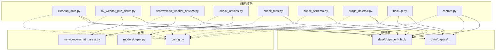
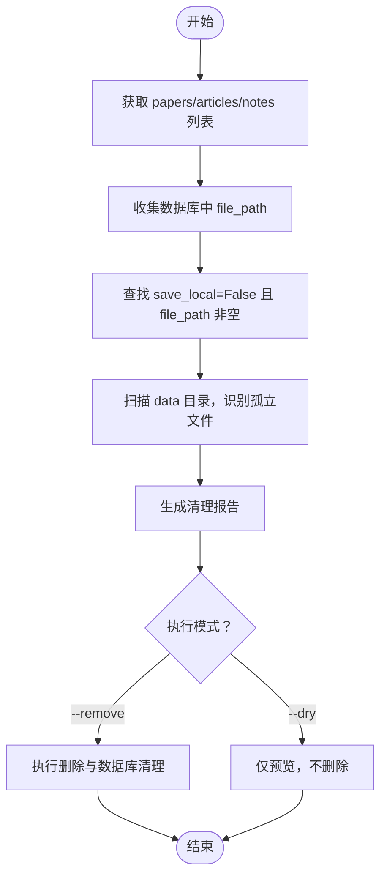
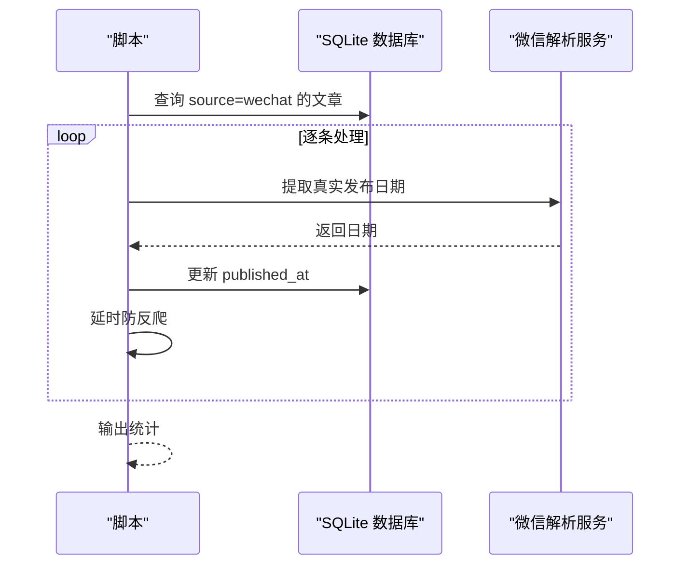
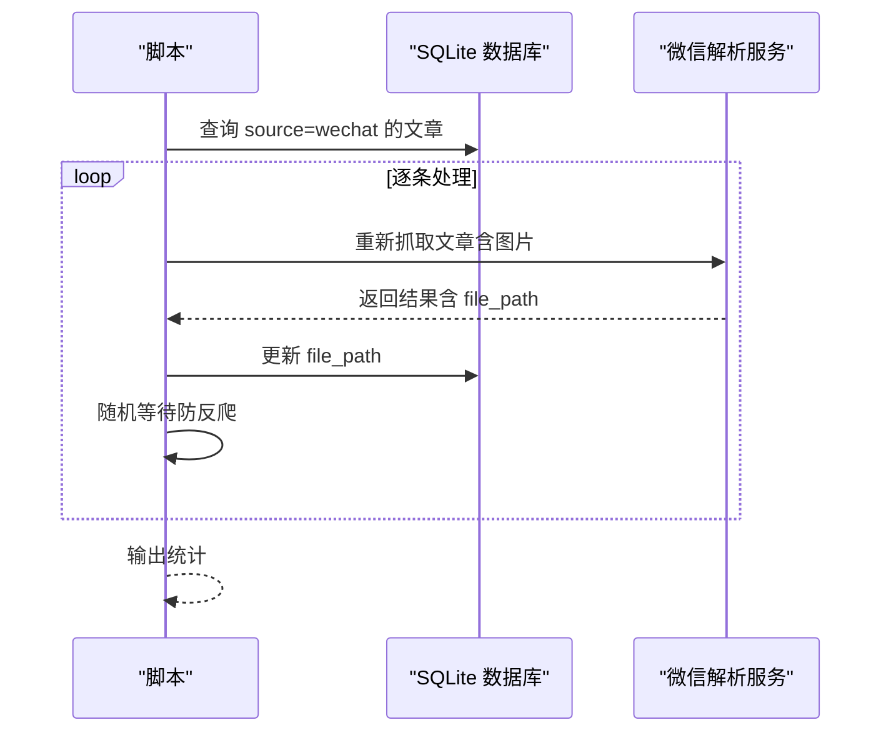
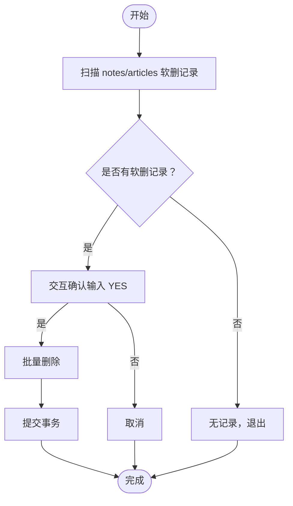
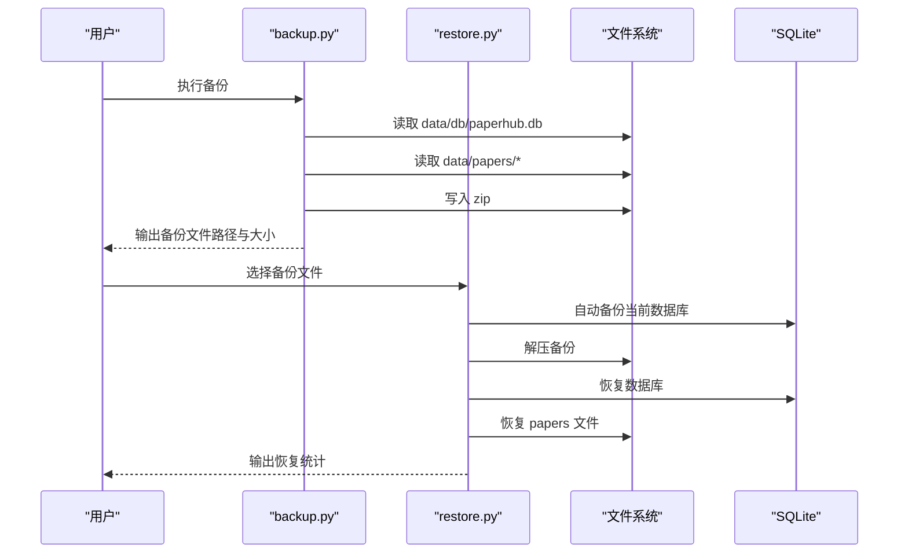
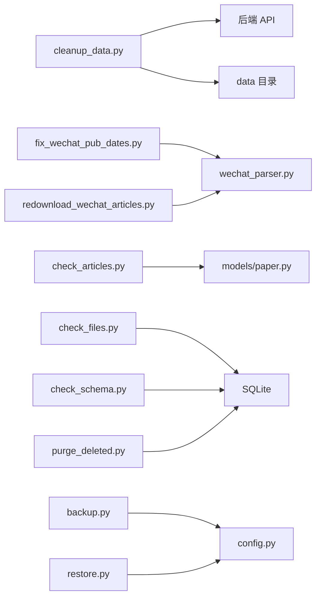

# 维护工具集

<cite>
**本文引用的文件**
- [scripts/maintenance/cleanup_data.py](file://scripts/maintenance/cleanup_data.py)
- [scripts/maintenance/fix_wechat_pub_dates.py](file://scripts/maintenance/fix_wechat_pub_dates.py)
- [scripts/maintenance/redownload_wechat_articles.py](file://scripts/maintenance/redownload_wechat_articles.py)
- [scripts/maintenance/check_articles.py](file://scripts/maintenance/check_articles.py)
- [scripts/maintenance/check_files.py](file://scripts/maintenance/check_files.py)
- [scripts/maintenance/check_schema.py](file://scripts/maintenance/check_schema.py)
- [scripts/maintenance/purge_deleted.py](file://scripts/maintenance/purge_deleted.py)
- [scripts/maintenance/backup.py](file://scripts/maintenance/backup.py)
- [scripts/maintenance/restore.py](file://scripts/maintenance/restore.py)
- [backend/config.py](file://backend/config.py)
- [backend/models/paper.py](file://backend/models/paper.py)
- [backend/services/wechat_parser.py](file://backend/services/wechat_parser.py)
</cite>

## 目录
1. [简介](#简介)
2. [项目结构](#项目结构)
3. [核心组件](#核心组件)
4. [架构总览](#架构总览)
5. [详细组件分析](#详细组件分析)
6. [依赖分析](#依赖分析)
7. [性能考虑](#性能考虑)
8. [故障排查指南](#故障排查指南)
9. [结论](#结论)
10. [附录](#附录)

## 简介
本指南面向 PaperHub 的运维与开发者，系统性介绍维护工具集的使用方法、适用场景、执行条件、风险评估与最佳实践。涵盖以下工具：
- 数据清理工具：cleanup_data.py
- 微信公众号日期修复：fix_wechat_pub_dates.py
- 文章重新下载：redownload_wechat_articles.py
- 数据检查工具：check_articles.py、check_files.py、check_schema.py
- 垃圾数据清理：purge_deleted.py
- 备份与恢复：backup.py、restore.py

文档重点说明各工具的参数、输出格式、错误处理、批量操作安全措施、回滚机制与数据保护策略，并提供维护计划、自动化执行与结果验证建议。

## 项目结构
维护工具集中于 scripts/maintenance 目录，围绕数据库（SQLite）与本地数据目录（data/...）进行读取、校验与修改；部分工具通过直接访问数据库或调用后端服务实现功能。

图表来源
- [scripts/maintenance/cleanup_data.py:1-325](file://scripts/maintenance/cleanup_data.py#L1-L325)
- [scripts/maintenance/fix_wechat_pub_dates.py:1-67](file://scripts/maintenance/fix_wechat_pub_dates.py#L1-L67)
- [scripts/maintenance/redownload_wechat_articles.py:1-71](file://scripts/maintenance/redownload_wechat_articles.py#L1-L71)
- [scripts/maintenance/check_articles.py:1-36](file://scripts/maintenance/check_articles.py#L1-L36)
- [scripts/maintenance/check_files.py:1-77](file://scripts/maintenance/check_files.py#L1-L77)
- [scripts/maintenance/check_schema.py:1-26](file://scripts/maintenance/check_schema.py#L1-L26)
- [scripts/maintenance/purge_deleted.py:1-79](file://scripts/maintenance/purge_deleted.py#L1-L79)
- [scripts/maintenance/backup.py:1-121](file://scripts/maintenance/backup.py#L1-L121)
- [scripts/maintenance/restore.py:1-166](file://scripts/maintenance/restore.py#L1-L166)
- [backend/config.py:1-134](file://backend/config.py#L1-L134)
- [backend/models/paper.py:1-360](file://backend/models/paper.py#L1-L360)
- [backend/services/wechat_parser.py:1-200](file://backend/services/wechat_parser.py#L1-L200)

章节来源
- [scripts/maintenance/cleanup_data.py:1-325](file://scripts/maintenance/cleanup_data.py#L1-L325)
- [scripts/maintenance/fix_wechat_pub_dates.py:1-67](file://scripts/maintenance/fix_wechat_pub_dates.py#L1-L67)
- [scripts/maintenance/redownload_wechat_articles.py:1-71](file://scripts/maintenance/redownload_wechat_articles.py#L1-L71)
- [scripts/maintenance/check_articles.py:1-36](file://scripts/maintenance/check_articles.py#L1-L36)
- [scripts/maintenance/check_files.py:1-77](file://scripts/maintenance/check_files.py#L1-L77)
- [scripts/maintenance/check_schema.py:1-26](file://scripts/maintenance/check_schema.py#L1-L26)
- [scripts/maintenance/purge_deleted.py:1-79](file://scripts/maintenance/purge_deleted.py#L1-L79)
- [scripts/maintenance/backup.py:1-121](file://scripts/maintenance/backup.py#L1-L121)
- [scripts/maintenance/restore.py:1-166](file://scripts/maintenance/restore.py#L1-L166)
- [backend/config.py:1-134](file://backend/config.py#L1-L134)
- [backend/models/paper.py:1-360](file://backend/models/paper.py#L1-L360)
- [backend/services/wechat_parser.py:1-200](file://backend/services/wechat_parser.py#L1-L200)

## 核心组件
- 数据清理工具（cleanup_data.py）
  - 功能：扫描数据库与磁盘不一致、删除孤立文件、修正 save_local=False 但仍有 file_path 的记录。
  - 适用场景：磁盘膨胀、索引不一致、导入后残留冗余。
  - 参数：--dry（仅预览）、--remove（执行删除）。
  - 输出：报告不一致项与孤立文件数量、大小；可选执行删除并反馈删除结果。
  - 风险：误删需谨慎，建议先 --dry 观察；对配对的 md/html 文件有特殊处理，避免误删。
- 微信公众号日期修复（fix_wechat_pub_dates.py）
  - 功能：批量抓取微信文章真实发布时间并更新数据库。
  - 适用场景：历史文章发布时间不准确或缺失。
  - 参数：无命令行参数，直接运行。
  - 输出：逐条处理进度、成功/跳过/失败统计。
  - 风险：网络请求可能触发反爬，内置延时；失败不影响整体流程。
- 文章重新下载（redownload_wechat_articles.py）
  - 功能：重新抓取微信文章，补全 _files 图片资源与 file_path。
  - 适用场景：图片缺失、文件路径异常。
  - 参数：无命令行参数，直接运行。
  - 输出：逐条处理进度、成功/跳过/失败统计。
  - 风险：防反爬机制（随机等待），失败不影响整体流程。
- 数据检查工具
  - check_articles.py：查询并展示未删除的文章字段（标题、作者、URL、发布时间、文件路径等）。
  - check_files.py：检查 papers/articles/notes 表的 file_path 字段对应文件是否存在。
  - check_schema.py：列出数据库所有表及列信息，辅助核对表结构。
- 垃圾数据清理（purge_deleted.py）
  - 功能：永久删除 notes/articles 中标记为已删除的记录。
  - 适用场景：软删除数据积累过多，需要释放空间。
  - 参数：无命令行参数，运行后交互确认。
  - 输出：扫描软删记录、确认提示、执行结果。
  - 风险：不可逆操作，务必确认；内置回滚（异常时回滚）。
- 备份与恢复（backup.py、restore.py）
  - 功能：打包 data/db/paperhub.db 与 data/papers/ 下的全部文件为 zip；恢复时自动备份当前数据库并覆盖目标。
  - 适用场景：重大维护前的全量备份；恢复到指定时间点。
  - 参数：backup.py 支持 -n 自定义名称、-l 列表；restore.py 支持 -f 指定文件、-l 列表、交互式选择。
  - 输出：进度与统计信息；恢复前自动备份当前数据库。

章节来源
- [scripts/maintenance/cleanup_data.py:1-325](file://scripts/maintenance/cleanup_data.py#L1-L325)
- [scripts/maintenance/fix_wechat_pub_dates.py:1-67](file://scripts/maintenance/fix_wechat_pub_dates.py#L1-L67)
- [scripts/maintenance/redownload_wechat_articles.py:1-71](file://scripts/maintenance/redownload_wechat_articles.py#L1-L71)
- [scripts/maintenance/check_articles.py:1-36](file://scripts/maintenance/check_articles.py#L1-L36)
- [scripts/maintenance/check_files.py:1-77](file://scripts/maintenance/check_files.py#L1-L77)
- [scripts/maintenance/check_schema.py:1-26](file://scripts/maintenance/check_schema.py#L1-L26)
- [scripts/maintenance/purge_deleted.py:1-79](file://scripts/maintenance/purge_deleted.py#L1-L79)
- [scripts/maintenance/backup.py:1-121](file://scripts/maintenance/backup.py#L1-L121)
- [scripts/maintenance/restore.py:1-166](file://scripts/maintenance/restore.py#L1-L166)

## 架构总览
维护工具与后端的关系如下：

图表来源
- [scripts/maintenance/cleanup_data.py:1-325](file://scripts/maintenance/cleanup_data.py#L1-L325)
- [scripts/maintenance/fix_wechat_pub_dates.py:1-67](file://scripts/maintenance/fix_wechat_pub_dates.py#L1-L67)
- [scripts/maintenance/redownload_wechat_articles.py:1-71](file://scripts/maintenance/redownload_wechat_articles.py#L1-L71)
- [scripts/maintenance/check_articles.py:1-36](file://scripts/maintenance/check_articles.py#L1-L36)
- [scripts/maintenance/check_files.py:1-77](file://scripts/maintenance/check_files.py#L1-L77)
- [scripts/maintenance/check_schema.py:1-26](file://scripts/maintenance/check_schema.py#L1-L26)
- [scripts/maintenance/purge_deleted.py:1-79](file://scripts/maintenance/purge_deleted.py#L1-L79)
- [scripts/maintenance/backup.py:1-121](file://scripts/maintenance/backup.py#L1-L121)
- [scripts/maintenance/restore.py:1-166](file://scripts/maintenance/restore.py#L1-L166)
- [backend/config.py:1-134](file://backend/config.py#L1-L134)
- [backend/models/paper.py:1-360](file://backend/models/paper.py#L1-L360)
- [backend/services/wechat_parser.py:1-200](file://backend/services/wechat_parser.py#L1-L200)

## 详细组件分析

### 数据清理工具（cleanup_data.py）
- 适用场景
  - 磁盘空间异常增长
  - 导入后出现 save_local=False 但仍有 file_path 的记录
  - 磁盘上存在但数据库无记录的文件
- 执行条件
  - 后端 API 可用（默认 http://localhost:5899/api）
  - data 目录存在且包含 papers/articles/notes 子目录
- 风险评估
  - 删除操作需谨慎，建议先 --dry 预览
  - 对配对的 md/html 文件有特殊处理，避免误删
- 批量操作与安全
  - --dry：仅输出报告，不删除
  - --remove：执行删除并同步清空数据库 file_path
- 结果验证
  - 统计不一致项与孤立文件数量、大小
  - 删除后再次运行 --dry 核对
- 参数与输出
  - 参数：--dry、--remove
  - 输出：不一致项列表、孤立文件列表、总大小；删除后统计

图表来源
- [scripts/maintenance/cleanup_data.py:282-325](file://scripts/maintenance/cleanup_data.py#L282-L325)

章节来源
- [scripts/maintenance/cleanup_data.py:1-325](file://scripts/maintenance/cleanup_data.py#L1-L325)
- [backend/config.py:1-134](file://backend/config.py#L1-L134)

### 微信公众号日期修复（fix_wechat_pub_dates.py）
- 适用场景
  - 历史文章发布时间不准确或缺失
- 执行条件
  - 数据库中存在 source=wechat 的文章
  - 可访问微信文章 URL
- 风险评估
  - 网络请求可能触发反爬，内置延时
  - 单条失败不影响整体流程
- 批量操作与安全
  - 逐条处理，带延时
  - 失败条目单独统计
- 结果验证
  - 成功/跳过/失败计数
  - 可结合 check_articles.py 核对更新前后差异

图表来源
- [scripts/maintenance/fix_wechat_pub_dates.py:1-67](file://scripts/maintenance/fix_wechat_pub_dates.py#L1-L67)
- [backend/services/wechat_parser.py:279-285](file://backend/services/wechat_parser.py#L279-L285)

章节来源
- [scripts/maintenance/fix_wechat_pub_dates.py:1-67](file://scripts/maintenance/fix_wechat_pub_dates.py#L1-L67)
- [backend/services/wechat_parser.py:279-285](file://backend/services/wechat_parser.py#L279-L285)

### 文章重新下载（redownload_wechat_articles.py）
- 适用场景
  - 图片缺失、文件路径异常
- 执行条件
  - 数据库中存在 source=wechat 的文章
  - 可访问微信文章 URL
- 风险评估
  - 防反爬机制（随机等待）
  - 失败不影响整体流程
- 批量操作与安全
  - 逐条处理，随机等待 3-8 秒
  - 失败条目单独统计
- 结果验证
  - 成功/跳过/失败计数
  - 检查 file_path 是否更新

图表来源
- [scripts/maintenance/redownload_wechat_articles.py:1-71](file://scripts/maintenance/redownload_wechat_articles.py#L1-L71)
- [backend/services/wechat_parser.py:916-925](file://backend/services/wechat_parser.py#L916-L925)

章节来源
- [scripts/maintenance/redownload_wechat_articles.py:1-71](file://scripts/maintenance/redownload_wechat_articles.py#L1-L71)
- [backend/services/wechat_parser.py:916-925](file://backend/services/wechat_parser.py#L916-L925)

### 数据检查工具
- check_articles.py
  - 作用：查询未删除文章并展示关键字段，便于人工核对。
  - 输出：逐条打印标题、作者、URL、创建/发布日期、文件路径等。
- check_files.py
  - 作用：检查 papers/articles/notes 表的 file_path 字段对应文件是否存在。
  - 输出：表格形式显示 ID、标题、状态（✅/❌/—）、文件路径。
- check_schema.py
  - 作用：列出数据库所有表及其列，辅助核对表结构是否符合预期。

章节来源
- [scripts/maintenance/check_articles.py:1-36](file://scripts/maintenance/check_articles.py#L1-L36)
- [scripts/maintenance/check_files.py:1-77](file://scripts/maintenance/check_files.py#L1-L77)
- [scripts/maintenance/check_schema.py:1-26](file://scripts/maintenance/check_schema.py#L1-L26)

### 垃圾数据清理（purge_deleted.py）
- 适用场景
  - notes/articles 中软删除记录过多
- 执行条件
  - 表存在 is_deleted 字段
- 风险评估
  - 不可逆操作，务必确认
  - 异常时自动回滚
- 批量操作与安全
  - 交互式确认（需输入 YES）
  - 一次性删除多个表的记录
- 结果验证
  - 删除计数与最终统计

图表来源
- [scripts/maintenance/purge_deleted.py:1-79](file://scripts/maintenance/purge_deleted.py#L1-L79)

章节来源
- [scripts/maintenance/purge_deleted.py:1-79](file://scripts/maintenance/purge_deleted.py#L1-L79)

### 备份与恢复（backup.py、restore.py）
- backup.py
  - 作用：打包 data/db/paperhub.db 与 data/papers/ 下的全部文件为 zip。
  - 参数：-n 自定义名称、-l 列表。
  - 输出：备份文件路径、大小、创建时间。
- restore.py
  - 作用：恢复备份到当前数据；恢复前自动备份当前数据库。
  - 参数：-f 指定备份文件、-l 列表、交互式选择。
  - 输出：恢复进度与统计；失败时提示并回滚。

图表来源
- [scripts/maintenance/backup.py:1-121](file://scripts/maintenance/backup.py#L1-L121)
- [scripts/maintenance/restore.py:1-166](file://scripts/maintenance/restore.py#L1-L166)

章节来源
- [scripts/maintenance/backup.py:1-121](file://scripts/maintenance/backup.py#L1-L121)
- [scripts/maintenance/restore.py:1-166](file://scripts/maintenance/restore.py#L1-L166)

## 依赖分析
- 组件耦合
  - cleanup_data.py 依赖后端 API 获取数据列表，依赖本地 data 目录进行文件扫描。
  - fix_wechat_pub_dates.py、redownload_wechat_articles.py 依赖微信解析服务。
  - check_* 工具依赖数据库与模型定义。
  - backup/restore 工具依赖后端配置中的目录路径。
- 外部依赖
  - requests、sqlite3、BeautifulSoup、lxml 等第三方库。
- 潜在循环依赖
  - 维护脚本与后端模块之间为单向依赖，无循环。
- 接口契约
  - 各脚本通过命令行参数控制行为，输出标准化文本报告，便于自动化集成。

图表来源
- [scripts/maintenance/cleanup_data.py:1-325](file://scripts/maintenance/cleanup_data.py#L1-L325)
- [scripts/maintenance/fix_wechat_pub_dates.py:1-67](file://scripts/maintenance/fix_wechat_pub_dates.py#L1-L67)
- [scripts/maintenance/redownload_wechat_articles.py:1-71](file://scripts/maintenance/redownload_wechat_articles.py#L1-L71)
- [scripts/maintenance/check_articles.py:1-36](file://scripts/maintenance/check_articles.py#L1-L36)
- [scripts/maintenance/check_files.py:1-77](file://scripts/maintenance/check_files.py#L1-L77)
- [scripts/maintenance/check_schema.py:1-26](file://scripts/maintenance/check_schema.py#L1-L26)
- [scripts/maintenance/purge_deleted.py:1-79](file://scripts/maintenance/purge_deleted.py#L1-L79)
- [scripts/maintenance/backup.py:1-121](file://scripts/maintenance/backup.py#L1-L121)
- [scripts/maintenance/restore.py:1-166](file://scripts/maintenance/restore.py#L1-L166)
- [backend/config.py:1-134](file://backend/config.py#L1-L134)
- [backend/models/paper.py:1-360](file://backend/models/paper.py#L1-L360)
- [backend/services/wechat_parser.py:1-200](file://backend/services/wechat_parser.py#L1-L200)

章节来源
- [backend/config.py:1-134](file://backend/config.py#L1-L134)
- [backend/models/paper.py:1-360](file://backend/models/paper.py#L1-L360)
- [backend/services/wechat_parser.py:1-200](file://backend/services/wechat_parser.py#L1-L200)

## 性能考虑
- 网络请求节流
  - fix_wechat_pub_dates.py 与 redownload_wechat_articles.py 内置延时与随机等待，降低被反爬拦截的风险。
- 批量处理效率
  - cleanup_data.py 采用集合去重与路径相对化，减少重复 IO。
  - check_files.py 仅检查 file_path 字段对应的文件存在性，避免全量扫描。
- 数据库访问
  - 各脚本尽量减少往返次数，如一次性查询后端 API 或数据库。
- I/O 优化
  - backup.py 使用 ZIP 压缩，减小备份体积；restore.py 使用临时目录解压，避免覆盖过程中的数据损坏。

## 故障排查指南
- 常见问题与处理
  - API 不可用：cleanup_data.py 在获取列表失败时会直接退出，检查后端服务端口与网络连通性。
  - 数据库连接失败：check_* 与 purge_deleted.py 在连接失败时会报错并终止，检查数据库文件权限与路径。
  - 微信反爬：fix_wechat_pub_dates.py 与 redownload_wechat_articles.py 会因网络错误跳过个别条目，适当增加延时或更换代理。
  - 文件路径异常：check_files.py 可定位缺失文件，手动补充或通过 cleanup_data.py 清理不一致项。
- 回滚与恢复
  - purge_deleted.py 在异常时自动回滚，确保数据安全。
  - restore.py 在恢复前自动备份当前数据库，失败时可回退到自动备份。
- 日志与输出
  - 各工具均输出详细统计与进度信息，便于定位问题。
  - 建议将输出重定向至日志文件以便审计。

章节来源
- [scripts/maintenance/cleanup_data.py:38-67](file://scripts/maintenance/cleanup_data.py#L38-L67)
- [scripts/maintenance/fix_wechat_pub_dates.py:37-59](file://scripts/maintenance/fix_wechat_pub_dates.py#L37-L59)
- [scripts/maintenance/redownload_wechat_articles.py:56-63](file://scripts/maintenance/redownload_wechat_articles.py#L56-L63)
- [scripts/maintenance/purge_deleted.py:73-78](file://scripts/maintenance/purge_deleted.py#L73-L78)
- [scripts/maintenance/restore.py:71-81](file://scripts/maintenance/restore.py#L71-L81)

## 结论
维护工具集覆盖了 PaperHub 的日常运维关键环节：数据一致性检查、文件清理、内容修复、结构核对与垃圾清理，并提供完善的备份与恢复能力。建议在执行任何破坏性操作前，先进行备份与预览；在批量处理时遵循“小步快跑”的原则，逐步验证结果；结合自动化脚本与定时任务，形成可持续的维护流程。

## 附录
- 维护计划制定
  - 周期性：每周运行 check_files.py 与 check_schema.py；每月运行 cleanup_data.py --dry；每季度运行 backup.py。
  - 触发条件：导入大量内容后、发现异常发布时间或图片缺失后。
- 自动化执行
  - 将脚本加入系统计划任务或 CI/CD 流水线，统一输出日志与告警。
- 结果验证
  - 以 check_* 报告与备份恢复测试为准绳，确保数据完整性与可恢复性。