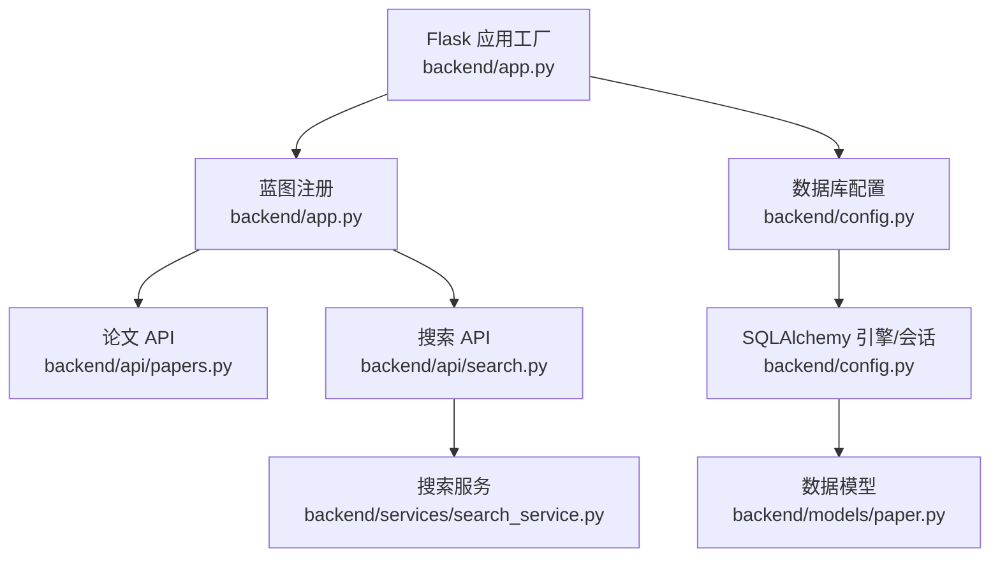
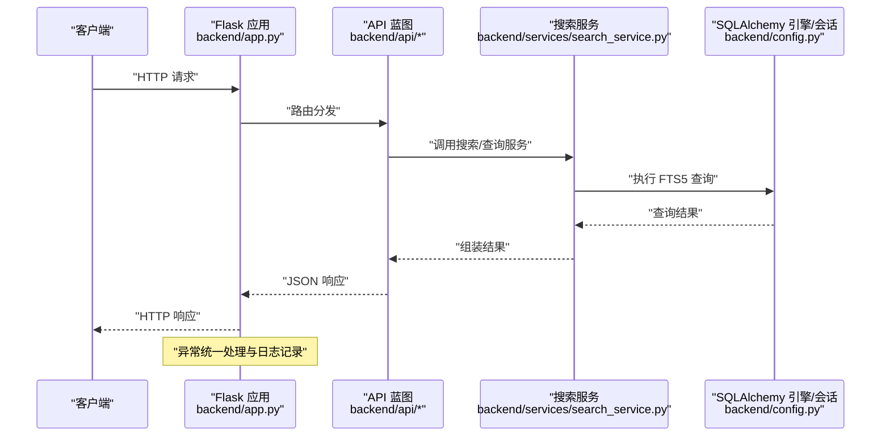
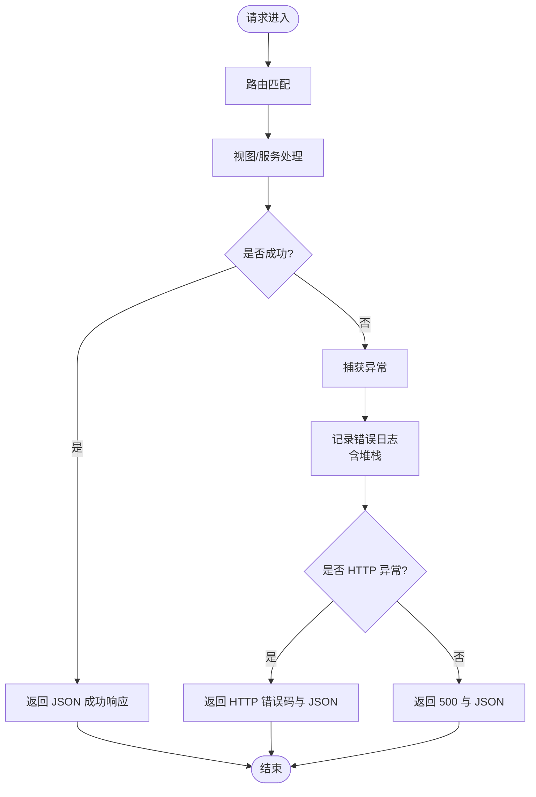
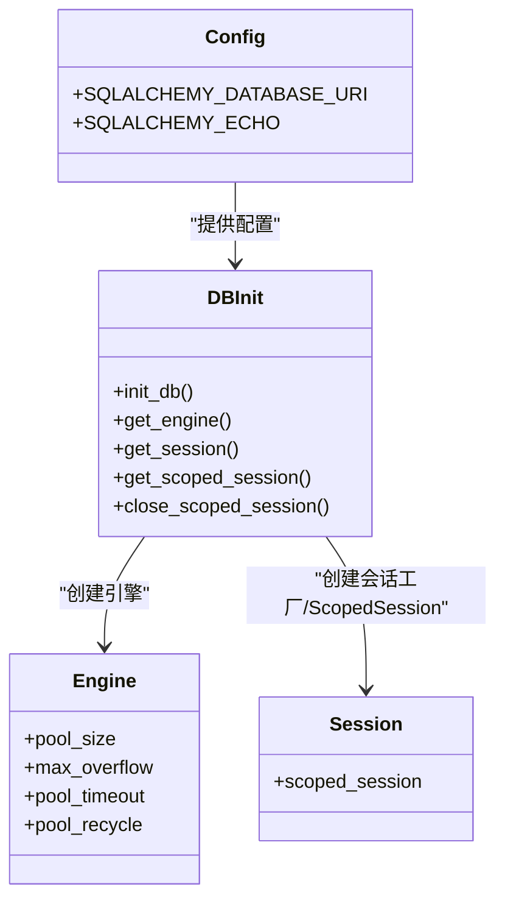
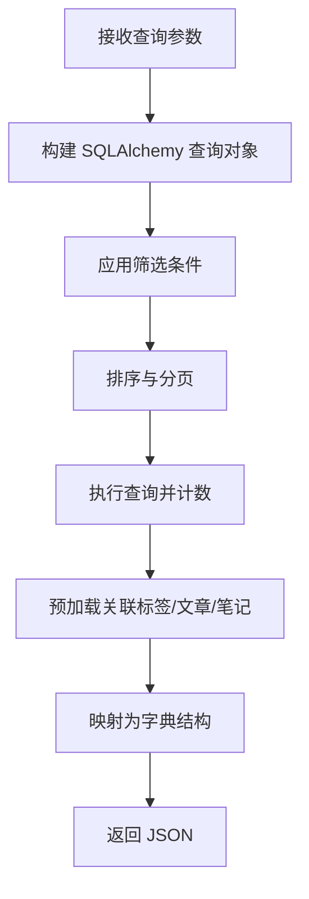
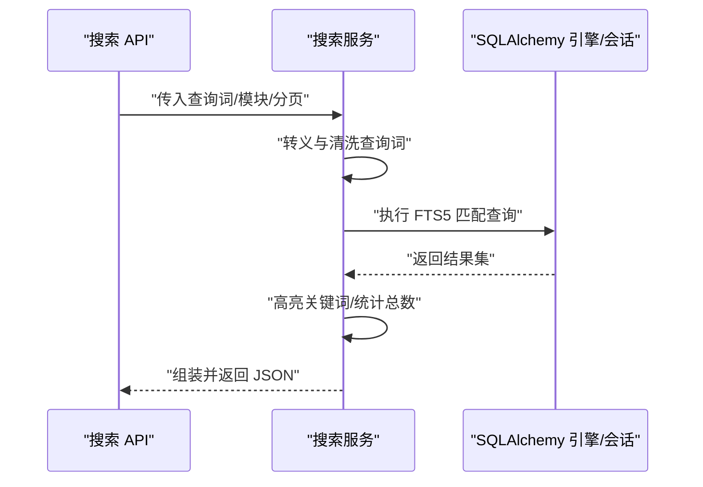
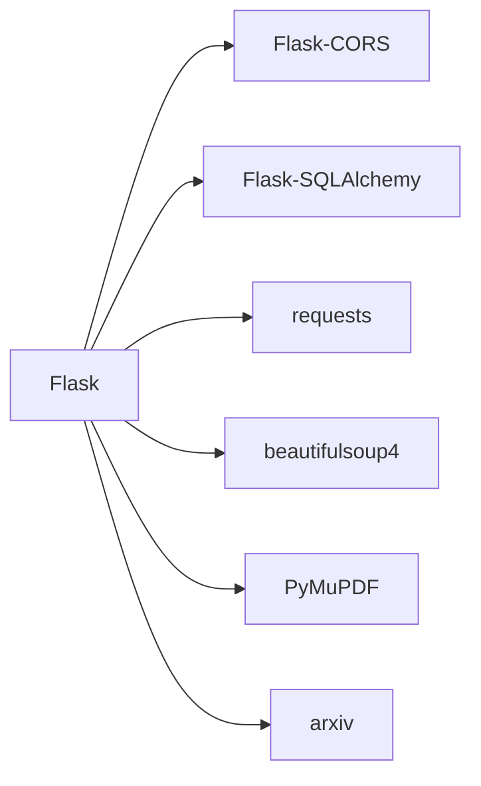

# 性能监控

<cite>
**本文引用的文件**
- [backend/app.py](file://backend/app.py)
- [backend/config.py](file://backend/config.py)
- [backend/api/papers.py](file://backend/api/papers.py)
- [backend/api/search.py](file://backend/api/search.py)
- [backend/services/search_service.py](file://backend/services/search_service.py)
- [backend/models/paper.py](file://backend/models/paper.py)
- [scripts/maintenance/check_schema.py](file://scripts/maintenance/check_schema.py)
- [scripts/tests/test_batch_api.py](file://scripts/tests/test_batch_api.py)
- [backend/requirements.txt](file://backend/requirements.txt)
</cite>

## 目录
1. [简介](#简介)
2. [项目结构](#项目结构)
3. [核心组件](#核心组件)
4. [架构总览](#架构总览)
5. [详细组件分析](#详细组件分析)
6. [依赖分析](#依赖分析)
7. [性能考量](#性能考量)
8. [故障排查指南](#故障排查指南)
9. [结论](#结论)
10. [附录](#附录)

## 简介
本指南聚焦于 PaperHub 后端的性能监控与日志配置，围绕以下目标展开：
- 解释 Flask 应用的日志配置、扫描请求过滤与异常处理机制
- 说明数据库连接池监控、内存使用监控与响应时间监控的实现现状与优化方向
- 提供性能瓶颈识别与优化建议：数据库查询优化、缓存策略、并发处理
- 文档化错误追踪与异常处理流程，以及告警配置建议
- 给出系统资源监控与容量规划建议

## 项目结构
后端采用 Flask + SQLAlchemy 的轻量级架构，核心入口为应用工厂函数，数据库连接通过集中式配置模块初始化，API 蓝图按功能域划分，服务层封装检索逻辑。

图表来源
- [backend/app.py:41-137](file://backend/app.py#L41-L137)
- [backend/config.py:85-134](file://backend/config.py#L85-L134)
- [backend/api/papers.py:1-200](file://backend/api/papers.py#L1-L200)
- [backend/api/search.py:1-70](file://backend/api/search.py#L1-L70)
- [backend/services/search_service.py:1-200](file://backend/services/search_service.py#L1-L200)
- [backend/models/paper.py:1-360](file://backend/models/paper.py#L1-L360)

章节来源
- [backend/app.py:41-137](file://backend/app.py#L41-L137)
- [backend/config.py:85-134](file://backend/config.py#L85-L134)

## 核心组件
- 日志与异常处理：应用启动时设置基础日志格式，并为 Werkzeug 日志器添加扫描请求过滤器；全局异常处理器统一返回 JSON 并记录错误堆栈。
- 数据库连接池：集中式引擎与会话工厂初始化，支持连接池参数配置与线程安全的 ScopedSession 生命周期管理。
- API 层：论文与搜索 API 负责业务请求解析与结果返回；搜索服务封装 FTS5 查询与高亮逻辑。
- 模型层：定义论文、文章、笔记及标签等实体与多对多关联表，支撑全文检索与标签筛选。

章节来源
- [backend/app.py:46-90](file://backend/app.py#L46-L90)
- [backend/config.py:85-134](file://backend/config.py#L85-L134)
- [backend/api/papers.py:29-108](file://backend/api/papers.py#L29-L108)
- [backend/api/search.py:14-51](file://backend/api/search.py#L14-L51)
- [backend/services/search_service.py:39-96](file://backend/services/search_service.py#L39-L96)
- [backend/models/paper.py:93-146](file://backend/models/paper.py#L93-L146)

## 架构总览
下图展示从客户端请求到数据库查询的关键路径，以及日志与异常处理的贯穿流程。

图表来源
- [backend/app.py:70-90](file://backend/app.py#L70-L90)
- [backend/api/search.py:14-51](file://backend/api/search.py#L14-L51)
- [backend/services/search_service.py:39-96](file://backend/services/search_service.py#L39-L96)
- [backend/config.py:85-134](file://backend/config.py#L85-L134)

## 详细组件分析

### 日志与异常处理
- 基础日志：应用启动时设置日志级别与格式，便于统一输出。
- 扫描请求过滤：自定义过滤器屏蔽扫描模式关键字，降低噪音日志。
- 全局异常处理：捕获未处理异常，区分 HTTP 与非 HTTP 异常，返回结构化错误信息并记录堆栈；对特定扫描路径返回 404 以避免暴露系统细节。

图表来源
- [backend/app.py:70-90](file://backend/app.py#L70-L90)
- [backend/app.py:32-38](file://backend/app.py#L32-L38)

章节来源
- [backend/app.py:46-90](file://backend/app.py#L46-L90)

### 数据库连接池与会话管理
- 初始化：应用启动时创建全局唯一引擎，配置连接池大小、溢出连接、获取超时与回收时间，避免 SQLite 锁问题。
- 会话工厂：基于引擎创建会话工厂，结合线程安全的 ScopedSession，确保同一线程内共享会话。
- 生命周期：请求结束后移除 ScopedSession，防止会话泄漏。

图表来源
- [backend/config.py:85-134](file://backend/config.py#L85-L134)

章节来源
- [backend/config.py:85-134](file://backend/config.py#L85-L134)

### 论文 API 与查询优化要点
- 分页与筛选：支持多维筛选（分类、状态、星标、来源、日期范围、标签）与分页，查询构建清晰。
- 关联预加载：在返回前触发关联属性访问，减少 N+1 查询风险。
- 文件大小计算：按需统计文件大小，注意磁盘 IO 对性能的影响。

图表来源
- [backend/api/papers.py:29-108](file://backend/api/papers.py#L29-L108)

章节来源
- [backend/api/papers.py:29-108](file://backend/api/papers.py#L29-L108)

### 搜索服务与全文检索
- 查询转义：对 FTS5 特殊字符进行转义与清洗，提升查询稳定性。
- 高亮：对标题与摘要进行关键词高亮，改善前端展示体验。
- FTS5 查询：显式使用 FTS5 表进行匹配与排序，限制返回字段并分页。

图表来源
- [backend/api/search.py:14-51](file://backend/api/search.py#L14-L51)
- [backend/services/search_service.py:8-26](file://backend/services/search_service.py#L8-L26)
- [backend/services/search_service.py:39-96](file://backend/services/search_service.py#L39-L96)

章节来源
- [backend/api/search.py:14-51](file://backend/api/search.py#L14-L51)
- [backend/services/search_service.py:39-96](file://backend/services/search_service.py#L39-L96)

### 数据模型与索引建议
- 多对多关联：论文/文章/笔记与标签通过中间表关联，支持灵活筛选。
- 建议：为高频查询字段（如 published_at、source、status、starred）建立索引；FTS5 表由 SQLite 自动维护，但需定期检查与重建以保持性能。

章节来源
- [backend/models/paper.py:18-87](file://backend/models/paper.py#L18-L87)

### 维护与测试工具
- 模式检查：脚本列出数据库表结构，辅助定位缺失索引或冗余列。
- 批量 API 测试：验证批量操作的正确性与错误处理行为，便于发现潜在性能问题。

章节来源
- [scripts/maintenance/check_schema.py:1-26](file://scripts/maintenance/check_schema.py#L1-L26)
- [scripts/tests/test_batch_api.py:107-180](file://scripts/tests/test_batch_api.py#L107-L180)

## 依赖分析
- Flask 与扩展：Flask、Flask-CORS、Flask-SQLAlchemy 提供 Web 框架、跨域与 ORM 能力。
- 文档解析与网络：arxiv、PyMuPDF、requests、beautifulsoup4、trafilatura、readability-lxml、newspaper3k、lxml、html2text 等用于抓取与解析外部内容，可能成为 I/O 密集型性能瓶颈。

图表来源
- [backend/requirements.txt:1-15](file://backend/requirements.txt#L1-L15)

章节来源
- [backend/requirements.txt:1-15](file://backend/requirements.txt#L1-L15)

## 性能考量

### 数据库连接池监控
- 当前实现
  - 已启用连接池参数配置，包含池大小、溢出连接、获取超时与回收时间。
  - 使用线程安全的 ScopedSession，请求结束时移除，避免会话泄漏。
- 建议
  - 生产环境开启连接池状态监控（如 pool_size、checked_out、overflow 等指标），结合慢查询日志定位热点。
  - 针对 SQLite，合理设置 pool_recycle 以规避锁竞争；若并发较高，考虑迁移到 PostgreSQL 并启用连接池管理器。

章节来源
- [backend/config.py:92-99](file://backend/config.py#L92-L99)
- [backend/config.py:128-134](file://backend/config.py#L128-L134)

### 内存使用监控
- 当前实现
  - 未内置内存采样与告警机制。
- 建议
  - 在生产部署中集成进程级内存监控（如 psutil 或系统 cgroup 指标），设定阈值告警。
  - 对大文档解析与全文检索场景，控制单次处理的数据规模，避免峰值内存过高。

[本节为通用指导，无需文件引用]

### 响应时间监控
- 当前实现
  - 未内置请求耗时埋点与指标导出。
- 建议
  - 在 API 层增加请求开始/结束时间戳，计算耗时并记录到日志或指标系统。
  - 对慢查询（如搜索服务）单独打点，区分网络抓取、解析与数据库查询阶段。

[本节为通用指导，无需文件引用]

### 数据库查询优化
- 现状
  - 论文 API 使用多条件筛选与分页；搜索服务使用 FTS5 匹配与排序。
- 优化建议
  - 为高频筛选字段建立索引（如 published_at、source、status、starred）。
  - 控制 SELECT 字段数量，避免不必要的大字段传输。
  - 对复杂筛选组合，评估是否可通过物化视图或二级索引优化。

章节来源
- [backend/api/papers.py:47-97](file://backend/api/papers.py#L47-L97)
- [backend/services/search_service.py:48-71](file://backend/services/search_service.py#L48-L71)

### 缓存策略
- 建议
  - 对静态资源与只读列表（如标签、分类）启用短期缓存。
  - 对热门搜索词与结果进行 LRU 缓存，降低重复查询压力。
  - 使用 Redis/Memcached 作为缓存层，注意序列化与键空间管理。

[本节为通用指导，无需文件引用]

### 并发处理
- 建议
  - 使用 gunicorn/uWSGI 等 WSGI 服务器承载多进程/多线程，结合 CPU 核心数配置 worker 数量。
  - 对 I/O 密集型任务（下载/解析）使用异步队列（如 Celery/RQ）解耦，避免阻塞主请求线程。

[本节为通用指导，无需文件引用]

### 错误追踪与异常处理
- 现状
  - 全局异常处理器统一返回 JSON，并记录堆栈；对扫描路径返回 404。
- 建议
  - 集成结构化日志（如 JSON 格式）与上下文字段（trace_id、endpoint、user_agent）。
  - 对 5xx 错误接入告警通道（如邮件/IM/Webhook），设置阈值与收敛窗口。
  - 对常见异常（如数据库连接失败、超时）进行降级与重试策略。

章节来源
- [backend/app.py:70-90](file://backend/app.py#L70-L90)

### 系统资源监控与容量规划
- 建议
  - 监控 CPU、内存、磁盘 IO、网络带宽与连接数；对 SQLite 场景关注锁等待与文件系统性能。
  - 基于历史峰值与增长趋势进行容量规划，预留 20%-30% 缓冲。
  - 对 PDF 解析与网络抓取引入限速与熔断，避免资源枯竭。

[本节为通用指导，无需文件引用]

## 故障排查指南
- 健康检查
  - 使用健康端点确认服务可用性，便于自动化巡检与重启。
- 日志定位
  - 查看全局异常日志与扫描过滤后的访问日志，快速定位异常类型与发生位置。
- 数据库诊断
  - 使用维护脚本检查表结构，核对索引是否存在；结合查询计划分析慢查询。
- 批量操作验证
  - 使用测试脚本验证批量操作的正确性与错误处理，发现边界条件与性能退化。

章节来源
- [backend/app.py:101-103](file://backend/app.py#L101-L103)
- [backend/app.py:70-90](file://backend/app.py#L70-L90)
- [scripts/maintenance/check_schema.py:1-26](file://scripts/maintenance/check_schema.py#L1-L26)
- [scripts/tests/test_batch_api.py:317-360](file://scripts/tests/test_batch_api.py#L317-L360)

## 结论
PaperHub 当前具备基础的日志与异常处理能力，数据库连接池通过集中式配置实现，API 层与服务层职责清晰。为进一步提升可观测性与稳定性，建议补充请求耗时与慢查询打点、连接池与系统资源监控、缓存与并发优化策略，并完善错误追踪与告警体系。针对 SQLite 的并发与锁问题，可考虑迁移至更适配的数据库并启用专业连接池管理。

[本节为总结性内容，无需文件引用]

## 附录
- 快速检查清单
  - 是否启用连接池状态监控与慢查询日志？
  - 是否对高频筛选字段建立索引？
  - 是否对静态资源与只读列表启用缓存？
  - 是否对 5xx 错误接入告警通道？
  - 是否对 PDF 解析与网络抓取引入限速与熔断？

[本节为通用指导，无需文件引用]