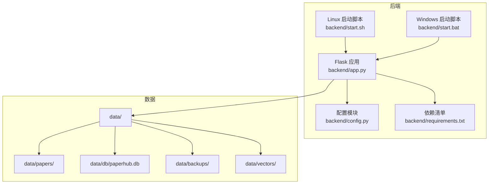
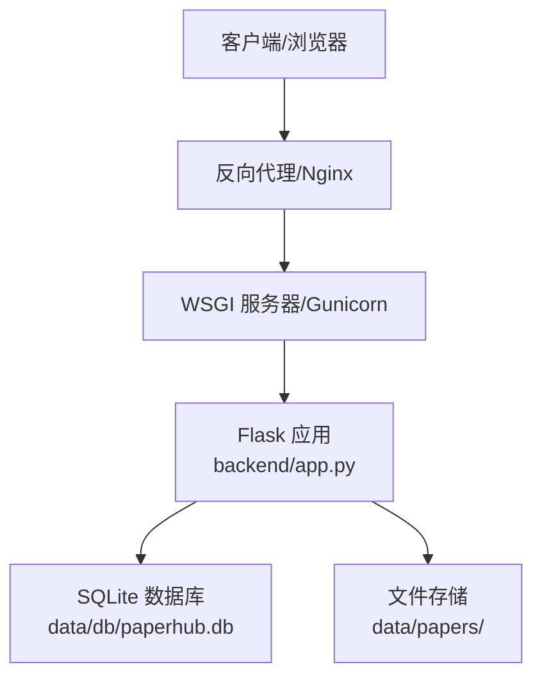
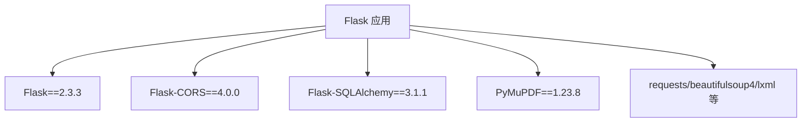

# 生产环境部署

<cite>
**本文引用的文件**
- [backend/config.py](file://backend/config.py)
- [backend/app.py](file://backend/app.py)
- [backend/start.sh](file://backend/start.sh)
- [backend/start.bat](file://backend/start.bat)
- [backend/requirements.txt](file://backend/requirements.txt)
- [backend/README.md](file://backend/README.md)
- [specs/system/global_config.yml](file://specs/system/global_config.yml)
- [scripts/maintenance/backup.py](file://scripts/maintenance/backup.py)
- [scripts/maintenance/restore.py](file://scripts/maintenance/restore.py)
- [specs/backend/api/backup.yml](file://specs/backend/api/backup.yml)
- [specs/backend/api/papers.yml](file://specs/backend/api/papers.yml)
- [README.md](file://README.md)
</cite>

## 目录
1. [简介](#简介)
2. [项目结构](#项目结构)
3. [核心组件](#核心组件)
4. [架构总览](#架构总览)
5. [详细组件分析](#详细组件分析)
6. [依赖分析](#依赖分析)
7. [性能考虑](#性能考虑)
8. [故障排查指南](#故障排查指南)
9. [结论](#结论)
10. [附录](#附录)

## 简介
本指南面向在生产环境中部署 PaperHub 的运维与开发团队，提供从环境变量配置、Flask 生产配置、数据库连接池、文件上传限制，到 Linux 与 Windows 平台部署脚本与进程管理、安全加固（含 HTTPS 与访问控制）、以及性能优化与资源限制的完整实践说明。文档严格基于仓库中的配置与脚本文件进行分析与提炼，确保可操作性与可追溯性。

## 项目结构
PaperHub 采用前后端分离的单仓结构，后端为 Flask 应用，前端为静态页面。生产部署主要围绕后端 Flask 应用展开，数据目录位于项目根目录下的 data 子目录，包含 papers、db、backups、vectors 等子目录。

图表来源
- [backend/app.py:1-234](file://backend/app.py#L1-L234)
- [backend/config.py:1-134](file://backend/config.py#L1-L134)
- [backend/start.sh:1-24](file://backend/start.sh#L1-L24)
- [backend/start.bat:1-24](file://backend/start.bat#L1-L24)

章节来源
- [README.md:383-481](file://README.md#L383-L481)
- [backend/README.md:50-84](file://backend/README.md#L50-L84)

## 核心组件
- Flask 应用与路由注册：应用在创建时加载配置、初始化数据库、注册蓝图，并提供健康检查与静态资源路由。
- 配置模块：集中管理 SECRET_KEY、CORS、文件上传大小限制、数据库连接 URI、ChromaDB 持久化目录等。
- 数据库连接池：通过 SQLAlchemy 初始化全局 Engine 与 Session 工厂，支持连接池大小、溢出连接、超时与回收策略。
- 启动脚本：Linux/macOS 使用 start.sh，Windows 使用 start.bat，自动安装依赖并启动应用。
- 备份与恢复：提供命令行工具与 API，支持备份导出、列表查询、删除与交互式恢复。

章节来源
- [backend/app.py:41-137](file://backend/app.py#L41-L137)
- [backend/config.py:35-134](file://backend/config.py#L35-L134)
- [backend/start.sh:1-24](file://backend/start.sh#L1-L24)
- [backend/start.bat:1-24](file://backend/start.bat#L1-L24)
- [scripts/maintenance/backup.py:1-121](file://scripts/maintenance/backup.py#L1-L121)
- [scripts/maintenance/restore.py:1-166](file://scripts/maintenance/restore.py#L1-L166)

## 架构总览
生产部署建议采用反向代理（如 Nginx）前置，后端以 WSGI 服务器（如 Gunicorn）运行，实现 HTTPS 终结、静态资源缓存、限流与健康检查。数据库使用 SQLite，结合连接池参数与定期备份策略保障稳定性。

图表来源
- [backend/app.py:101-136](file://backend/app.py#L101-L136)
- [backend/config.py:39-42](file://backend/config.py#L39-L42)

## 详细组件分析

### Flask 生产配置要点
- SECRET_KEY：用于会话签名等安全用途，生产环境必须设置为强随机字符串，且与部署环境隔离。
- CORS 配置：开发环境允许所有来源，生产环境建议限定可信域名，避免通配符。
- 文件上传限制：MAX_CONTENT_LENGTH 控制请求体大小，生产环境可根据业务峰值调优。
- 数据库连接池：通过 SQLAlchemy 初始化全局 Engine，设置 pool_size、max_overflow、pool_timeout、pool_recycle，避免 SQLite 锁竞争。
- 静态资源与健康检查：提供 /health、/favicon.ico、/static/* 等路由，便于监控与前端资源访问。

章节来源
- [backend/config.py:35-56](file://backend/config.py#L35-L56)
- [backend/config.py:85-134](file://backend/config.py#L85-L134)
- [backend/app.py:54-64](file://backend/app.py#L54-L64)
- [backend/app.py:101-136](file://backend/app.py#L101-L136)

### CORS 配置与访问控制
- 开发环境：CORS 允许所有来源，便于本地联调。
- 生产环境：建议将 CORS_ORIGINS 限定为实际域名白名单，避免跨域风险；同时在反向代理层统一处理跨域头，确保安全性与一致性。

章节来源
- [backend/config.py:44-48](file://backend/config.py#L44-L48)
- [backend/app.py:57-62](file://backend/app.py#L57-L62)

### 数据库连接池设置
- 连接池大小：根据并发请求与数据库写入负载设定 pool_size。
- 溢出连接：max_overflow 控制在池满时可额外创建的连接数。
- 超时与回收：pool_timeout 控制获取连接的等待时间；pool_recycle 控制连接回收周期，避免 SQLite 长事务导致锁问题。

章节来源
- [backend/config.py:92-99](file://backend/config.py#L92-L99)

### 文件上传限制
- MAX_CONTENT_LENGTH：默认 50MB，生产环境可根据 PDF/图片等文件大小与并发量调整。
- UPLOAD_FOLDER：上传根目录，需确保磁盘空间与权限充足。

章节来源
- [backend/config.py:50-52](file://backend/config.py#L50-L52)

### 启动脚本与进程管理
- Linux/macOS：start.sh 自动安装依赖并启动应用。
- Windows：start.bat 同步流程。
- 建议：生产环境使用 systemd（Linux）或任务计划程序（Windows）管理守护进程，配合日志轮转与健康检查。

章节来源
- [backend/start.sh:1-24](file://backend/start.sh#L1-L24)
- [backend/start.bat:1-24](file://backend/start.bat#L1-L24)
- [backend/README.md:25-46](file://backend/README.md#L25-L46)

### HTTPS 与安全加固
- HTTPS 终结：建议在反向代理层启用 TLS，证书由权威 CA 颁发并定期续期。
- 访问控制：CORS 白名单限定、反向代理层速率限制与 IP 黑名单。
- 会话安全：设置 secure、HttpOnly、SameSite 等 Cookie 属性（在反向代理或应用层配置）。
- 敏感信息：SECRET_KEY、第三方 API Key 等置于环境变量或安全密钥管理服务。

章节来源
- [specs/system/global_config.yml:4-7](file://specs/system/global_config.yml#L4-L7)
- [backend/config.py:37](file://backend/config.py#L37)

### 备份与恢复
- 命令行工具：支持创建备份、列出备份、交互式恢复，恢复前自动备份当前数据库。
- API 接口：提供导出、导入、列表、删除等接口，支持二进制下载与 multipart 上传。
- 建议：生产环境定期调度备份任务，保留多版本备份，异地归档。

章节来源
- [scripts/maintenance/backup.py:1-121](file://scripts/maintenance/backup.py#L1-L121)
- [scripts/maintenance/restore.py:1-166](file://scripts/maintenance/restore.py#L1-L166)
- [specs/backend/api/backup.yml:1-92](file://specs/backend/api/backup.yml#L1-L92)

### 性能与资源限制
- 连接池参数：根据并发与数据库写入压力调整 pool_size 与 max_overflow。
- 请求体限制：合理设置 MAX_CONTENT_LENGTH，避免内存占用过高。
- 静态资源：由反向代理缓存与压缩，减轻后端压力。
- 监控与日志：启用健康检查端点与异常拦截，结合日志聚合与告警。

章节来源
- [backend/config.py:92-99](file://backend/config.py#L92-L99)
- [backend/config.py:50-52](file://backend/config.py#L50-L52)
- [backend/app.py:101-103](file://backend/app.py#L101-L103)

## 依赖分析
后端依赖通过 requirements.txt 管理，核心组件包括 Flask、Flask-CORS、Flask-SQLAlchemy 与 PDF/网络解析相关库。生产部署建议锁定版本并定期审计。

图表来源
- [backend/requirements.txt:1-15](file://backend/requirements.txt#L1-L15)

章节来源
- [backend/requirements.txt:1-15](file://backend/requirements.txt#L1-L15)

## 性能考虑
- 连接池：根据并发与数据库写入负载调整 pool_size 与 max_overflow，避免阻塞与锁竞争。
- 上传限制：结合业务场景设置 MAX_CONTENT_LENGTH，避免内存压力。
- 反向代理：启用静态资源缓存、Gzip 压缩与健康检查，提升响应速度与稳定性。
- 监控：利用 /health 端点与日志系统，建立告警与容量规划。

章节来源
- [backend/config.py:92-99](file://backend/config.py#L92-L99)
- [backend/config.py:50-52](file://backend/config.py#L50-L52)
- [backend/app.py:101-103](file://backend/app.py#L101-L103)

## 故障排查指南
- 异常处理：应用内置异常拦截，区分 NotFound 与扫描请求，避免日志污染。
- 扫描过滤：通过 ScanFilter 过滤常见扫描请求，降低噪音。
- 备份恢复：使用命令行工具与 API 进行备份与恢复，恢复前自动备份当前数据库，防止误操作。

章节来源
- [backend/app.py:25-39](file://backend/app.py#L25-L39)
- [backend/app.py:70-89](file://backend/app.py#L70-L89)
- [scripts/maintenance/restore.py:57-123](file://scripts/maintenance/restore.py#L57-L123)

## 结论
生产部署 PaperHub 的关键在于：严格的环境变量与安全配置、合理的数据库连接池与文件上传限制、稳定的进程与守护进程管理、完善的备份与恢复机制，以及通过反向代理实现 HTTPS 终结与访问控制。遵循本指南可显著提升系统的可靠性与安全性。

## 附录

### A. 生产环境参数清单
- SECRET_KEY：强随机字符串，用于会话签名。
- CORS_ORIGINS：生产环境限定为可信域名列表。
- MAX_CONTENT_LENGTH：按业务峰值设置，单位字节。
- SQLALCHEMY_POOL_SIZE / MAX_OVERFLOW / POOL_TIMEOUT / POOL_RECYCLE：按并发与数据库负载调优。
- 上传目录与备份目录：确保磁盘空间与权限。

章节来源
- [specs/system/global_config.yml:4-7](file://specs/system/global_config.yml#L4-L7)
- [specs/system/global_config.yml:24-31](file://specs/system/global_config.yml#L24-L31)
- [specs/system/global_config.yml:44-59](file://specs/system/global_config.yml#L44-L59)
- [backend/config.py:37](file://backend/config.py#L37)
- [backend/config.py:44-52](file://backend/config.py#L44-L52)
- [backend/config.py:92-99](file://backend/config.py#L92-L99)

### B. Linux 与 Windows 部署脚本使用
- Linux/macOS：进入 backend 目录执行 start.sh，自动安装依赖并启动应用。
- Windows：进入 backend 目录执行 start.bat，行为一致。
- 建议：使用 systemd 或任务计划程序管理守护进程，配合日志轮转与健康检查。

章节来源
- [backend/start.sh:1-24](file://backend/start.sh#L1-L24)
- [backend/start.bat:1-24](file://backend/start.bat#L1-L24)
- [backend/README.md:25-46](file://backend/README.md#L25-L46)

### C. API 与数据模型参考
- 论文库 API：支持分页、筛选、导入、搜索等，详见 papers.yml。
- 备份 API：支持导出、导入、列表、删除，详见 backup.yml。
- 数据模型：Paper/Article/Note/Tag 关联表，详见 docs/SCHEMA.md。

章节来源
- [specs/backend/api/papers.yml:1-404](file://specs/backend/api/papers.yml#L1-L404)
- [specs/backend/api/backup.yml:1-92](file://specs/backend/api/backup.yml#L1-L92)
- [README.md:464](file://README.md#L464)