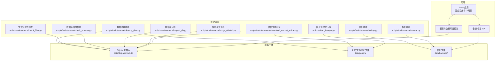
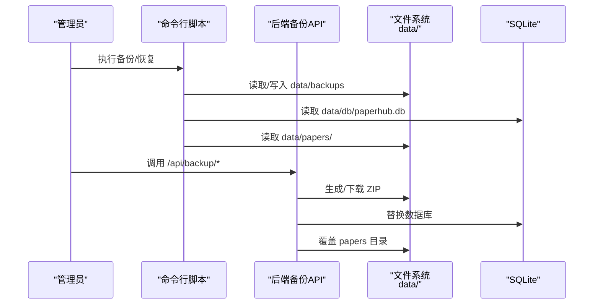
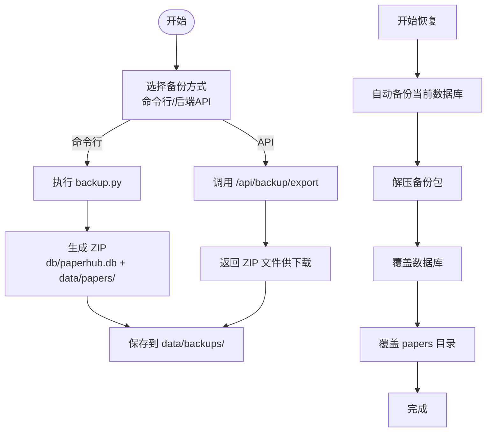
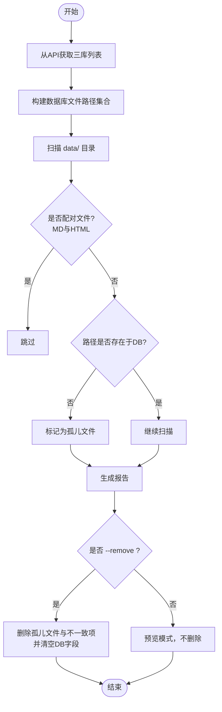
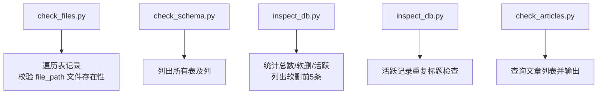
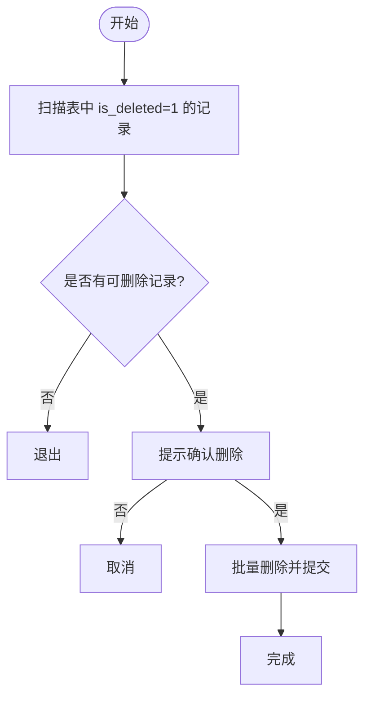
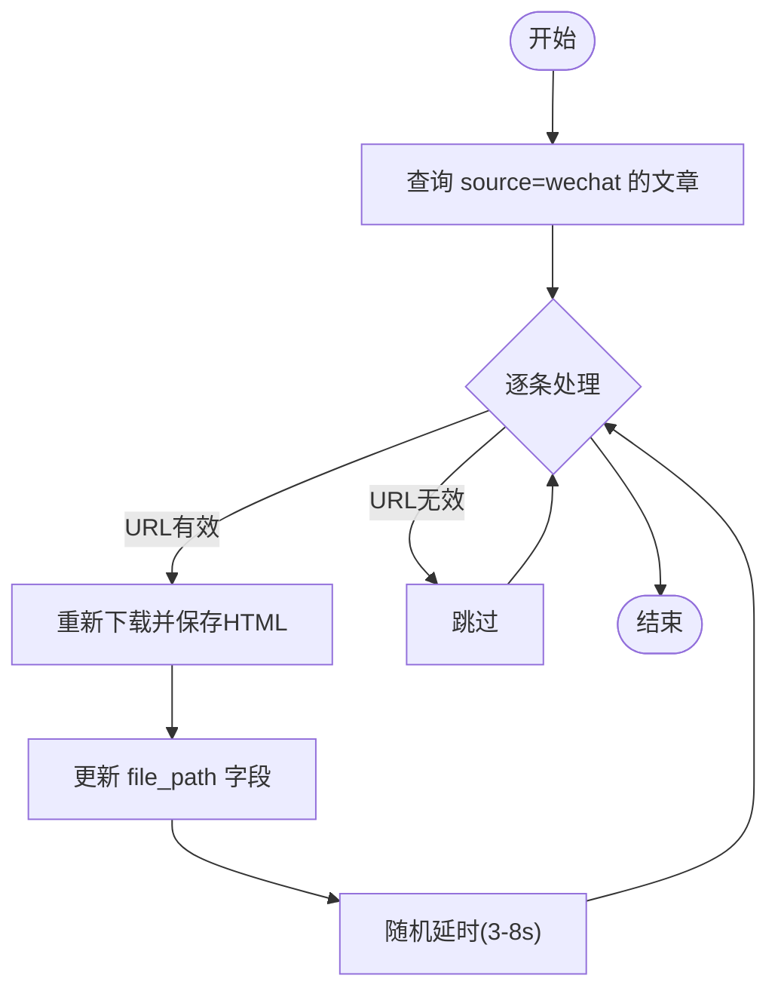
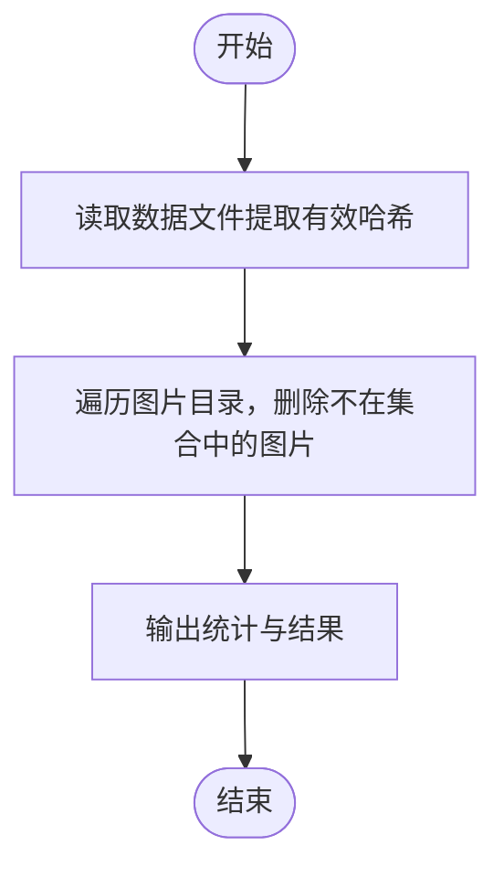
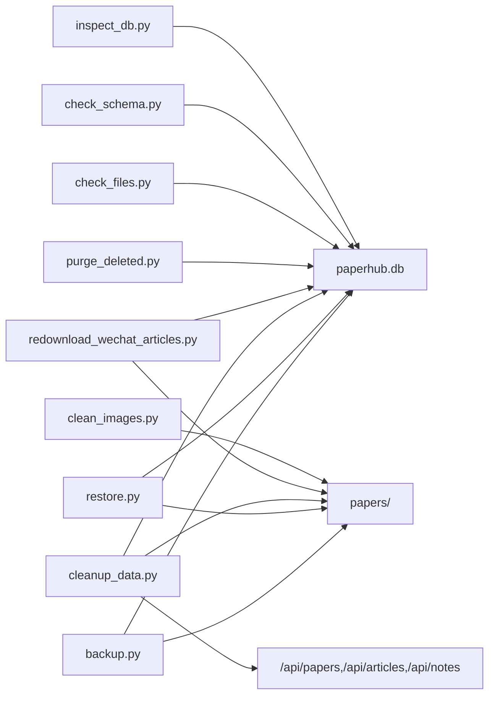

# 维护和优化

<cite>
**本文引用的文件**
- [README.md](file://README.md)
- [CHECKLIST.md](file://CHECKLIST.md)
- [backend/config.py](file://backend/config.py)
- [backend/app.py](file://backend/app.py)
- [backend/api/backup.py](file://backend/api/backup.py)
- [scripts/maintenance/backup.py](file://scripts/maintenance/backup.py)
- [scripts/maintenance/restore.py](file://scripts/maintenance/restore.py)
- [scripts/maintenance/cleanup_data.py](file://scripts/maintenance/cleanup_data.py)
- [scripts/maintenance/check_files.py](file://scripts/maintenance/check_files.py)
- [scripts/maintenance/check_schema.py](file://scripts/maintenance/check_schema.py)
- [scripts/maintenance/inspect_db.py](file://scripts/maintenance/inspect_db.py)
- [scripts/maintenance/purge_deleted.py](file://scripts/maintenance/purge_deleted.py)
- [scripts/maintenance/redownload_wechat_articles.py](file://scripts/maintenance/redownload_wechat_articles.py)
- [scripts/maintenance/check_articles.py](file://scripts/maintenance/check_articles.py)
- [scripts/clean_images.py](file://scripts/clean_images.py)
</cite>

## 目录
1. [简介](#简介)
2. [项目结构](#项目结构)
3. [核心组件](#核心组件)
4. [架构总览](#架构总览)
5. [详细组件分析](#详细组件分析)
6. [依赖分析](#依赖分析)
7. [性能考虑](#性能考虑)
8. [故障排除指南](#故障排除指南)
9. [结论](#结论)
10. [附录](#附录)

## 简介
本指南面向PaperHub系统的运维与优化，围绕“定期维护任务、备份与恢复、数据清理、系统健康检查与诊断、性能优化、最佳实践与故障排除”展开。文档以仓库内的脚本与API为依据，提供可操作的步骤、流程图与最佳实践建议，帮助读者在不深入源码的前提下高效开展日常维护与应急处置。

## 项目结构
PaperHub采用前后端分离与本地化存储架构：后端使用Flask + SQLite + SQLAlchemy；前端为单页应用；数据集中于data目录（papers、db、backups等）。维护工具集中在scripts/maintenance目录，备份与恢复同时支持命令行与后端API。

图表来源
- [backend/app.py:140-158](file://backend/app.py#L140-L158)
- [backend/config.py:76-134](file://backend/config.py#L76-L134)
- [backend/api/backup.py:16-249](file://backend/api/backup.py#L16-L249)
- [scripts/maintenance/backup.py:1-121](file://scripts/maintenance/backup.py#L1-L121)
- [scripts/maintenance/restore.py:1-166](file://scripts/maintenance/restore.py#L1-L166)
- [scripts/maintenance/cleanup_data.py:1-325](file://scripts/maintenance/cleanup_data.py#L1-L325)
- [scripts/maintenance/check_files.py:1-77](file://scripts/maintenance/check_files.py#L1-L77)
- [scripts/maintenance/check_schema.py:1-26](file://scripts/maintenance/check_schema.py#L1-L26)
- [scripts/maintenance/inspect_db.py:1-91](file://scripts/maintenance/inspect_db.py#L1-L91)
- [scripts/maintenance/purge_deleted.py:1-79](file://scripts/maintenance/purge_deleted.py#L1-L79)
- [scripts/maintenance/redownload_wechat_articles.py:1-71](file://scripts/maintenance/redownload_wechat_articles.py#L1-L71)
- [scripts/clean_images.py:1-102](file://scripts/clean_images.py#L1-L102)

章节来源
- [README.md:383-481](file://README.md#L383-L481)
- [backend/config.py:18-32](file://backend/config.py#L18-L32)

## 核心组件
- 备份与恢复
  - 命令行备份/恢复：scripts/maintenance/backup.py、scripts/maintenance/restore.py
  - 后端API备份/恢复：backend/api/backup.py
- 数据清理
  - 通用清理：scripts/maintenance/cleanup_data.py（冗余文件、save_local不一致项）
  - 微信补全：scripts/maintenance/redownload_wechat_articles.py
  - 图片清理：scripts/clean_images.py（宝玉AI公众号）
- 健康检查与诊断
  - 文件完整性：scripts/maintenance/check_files.py
  - 数据库结构：scripts/maintenance/check_schema.py
  - 数据库分析：scripts/maintenance/inspect_db.py（软删、重复标题）
  - 文章列表快照：scripts/maintenance/check_articles.py
  - 软删永久清理：scripts/maintenance/purge_deleted.py
- 配置与连接
  - 数据目录与连接池：backend/config.py
  - 应用与路由：backend/app.py

章节来源
- [backend/api/backup.py:46-171](file://backend/api/backup.py#L46-L171)
- [scripts/maintenance/backup.py:47-76](file://scripts/maintenance/backup.py#L47-L76)
- [scripts/maintenance/restore.py:57-123](file://scripts/maintenance/restore.py#L57-L123)
- [scripts/maintenance/cleanup_data.py:37-325](file://scripts/maintenance/cleanup_data.py#L37-L325)
- [scripts/maintenance/check_files.py:16-77](file://scripts/maintenance/check_files.py#L16-L77)
- [scripts/maintenance/check_schema.py:9-26](file://scripts/maintenance/check_schema.py#L9-L26)
- [scripts/maintenance/inspect_db.py:14-91](file://scripts/maintenance/inspect_db.py#L14-L91)
- [scripts/maintenance/purge_deleted.py:15-79](file://scripts/maintenance/purge_deleted.py#L15-L79)
- [scripts/maintenance/redownload_wechat_articles.py:20-71](file://scripts/maintenance/redownload_wechat_articles.py#L20-L71)
- [scripts/clean_images.py:72-102](file://scripts/clean_images.py#L72-L102)
- [backend/config.py:18-134](file://backend/config.py#L18-L134)

## 架构总览
备份与恢复既可通过后端API进行，也可通过命令行脚本执行。数据清理与健康检查脚本直接读取数据库与文件系统，定位冗余与不一致项，并提供预览与删除选项。

图表来源
- [scripts/maintenance/backup.py:47-76](file://scripts/maintenance/backup.py#L47-L76)
- [scripts/maintenance/restore.py:57-123](file://scripts/maintenance/restore.py#L57-L123)
- [backend/api/backup.py:46-171](file://backend/api/backup.py#L46-L171)

## 详细组件分析

### 备份与恢复组件
- 备份策略
  - 全量备份：打包数据库与papers目录，时间戳命名，支持自定义名称
  - 存储位置：data/backups/
- 恢复策略
  - 恢复前自动备份当前数据库，防止误操作
  - 解压备份并覆盖数据库与papers目录
- 命令行与API
  - 命令行：scripts/maintenance/backup.py、scripts/maintenance/restore.py
  - API：/api/backup/export、/api/backup/import、/api/backup/list、/api/backup/delete

图表来源
- [scripts/maintenance/backup.py:47-76](file://scripts/maintenance/backup.py#L47-L76)
- [scripts/maintenance/restore.py:57-123](file://scripts/maintenance/restore.py#L57-L123)
- [backend/api/backup.py:46-171](file://backend/api/backup.py#L46-L171)

章节来源
- [scripts/maintenance/backup.py:106-121](file://scripts/maintenance/backup.py#L106-L121)
- [scripts/maintenance/restore.py:146-166](file://scripts/maintenance/restore.py#L146-L166)
- [backend/api/backup.py:173-249](file://backend/api/backup.py#L173-L249)

### 数据清理组件
- 目标
  - 删除save_local=False但file_path非空的文件并清空字段
  - 删除数据库中无记录的磁盘文件（特殊目录配对文件除外）
- 流程
  - 通过API获取papers/articles/notes列表，构建数据库文件路径集合
  - 遍历data目录，识别孤儿文件与不一致项
  - 预览模式不删除，--remove参数才执行删除

图表来源
- [scripts/maintenance/cleanup_data.py:37-325](file://scripts/maintenance/cleanup_data.py#L37-L325)

章节来源
- [scripts/maintenance/cleanup_data.py:18-325](file://scripts/maintenance/cleanup_data.py#L18-L325)

### 健康检查与诊断组件
- 文件完整性检查
  - 遍历papers/articles/notes表，检查file_path对应的本地文件是否存在
- 数据库结构检查
  - 列出所有表及其列信息
- 数据库综合分析
  - 统计总数/软删/活跃数，列出软删记录前5条
  - 活跃记录中按标题分组统计重复
- 文章列表快照
  - 查询并输出文章基本信息（ID、标题、作者、URL、时间、文件路径）

图表来源
- [scripts/maintenance/check_files.py:16-77](file://scripts/maintenance/check_files.py#L16-L77)
- [scripts/maintenance/check_schema.py:9-26](file://scripts/maintenance/check_schema.py#L9-L26)
- [scripts/maintenance/inspect_db.py:14-91](file://scripts/maintenance/inspect_db.py#L14-L91)
- [scripts/maintenance/check_articles.py:21-36](file://scripts/maintenance/check_articles.py#L21-L36)

章节来源
- [scripts/maintenance/check_files.py:16-77](file://scripts/maintenance/check_files.py#L16-L77)
- [scripts/maintenance/check_schema.py:9-26](file://scripts/maintenance/check_schema.py#L9-L26)
- [scripts/maintenance/inspect_db.py:14-91](file://scripts/maintenance/inspect_db.py#L14-L91)
- [scripts/maintenance/check_articles.py:21-36](file://scripts/maintenance/check_articles.py#L21-L36)

### 软删永久清理组件
- 功能
  - 扫描软删记录（is_deleted=1），支持批量确认删除
  - 事务保护，失败回滚
- 注意
  - 仅对存在is_deleted字段的表生效

图表来源
- [scripts/maintenance/purge_deleted.py:15-79](file://scripts/maintenance/purge_deleted.py#L15-L79)

章节来源
- [scripts/maintenance/purge_deleted.py:15-79](file://scripts/maintenance/purge_deleted.py#L15-L79)

### 微信文章补全组件
- 功能
  - 重新下载微信文章，补全丢失的_files图片目录
  - 更新数据库file_path字段
  - 防反爬随机延时
- 适用场景
  - 文件系统损坏或迁移后图片目录缺失

图表来源
- [scripts/maintenance/redownload_wechat_articles.py:20-71](file://scripts/maintenance/redownload_wechat_articles.py#L20-L71)

章节来源
- [scripts/maintenance/redownload_wechat_articles.py:20-71](file://scripts/maintenance/redownload_wechat_articles.py#L20-L71)

### 图片清理组件（宝玉AI）
- 功能
  - 从数据文件中提取有效图片哈希，清理孤儿图片
- 适用场景
  - 公众号图片目录中存在历史遗留孤儿文件

图表来源
- [scripts/clean_images.py:72-102](file://scripts/clean_images.py#L72-L102)

章节来源
- [scripts/clean_images.py:72-102](file://scripts/clean_images.py#L72-L102)

## 依赖分析
- 维护脚本依赖
  - 数据库：SQLite（data/db/paperhub.db）
  - 文件系统：data/papers/、data/backups/
  - 后端API：/api/backup/*、/api/articles、/api/papers、/api/notes
- 配置与连接
  - 目录与连接池：backend/config.py
  - 路由注册：backend/app.py

图表来源
- [scripts/maintenance/backup.py:47-76](file://scripts/maintenance/backup.py#L47-L76)
- [scripts/maintenance/restore.py:57-123](file://scripts/maintenance/restore.py#L57-L123)
- [scripts/maintenance/cleanup_data.py:30-67](file://scripts/maintenance/cleanup_data.py#L30-L67)
- [scripts/maintenance/redownload_wechat_articles.py:16-63](file://scripts/maintenance/redownload_wechat_articles.py#L16-L63)
- [scripts/maintenance/purge_deleted.py:11-66](file://scripts/maintenance/purge_deleted.py#L11-L66)
- [scripts/maintenance/check_files.py:10-76](file://scripts/maintenance/check_files.py#L10-L76)
- [scripts/maintenance/check_schema.py:5-25](file://scripts/maintenance/check_schema.py#L5-L25)
- [scripts/maintenance/inspect_db.py:10-89](file://scripts/maintenance/inspect_db.py#L10-L89)
- [scripts/clean_images.py:74-99](file://scripts/clean_images.py#L74-L99)

章节来源
- [backend/config.py:18-32](file://backend/config.py#L18-L32)
- [backend/app.py:140-158](file://backend/app.py#L140-L158)

## 性能考虑
- 备份与恢复
  - 备份采用ZIP压缩，建议定期清理旧备份，控制data/backups目录大小
  - 恢复前自动备份当前数据库，避免误操作造成损失
- 数据库连接
  - 后端使用连接池（pool_size、max_overflow、pool_recycle），有助于缓解SQLite锁问题
- 健康检查
  - 文件完整性检查与数据库分析脚本适合在低峰时段执行，避免影响在线服务

章节来源
- [backend/config.py:92-103](file://backend/config.py#L92-L103)
- [scripts/maintenance/restore.py:71-80](file://scripts/maintenance/restore.py#L71-L80)

## 故障排除指南
- 备份/恢复失败
  - 确认data/backups目录可写
  - 恢复前务必确认已自动备份当前数据库
  - 恢复时选择正确的备份文件，注意文件名合法性
- 数据清理误删
  - 使用预览模式（不带--remove）先查看报告
  - 仅在确认无误后再执行删除
- 文件完整性异常
  - 使用check_files.py核对file_path与实际文件
  - 若为微信文章，使用redownload_wechat_articles.py补全
- 软删记录过多
  - 使用purge_deleted.py进行安全批量永久删除
- 图片目录膨胀
  - 使用clean_images.py清理孤儿图片

章节来源
- [scripts/maintenance/restore.py:57-123](file://scripts/maintenance/restore.py#L57-L123)
- [scripts/maintenance/cleanup_data.py:282-325](file://scripts/maintenance/cleanup_data.py#L282-L325)
- [scripts/maintenance/check_files.py:16-77](file://scripts/maintenance/check_files.py#L16-L77)
- [scripts/maintenance/purge_deleted.py:15-79](file://scripts/maintenance/purge_deleted.py#L15-L79)
- [scripts/maintenance/redownload_wechat_articles.py:20-71](file://scripts/maintenance/redownload_wechat_articles.py#L20-L71)
- [scripts/clean_images.py:72-102](file://scripts/clean_images.py#L72-L102)

## 结论
PaperHub提供了完善的维护工具链：命令行备份/恢复、API备份/恢复、数据清理、健康检查与诊断、软删清理与微信文章补全等。结合后端配置的连接池与路由，可在保障数据安全的前提下高效开展日常维护与应急处置。建议将上述流程纳入自动化巡检与演练，持续优化备份策略与清理频率，确保系统长期稳定运行。

## 附录
- 维护最佳实践
  - 定期执行文件完整性检查与数据库结构检查
  - 每月执行一次数据清理（预览模式），确认无误后删除
  - 每季度评估备份有效性，清理过期备份
  - 对微信文章定期补全，避免图片目录缺失
  - 对图片目录进行周期性清理，避免孤儿文件增长
- 相关文档与进度
  - 项目实施清单与功能特性详见README与CHECKLIST

章节来源
- [README.md:383-481](file://README.md#L383-L481)
- [CHECKLIST.md:569-585](file://CHECKLIST.md#L569-L585)