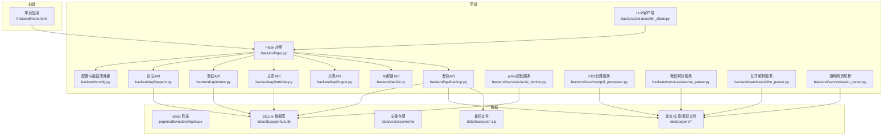
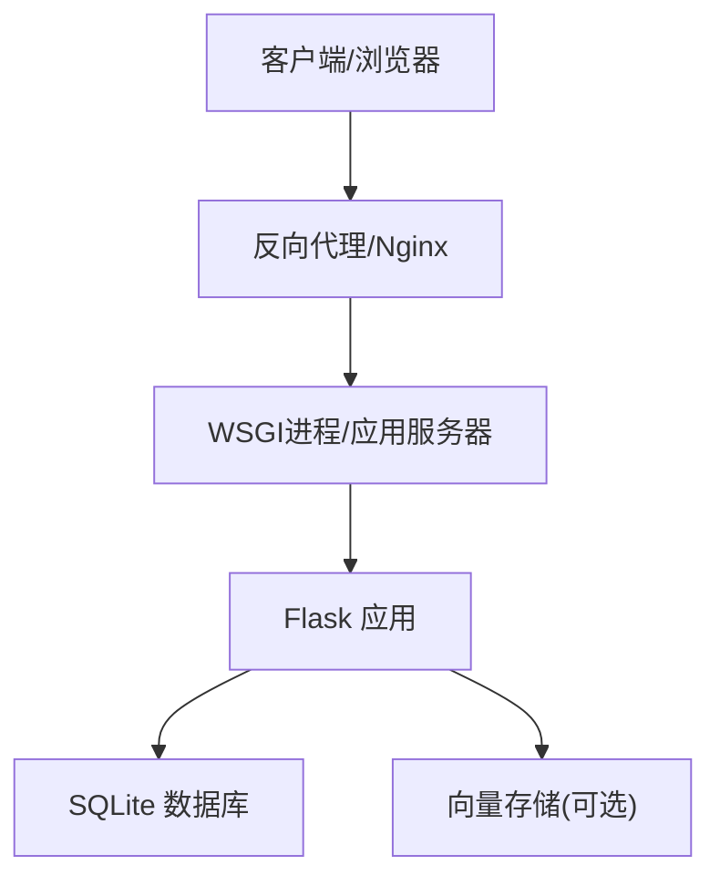
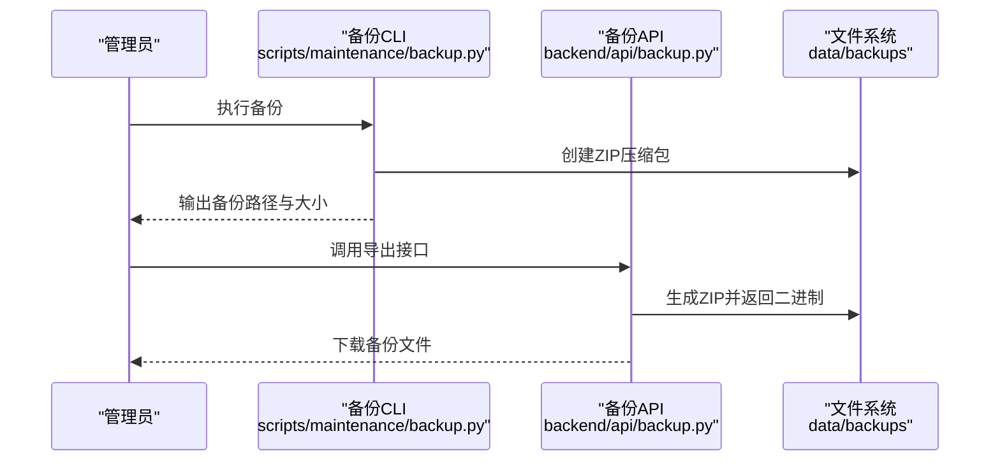
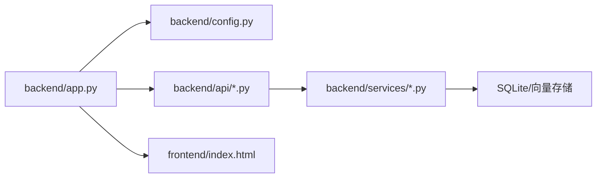

# 部署和运维

<cite>
**本文引用的文件**
- [backend/app.py](file://backend/app.py)
- [backend/config.py](file://backend/config.py)
- [backend/start.sh](file://backend/start.sh)
- [backend/start.bat](file://backend/start.bat)
- [backend/requirements.txt](file://backend/requirements.txt)
- [backend/requirements-py11.txt](file://backend/requirements-py11.txt)
- [backend/api/backup.py](file://backend/api/backup.py)
- [scripts/maintenance/backup.py](file://scripts/maintenance/backup.py)
- [scripts/maintenance/restore.py](file://scripts/maintenance/restore.py)
- [specs/backend/api/papers.yml](file://specs/backend/api/papers.yml)
- [specs/backend/api/backup.yml](file://specs/backend/api/backup.yml)
- [README.md](file://README.md)
- [CHECKLIST.md](file://CHECKLIST.md)
</cite>

## 目录
1. [简介](#简介)
2. [项目结构](#项目结构)
3. [核心组件](#核心组件)
4. [架构总览](#架构总览)
5. [详细组件分析](#详细组件分析)
6. [依赖关系分析](#依赖关系分析)
7. [性能考量](#性能考量)
8. [故障排查指南](#故障排查指南)
9. [结论](#结论)
10. [附录](#附录)

## 简介
本指南面向PaperHub生产环境的部署与运维，覆盖Flask应用部署配置、进程管理、负载均衡策略、日志与监控、错误追踪、容器化与自动化部署、监控告警、运维最佳实践、故障排除与系统优化，以及备份与灾难恢复。文档以仓库现有代码与规范为依据，结合实际部署场景给出可操作的建议。

## 项目结构
PaperHub采用前后端分离的单体式后端架构，后端基于Flask + SQLite + SQLAlchemy，前端为CDN版本的单页应用。数据目录位于项目根目录下的data，包含papers、db、vectors、backups等子目录；后端通过蓝图组织API路由，并在应用启动时注册。

图表来源
- [backend/app.py:1-137](file://backend/app.py#L1-L137)
- [backend/config.py:35-134](file://backend/config.py#L35-L134)
- [README.md:383-481](file://README.md#L383-L481)

章节来源
- [README.md:383-481](file://README.md#L383-L481)

## 核心组件
- Flask主应用与路由注册：集中于backend/app.py，负责CORS、静态资源路由、健康检查、异常处理、蓝图注册与数据库初始化。
- 配置与数据库连接：backend/config.py提供开发/生产配置、全局SQLAlchemy引擎与scoped_session管理，确保连接池与线程安全。
- 启动脚本：backend/start.sh与backend/start.bat分别用于Linux/macOS与Windows环境的一键安装依赖与启动。
- 备份与恢复：后端提供备份API与前端集成；同时提供命令行工具scripts/maintenance/backup.py与scripts/maintenance/restore.py，支持离线备份与恢复。
- API规范：specs/backend/api/*.yml描述了论文、备份等核心API的行为、输入输出与错误码，是部署与监控对接的重要依据。

章节来源
- [backend/app.py:41-137](file://backend/app.py#L41-L137)
- [backend/config.py:35-134](file://backend/config.py#L35-L134)
- [backend/start.sh:1-24](file://backend/start.sh#L1-L24)
- [backend/start.bat:1-24](file://backend/start.bat#L1-L24)
- [backend/api/backup.py](file://backend/api/backup.py)
- [scripts/maintenance/backup.py:1-121](file://scripts/maintenance/backup.py#L1-L121)
- [scripts/maintenance/restore.py:1-166](file://scripts/maintenance/restore.py#L1-L166)
- [specs/backend/api/papers.yml:1-404](file://specs/backend/api/papers.yml#L1-L404)
- [specs/backend/api/backup.yml:1-92](file://specs/backend/api/backup.yml#L1-L92)

## 架构总览
PaperHub后端采用“单实例+SQLite”的轻量架构，适合个人或小团队私有化部署。生产环境建议通过反向代理（如Nginx）前置，配合进程管理（如PM2/Gunicorn）与健康检查，实现高可用与可扩展。

图表来源
- [backend/app.py:101-103](file://backend/app.py#L101-L103)
- [backend/config.py:92-103](file://backend/config.py#L92-L103)

## 详细组件分析

### Flask应用部署配置
- 进程与端口
  - 开发模式默认端口为5799，可通过命令行参数传入；生产环境建议通过反向代理暴露80/443端口，应用监听127.0.0.1:PORT。
- CORS与静态资源
  - 全局CORS允许所有来源；静态资源路由包括前端index.html、笔记图片、微信/知乎/网页等静态文件。
- 健康检查
  - 提供/health接口返回状态ok，可用于Kubernetes/云平台健康探针。
- 异常处理
  - 全局异常捕获，区分HTTPException与未知异常，返回结构化错误；对扫描探测请求进行过滤，避免日志污染。
- 数据库初始化
  - 应用启动时创建表结构与初始标签；支持SQLite连接池与线程安全Session。

章节来源
- [backend/app.py:41-137](file://backend/app.py#L41-L137)
- [backend/config.py:85-134](file://backend/config.py#L85-L134)

### 进程管理与负载均衡
- 进程模型
  - 建议使用Gunicorn或uWSGI作为WSGI服务器，启动多个worker进程；每个worker独立持有SQLite连接，避免锁竞争。
- 反向代理
  - Nginx作为反向代理，提供SSL终止、静态资源缓存、限流与健康检查转发。
- 负载均衡
  - 多实例部署时，建议使用Nginx或云平台LB；若使用SQLite，需确保仅单实例写入或采用共享存储+锁策略（不推荐）；更优方案为迁移到PostgreSQL并使用主从复制。

章节来源
- [backend/app.py:220-234](file://backend/app.py#L220-L234)

### 日志配置
- 访问日志过滤
  - 通过ScanFilter过滤扫描探测请求，减少噪声；Werkzeug日志器挂载该过滤器。
- 异常日志
  - 全局异常处理器记录traceback；对NotFound且属于扫描特征的请求直接返回404，不计入ERROR级别日志。
- 建议
  - 生产环境启用结构化日志（JSON），输出到stdout，由容器编排系统收集；设置日志轮转与保留周期。

章节来源
- [backend/app.py:32-89](file://backend/app.py#L32-L89)

### 性能监控与错误追踪
- 监控指标
  - 建议采集：请求QPS/延迟、错误率、数据库连接池使用率、磁盘空间、向量存储大小。
- 错误追踪
  - 结合全局异常处理器与日志系统，对HTTPException与未知异常进行分类上报；对高频错误建立告警。
- 建议
  - 集成Prometheus+Grafana或云监控平台；对慢查询与异常堆栈进行采样上报。

章节来源
- [specs/backend/api/papers.yml:327-404](file://specs/backend/api/papers.yml#L327-L404)
- [specs/backend/api/backup.yml:1-92](file://specs/backend/api/backup.yml#L1-L92)

### 备份与灾难恢复
- 备份内容
  - SQLite数据库与data/papers目录全量打包；支持自定义命名与时间戳。
- 备份API
  - 后端提供导出、导入、列表、删除接口；前端在入库页集成备份管理。
- 命令行工具
  - scripts/maintenance/backup.py与scripts/maintenance/restore.py支持离线备份与交互式恢复，恢复前自动备份当前数据库。
- 灾难恢复流程
  - 评估RPO/RTO目标；定期演练恢复；验证恢复后的数据完整性与服务可用性。

图表来源
- [scripts/maintenance/backup.py:47-76](file://scripts/maintenance/backup.py#L47-L76)
- [backend/api/backup.py](file://backend/api/backup.py)

章节来源
- [backend/api/backup.py](file://backend/api/backup.py)
- [scripts/maintenance/backup.py:1-121](file://scripts/maintenance/backup.py#L1-L121)
- [scripts/maintenance/restore.py:1-166](file://scripts/maintenance/restore.py#L1-L166)
- [specs/backend/api/backup.yml:1-92](file://specs/backend/api/backup.yml#L1-L92)

### 容器化部署
- 建议镜像
  - 基于官方Python运行时镜像，COPY项目代码，安装依赖，暴露应用端口，设置工作目录与启动命令。
- 挂载卷
  - 将data目录映射到持久化存储，确保数据库与文件数据持久化。
- 健康检查
  - 使用/health接口进行健康探针；设置重启策略与资源限制。
- 反向代理
  - 在容器编排中使用Nginx作为边缘代理，提供TLS终止与静态资源缓存。

章节来源
- [backend/start.sh:17-24](file://backend/start.sh#L17-L24)
- [backend/requirements.txt:1-15](file://backend/requirements.txt#L1-15)

### 自动化部署与监控告警
- CI/CD
  - 使用流水线构建镜像、推送仓库、部署到目标环境；对备份与恢复流程进行自动化测试。
- 监控告警
  - 基于日志与指标建立阈值告警；对数据库连接池耗尽、磁盘空间不足、备份失败等关键事件报警。
- 变更管理
  - 采用蓝绿/金丝雀发布策略，逐步切换流量；回滚机制与变更审计。

章节来源
- [CHECKLIST.md:587-622](file://CHECKLIST.md#L587-L622)

## 依赖关系分析

图表来源
- [backend/app.py:140-157](file://backend/app.py#L140-L157)
- [backend/config.py:85-134](file://backend/config.py#L85-L134)

章节来源
- [backend/app.py:140-157](file://backend/app.py#L140-L157)
- [backend/config.py:85-134](file://backend/config.py#L85-L134)

## 性能考量
- 数据库连接池
  - 当前配置pool_size=5、max_overflow=10、pool_recycle=3600；生产环境根据并发与I/O能力调整。
- SQLite局限
  - 单实例写入瓶颈；建议在高并发场景迁移到PostgreSQL并使用主从复制。
- 静态资源
  - 前端CDN化，后端提供静态路由；Nginx缓存与Gzip压缩提升传输效率。
- 搜索与解析
  - arXiv抓取、PDF解析、网页正文提取等IO密集任务建议异步化或限流，避免阻塞主线程。
- 日志与监控
  - 控制台日志级别，生产环境使用结构化日志与集中化收集。

章节来源
- [backend/config.py:92-103](file://backend/config.py#L92-L103)
- [specs/backend/api/papers.yml:327-404](file://specs/backend/api/papers.yml#L327-L404)

## 故障排查指南
- 常见问题定位
  - 404扫描探测：由ScanFilter过滤，确认是否误报；检查请求路径是否命中扫描特征。
  - 数据库锁/连接异常：检查连接池配置与并发；必要时降低并发或迁移数据库。
  - 备份/恢复失败：核对data目录权限、磁盘空间与ZIP格式；使用命令行工具验证流程。
- 运维脚本
  - scripts/maintenance/*.py提供检查、清理、修正与重下等实用工具，便于日常维护。
- 回滚与恢复
  - 使用/data/backups中的历史备份进行恢复；恢复前自动备份当前数据库，防止误操作。

章节来源
- [backend/app.py:25-89](file://backend/app.py#L25-L89)
- [scripts/maintenance/restore.py:57-123](file://scripts/maintenance/restore.py#L57-L123)
- [CHECKLIST.md:569-584](file://CHECKLIST.md#L569-L584)

## 结论
PaperHub当前以Flask+SQLite为核心，适合个人与小团队私有化部署。生产环境建议通过反向代理与WSGI进程管理实现高可用；在性能方面，需关注数据库连接池与I/O瓶颈；在可靠性方面，完善备份与灾难恢复流程至关重要。随着业务增长，可考虑数据库迁移与微服务化演进。

## 附录

### 部署清单（建议）
- 环境准备
  - Python 3.11+（或兼容版本）、pip依赖安装、data目录权限。
- 应用启动
  - 使用Gunicorn/uWSGI启动多个worker；Nginx反向代理；/health健康检查。
- 监控与日志
  - 结构化日志输出到stdout；Prometheus/Grafana采集指标；告警阈值设定。
- 备份策略
  - 定期自动备份（每日/每周）；离线归档；演练恢复流程。
- 安全加固
  - 限制CORS来源；HTTPS终止；最小权限原则；敏感配置加密存储。

章节来源
- [backend/start.sh:17-24](file://backend/start.sh#L17-L24)
- [backend/requirements-py11.txt:1-18](file://backend/requirements-py11.txt#L1-L18)
- [specs/backend/api/backup.yml:1-92](file://specs/backend/api/backup.yml#L1-L92)