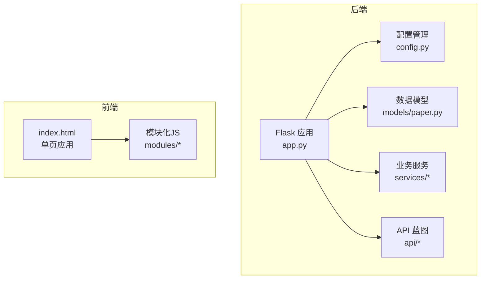
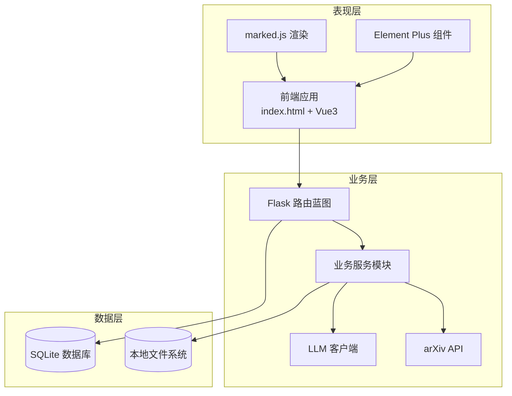
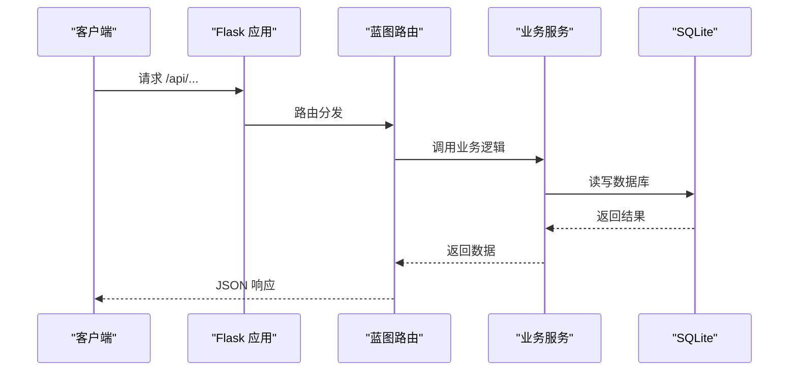
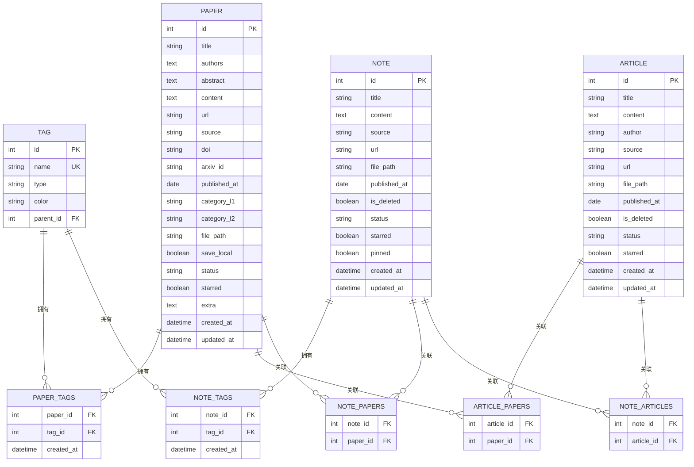
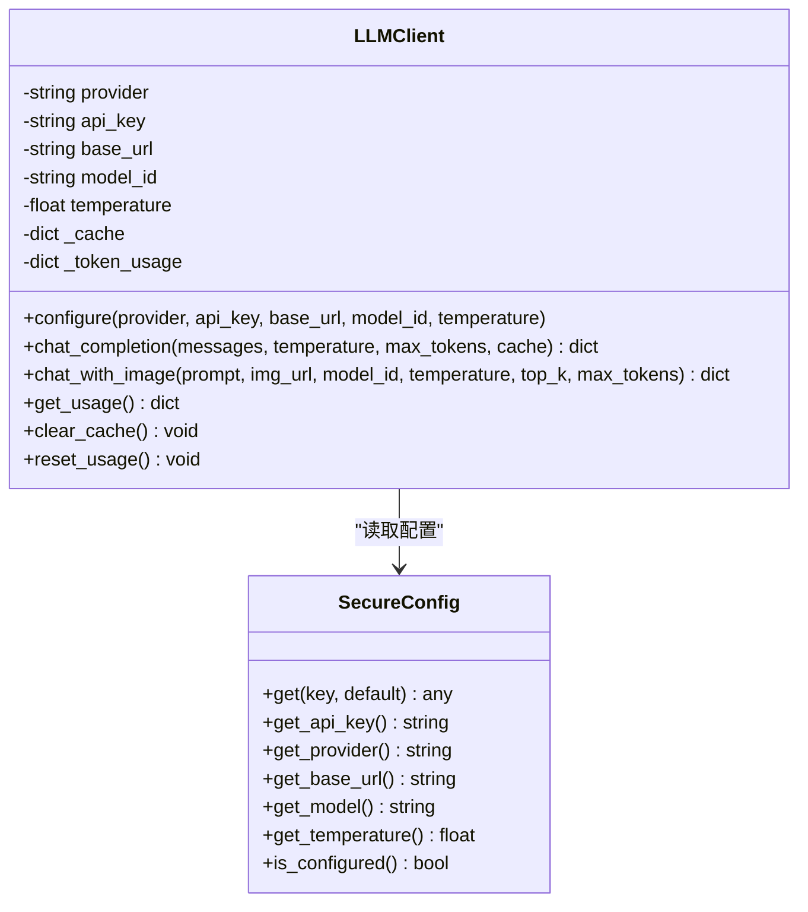
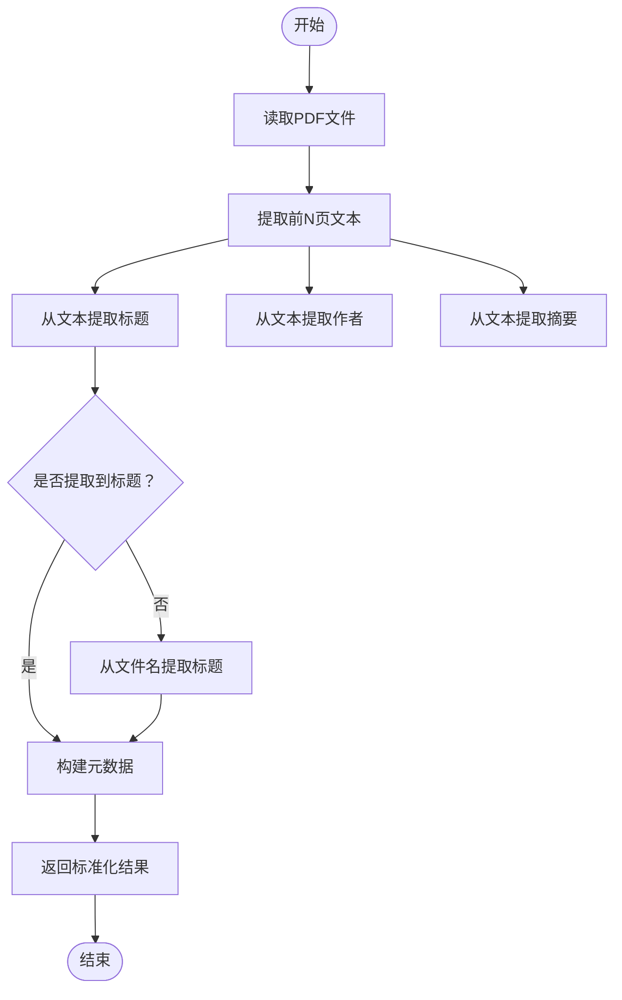
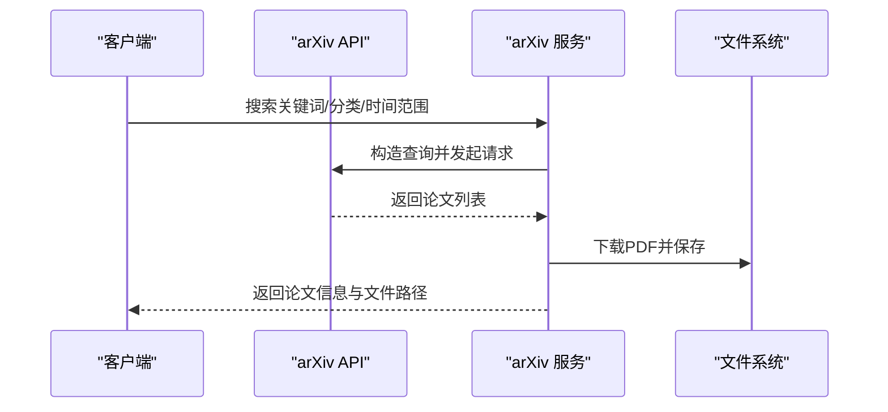
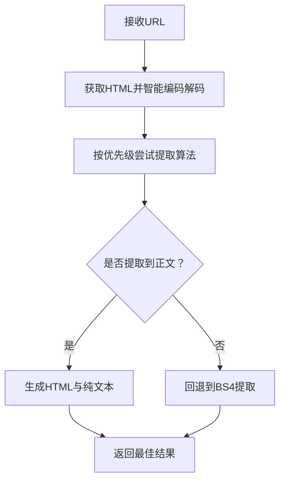
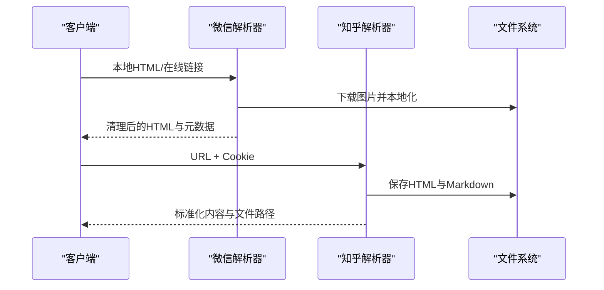
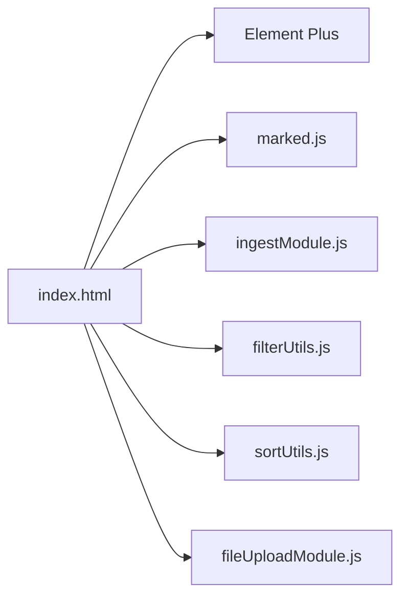

# 技术栈架构

<cite>
**本文档引用的文件**
- [README.md](file://README.md)
- [requirements.txt](file://backend/requirements.txt)
- [requirements-py11.txt](file://backend/requirements-py11.txt)
- [app.py](file://backend/app.py)
- [config.py](file://backend/config.py)
- [paper.py](file://backend/models/paper.py)
- [llm_client.py](file://backend/services/llm_client.py)
- [pdf_processor.py](file://backend/services/pdf_processor.py)
- [arxiv_fetcher.py](file://backend/services/arxiv_fetcher.py)
- [web_parser.py](file://backend/services/web_parser.py)
- [zhihu_parser.py](file://backend/services/zhihu_parser.py)
- [wechat_parser.py](file://backend/services/wechat_parser.py)
- [index.html](file://frontend/index.html)
- [ingestModule.js](file://frontend/src/modules/ingestModule.js)
- [sortUtils.js](file://frontend/src/modules/sortUtils.js)
- [filterUtils.js](file://frontend/src/modules/filterUtils.js)
- [fileUploadModule.js](file://frontend/src/modules/fileUploadModule.js)
</cite>

## 目录
1. [简介](#简介)
2. [项目结构](#项目结构)
3. [核心组件](#核心组件)
4. [架构总览](#架构总览)
5. [详细组件分析](#详细组件分析)
6. [依赖关系分析](#依赖关系分析)
7. [性能考虑](#性能考虑)
8. [故障排查指南](#故障排查指南)
9. [结论](#结论)

## 简介
PaperHub 是一个面向算法工程师的个人知识管理系统，支持论文、公众号文章、对话笔记的统一管理与检索。系统采用前后端分离架构：后端基于 Flask + SQLite + SQLAlchemy，前端采用 Vue 3 + Element Plus + marked.js，数据处理方面使用 PyMuPDF、BeautifulSoup4、requests 等库，AI 集成通过 arXiv API 与多提供商大模型客户端实现。

## 项目结构
项目采用模块化组织方式，后端以 API 蓝图和业务服务模块划分职责，前端以单页应用 + 模块化 JS 的形式组织功能模块。



**图表来源**
- [app.py:1-234](file://backend/app.py#L1-L234)
- [config.py:1-134](file://backend/config.py#L1-L134)
- [paper.py:1-360](file://backend/models/paper.py#L1-L360)
- [index.html:1-800](file://frontend/index.html#L1-L800)

**章节来源**
- [README.md:383-481](file://README.md#L383-L481)
- [app.py:140-158](file://backend/app.py#L140-L158)

## 核心组件
- 后端框架：Flask 提供 Web 服务与路由；Flask-CORS 支持跨域；Flask-SQLAlchemy 提供 ORM；SQLite 作为本地数据库。
- 数据模型：Paper/Article/Note/Tag 等实体及多对多关联表，支持标签系统与跨模块关联。
- 业务服务：arXiv 抓取、PDF 处理、微信/知乎/通用网页解析、LLM 客户端封装、去重与导入流程。
- 前端框架：Vue 3 + Element Plus + marked.js，单页应用 + 模块化 JS，提供统一的三大模块交互体验。
- 数据处理：PyMuPDF 用于 PDF 解析；BeautifulSoup4 + requests 用于网页解析；trafilatura/readability/newspaper3k 提供多算法正文提取。
- AI 集成：arXiv API + 多提供商大模型客户端（OpenAI、豆包、通义千问、Anthropic、自定义 TEG）。

**章节来源**
- [requirements.txt:1-15](file://backend/requirements.txt#L1-L15)
- [requirements-py11.txt:1-18](file://backend/requirements-py11.txt#L1-L18)
- [paper.py:93-293](file://backend/models/paper.py#L93-L293)
- [README.md:508-518](file://README.md#L508-L518)

## 架构总览
系统采用三层架构：前端负责用户交互与视图渲染；后端负责业务逻辑与数据持久化；底层依赖外部 API 与本地文件系统。



**图表来源**
- [index.html:1-800](file://frontend/index.html#L1-L800)
- [app.py:140-158](file://backend/app.py#L140-L158)
- [llm_client.py:198-556](file://backend/services/llm_client.py#L198-L556)
- [arxiv_fetcher.py:32-47](file://backend/services/arxiv_fetcher.py#L32-L47)
- [config.py:35-57](file://backend/config.py#L35-L57)

## 详细组件分析

### 后端应用与配置
- Flask 应用创建与路由注册：集中注册 papers、ingest、wechat_subscription、search、ai、note_images、web_extract、backup、export 等蓝图。
- 数据库初始化：根据配置创建 SQLite 数据库与表结构，初始化标签数据。
- 静态资源路由：提供前端静态文件、微信/知乎/笔记图片等静态资源访问。
- 异常处理：过滤扫描请求日志，统一返回错误信息与状态码。



**图表来源**
- [app.py:140-158](file://backend/app.py#L140-L158)
- [config.py:160-184](file://backend/app.py#L160-L184)

**章节来源**
- [app.py:41-137](file://backend/app.py#L41-L137)
- [app.py:160-184](file://backend/app.py#L160-L184)
- [config.py:85-134](file://backend/config.py#L85-L134)

### 数据模型与关系
- 实体与关联：Paper、Article、Note、Tag 四大实体，通过多对多关联表实现跨模块标签与关联。
- 字段设计：统一包含 created_at/updated_at、状态字段、星标字段等，支持排序与筛选。
- 关系映射：Paper-Tag、Note-Tag、Article-Paper、Note-Paper、Note-Article 等。



**图表来源**
- [paper.py:18-87](file://backend/models/paper.py#L18-L87)
- [paper.py:93-293](file://backend/models/paper.py#L93-L293)

**章节来源**
- [paper.py:18-87](file://backend/models/paper.py#L18-L87)
- [paper.py:93-293](file://backend/models/paper.py#L93-L293)

### AI 集成与 LLM 客户端
- 多提供商支持：OpenAI、豆包、通义千问、Anthropic、自定义 TEG。
- 安全配置：支持 .env 与环境变量，优先级与覆盖规则明确。
- 统一接口：chat_completion 与 chat_with_image，支持缓存与用量统计。
- 错误处理：API Key 缺失时返回错误信息，避免异常传播。



**图表来源**
- [llm_client.py:198-556](file://backend/services/llm_client.py#L198-L556)
- [llm_client.py:18-93](file://backend/services/llm_client.py#L18-L93)

**章节来源**
- [llm_client.py:18-93](file://backend/services/llm_client.py#L18-L93)
- [llm_client.py:198-556](file://backend/services/llm_client.py#L198-L556)

### PDF 处理与元数据提取
- 文本提取：限制提取前 N 页，避免大文件开销。
- 文件名解析：从文件名提取标题，去除版本号、日期、arXiv ID 等干扰信息。
- 文本解析：从文本中提取标题、作者、摘要，支持多行标题与作者列表清洗。
- 统一输出：标准化标题、作者、摘要、内容与来源字段。



**图表来源**
- [pdf_processor.py:10-170](file://backend/services/pdf_processor.py#L10-L170)

**章节来源**
- [pdf_processor.py:10-170](file://backend/services/pdf_processor.py#L10-L170)

### arXiv 抓取与搜索
- 输入解析：支持 arxiv.org 链接、arXiv:ID、纯 ID 三种输入格式。
- 搜索接口：关键词、分类、时间范围、排序方式等参数化查询。
- 分类映射：提供 70+ 个 arXiv 分类的映射表。
- PDF 下载：支持 arXiv 与通用 PDF 下载，自动去重与保存。



**图表来源**
- [arxiv_fetcher.py:123-227](file://backend/services/arxiv_fetcher.py#L123-L227)
- [arxiv_fetcher.py:32-47](file://backend/services/arxiv_fetcher.py#L32-L47)

**章节来源**
- [arxiv_fetcher.py:17-29](file://backend/services/arxiv_fetcher.py#L17-L29)
- [arxiv_fetcher.py:123-227](file://backend/services/arxiv_fetcher.py#L123-L227)
- [arxiv_fetcher.py:230-309](file://backend/services/arxiv_fetcher.py#L230-L309)

### 网页解析与内容提取
- 多算法自动选择：trafilatura、readability、newspaper3k、BeautifulSoup4。
- 编码智能处理：优先 UTF-8，回退 apparent_encoding 与常见中文编码。
- 内容清理：移除脚本、样式、广告与无用标签，保留正文与结构化 HTML。
- 保存完整页面：支持保存原始 HTML 以便离线查看。



**图表来源**
- [web_parser.py:178-244](file://backend/services/web_parser.py#L178-L244)
- [web_parser.py:22-63](file://backend/services/web_parser.py#L22-L63)

**章节来源**
- [web_parser.py:14-271](file://backend/services/web_parser.py#L14-L271)

### 微信与知乎内容解析
- 微信解析：支持本地 HTML 与在线链接，自动下载图片并本地化，清理冗余属性与广告，保留代码块、表格、引用等结构。
- 知乎解析：基于 Cookie 认证，提取标题、作者、发布时间，Markdown 转 HTML 渲染，生成双文件（HTML + Markdown）。



**图表来源**
- [wechat_parser.py:326-601](file://backend/services/wechat_parser.py#L326-L601)
- [zhihu_parser.py:279-323](file://backend/services/zhihu_parser.py#L279-L323)

**章节来源**
- [wechat_parser.py:326-601](file://backend/services/wechat_parser.py#L326-L601)
- [zhihu_parser.py:54-323](file://backend/services/zhihu_parser.py#L54-L323)

### 前端架构与模块化
- 单页应用：index.html 作为入口，引入 Element Plus 与 marked.js，内置样式与模块。
- 模块化 JS：ingestModule、sortUtils、filterUtils、fileUploadModule 等模块化组织功能。
- 统一交互：三大模块（论文/文章/笔记）共享状态与交互逻辑，保证一致性。



**图表来源**
- [index.html:1-800](file://frontend/index.html#L1-L800)
- [ingestModule.js:1-48](file://frontend/src/modules/ingestModule.js#L1-L48)
- [filterUtils.js:1-107](file://frontend/src/modules/filterUtils.js#L1-L107)
- [sortUtils.js:1-53](file://frontend/src/modules/sortUtils.js#L1-L53)
- [fileUploadModule.js:1-110](file://frontend/src/modules/fileUploadModule.js#L1-L110)

**章节来源**
- [index.html:1-800](file://frontend/index.html#L1-L800)
- [ingestModule.js:1-48](file://frontend/src/modules/ingestModule.js#L1-L48)
- [filterUtils.js:1-107](file://frontend/src/modules/filterUtils.js#L1-L107)
- [sortUtils.js:1-53](file://frontend/src/modules/sortUtils.js#L1-L53)
- [fileUploadModule.js:1-110](file://frontend/src/modules/fileUploadModule.js#L1-L110)

## 依赖关系分析
- 后端依赖：Flask + Flask-CORS + Flask-SQLAlchemy + arxiv + PyMuPDF + requests + beautifulsoup4 + 多种正文提取库。
- Python 版本差异：requirements-py11.txt 针对 Python 3.11+ 适配 lxml 版本，解决依赖冲突。
- 前端依赖：CDN 引入 Element Plus 与 marked.js，减少打包体积与构建复杂度。

```mermaid
graph TB
subgraph "后端依赖"
R1[Flask]
R2[Flask-CORS]
R3[Flask-SQLAlchemy]
R4[arxiv]
R5[PyMuPDF]
R6[requests]
R7[beautifulsoup4]
R8[trafilatura]
R9[readability-lxml]
R10[newspaper3k]
R11[lxml]
R12[html2text]
end
subgraph "前端依赖"
C1[Element Plus(CDN)]
C2[marked.js(CDN)]
end
R1 --> R2
R1 --> R3
R3 --> R11
R6 --> R7
R8 --> R1
R9 --> R1
R10 --> R1
```

**图表来源**
- [requirements.txt:1-15](file://backend/requirements.txt#L1-L15)
- [requirements-py11.txt:1-18](file://backend/requirements-py11.txt#L1-L18)
- [index.html:7-12](file://frontend/index.html#L7-L12)

**章节来源**
- [requirements.txt:1-15](file://backend/requirements.txt#L1-L15)
- [requirements-py11.txt:1-18](file://backend/requirements-py11.txt#L1-L18)
- [index.html:7-12](file://frontend/index.html#L7-L12)

## 性能考虑
- 数据库连接池：SQLite 使用连接池与连接回收策略，避免锁问题与资源泄漏。
- 前端计算策略：数据量小于阈值时前端计算，提升响应速度；超过阈值由后端计算，保证稳定性。
- PDF 处理：限制提取页数，避免大文件导致内存与 CPU 压力。
- 网页解析：多算法自动选择与编码智能处理，提高成功率与稳定性。
- Markdown 渲染：marked.js CDN 加载，减少前端构建与带宽消耗。

**章节来源**
- [config.py:92-99](file://backend/config.py#L92-L99)
- [README.md:559-567](file://README.md#L559-L567)
- [pdf_processor.py:10-24](file://backend/services/pdf_processor.py#L10-L24)
- [web_parser.py:14-21](file://backend/services/web_parser.py#L14-L21)
- [index.html:8-10](file://frontend/index.html#L8-L10)

## 故障排查指南
- 后端异常处理：统一捕获异常并返回错误信息，扫描请求日志被过滤，避免控制台污染。
- CORS 配置：开发环境允许所有来源，生产环境需按域名白名单配置。
- 数据库初始化：首次启动自动创建表与默认标签，若迁移笔记需手动执行迁移脚本。
- LLM 配置：检查 .env 或环境变量是否正确配置 API Key 与提供商信息。
- 网页解析失败：检查网络连通性与目标站点反爬策略，必要时更换解析算法或增加延时。

**章节来源**
- [app.py:70-89](file://backend/app.py#L70-L89)
- [app.py:54-64](file://backend/app.py#L54-L64)
- [app.py:178-182](file://backend/app.py#L178-L182)
- [llm_client.py:562-590](file://backend/services/llm_client.py#L562-L590)
- [web_parser.py:22-63](file://backend/services/web_parser.py#L22-L63)

## 结论
PaperHub 通过合理的前后端分离与模块化设计，结合轻量级的后端技术栈与强大的数据处理能力，实现了论文、文章与笔记的一体化管理。SQLite + SQLAlchemy 的组合满足本地化与私有化需求，Vue 3 + Element Plus + marked.js 提供了良好的用户体验。AI 集成与多算法正文提取进一步增强了系统的智能化与实用性。建议在生产环境中完善 CORS 白名单与日志监控，并持续优化解析算法与缓存策略以提升性能与稳定性。