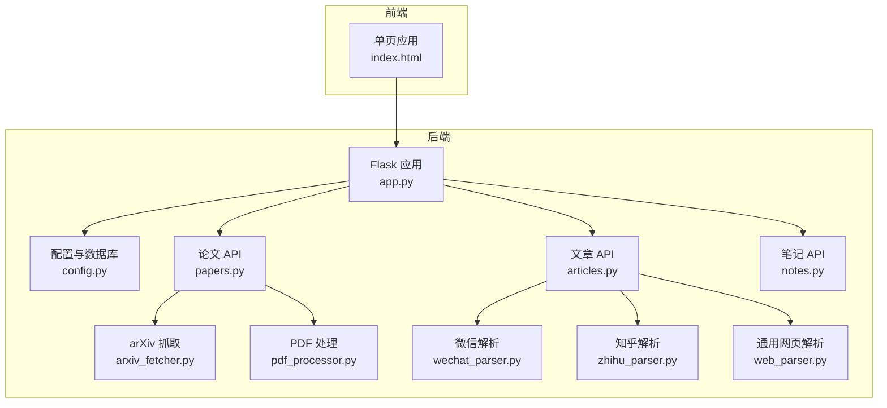
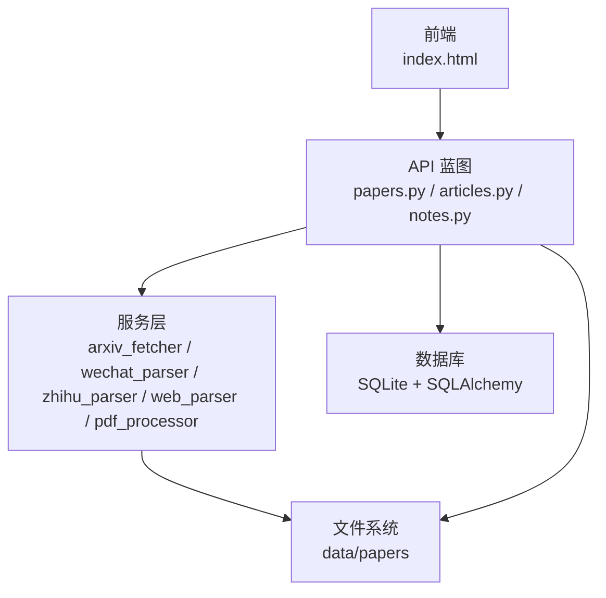
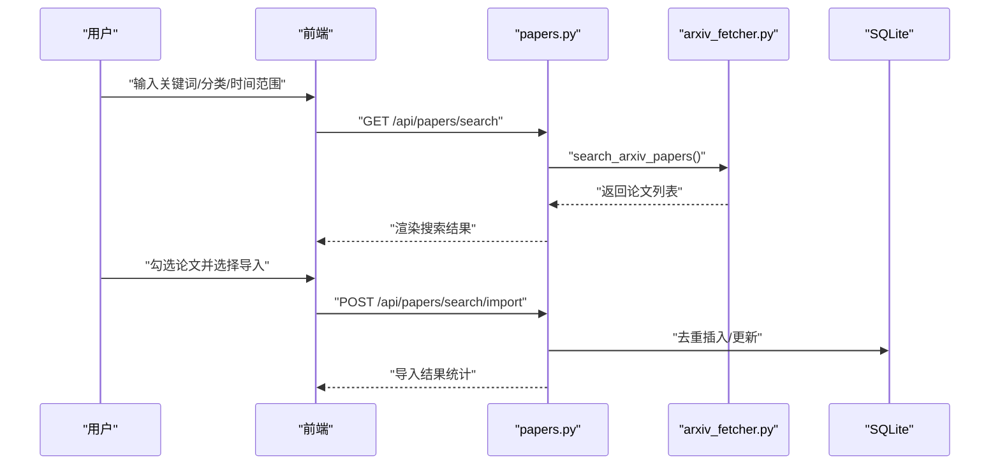
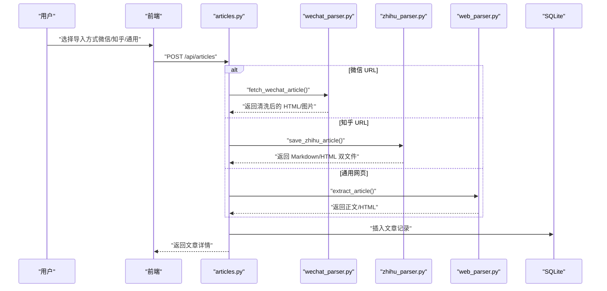
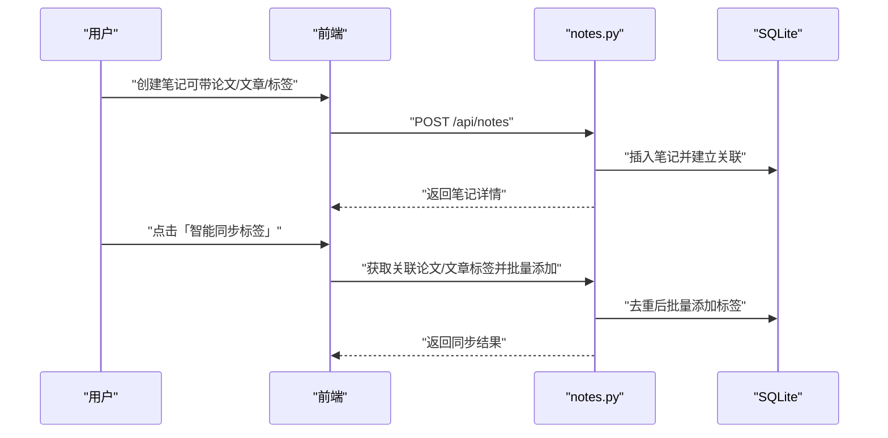
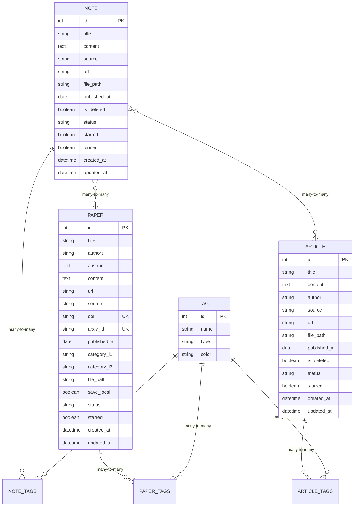
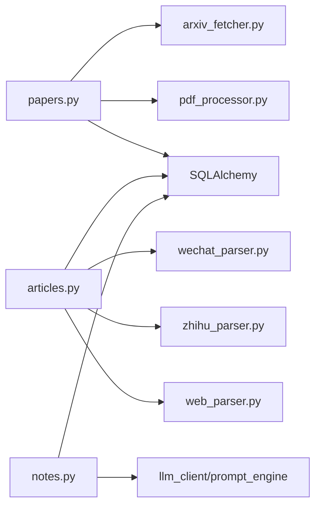

# 核心功能特性

<cite>
**本文引用的文件**
- [README.md](file://README.md)
- [backend/app.py](file://backend/app.py)
- [backend/config.py](file://backend/config.py)
- [specs/backend/api/papers.yml](file://specs/backend/api/papers.yml)
- [specs/backend/api/articles.yml](file://specs/backend/api/articles.yml)
- [specs/backend/api/notes.yml](file://specs/backend/api/notes.yml)
- [specs/backend/models/paper.yml](file://specs/backend/models/paper.yml)
- [specs/backend/models/article.yml](file://specs/backend/models/article.yml)
- [specs/backend/models/note.yml](file://specs/backend/models/note.yml)
- [backend/api/papers.py](file://backend/api/papers.py)
- [backend/api/articles.py](file://backend/api/articles.py)
- [backend/api/notes.py](file://backend/api/notes.py)
- [backend/services/arxiv_fetcher.py](file://backend/services/arxiv_fetcher.py)
- [backend/services/pdf_processor.py](file://backend/services/pdf_processor.py)
- [backend/services/wechat_parser.py](file://backend/services/wechat_parser.py)
- [backend/services/zhihu_parser.py](file://backend/services/zhihu_parser.py)
- [backend/services/web_parser.py](file://backend/services/web_parser.py)
</cite>

## 目录
1. [简介](#简介)
2. [项目结构](#项目结构)
3. [核心组件](#核心组件)
4. [架构总览](#架构总览)
5. [详细组件分析](#详细组件分析)
6. [依赖关系分析](#依赖关系分析)
7. [性能考量](#性能考量)
8. [故障排查指南](#故障排查指南)
9. [结论](#结论)
10. [附录](#附录)

## 简介
PaperHub 是面向算法工程师的个人知识管理系统，以“三大模块统一架构”为核心，提供论文库、文章库、笔记库的一体化管理能力。系统强调一致性原则：三模块 90% 交互逻辑复用，统一状态系统与标签体系，支持 PDF/HTML/Markdown 的原生渲染与预览，覆盖 arXiv 自动抓取、微信/知乎多源导入、AI 对话笔记、智能去重、批量操作与备份恢复等关键能力。

## 项目结构
- 后端采用 Flask + SQLite + SQLAlchemy 架构，统一入口在 app.py，注册各模块 API 蓝图与静态资源路由。
- 数据模型通过 YAML 规范定义，涵盖 Paper/Article/Note/Tag 及其多对多关系。
- 服务层封装抓取、解析、去重、PDF 处理等业务逻辑，API 层负责请求处理与响应。
- 前端为单页应用（index.html），通过 CDN 引入 Vue3/Element Plus/marked.js 等依赖，实现统一的三库交互体验。

图表来源
- [backend/app.py:140-158](file://backend/app.py#L140-L158)
- [backend/config.py:35-74](file://backend/config.py#L35-L74)
- [backend/api/papers.py:1-20](file://backend/api/papers.py#L1-L20)
- [backend/api/articles.py:1-20](file://backend/api/articles.py#L1-L20)
- [backend/api/notes.py:1-20](file://backend/api/notes.py#L1-L20)

章节来源
- [README.md:383-481](file://README.md#L383-L481)
- [backend/app.py:140-158](file://backend/app.py#L140-L158)
- [backend/config.py:35-74](file://backend/config.py#L35-L74)

## 核心组件
- 论文库模块：arXiv 关键词检索与批量导入、PDF 在线预览、阅读状态与标星管理、标签系统、元数据编辑、批量操作与硬删除。
- 文章库模块：微信公众号/知乎/通用网页多源导入、HTML 预览、智能去重、标签系统、批量操作与硬删除。
- 笔记库模块：AI 对话导入、Markdown 完整渲染、标签智能同步、笔记-论文/文章双向关联、批量操作与硬删除。

章节来源
- [README.md:22-48](file://README.md#L22-L48)
- [specs/backend/api/papers.yml:1-404](file://specs/backend/api/papers.yml#L1-L404)
- [specs/backend/api/articles.yml:1-266](file://specs/backend/api/articles.yml#L1-L266)
- [specs/backend/api/notes.yml:1-378](file://specs/backend/api/notes.yml#L1-L378)

## 架构总览
系统遵循“前后端分离、后端统一 API、前端复用交互”的设计原则。后端通过蓝图组织三大模块 API，服务层封装具体抓取与解析逻辑，数据库层通过 SQLAlchemy 管理实体与关系。静态资源路由支持微信/知乎/笔记图片等本地化文件访问。

图表来源
- [backend/app.py:140-158](file://backend/app.py#L140-L158)
- [backend/api/papers.py:1-20](file://backend/api/papers.py#L1-L20)
- [backend/api/articles.py:1-20](file://backend/api/articles.py#L1-L20)
- [backend/api/notes.py:1-20](file://backend/api/notes.py#L1-L20)

章节来源
- [backend/app.py:140-158](file://backend/app.py#L140-L158)
- [backend/config.py:20-33](file://backend/config.py#L20-L33)

## 详细组件分析

### 论文库模块（papers）
- 功能要点
  - arXiv 检索与批量导入：支持关键词、分类、时间范围、排序方式，批量导入时基于 arXiv ID 去重。
  - PDF 在线预览与下载：支持原生 PDF 预览与下载，微信/知乎/笔记 HTML 的本地化预览。
  - 阅读状态与标星：统一的 pending/reading/done/mastered 状态与 starred 标星。
  - 标签系统：支持添加/移除标签，标签自动创建，后端统计计数。
  - 元数据编辑：支持标题、arXiv ID、作者、摘要、分类等字段编辑。
  - 批量操作：批量更新状态/标签/标星/删除。
  - 硬删除与文件清理：删除论文时清理本地 PDF/HTML 及微信图片目录。

- 技术实现
  - API 定义：分页、筛选、排序、批量操作、标签管理、arXiv 搜索与导入。
  - 服务层：arXiv 抓取与 PDF 下载、PDF 文本提取与元数据解析。
  - 数据模型：Paper 实体及与 Tag/Note/Article 的多对多关系。

图表来源
- [specs/backend/api/papers.yml:327-399](file://specs/backend/api/papers.yml#L327-L399)
- [backend/api/papers.py:475-591](file://backend/api/papers.py#L475-L591)
- [backend/services/arxiv_fetcher.py:123-227](file://backend/services/arxiv_fetcher.py#L123-L227)

章节来源
- [specs/backend/api/papers.yml:1-404](file://specs/backend/api/papers.yml#L1-L404)
- [backend/api/papers.py:1-800](file://backend/api/papers.py#L1-L800)
- [specs/backend/models/paper.yml:1-164](file://specs/backend/models/paper.yml#L1-L164)
- [backend/services/arxiv_fetcher.py:1-324](file://backend/services/arxiv_fetcher.py#L1-L324)
- [backend/services/pdf_processor.py:1-170](file://backend/services/pdf_processor.py#L1-L170)

### 文章库模块（articles）
- 功能要点
  - 多源导入：微信公众号（URL 在线抓取/本地 HTML）、知乎（Cookie 登录）、通用网页正文提取。
  - HTML 预览：微信/知乎/通用网页均以 HTML 渲染，保留排版与图片。
  - 智能去重：基于标题/内容/URL 的去重策略。
  - 标签系统：支持添加/移除标签，标签自动创建。
  - 批量操作：批量更新状态/标签/标星/删除。
  - 硬删除与文件清理：删除文章时清理本地微信 HTML 与图片目录。

- 技术实现
  - API 定义：列表/详情/创建/更新/删除、标签管理、批量操作。
  - 服务层：微信解析（BeautifulSoup + requests，图片本地化与样式清理）、知乎解析（Cookie 认证、Markdown 转换）、通用网页解析（trafilatura/readability/newspaper3k 多算法自动选择）。

图表来源
- [specs/backend/api/articles.yml:1-266](file://specs/backend/api/articles.yml#L1-L266)
- [backend/api/articles.py:81-174](file://backend/api/articles.py#L81-L174)
- [backend/services/wechat_parser.py:326-601](file://backend/services/wechat_parser.py#L326-L601)
- [backend/services/zhihu_parser.py:279-323](file://backend/services/zhihu_parser.py#L279-L323)
- [backend/services/web_parser.py:178-244](file://backend/services/web_parser.py#L178-L244)

章节来源
- [specs/backend/api/articles.yml:1-266](file://specs/backend/api/articles.yml#L1-L266)
- [backend/api/articles.py:1-482](file://backend/api/articles.py#L1-L482)
- [specs/backend/models/article.yml:1-114](file://specs/backend/models/article.yml#L1-L114)
- [backend/services/wechat_parser.py:1-800](file://backend/services/wechat_parser.py#L1-L800)
- [backend/services/zhihu_parser.py:1-323](file://backend/services/zhihu_parser.py#L1-L323)
- [backend/services/web_parser.py:1-271](file://backend/services/web_parser.py#L1-L271)

### 笔记库模块（notes）
- 功能要点
  - AI 对话导入：支持多提供商（豆包/OpenAI/通义/Anthropic/TEG），生成 AI 解读笔记并自动关联论文。
  - Markdown 渲染：marked.js + 专属 CSS，支持标题/代码块/表格/引用等完整语法。
  - 标签智能同步：一键合并关联论文/文章的所有标签，自动去重并批量添加。
  - 双向关联：笔记与论文/文章的相互关联与详情页展示。
  - 批量操作：批量更新状态/标签/标星/置顶/删除。
  - 硬删除与图片清理：删除笔记时清理引用的 note_images 图片。

- 技术实现
  - API 定义：列表/详情/创建/更新/删除、标签管理、笔记-论文/文章关联、批量操作。
  - 服务层：AI 客户端与提示词引擎（见 docs/ 大模型融入系统设计方案）。
  - 数据模型：Note 实体及与 Tag/Paper/Article 的多对多关系。

图表来源
- [specs/backend/api/notes.yml:1-378](file://specs/backend/api/notes.yml#L1-L378)
- [backend/api/notes.py:61-134](file://backend/api/notes.py#L61-L134)
- [specs/backend/models/note.yml:1-115](file://specs/backend/models/note.yml#L1-L115)

章节来源
- [specs/backend/api/notes.yml:1-378](file://specs/backend/api/notes.yml#L1-L378)
- [backend/api/notes.py:1-595](file://backend/api/notes.py#L1-L595)
- [specs/backend/models/note.yml:1-115](file://specs/backend/models/note.yml#L1-L115)

### 数据模型与关系

图表来源
- [specs/backend/models/paper.yml:1-164](file://specs/backend/models/paper.yml#L1-L164)
- [specs/backend/models/article.yml:1-114](file://specs/backend/models/article.yml#L1-L114)
- [specs/backend/models/note.yml:1-115](file://specs/backend/models/note.yml#L1-L115)

章节来源
- [specs/backend/models/paper.yml:1-164](file://specs/backend/models/paper.yml#L1-L164)
- [specs/backend/models/article.yml:1-114](file://specs/backend/models/article.yml#L1-L114)
- [specs/backend/models/note.yml:1-115](file://specs/backend/models/note.yml#L1-L115)

## 依赖关系分析
- 组件耦合
  - API 层与服务层松耦合：通过函数调用传递参数与结果，便于单元测试与替换实现。
  - 服务层与数据层松耦合：通过 SQLAlchemy ORM 操作实体，避免直接依赖具体 SQL。
  - 前后端通过 REST API 通信，前端复用统一的交互逻辑与状态/标签筛选组件。
- 外部依赖
  - arXiv SDK、requests、BeautifulSoup、PyPDF2、trafilatura/readability/newspaper3k 等。
  - 前端依赖 marked.js、Element Plus、Vue3（CDN）。

图表来源
- [backend/api/papers.py:1-20](file://backend/api/papers.py#L1-L20)
- [backend/api/articles.py:1-20](file://backend/api/articles.py#L1-L20)
- [backend/api/notes.py:1-20](file://backend/api/notes.py#L1-L20)
- [backend/services/arxiv_fetcher.py:1-15](file://backend/services/arxiv_fetcher.py#L1-L15)
- [backend/services/pdf_processor.py:1-8](file://backend/services/pdf_processor.py#L1-L8)
- [backend/services/wechat_parser.py:1-12](file://backend/services/wechat_parser.py#L1-L12)
- [backend/services/zhihu_parser.py:1-12](file://backend/services/zhihu_parser.py#L1-L12)
- [backend/services/web_parser.py:1-12](file://backend/services/web_parser.py#L1-L12)

章节来源
- [backend/api/papers.py:1-20](file://backend/api/papers.py#L1-L20)
- [backend/api/articles.py:1-20](file://backend/api/articles.py#L1-L20)
- [backend/api/notes.py:1-20](file://backend/api/notes.py#L1-L20)

## 性能考量
- 数据库连接池：全局单例 Engine + ScopedSession，连接池大小与回收策略降低锁竞争。
- 查询优化：按需筛选与分页，索引覆盖常用查询字段（标题、状态、标星、arXiv ID 等）。
- 文件 I/O：PDF/HTML/图片本地化存储，预览时按需读取，避免重复下载。
- 前端渲染：Markdown 与 HTML 渲染通过 CDN 加载，减少首屏阻塞。
- 搜索体验：全文检索（FTS5）与防抖机制显著提升搜索响应速度。

章节来源
- [backend/config.py:85-134](file://backend/config.py#L85-L134)
- [specs/backend/models/paper.yml:151-164](file://specs/backend/models/paper.yml#L151-L164)
- [specs/backend/models/article.yml:107-114](file://specs/backend/models/article.yml#L107-L114)
- [specs/backend/models/note.yml:108-115](file://specs/backend/models/note.yml#L108-L115)
- [README.md:267-276](file://README.md#L267-L276)

## 故障排查指南
- 网络扫描过滤：内置 ScanFilter 过滤常见扫描路径，减少控制台噪音。
- 异常处理：统一异常捕获与 HTTP 状态码返回，404/405 等错误保持原始状态码。
- 删除清理：论文/文章/笔记删除时自动清理本地文件，避免残留。
- 微信时间修复：提供轻量级函数从原始页面提取发布时间，修复 fallback 问题。
- 备份恢复：支持数据库与本地文件全量打包，提供历史列表与恢复流程。

章节来源
- [backend/app.py:15-39](file://backend/app.py#L15-L39)
- [backend/app.py:70-89](file://backend/app.py#L70-L89)
- [backend/api/papers.py:256-296](file://backend/api/papers.py#L256-L296)
- [backend/api/articles.py:175-217](file://backend/api/articles.py#L175-L217)
- [backend/api/notes.py:190-228](file://backend/api/notes.py#L190-L228)
- [backend/services/wechat_parser.py:280-324](file://backend/services/wechat_parser.py#L280-L324)
- [README.md:331-343](file://README.md#L331-L343)

## 结论
PaperHub 通过“三大模块统一架构”，实现了论文、文章、笔记的一体化管理与一致体验。依托 arXiv、微信、知乎、通用网页等多源导入能力，结合 PDF/HTML/Markdown 的原生渲染与智能去重、标签同步、批量操作与备份恢复等特性，满足算法工程师对知识沉淀与检索的深度需求。系统在架构设计、数据模型与前端交互上均体现出高度一致性与可维护性。

## 附录

### 功能对比表
- 论文库
  - arXiv 检索与导入：支持关键词/分类/时间范围/排序，批量导入去重
  - PDF 预览与下载：原生 PDF 预览，微信/知乎/笔记 HTML 本地化预览
  - 阅读状态与标星：统一状态系统与 starred 标记
  - 标签系统：自动创建、后端统计计数
  - 元数据编辑：标题/arXiv ID/作者/摘要/分类
  - 批量操作：状态/标签/标星/删除
  - 删除清理：硬删除并清理本地文件
- 文章库
  - 多源导入：微信 URL/本地 HTML、知乎（Cookie）、通用网页
  - HTML 预览：微信/知乎/通用网页 HTML 渲染
  - 智能去重：基于标题/内容/URL
  - 标签系统：自动创建
  - 批量操作：状态/标签/标星/删除
  - 删除清理：硬删除并清理微信本地 HTML 与图片
- 笔记库
  - AI 对话导入：多提供商，生成 AI 解读笔记并自动关联
  - Markdown 渲染：marked.js + 专属 CSS
  - 标签智能同步：一键合并关联论文/文章标签
  - 双向关联：笔记-论文/文章相互关联
  - 批量操作：状态/标签/标星/置顶/删除
  - 删除清理：硬删除并清理 note_images 引用图片

章节来源
- [README.md:22-48](file://README.md#L22-L48)
- [specs/backend/api/papers.yml:1-404](file://specs/backend/api/papers.yml#L1-L404)
- [specs/backend/api/articles.yml:1-266](file://specs/backend/api/articles.yml#L1-L266)
- [specs/backend/api/notes.yml:1-378](file://specs/backend/api/notes.yml#L1-L378)