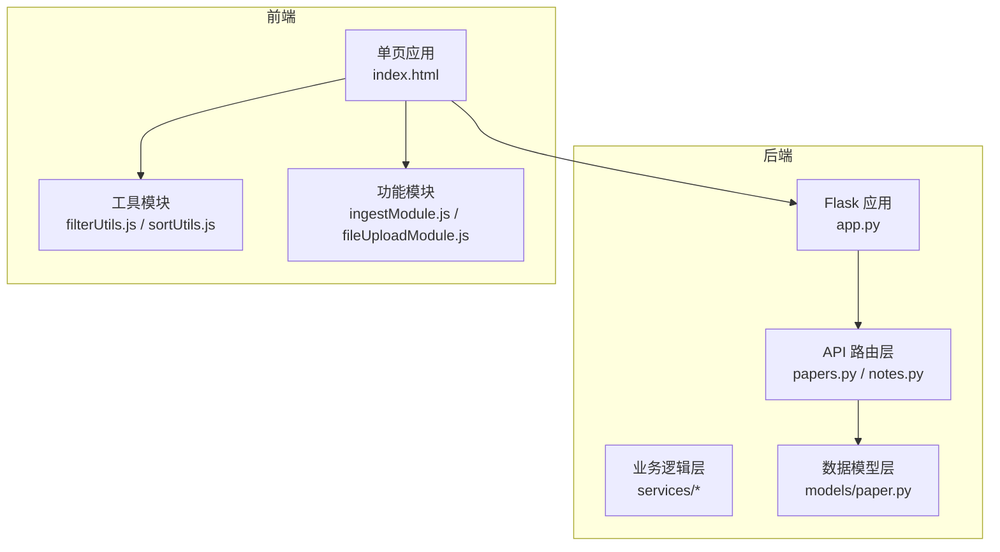
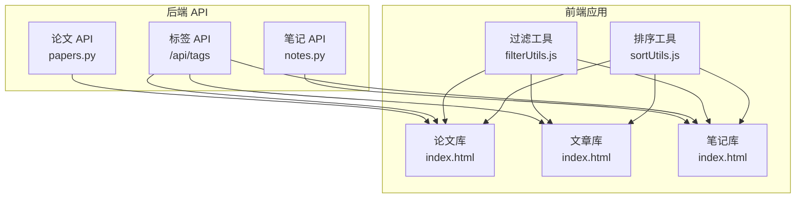
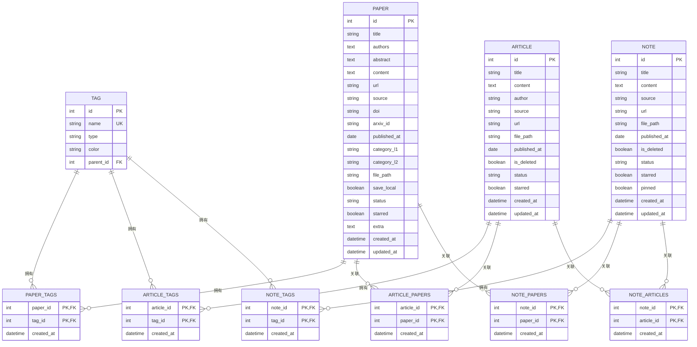
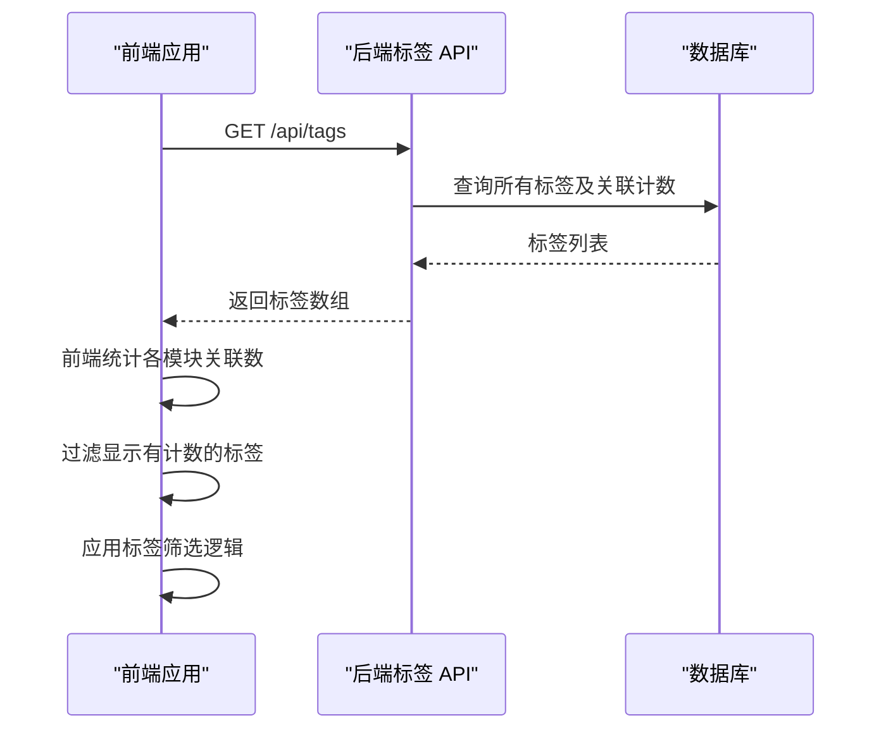
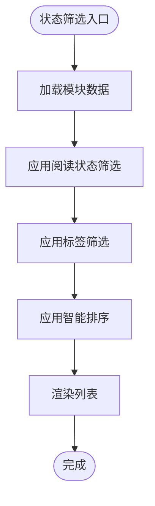
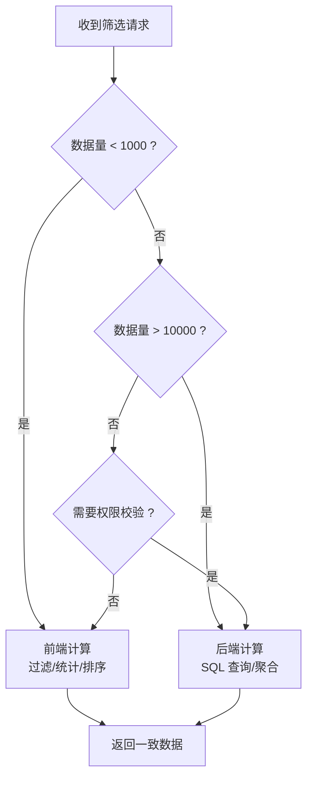
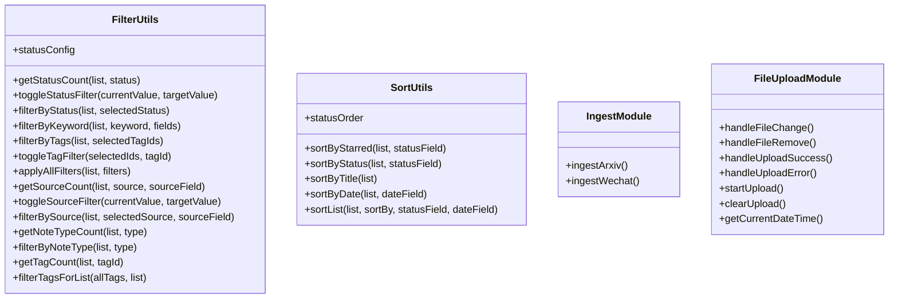
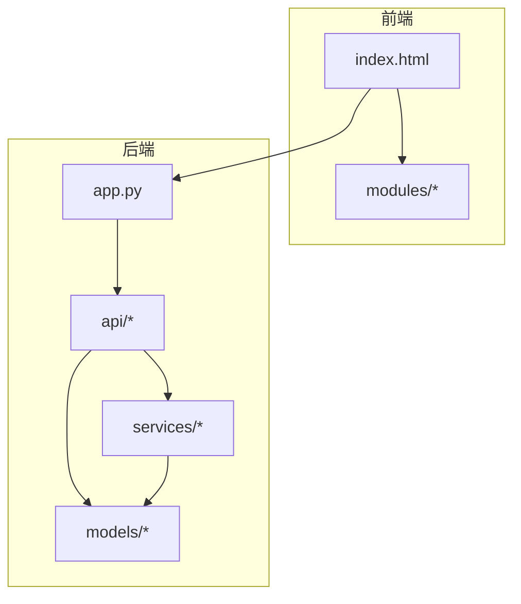

# 设计理念方法论

<cite>
**本文档引用的文件**
- [README.md](file://README.md)
- [架构规范.md](file://specs/architecture.spec.md)
- [项目完整复盘与优化清单.md](file://docs/项目完整复盘与优化清单.md)
- [笔记系统设计方案.md](file://docs/笔记系统设计方案.md)
- [标签筛选系统开发经验总结.md](file://docs/标签筛选系统开发经验总结.md)
- [app.py](file://backend/app.py)
- [paper.py](file://backend/models/paper.py)
- [papers.py](file://backend/api/papers.py)
- [notes.py](file://backend/api/notes.py)
- [filterUtils.js](file://frontend/src/modules/filterUtils.js)
- [sortUtils.js](file://frontend/src/modules/sortUtils.js)
- [ingestModule.js](file://frontend/src/modules/ingestModule.js)
- [fileUploadModule.js](file://frontend/src/modules/fileUploadModule.js)
- [index.html](file://frontend/index.html)
- [全局配置标准规约.yml](file://specs/system/global_config.yml)
</cite>

## 目录
1. [引言](#引言)
2. [项目结构](#项目结构)
3. [核心组件](#核心组件)
4. [架构概览](#架构概览)
5. [详细组件分析](#详细组件分析)
6. [依赖分析](#依赖分析)
7. [性能考虑](#性能考虑)
8. [故障排查指南](#故障排查指南)
9. [结论](#结论)
10. [附录](#附录)

## 引言
本文件系统化阐述 PaperHub 的设计理念与方法论，围绕"一致性"黄金原则，深入解析三大模块统一架构的设计思路与实现方法，涵盖数据模型设计、标签系统架构、状态管理策略、前后端分工原则（数据量<1000由前端计算，数据量>10000由后端计算）的设计考量，并提供设计决策的权衡分析、技术债务管理与持续改进策略。

## 项目结构
PaperHub 采用前后端分离的模块化架构，后端基于 Flask + SQLAlchemy，前端为单页应用（CDN 版本），通过统一的 API 规约进行交互。项目目录遵循严格的分层职责划分，确保可扩展与可维护性。

**图表来源**
- [架构规范.md:1-83](file://specs/architecture.spec.md#L1-L83)
- [app.py:140-158](file://backend/app.py#L140-L158)

**章节来源**
- [架构规范.md:1-83](file://specs/architecture.spec.md#L1-L83)
- [README.md:383-481](file://README.md#L383-L481)

## 核心组件
- 数据模型层：统一的数据模型设计，支持三大模块的多对多关联与标签系统，确保数据一致性与可扩展性。
- API 路由层：清晰的 RESTful 接口，负责参数校验、调用服务层、返回统一格式响应。
- 业务逻辑层：封装复杂业务逻辑、外部调用与数据处理，避免 API 层承担过多职责。
- 前端工具模块：复用的过滤与排序工具，支撑三大模块的筛选与排序一致性。
- 前端功能模块：入库与文件上传等具体功能，通过统一的 API 接口与后端交互。

**章节来源**
- [paper.py:1-360](file://backend/models/paper.py#L1-L360)
- [papers.py:1-822](file://backend/api/papers.py#L1-L822)
- [notes.py:1-595](file://backend/api/notes.py#L1-L595)
- [filterUtils.js:1-107](file://frontend/src/modules/filterUtils.js#L1-L107)
- [sortUtils.js:1-53](file://frontend/src/modules/sortUtils.js#L1-L53)

## 架构概览
PaperHub 的架构以"一致性"为核心设计原则，三大模块在视觉、布局、数据与交互层面保持高度一致，确保用户学习一次即可无缝切换。后端提供统一 API，前端在合适场景进行本地计算，实现性能与一致性的平衡。

**图表来源**
- [papers.py:369-408](file://backend/api/papers.py#L369-L408)
- [notes.py:25-59](file://backend/api/notes.py#L25-L59)
- [index.html:137-153](file://frontend/index.html#L137-L153)
- [filterUtils.js:1-107](file://frontend/src/modules/filterUtils.js#L1-L107)
- [sortUtils.js:1-53](file://frontend/src/modules/sortUtils.js#L1-L53)

**章节来源**
- [README.md:546-573](file://README.md#L546-L573)
- [项目完整复盘与优化清单.md:169-191](file://docs/项目完整复盘与优化清单.md#L169-L191)

## 详细组件分析

### 数据模型设计
PaperHub 的数据模型采用关系型数据库与多对多关联表设计，支持三大模块之间的灵活关联。核心实体包括论文、文章、笔记与标签，以及它们之间的关联表，确保数据的完整性与可扩展性。

**图表来源**
- [paper.py:18-87](file://backend/models/paper.py#L18-L87)

**章节来源**
- [paper.py:93-293](file://backend/models/paper.py#L93-L293)

### 标签系统架构
PaperHub 的标签系统采用"一套后端 API，前端三次过滤"的架构设计，三大模块各自独立的标签筛选区域，但共享同一套筛选逻辑与交互模式，确保一致性与可维护性。

**图表来源**
- [papers.py:369-408](file://backend/api/papers.py#L369-L408)
- [标签筛选系统开发经验总结.md:41-76](file://docs/标签筛选系统开发经验总结.md#L41-L76)

**章节来源**
- [笔记系统设计方案.md:56-106](file://docs/笔记系统设计方案.md#L56-L106)
- [标签筛选系统开发经验总结.md:9-38](file://docs/标签筛选系统开发经验总结.md#L9-L38)

### 状态管理策略
PaperHub 在三大模块中实现了统一的状态管理策略，包括阅读状态与标星功能，确保用户在不同模块间切换时无需重新学习交互方式。

**图表来源**
- [sortUtils.js:3-51](file://frontend/src/modules/sortUtils.js#L3-L51)
- [filterUtils.js:20-58](file://frontend/src/modules/filterUtils.js#L20-L58)

**章节来源**
- [项目完整复盘与优化清单.md:169-191](file://docs/项目完整复盘与优化清单.md#L169-L191)
- [README.md:546-573](file://README.md#L546-L573)

### 前后端分工原则
PaperHub 在前后端分工上采用了"数据量阈值驱动"的原则：数据量小于 1000 时由前端计算，大于 10000 时由后端计算，兼顾性能与一致性。

**图表来源**
- [项目完整复盘与优化清单.md:182-191](file://docs/项目完整复盘与优化清单.md#L182-L191)

**章节来源**
- [项目完整复盘与优化清单.md:182-191](file://docs/项目完整复盘与优化清单.md#L182-L191)
- [README.md:559-567](file://README.md#L559-L567)

### 设计模式应用实例
- 工厂模式：前端模块通过工厂函数创建功能模块，统一接口与生命周期管理。
- 策略模式：排序与过滤采用策略模式，支持多种排序与筛选策略的动态切换。
- 适配器模式：后端 API 适配前端数据结构，确保前后端数据格式一致。

**图表来源**
- [filterUtils.js:1-107](file://frontend/src/modules/filterUtils.js#L1-L107)
- [sortUtils.js:1-53](file://frontend/src/modules/sortUtils.js#L1-L53)
- [ingestModule.js:1-48](file://frontend/src/modules/ingestModule.js#L1-L48)
- [fileUploadModule.js:1-110](file://frontend/src/modules/fileUploadModule.js#L1-L110)

**章节来源**
- [filterUtils.js:1-107](file://frontend/src/modules/filterUtils.js#L1-L107)
- [sortUtils.js:1-53](file://frontend/src/modules/sortUtils.js#L1-L53)
- [ingestModule.js:1-48](file://frontend/src/modules/ingestModule.js#L1-L48)
- [fileUploadModule.js:1-110](file://frontend/src/modules/fileUploadModule.js#L1-L110)

## 依赖分析
PaperHub 的依赖关系清晰，遵循分层职责与单一职责原则，避免跨层反向依赖。

**图表来源**
- [架构规范.md:21-78](file://specs/architecture.spec.md#L21-L78)
- [app.py:140-158](file://backend/app.py#L140-L158)

**章节来源**
- [架构规范.md:74-83](file://specs/architecture.spec.md#L74-L83)
- [app.py:140-158](file://backend/app.py#L140-L158)

## 性能考虑
- 前端计算优化：在数据量较小的情况下，前端进行过滤与统计，减少后端压力与网络往返。
- 后端计算优化：大数据量场景下，后端进行 SQL 聚合与分页，确保响应性能。
- 缓存策略：前端使用 LRU 缓存与防抖机制，减少重复请求与渲染开销。
- 资源管理：统一的静态资源路由与文件清理策略，避免资源泄露与磁盘占用。

## 故障排查指南
- 日志过滤：后端应用内置扫描请求过滤器，自动过滤网络扫描探测请求，保持控制台整洁。
- 异常处理：全局异常处理器统一返回错误信息，区分 HTTP 状态码与自定义错误类型。
- 数据一致性：前端详情页数据加载采用异步请求，确保关联数据的完整性与一致性。
- 配置管理：通过全局配置规约统一管理数据库连接、CORS、分页等关键配置项。

**章节来源**
- [app.py:32-89](file://backend/app.py#L32-L89)
- [项目完整复盘与优化清单.md:141-151](file://docs/项目完整复盘与优化清单.md#L141-L151)
- [全局配置标准规约.yml:1-80](file://specs/system/global_config.yml#L1-L80)

## 结论
PaperHub 通过"一致性"黄金原则，构建了三大模块统一架构，实现了视觉、布局、数据与交互的高度一致。在数据模型设计上，采用关系型数据库与多对多关联表，确保数据完整性与可扩展性；在标签系统架构上，采用"一套后端 API，前端三次过滤"的设计，既保证了性能又确保了数据一致性；在前后端分工上，基于数据量阈值的计算策略，实现了性能与一致性的平衡。通过持续的技术债务管理与最佳实践沉淀，PaperHub 为个人知识管理提供了高效、稳定且易用的解决方案。

## 附录
- 设计哲学总结：以用户为中心，追求一致性与易用性，宁缺毋滥。
- 持续改进策略：定期回顾与优化，保持架构简洁与代码质量。
- 最佳实践指导：遵循分层职责、单一职责与依赖倒置原则，确保系统的可维护性与可扩展性。