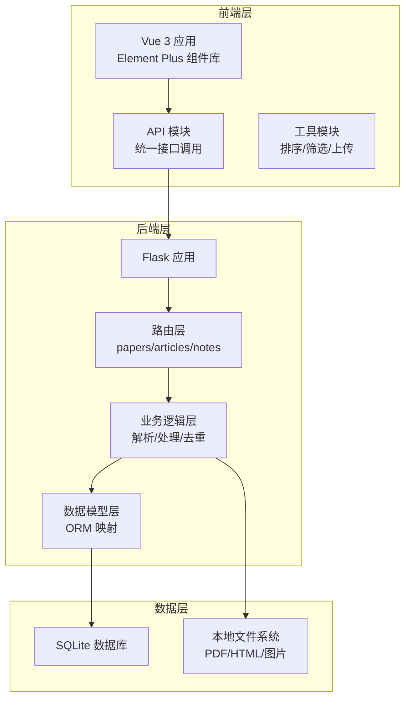
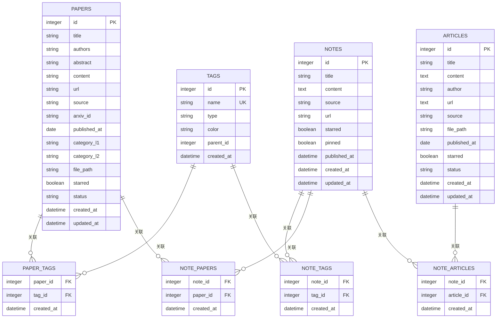
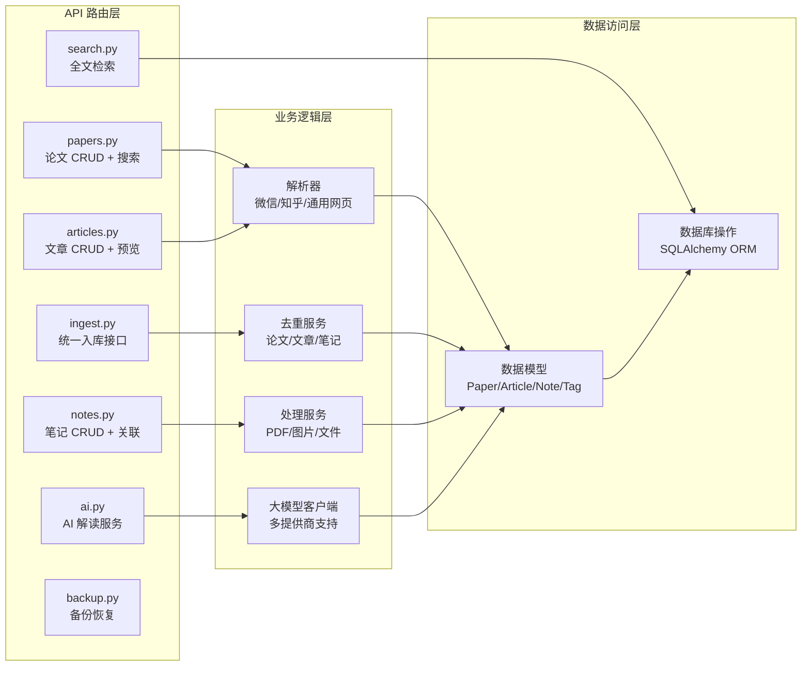
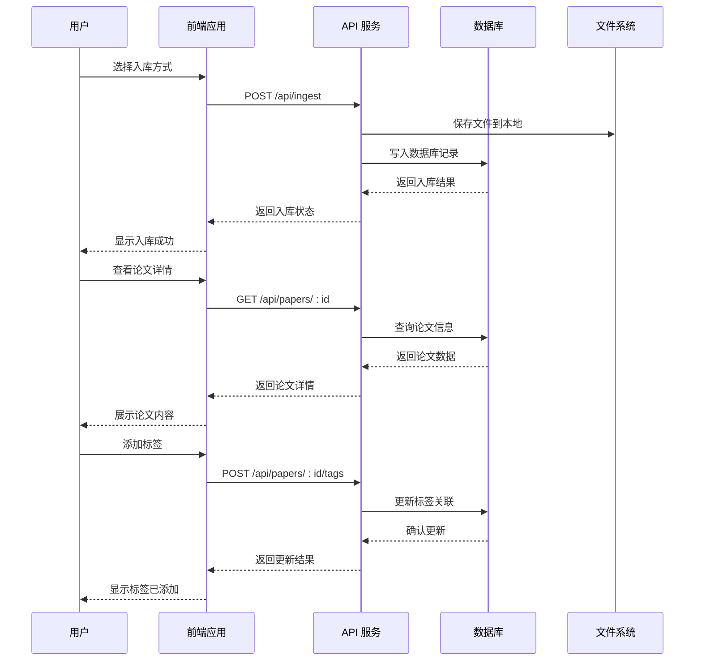
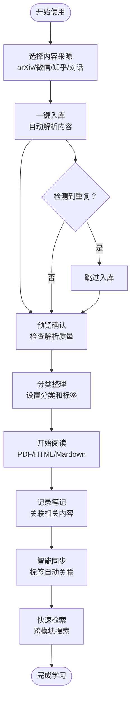

# 项目介绍

<cite>
**本文档引用的文件**
- [README.md](file://README.md)
- [CHECKLIST.md](file://CHECKLIST.md)
- [SCHEMA.md](file://docs/SCHEMA.md)
- [architecture.spec.md](file://specs/architecture.spec.md)
- [global_config.yml](file://specs/system/global_config.yml)
- [backend/README.md](file://backend/README.md)
- [frontend/README.md](file://frontend/README.md)
- [backend/app.py](file://backend/app.py)
- [backend/config.py](file://backend/config.py)
- [backend/api/papers.py](file://backend/api/papers.py)
- [backend/api/notes.py](file://backend/api/notes.py)
- [backend/api/articles.py](file://backend/api/articles.py)
- [specs/backend/models/paper.yml](file://specs/backend/models/paper.yml)
- [specs/backend/models/note.yml](file://specs/backend/models/note.yml)
</cite>

## 目录
1. [项目概述](#项目概述)
2. [核心价值主张](#核心价值主张)
3. [设计理念](#设计理念)
4. [目标用户群体](#目标用户群体)
5. [三大核心模块](#三大核心模块)
6. [系统架构概览](#系统架构概览)
7. [详细模块分析](#详细模块分析)
8. [发展历程与版本演进](#发展历程与版本演进)
9. [使用场景与案例](#使用场景与案例)
10. [性能与可靠性](#性能与可靠性)
11. [故障排查指南](#故障排查指南)
12. [结语](#结语)

## 项目概述

PaperHub 是一个专为算法工程师设计的本地化、私有化的个人知识管理系统。项目通过统一的三大核心模块（论文库、文章库、笔记库），为用户提供从资料收集、整理、标注到深度思考的一体化解决方案。

项目采用"本地优先"的设计理念，所有数据存储在本地，确保隐私安全与永久可用。系统支持多源内容接入，包括 arXiv 论文、微信公众号文章、知乎专栏以及 AI 对话笔记，并提供完整的标签体系、多维度筛选和智能排序功能。

## 核心价值主张

### 1. 本地化与私有化
- 所有数据存储在本地，无需担心隐私泄露
- 支持离线访问，网络不稳定时仍可正常使用
- 数据永久可控，不受第三方平台政策影响

### 2. 一体化知识管理
- 三大模块统一架构，用户只需学习一次交互逻辑
- 智能标签同步，关联内容自动保持一致
- Markdown 完整渲染，支持论文、文章、笔记的统一展示

### 3. 高效科研生产力
- 多源内容统一管理，避免信息孤岛
- 智能去重机制，避免重复入库
- 批量操作支持，提升管理效率
- 搜索体验优化，快速定位所需内容

## 设计理念

### 一致性黄金原则
PaperHub 坚持"一致性"设计原则，三大模块在以下方面保持完全一致：
- **视觉设计**：左侧行为状态配色完全一致（待读绿/在读蓝/已读灰/精读金）
- **布局结构**：侧边栏状态筛选在上，标签筛选在下
- **数据处理**：排序算法统一（标星 → 状态 → 时间）
- **交互体验**：标签点击效果、状态切换等交互完全复用

### 本地优先策略
- 数据库采用 SQLite，轻量可靠
- 文件存储采用本地路径，避免云端依赖
- 配置管理集中化，便于部署和维护

### 模块化架构
- 后端采用 Flask + SQLAlchemy 架构
- 前端使用 Vue 3 + Element Plus 构建
- API 设计遵循 RESTful 规范
- 业务逻辑清晰分离，便于扩展和维护

## 目标用户群体

### 主要用户
- **算法工程师**：需要管理大量论文和技术文章
- **研究人员**：需要整理和分析学术文献
- **技术爱好者**：关注前沿技术和行业动态
- **终身学习者**：持续更新知识体系的专业人士

### 用户需求痛点
- 论文管理混乱，难以快速查找
- 多平台信息分散，缺乏统一入口
- 标签体系不统一，筛选困难
- 内容质量参差不齐，需要有效管理
- 学习过程缺乏系统性记录

## 三大核心模块

### 论文库模块
论文库是系统的核心模块，专注于学术论文的管理：

#### 核心功能
- **arXiv 论文自动抓取**：支持 ID/链接等多种格式
- **PDF 在线预览**：浏览器原生支持翻页缩放
- **阅读状态管理**：待读/在读/已读/精读四种状态
- **标星收藏**：重要论文快速标记
- **二级分类体系**：涵盖大模型、计算机视觉、Agent、多模态、工程落地等领域

#### 技术特点
- 支持 arXiv ID 标签显示
- 元数据完整展示（标题、作者、摘要、分类）
- 文件路径管理，支持本地 PDF 存储

### 文章库模块
文章库专门管理来自网络的内容：

#### 核心功能
- **微信公众号文章导入**：支持 URL 在线导入和本地 HTML 导入
- **HTML 完整预览**：iframe 渲染，与微信阅读体验一致
- **图片本地化**：解决防盗链问题，确保内容永久可用
- **批量 PDF 导入**：支持拖拽上传多个文件

#### 技术特点
- 支持多种来源识别（微信 URL、微信本地、arXiv）
- 发布时间精确显示
- 智能去重机制，避免重复导入

### 笔记库模块
笔记库提供灵活的知识记录和管理功能：

#### 核心功能
- **对话笔记导入**：支持主流大模型来源（豆包、Kimi、千问、DeepSeek、Claude、ChatGPT）
- **Markdown 完整渲染**：marked.js CDN + 专属 CSS 样式
- **智能标签同步**：一键合并关联论文/文章的所有标签
- **独立标签筛选**：与论文/文章库布局完全一致

#### 技术特点
- 支持 Markdown 格式正文自动转换为精美 HTML
- 标题自动提取，日期默认当前时间
- 支持图片粘贴上传，自动保存到本地

## 系统架构概览

PaperHub 采用前后端分离的架构设计，后端提供 RESTful API，前端通过单页应用提供丰富的交互体验。

**图表来源**
- [backend/app.py:41-137](file://backend/app.py#L41-L137)
- [backend/config.py:35-134](file://backend/config.py#L35-L134)

### 技术栈
- **后端**：Flask + SQLite + SQLAlchemy
- **前端**：Vue 3 + Element Plus (CDN)
- **解析引擎**：BeautifulSoup4 + requests
- **PDF处理**：PyMuPDF (fitz)
- **Markdown渲染**：marked.js (CDN)

## 详细模块分析

### 数据模型设计

PaperHub 采用关系型数据库设计，通过多对多关联实现模块间的灵活组合。

**图表来源**
- [specs/backend/models/paper.yml:1-164](file://specs/backend/models/paper.yml#L1-L164)
- [specs/backend/models/note.yml:1-115](file://specs/backend/models/note.yml#L1-L115)
- [SCHEMA.md:41-182](file://docs/SCHEMA.md#L41-L182)

### API 服务架构

后端采用模块化设计，每个业务模块对应独立的 API 路由：

**图表来源**
- [backend/api/papers.py:1-200](file://backend/api/papers.py#L1-L200)
- [backend/api/articles.py:1-200](file://backend/api/articles.py#L1-L200)
- [backend/api/notes.py:1-200](file://backend/api/notes.py#L1-L200)

### 前端交互流程

PaperHub 的前端采用单页应用架构，提供流畅的用户体验：

**图表来源**
- [frontend/index.html:1-800](file://frontend/index.html#L1-L800)
- [backend/api/papers.py:111-147](file://backend/api/papers.py#L111-L147)

## 发展历程与版本演进

PaperHub 项目经历了从 MVP 到完整功能系统的演进过程，每个阶段都有明确的目标和成果。

### 阶段性发展里程碑

```mermaid
gantt
title PaperHub 发展历程
dateFormat X
axisFormat %Y.%m
section 需求分析期
MVP构建 :milestone, 2026.01, 2026.02
section 核心功能期
基础骨架(MVP) :active, 2026.02, 2026.03
多源入库 :active, 2026.03, 2026.04
对话笔记 :active, 2026.04, 2026.05
知乎导入 :active, 2026.05, 2026.06
section 架构统一期
三大模块统一 :active, 2026.05.02, 2026.05.02
检索与知识库 :active, 2026.05.08, 2026.05.08
搜索体验升级 :active, 2026.05.08, 2026.05.08
section 优化完善期
笔记图片上传 :active, 2026.05.09, 2026.05.09
三库硬删除 :active, 2026.05.10, 2026.05.10
批量操作 :active, 2026.05.11, 2026.05.11
入库界面重构 :active, 2026.05.12, 2026.05.12
精选内容 :active, 2026.05.12, 2026.05.13
section 当前状态
完成所有阶段 :milestone, 2026.05.13, 2026.05.13
```

### 关键功能演进

| 阶段 | 核心功能 | 技术突破 | 用户收益 |
|------|----------|----------|----------|
| MVP | arXiv 入库、PDF 预览 | 基础架构搭建 | 解决论文管理基本需求 |
| 多源入库 | 微信文章、批量导入 | 多源内容整合 | 扩展内容来源 |
| 对话笔记 | AI 对话导入 | 大模型集成 | 提升知识获取效率 |
| 架构统一 | 三大模块一致化 | 统一设计原则 | 降低学习成本 |
| 检索优化 | 全文检索、搜索建议 | 搜索体验提升 | 快速定位内容 |

**章节来源**
- [CHECKLIST.md:1-726](file://CHECKLIST.md#L1-L726)
- [README.md:485-504](file://README.md#L485-L504)

## 使用场景与案例

### 算法工程师日常使用场景

#### 场景一：论文阅读与管理
1. **批量导入**：通过 arXiv 关键词搜索，批量导入相关论文
2. **分类整理**：根据研究方向设置二级分类（如计算机视觉、大模型）
3. **状态跟踪**：使用四种阅读状态管理论文进度
4. **标签体系**：为重要概念、方法、数据集添加标签
5. **笔记记录**：在论文详情页直接创建笔记，关联相关文章

#### 场景二：技术文章学习
1. **内容聚合**：从微信公众号、知乎、通用网页导入技术文章
2. **去重处理**：系统自动检测重复内容，避免重复学习
3. **图片本地化**：所有图片保存到本地，避免外链失效
4. **标签同步**：文章标签自动同步到关联的论文和笔记

#### 场景三：AI 对话知识化
1. **对话记录**：将与大模型的对话内容自动保存为笔记
2. **格式转换**：Markdown 格式自动转换为精美 HTML
3. **来源标识**：清楚标识笔记来源（如 Claude、ChatGPT）
4. **智能关联**：对话内容可关联到相关论文进行交叉学习

### 典型使用流程

## 性能与可靠性

### 性能优化策略

#### 数据库优化
- **连接池管理**：使用 SQLAlchemy 连接池，支持并发访问
- **索引优化**：为常用查询字段建立索引
- **查询优化**：分页查询，避免一次性加载大量数据
- **缓存策略**：搜索结果 LRU 缓存，提升重复查询性能

#### 前端性能
- **懒加载**：按需加载模块和组件
- **虚拟滚动**：长列表虚拟滚动，提升渲染性能
- **防抖机制**：搜索输入防抖，减少网络请求
- **本地存储**：用户偏好本地持久化

#### 文件处理优化
- **异步处理**：大文件上传采用异步处理
- **进度反馈**：上传进度实时显示
- **断点续传**：支持大文件断点续传
- **压缩优化**：图片压缩，减少存储空间

### 可靠性保障

#### 数据安全
- **本地存储**：所有数据存储在本地，无云端传输
- **备份机制**：支持数据库和文件全量备份
- **版本控制**：论文版本管理，支持历史版本对比
- **软删除保护**：误删内容可恢复

#### 系统稳定性
- **异常处理**：完善的异常捕获和处理机制
- **日志系统**：详细的访问日志和错误日志
- **健康检查**：定时健康检查，自动发现异常
- **监控告警**：关键指标监控和告警通知

## 故障排查指南

### 常见问题及解决方案

#### 启动问题
**问题**：服务无法启动
**原因**：端口占用、依赖缺失、配置错误
**解决方案**：
1. 检查端口占用情况
2. 确认 Python 依赖安装完整
3. 验证配置文件设置正确
4. 查看启动日志获取详细错误信息

#### 数据导入问题
**问题**：微信文章导入失败
**原因**：网络问题、Cookie 失效、反爬机制
**解决方案**：
1. 检查网络连接稳定性
2. 更新知乎 Cookie
3. 调整请求频率，避免触发反爬
4. 使用备用导入方式

#### 性能问题
**问题**：页面加载缓慢
**原因**：数据量过大、网络延迟、浏览器性能
**解决方案**：
1. 清理不必要的数据
2. 优化网络环境
3. 清理浏览器缓存
4. 考虑升级硬件配置

### 维护工具

PaperHub 提供了完善的维护工具集：

| 工具类别 | 工具名称 | 功能描述 |
|----------|----------|----------|
| 数据维护 | check_articles.py | 文章列表快速查看 |
| 文件检查 | check_files.py | 文件完整性检查 |
| 数据库分析 | inspect_db.py | 数据库综合分析 |
| 数据清理 | cleanup_data.py | 孤立冗余文件清理 |
| 版本修复 | fix_wechat_pub_dates.py | 微信文章发布时间修复 |
| 重新下载 | redownload_wechat_articles.py | 公众号文章重新下载 |

**章节来源**
- [CHECKLIST.md:569-622](file://CHECKLIST.md#L569-L622)

## 结语

PaperHub 作为一个专业的个人知识管理系统，通过统一的三大模块架构、完善的标签体系和智能化的处理机制，为算法工程师提供了高效、可靠的个人知识管理解决方案。

项目的成功不仅体现在功能的完整性，更重要的是解决了科研工作者在知识管理中的核心痛点：多源内容整合、学习过程记录、知识体系构建和高效检索。通过本地化部署和私有化存储，PaperHub 确保了用户数据的安全性和长期可用性。

随着项目的持续演进，PaperHub 将继续引入更多智能化功能，如向量语义检索、智能推荐等，进一步提升用户的科研生产力。无论是初学者还是资深研究者，都能在 PaperHub 中找到适合自己的知识管理方式。

未来，PaperHub 将致力于：
- **智能化增强**：引入更多 AI 辅助功能
- **协作扩展**：支持团队知识共享
- **生态建设**：构建完整的科研知识生态系统
- **性能优化**：持续提升系统性能和用户体验

通过这些努力，PaperHub 将成为算法工程师不可或缺的个人知识管理伙伴。