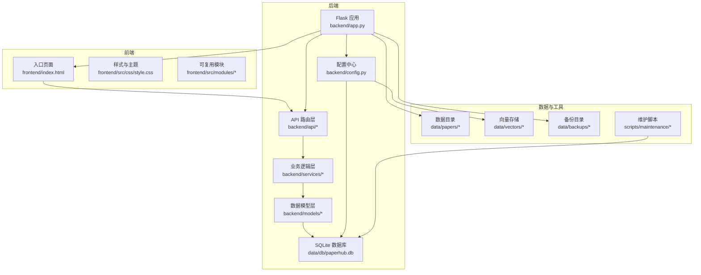
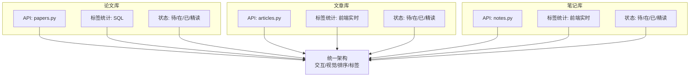
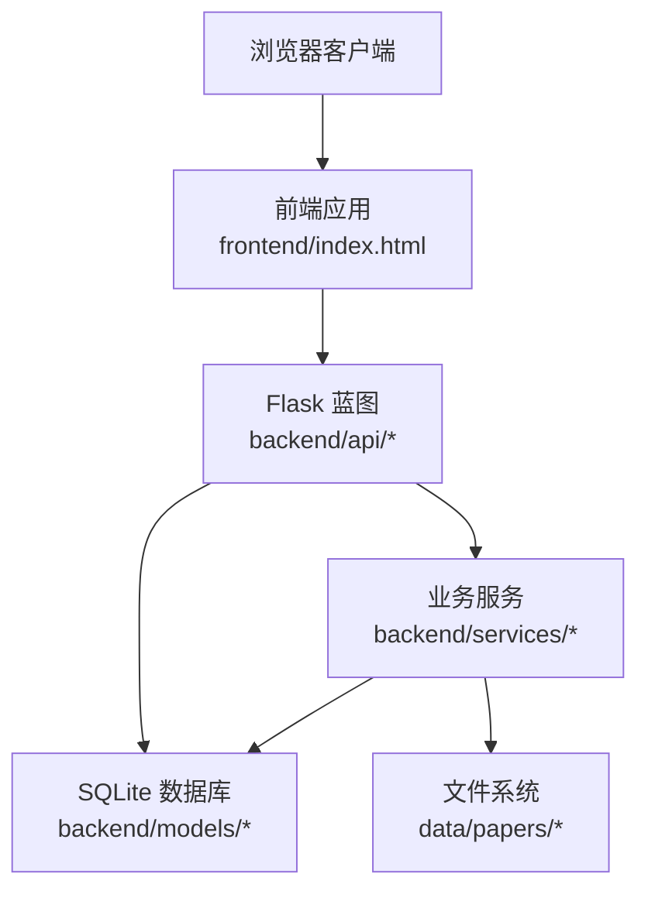
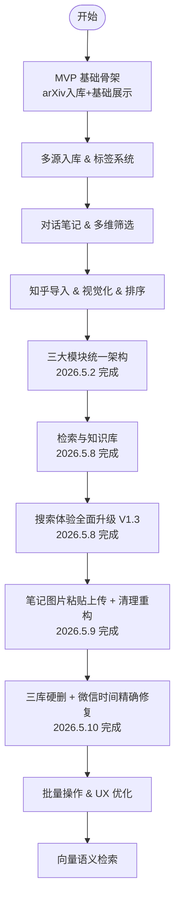
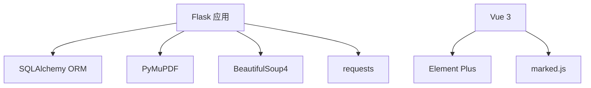
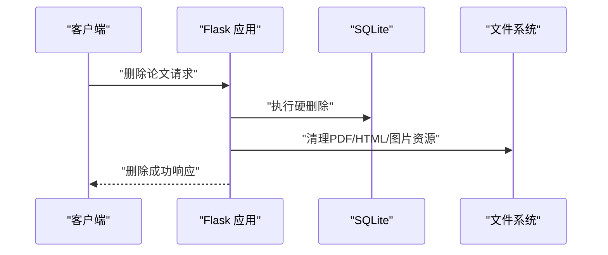
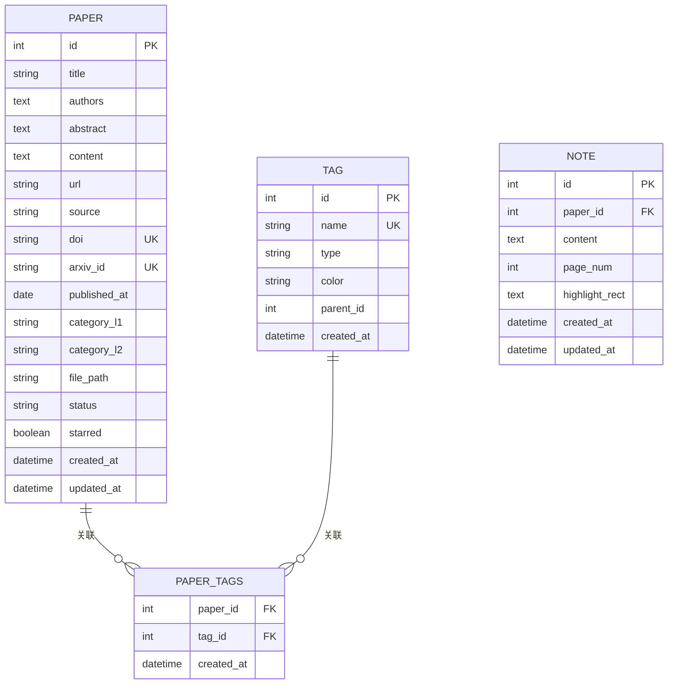

# 项目概述

<cite>
**本文引用的文件**
- [README.md](file://README.md)
- [PLAN.md](file://PLAN.md)
- [CHECKLIST.md](file://CHECKLIST.md)
- [backend/app.py](file://backend/app.py)
- [backend/config.py](file://backend/config.py)
- [backend/README.md](file://backend/README.md)
- [frontend/README.md](file://frontend/README.md)
- [frontend/index.html](file://frontend/index.html)
- [specs/architecture.spec.md](file://specs/architecture.spec.md)
- [specs/system/global_config.yml](file://specs/system/global_config.yml)
- [specs/backend/models/paper.yml](file://specs/backend/models/paper.yml)
- [specs/backend/api/papers.yml](file://specs/backend/api/papers.yml)
- [docs/SCHEMA.md](file://docs/SCHEMA.md)
- [specs/frontend/modules/fileUploadModule.yml](file://specs/frontend/modules/fileUploadModule.yml)
</cite>

## 目录
1. [简介](#简介)
2. [项目结构](#项目结构)
3. [核心理念与设计目标](#核心理念与设计目标)
4. [技术栈与架构决策](#技术栈与架构决策)
5. [三大模块统一架构](#三大模块统一架构)
6. [系统架构概览](#系统架构概览)
7. [核心功能亮点](#核心功能亮点)
8. [发展历程与阶段里程碑](#发展历程与阶段里程碑)
9. [目标用户与使用场景](#目标用户与使用场景)
10. [依赖关系分析](#依赖关系分析)
11. [性能与可扩展性考量](#性能与可扩展性考量)
12. [故障排查与运维](#故障排查与运维)
13. [结论](#结论)

## 简介
PaperHub 是一款面向算法工程师的本地化、私有化知识管理系统，支持论文、公众号文章与对话笔记的一体化管理。项目通过“三大模块统一架构”实现论文库、文章库、笔记库在交互、视觉、排序与标签体系上的高度一致，确保用户“学习一次即可贯通”。系统强调本地优先、多源接入、智能同步标签与统一预览能力，覆盖从数据采集、入库、去重、标签管理、多维筛选到全文检索与向量检索的完整知识管理闭环。

**章节来源**
- [README.md:11](file://README.md#L11)
- [README.md:32](file://README.md#L32)
- [README.md:150](file://README.md#L150)

## 项目结构
项目采用前后端分离与模块化组织，后端以 Flask + SQLite + SQLAlchemy 为核心，前端为单页应用（CDN 版本），配合规范化的模块划分与统一的配置标准，确保可维护性与可扩展性。

**图表来源**
- [specs/architecture.spec.md:6](file://specs/architecture.spec.md#L6)
- [specs/architecture.spec.md:21](file://specs/architecture.spec.md#L21)
- [specs/architecture.spec.md:50](file://specs/architecture.spec.md#L50)
- [backend/app.py:42](file://backend/app.py#L42)
- [backend/config.py:18](file://backend/config.py#L18)

**章节来源**
- [specs/architecture.spec.md:1-83](file://specs/architecture.spec.md#L1-L83)
- [backend/README.md:43](file://backend/README.md#L43)
- [frontend/README.md:1-4](file://frontend/README.md#L1-L4)

## 核心理念与设计目标
- 本地优先：所有数据存储在本地，保障隐私与长期可用性。
- 多源接入：arXiv、微信公众号、知乎、大模型对话等多渠道一键入库。
- 三大模块统一：论文库、文章库、笔记库在状态系统、标签体系、排序与交互上高度一致，降低学习成本。
- 智能同步标签：笔记可一键同步关联论文/文章的标签，提升知识关联效率。
- 统一预览：PDF、HTML、Markdown 三种内容形态统一渲染，适配不同阅读场景。

**章节来源**
- [README.md:32](file://README.md#L32)
- [README.md:34](file://README.md#L34)
- [README.md:36](file://README.md#L36)
- [README.md:37](file://README.md#L37)
- [README.md:38](file://README.md#L38)
- [README.md:39](file://README.md#L39)
- [README.md:40](file://README.md#L40)

## 技术栈与架构决策
- 后端：Flask + SQLite + SQLAlchemy，轻量稳定、易于部署与维护。
- 爬虫与解析：requests + BeautifulSoup4，用于微信、知乎等内容抓取与清洗。
- PDF处理：PyMuPDF（fitz），用于 PDF 元数据与内容提取。
- 前端：Vue 3 + Element Plus（CDN 单页应用），Markdown 渲染采用 marked.js。
- 全文检索：SQLite FTS5（规划中），向量检索：ChromaDB / FAISS（长期规划）。
- 配置与安全：集中式配置（specs/system/global_config.yml），支持 CORS、Cookie 安全标志、数据库连接池与超时回收。

**章节来源**
- [README.md:436](file://README.md#L436)
- [README.md:442](file://README.md#L442)
- [README.md:443](file://README.md#L443)
- [README.md:444](file://README.md#L444)
- [README.md:445](file://README.md#L445)
- [specs/system/global_config.yml:1-80](file://specs/system/global_config.yml#L1-L80)

## 三大模块统一架构
三大模块（论文库、文章库、笔记库）在以下方面实现统一：
- 一致性原则：90% 交互逻辑复用，用户只需学习一次。
- 状态系统：统一四种状态（待读/在读/已读/精读），视觉配色一致。
- 标签系统：独立标签筛选，前端各自统计与过滤；论文库后端统计，文章/笔记库前端统计。
- 排序算法：统一“标星 → 状态 → 时间”的优先级。
- 布局与交互：侧边栏“状态在上、标签在下”，清除按钮统一放置，点击切换与多标签交集筛选一致。

**图表来源**
- [README.md:150](file://README.md#L150)
- [README.md:201](file://README.md#L201)
- [README.md:211](file://README.md#L211)
- [README.md:213](file://README.md#L213)
- [README.md:214](file://README.md#L214)

**章节来源**
- [README.md:150](file://README.md#L150)
- [README.md:201](file://README.md#L201)
- [README.md:211](file://README.md#L211)
- [README.md:213](file://README.md#L213)
- [README.md:214](file://README.md#L214)

## 系统架构概览
后端以 Flask 为中心，通过蓝图注册 API，业务逻辑集中在 services，数据模型由 SQLAlchemy 管理；前端单页应用通过模块化封装实现复用与解耦；配置中心集中管理数据库、向量存储、CORS、文件上传等全局参数。

**图表来源**
- [backend/app.py:130](file://backend/app.py#L130)
- [specs/architecture.spec.md:21](file://specs/architecture.spec.md#L21)
- [specs/architecture.spec.md:32](file://specs/architecture.spec.md#L32)
- [specs/architecture.spec.md:41](file://specs/architecture.spec.md#L41)

**章节来源**
- [backend/app.py:130](file://backend/app.py#L130)
- [specs/architecture.spec.md:1-83](file://specs/architecture.spec.md#L1-L83)

## 核心功能亮点
- 多源入库：arXiv 自动抓取、微信公众号文章导入（URL/本地HTML）、知乎专栏导入（Cookie认证）、对话笔记导入（多来源支持）。
- 智能去重：基于 URL/标题的去重检测，入库前自动跳过重复。
- 标签系统：技术/会议/自定义三类标签，独立筛选与统计，支持智能同步。
- 统一预览：PDF 原生渲染、HTML iframe 渲染、Markdown 完整渲染。
- 搜索体验：FTS5 加权融合排序、防抖优化、键盘导航、LRU 本地缓存。
- 删除策略：三库统一硬删除，联动清理本地文件与图片资源。
- 维护工具：9 个长期维护脚本，覆盖备份、检查、清理、修正等场景。

**章节来源**
- [README.md:64](file://README.md#L64)
- [README.md:76](file://README.md#L76)
- [README.md:92](file://README.md#L92)
- [README.md:120](file://README.md#L120)
- [README.md:258](file://README.md#L258)
- [README.md:295](file://README.md#L295)
- [README.md:308](file://README.md#L308)

## 发展历程与阶段里程碑
项目按阶段推进，已完成 MVP、多源入库、对话笔记、知乎导入、视觉化与排序、三大模块统一架构、检索与知识库、搜索体验升级、笔记图片上传与清理、三库硬删与时间修正等里程碑，并持续规划批量操作与向量语义检索。

**图表来源**
- [README.md:416](file://README.md#L416)
- [README.md:424](file://README.md#L424)
- [README.md:426](file://README.md#L426)
- [README.md:428](file://README.md#L428)

**章节来源**
- [README.md:416](file://README.md#L416)
- [README.md:418](file://README.md#L418)
- [CHECKLIST.md:5](file://CHECKLIST.md#L5)

## 目标用户与使用场景
- 目标用户：算法工程师、研究者、技术爱好者，需要本地化、私有化知识管理与多源内容整合。
- 典型场景：
  - 论文阅读：arXiv 自动抓取、PDF 预览、阅读状态与标签管理。
  - 内容聚合：微信公众号、知乎文章、对话笔记统一入库与预览。
  - 知识沉淀：Markdown 笔记完整渲染、智能同步标签、关联论文/文章。
  - 搜索与检索：全文检索与未来向量检索，提升知识发现效率。

**章节来源**
- [README.md:11](file://README.md#L11)
- [README.md:150](file://README.md#L150)

## 依赖关系分析
- 后端依赖：Flask、SQLAlchemy、PyMuPDF、BeautifulSoup4、requests 等。
- 前端依赖：Vue 3、Element Plus、marked.js、自定义样式与模块。
- 配置依赖：集中式配置文件，确保数据库、向量存储、CORS、文件上传等参数一致。

**图表来源**
- [specs/system/global_config.yml:12](file://specs/system/global_config.yml#L12)
- [specs/system/global_config.yml:36](file://specs/system/global_config.yml#L36)
- [README.md:440](file://README.md#L440)
- [README.md:441](file://README.md#L441)
- [README.md:442](file://README.md#L442)
- [README.md:443](file://README.md#L443)
- [README.md:444](file://README.md#L444)

**章节来源**
- [specs/system/global_config.yml:1-80](file://specs/system/global_config.yml#L1-L80)
- [README.md:436](file://README.md#L436)
- [README.md:440](file://README.md#L440)
- [README.md:441](file://README.md#L441)
- [README.md:442](file://README.md#L442)
- [README.md:443](file://README.md#L443)
- [README.md:444](file://README.md#L444)

## 性能与可扩展性考量
- 数据库连接池：SQLite 使用连接池与超时回收，避免锁问题与资源泄漏。
- 前端统计策略：大数据量场景下由前端进行实时统计与过滤，减少后端压力。
- 搜索优化：FTS5 加权融合排序、防抖与 LRU 缓存，显著改善搜索体验。
- 向量检索：规划中的 ChromaDB/FAISS 将提供语义检索能力，支撑未来扩展。

**章节来源**
- [specs/system/global_config.yml:44](file://specs/system/global_config.yml#L44)
- [specs/system/global_config.yml:52](file://specs/system/global_config.yml#L52)
- [README.md:260](file://README.md#L260)
- [README.md:261](file://README.md#L261)
- [README.md:262](file://README.md#L262)
- [README.md:445](file://README.md#L445)

## 故障排查与运维
- 异常处理：统一异常拦截与 HTTPException 返回，扫描请求自动过滤，控制台清爽。
- 维护脚本：9 个维护脚本覆盖数据库检查、文件完整性、备份、修正与重下等场景。
- 删除与清理：三库统一硬删除策略，自动清理本地文件与图片资源，避免残留。

**图表来源**
- [backend/app.py:60](file://backend/app.py#L60)
- [backend/app.py:25](file://backend/app.py#L25)
- [README.md:297](file://README.md#L297)
- [README.md:298](file://README.md#L298)
- [README.md:299](file://README.md#L299)
- [README.md:300](file://README.md#L300)

**章节来源**
- [backend/app.py:60](file://backend/app.py#L60)
- [README.md:295](file://README.md#L295)
- [README.md:297](file://README.md#L297)
- [README.md:298](file://README.md#L298)
- [README.md:299](file://README.md#L299)
- [README.md:300](file://README.md#L300)

## 数据模型与 API 规范
- 数据模型：Paper/Article/Note/Tag 及其关联表，支持多对多与一对多关系，索引覆盖常见查询字段。
- API 规范：论文库 API 支持分页、多维筛选、arXiv 搜索与批量导入，标签管理与论文详情接口完备。
- 前端模块：文件上传模块封装上传流程、错误处理与智能跳转，遵循依赖注入与状态外置的设计原则。

**图表来源**
- [docs/SCHEMA.md:43](file://docs/SCHEMA.md#L43)
- [docs/SCHEMA.md:76](file://docs/SCHEMA.md#L76)
- [docs/SCHEMA.md:94](file://docs/SCHEMA.md#L94)
- [docs/SCHEMA.md:107](file://docs/SCHEMA.md#L107)
- [specs/backend/models/paper.yml:130](file://specs/backend/models/paper.yml#L130)

**章节来源**
- [specs/backend/models/paper.yml:1-164](file://specs/backend/models/paper.yml#L1-L164)
- [specs/backend/api/papers.yml:1-404](file://specs/backend/api/papers.yml#L1-L404)
- [specs/frontend/modules/fileUploadModule.yml:1-88](file://specs/frontend/modules/fileUploadModule.yml#L1-L88)

## 前端交互与模块化
- 前端采用单页应用（CDN 版本），通过模块化封装实现复用与解耦，包括排序、过滤、入库、文件上传等工具模块。
- 页面布局统一：侧边栏状态/标签筛选区、主内容区、搜索栏与菜单导航，确保三大模块一致体验。
- 上传流程：支持手动构造 FormData 与 Element Plus 原生上传两种模式，上传成功后根据返回内容智能跳转至相应模块并刷新数据。

**章节来源**
- [frontend/README.md:1-4](file://frontend/README.md#L1-L4)
- [frontend/index.html:1-200](file://frontend/index.html#L1-L200)
- [specs/frontend/modules/fileUploadModule.yml:1-88](file://specs/frontend/modules/fileUploadModule.yml#L1-L88)

## 结论
PaperHub 通过“三大模块统一架构”与“一致性黄金原则”，为算法工程师提供了本地化、私有化、多源接入的知识管理解决方案。项目在技术选型、模块化组织、配置标准化与前端工程化方面形成清晰的架构基线，结合持续的功能迭代与维护工具，具备良好的可扩展性与长期演进空间。未来可进一步引入向量检索与批量操作，持续提升知识发现与管理效率。