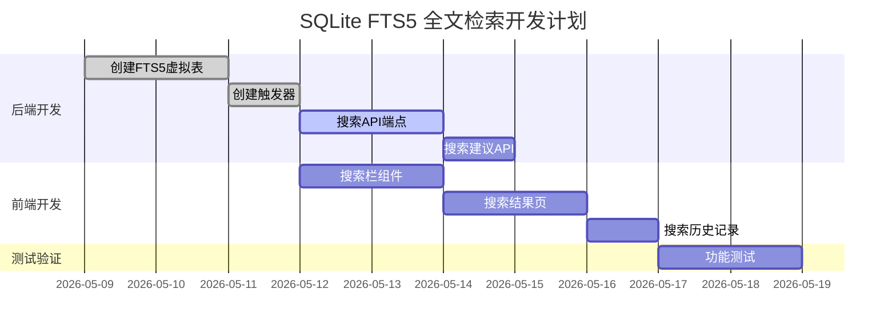

# SQLite FTS5 全文检索功能规划

---

## 📋 文档信息

| 项目 | 说明 |
|------|------|
| **文档版本** | v1.0 |
| **创建日期** | 2026-05-08 |
| **目标版本** | Phase 6.6 |
| **预计工作量** | 1 天 |
| **技术风险** | 低 |

---

## 一、需求分析

### 1.1 业务背景

当前 PaperHub 系统已支持多维度筛选（状态、标签、来源、日期），但当论文/文章数量超过 100 篇时，纯筛选方式效率较低，用户需要更高效的关键词搜索能力。

### 1.2 功能需求

| 需求编号 | 需求描述 | 优先级 |
|----------|----------|--------|
| REQ-001 | 支持标题、摘要、作者、来源的全文检索 | 高 |
| REQ-002 | 支持布尔查询（AND/OR/NOT） | 中 |
| REQ-003 | 搜索结果高亮匹配关键词 | 高 |
| REQ-004 | 支持分页展示搜索结果 | 高 |
| REQ-005 | 实时搜索（输入时即时响应） | 中 |
| REQ-006 | 搜索历史记录（localStorage） | 低 |
| REQ-007 | 支持跨模块搜索（论文/文章/笔记） | 中 |

### 1.3 用户场景

```
用户场景1：快速定位论文
  输入：关键词 "LLM reasoning"
  期望：返回标题或摘要中包含这些关键词的论文列表，高亮显示匹配位置

用户场景2：作者搜索
  输入：作者名 "Yann LeCun"
  期望：返回该作者发表的所有论文

用户场景3：组合搜索
  输入："transformer" AND "vision"
  期望：返回同时包含这两个关键词的内容
```

---

## 二、技术方案

### 2.1 技术选型

| 维度 | 方案 | 理由 |
|------|------|------|
| 数据库 | SQLite 3.31+ | 内置 FTS5 支持，无需额外依赖 |
| 索引类型 | FTS5 虚拟表 | 全文检索专用，性能优异 |
| 前端框架 | Vue 3 + Element Plus | 与现有系统一致 |
| 搜索模式 | 前缀搜索 + 全文匹配 | 支持模糊搜索 |

### 2.2 数据库设计

#### 2.2.1 FTS5 虚拟表结构

```sql
-- 论文全文检索表
CREATE VIRTUAL TABLE papers_fts USING fts5(
    title,          -- 标题
    abstract,       -- 摘要
    authors,        -- 作者（逗号分隔）
    category,       -- 分类
    content,        -- 全文内容（可选，后期扩展）
    tokenize='unicode61'  -- Unicode 分词
);

-- 文章全文检索表
CREATE VIRTUAL TABLE articles_fts USING fts5(
    title,          -- 标题
    content,        -- 正文内容
    author,         -- 作者/公众号名称
    source,         -- 来源
    tokenize='unicode61'
);

-- 笔记全文检索表
CREATE VIRTUAL TABLE notes_fts USING fts5(
    title,          -- 标题
    content,        -- Markdown 正文
    source,         -- 来源
    tokenize='unicode61'
);
```

#### 2.2.2 触发器同步（增量更新）

```sql
-- 论文表插入时同步到 FTS
CREATE TRIGGER papers_insert AFTER INSERT ON papers
BEGIN
    INSERT INTO papers_fts(rowid, title, abstract, authors, category)
    VALUES (new.id, new.title, new.abstract, new.authors, new.category_l1);
END;

-- 论文表更新时同步到 FTS
CREATE TRIGGER papers_update AFTER UPDATE ON papers
BEGIN
    DELETE FROM papers_fts WHERE rowid = old.id;
    INSERT INTO papers_fts(rowid, title, abstract, authors, category)
    VALUES (new.id, new.title, new.abstract, new.authors, new.category_l1);
END;

-- 论文表删除时同步到 FTS
CREATE TRIGGER papers_delete AFTER DELETE ON papers
BEGIN
    DELETE FROM papers_fts WHERE rowid = old.id;
END;
```

### 2.3 API 设计

#### 2.3.1 搜索接口

| 属性 | 值 |
|------|------|
| **URL** | `/api/search` |
| **方法** | GET |
| **权限** | 公开 |

**请求参数**：

| 参数 | 类型 | 必填 | 默认值 | 说明 |
|------|------|------|--------|------|
| `q` | string | 是 | - | 搜索关键词 |
| `module` | string | 否 | `all` | 搜索范围：`papers`/`articles`/`notes`/`all` |
| `page` | int | 否 | 1 | 页码（从1开始） |
| `size` | int | 否 | 20 | 每页数量 |
| `highlight` | bool | 否 | true | 是否高亮 |

**响应示例**：

```json
{
    "success": true,
    "total": 15,
    "page": 1,
    "size": 20,
    "results": [
        {
            "id": 42,
            "type": "paper",
            "title": "LLM-based Reasoning for Complex Tasks",
            "title_highlight": "<em>LLM</em>-based <em>Reasoning</em> for Complex Tasks",
            "abstract": "This paper presents...",
            "abstract_highlight": "This paper presents...",
            "authors": "John Doe, Jane Smith",
            "published_at": "2024-01-15",
            "source": "arXiv"
        }
    ]
}
```

#### 2.3.2 搜索建议接口

| 属性 | 值 |
|------|------|
| **URL** | `/api/search/suggest` |
| **方法** | GET |
| **权限** | 公开 |

**请求参数**：

| 参数 | 类型 | 必填 | 默认值 | 说明 |
|------|------|------|--------|------|
| `q` | string | 是 | - | 输入前缀 |
| `limit` | int | 否 | 5 | 返回数量 |

**响应示例**：

```json
{
    "success": true,
    "suggestions": [
        "LLM reasoning",
        "LLM fine-tuning",
        "LLM evaluation"
    ]
}
```

### 2.4 前端设计

#### 2.4.1 搜索栏组件

```
┌─────────────────────────────────────────────────────────────────┐
│  🔍 [搜索关键词输入框]                                          │
│     ┌─────────────────────────────────────────────────────┐    │
│     │ 输入关键词搜索论文、文章、笔记...                      │    │
│     └─────────────────────────────────────────────────────┘    │
│                           │                                   │
│                           ▼                                   │
│     ┌─────────────────────────────────────────────────────┐    │
│     │ 🔍 LLM reasoning          [清除]                    │    │
│     │ 📄 Attention is All You Need...                    │    │
│     │ 📰 Understanding Transformers...                   │    │
│     └─────────────────────────────────────────────────────┘    │
└─────────────────────────────────────────────────────────────────┘
```

#### 2.4.2 搜索结果页

```
┌─────────────────────────────────────────────────────────────────┐
│  搜索结果: "LLM" (共 15 条)                                  │
├─────────────────────────────────────────────────────────────────┤
│  📚 论文库 (8)  📰 文章库 (5)  📝 笔记库 (2)                  │
├─────────────────────────────────────────────────────────────────┤
│  ┌─────────────────────────────────────────────────────────┐   │
│  │  ⭐ <em>LLM</em>-based <em>Reasoning</em> for...       │   │
│  │     作者: John Doe | 来源: arXiv | 2024-01-15        │   │
│  │     <em>LLM</em> reasoning has emerged as...          │   │
│  └─────────────────────────────────────────────────────────┘   │
│  ┌─────────────────────────────────────────────────────────┐   │
│  │  📰 Understanding <em>LLM</em> Capabilities          │   │
│  │     来源: 机器之心 | 2024-02-20                      │   │
│  │     Recent advances in <em>LLM</em> technology...    │   │
│  └─────────────────────────────────────────────────────────┘   │
├─────────────────────────────────────────────────────────────────┤
│  分页导航: 上一页  1  2  3  下一页                          │
└─────────────────────────────────────────────────────────────────┘
```

---

## 三、实施计划

### 3.1 任务分解

| 任务编号 | 任务名称 | 负责人 | 预估时间 | 依赖 |
|----------|----------|--------|----------|------|
| TASK-001 | 创建 FTS5 虚拟表迁移脚本 | 后端 | 2小时 | - |
| TASK-002 | 创建触发器实现增量同步 | 后端 | 1小时 | TASK-001 |
| TASK-003 | 编写搜索 API 端点 | 后端 | 2小时 | TASK-002 |
| TASK-004 | 实现搜索建议 API | 后端 | 1小时 | TASK-003 |
| TASK-005 | 创建前端搜索栏组件 | 前端 | 2小时 | - |
| TASK-006 | 创建搜索结果页 | 前端 | 2小时 | TASK-004 |
| TASK-007 | 集成搜索历史记录 | 前端 | 1小时 | TASK-005 |
| TASK-008 | 测试与验证 | 全栈 | 2小时 | 所有 |

### 3.2 甘特图



---

## 四、代码规范

### 4.1 文件结构

```
backend/
├── api/
│   └── search.py           # 搜索 API 端点
├── services/
│   └── search_service.py   # 搜索业务逻辑
├── migrations/
│   └── 006_add_fts_tables.py  # FTS表迁移脚本
└── models/
    └── search.py           # 搜索相关模型

frontend/
└── src/
    ├── components/
    │   └── SearchBar.vue   # 搜索栏组件
    └── modules/
        └── searchModule.js # 搜索状态管理
```

### 4.2 命名规范

| 类型 | 规范示例 |
|------|----------|
| 文件 | `search_service.py`, `SearchBar.vue` |
| 类 | `SearchService`, `FtsSearch` |
| 函数 | `search_papers(query)`, `build_query()` |
| 变量 | `searchResults`, `searchKeyword` |
| 数据库表 | `papers_fts`, `articles_fts` |

---

## 五、测试计划

### 5.1 单元测试

| 测试用例 | 预期结果 |
|----------|----------|
| 单关键词搜索 | 返回包含该关键词的结果 |
| 多关键词搜索 | 返回同时包含所有关键词的结果 |
| 空关键词 | 返回错误或所有结果 |
| 不存在的关键词 | 返回空结果 |
| 分页参数验证 | 返回正确页数的数据 |

### 5.2 集成测试

| 测试场景 | 验证内容 |
|----------|----------|
| 新增论文 | FTS表自动同步 |
| 更新论文 | FTS表自动更新 |
| 删除论文 | FTS表自动删除 |
| 搜索结果点击 | 正确跳转到详情页 |

### 5.3 性能测试

| 测试指标 | 目标值 |
|----------|--------|
| 1000篇数据搜索响应时间 | < 100ms |
| 模糊搜索响应时间 | < 200ms |
| 并发10用户搜索 | 无错误 |

---

## 六、风险评估

| 风险 | 等级 | 应对措施 |
|------|------|----------|
| FTS表与主表数据不一致 | 中 | 使用触发器保证实时同步 |
| 中文分词效果不佳 | 低 | 使用 unicode61 分词器 |
| 搜索结果过多导致性能下降 | 中 | 限制单次返回数量，支持分页 |
| 索引占用空间过大 | 低 | FTS5 索引压缩率高，定期清理 |

---

## 七、部署与集成

### 7.1 数据库迁移

```bash
# 执行迁移脚本
cd backend
python -m migrations.run 006_add_fts_tables.py

# 手动重建索引（首次部署）
sqlite3 data/db/paperhub.db < scripts/init_fts.sql
```

### 7.2 前端集成

```javascript
// 在主页面添加搜索栏
import SearchBar from './components/SearchBar.vue';

// 在路由中添加搜索结果页
const routes = [
    { path: '/search', component: SearchResults }
];
```

---

## 八、后续优化方向

| 优先级 | 优化内容 | 说明 |
|--------|----------|------|
| 高 | 语义搜索 | 集成向量数据库 |
| 中 | 高级搜索语法 | 支持 AND/OR/NOT、括号分组 |
| 中 | 搜索历史 | 记录并展示搜索历史 |
| 低 | 搜索建议 | 根据输入实时推荐 |
| 低 | 热门搜索 | 展示热门关键词 |

---

## 📝 变更记录

| 日期 | 版本 | 变更内容 | 作者 |
|------|------|----------|------|
| 2026-05-08 | v1.0 | 初始版本 | System |

---

> 💡 **文档说明**：本规划文档基于 SQLite FTS5 实现全文检索功能，与现有技术栈完全兼容，无需额外依赖，实施风险低，预计1天完成。